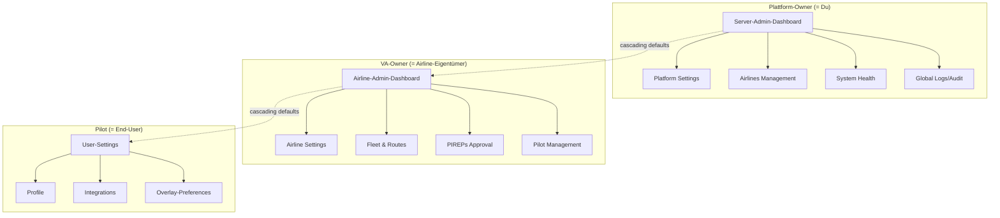
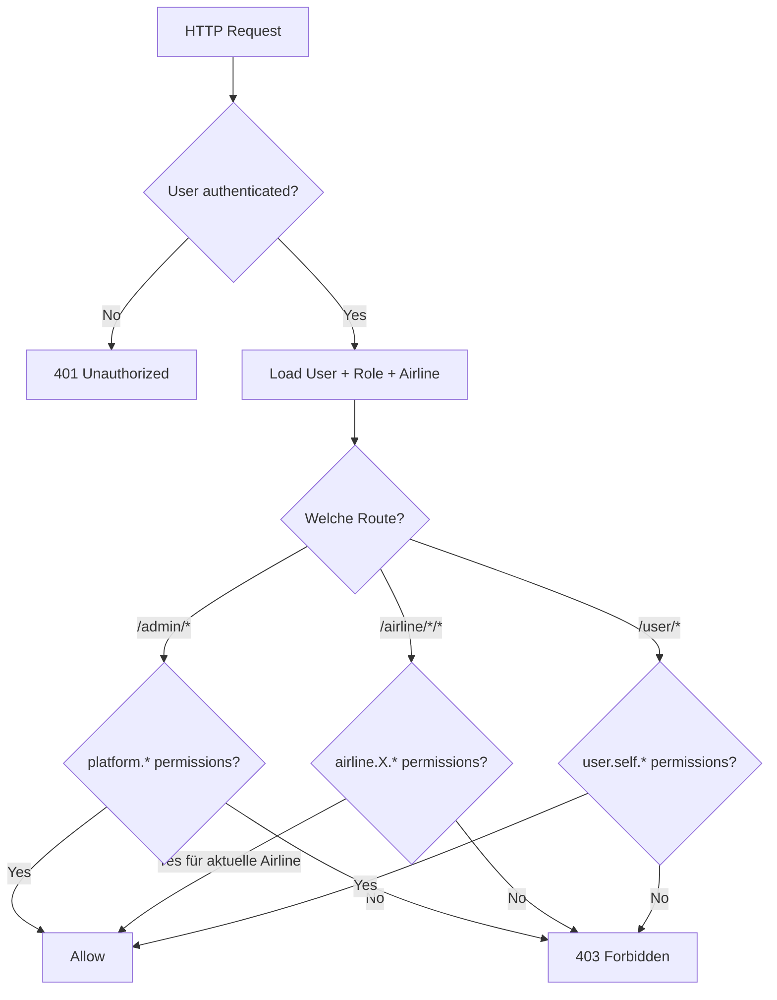
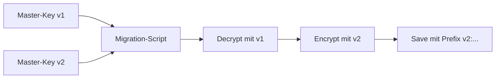
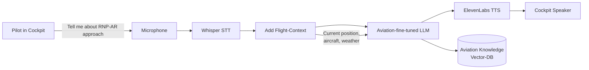
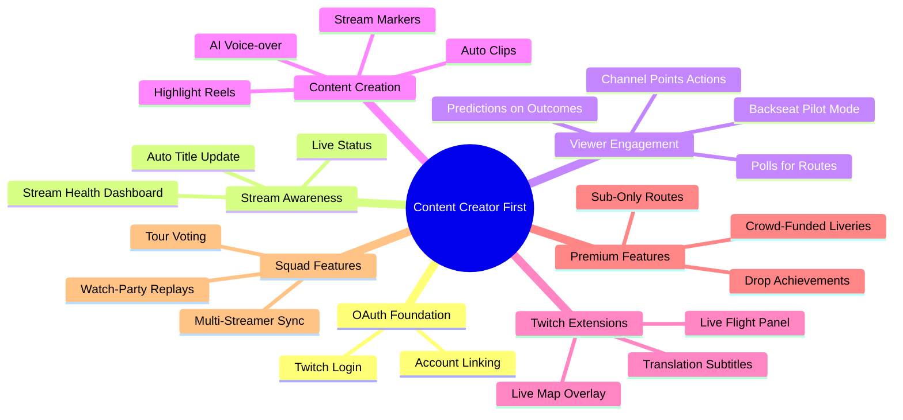
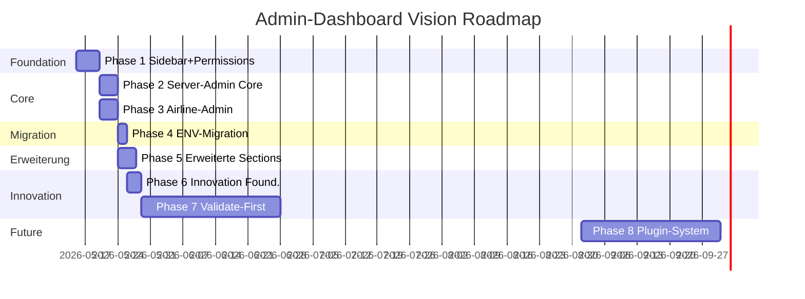

# Vision: Admin-Dashboards & Settings-Architektur

> **Status**: Vision / Ideen-Katalog / Roadmap
> **Datum**: 2026-04-27 (Tag 5 des Projekts)
> **Gilt als**: nicht-bindender Entwurf für künftige Implementation
> **Ziel-Audience**: Future-Self, Open-Source-Contributors, Beta-Tester

Diese Doc beschreibt die geplante Architektur für **Server-Admin-Dashboard** und **Airline-Admin-Dashboard** der VAM-Plattform (Arbeitstitel), inklusive Settings-Cascade, Encryption-at-Rest, und einer ausführlichen Innovation-Section mit unkonventionellen Feature-Ideen.

Sie ist **bewusst umfangreich**. Nicht alles muss gebaut werden. Vieles ist "Validate-First" markiert — das heißt: erst echten User-Bedarf bestätigen, dann erst implementieren. Andere Punkte sind "Just-Build" — pragmatische Standardlösungen, die ohne Risiko gebaut werden können.

---

## Inhaltsverzeichnis

1. [Executive Summary](#1-executive-summary)
2. [Konzeptionelle Trennung](#2-konzeptionelle-trennung)
3. [Permission-Hierarchie](#3-permission-hierarchie)
4. [Settings-Cascade-Pattern](#4-settings-cascade-pattern)
5. [Encrypted-Settings-Storage](#5-encrypted-settings-storage)
6. [Server-Admin-Dashboard](#6-server-admin-dashboard)
7. [Airline-Admin-Dashboard](#7-airline-admin-dashboard)
8. [Layout-Strategie & Theme-System](#8-layout-strategie--theme-system)
9. [Innovation-Section: Was hat keiner?](#9-innovation-section-was-hat-keiner)
10. [Settings-Migrations-Plan](#10-settings-migrations-plan)
11. [Roadmap mit Phasen](#11-roadmap-mit-phasen)
12. [Open Questions](#12-open-questions)
13. [Out-of-Scope](#13-out-of-scope)
14. [Glossar](#14-glossar)

---

## 1. Executive Summary

VAM-System (Arbeitstitel) entwickelt sich von einem Single-Airline-Tool zu einer **Multi-Tenant-Plattform**, auf der mehrere Virtual Airlines parallel betrieben werden können. Das erfordert klare administrative Strukturen, die nicht alle in einem einzigen Admin-Dashboard zusammengeworfen werden dürfen.

Diese Vision adressiert drei zusammenhängende Vorhaben:

1. **Server-Admin-Dashboard** für Plattform-Owner: Plattform-weite Settings, Airline-Verwaltung, System-Health, Cross-Airline-User-Management.

2. **Airline-Admin-Dashboard** für VA-Owner: Airline-spezifische Settings, Fleet, Routes, PIREPs, Pilot-Management, Awards, Discord-Integration.

3. **Settings-Cascade-Pattern**: Werte werden hierarchisch aufgelöst (System → Airline → User). Jede Ebene kann höher gelegene Defaults überschreiben, muss aber nicht.

Hinzu kommt die strategische Entscheidung, sensitive Settings (API-Keys, OAuth-Secrets, SMTP-Credentials) **nicht in `.env`** zu lagern, sondern in der Datenbank verschlüsselt — damit Airline-Admins ihre eigenen Integrationen ohne SSH-Zugang konfigurieren können.

Schließlich ist ein **Platform-Layout-Redesign** geplant (separate Doc), das eine fixierte Sidebar-Navigation einführt, ähnlich wie vAMSYS Phoenix oder Linear.

### Was diese Doc NICHT ist

- ❌ Termin-Plan: keine harten Deadlines
- ❌ Feature-Versprechen: alles ist Vision, nicht Vertrag
- ❌ Vollständige Spezifikation: Implementation-Details werden in separaten Tickets/Docs ausformuliert

### Aktueller Stand (Tag 5)

```
✅ Schema bereits Multi-Tenant-fähig (Airline-Model existiert)
✅ User-Model hat airlineId-Beziehung
✅ Roles + FeatureFlags-Models existieren als Foundation
✅ ACARS-Foundation gelegt (DataSource-Enum, LiveSession-Erweiterungen)
❌ Kein /admin Routing
❌ Keine Permission-Middleware
❌ Keine Plattform-Settings-Verwaltung außerhalb von .env
❌ Aktuelles Layout: Header-only, kein Sidebar-Pattern
```

---

## 2. Konzeptionelle Trennung

### 2.1 Drei Ebenen, drei Verantwortliche



### 2.2 Server-Admin: Wer ist das?

Der **Server-Admin** ist der Plattform-Owner, also typischerweise:
- Eine einzelne Person, die VAM für sich + Freunde betreibt
- Oder eine Hosting-Organisation, die VAM für mehrere VAs anbietet
- Im Open-Source-Use-Case: jeder, der VAM auf seinem eigenen Server installiert

Der Server-Admin hat **maximalen Zugriff** auf die Plattform — er kann Airlines erstellen/löschen, andere User zu Server-Admins promoten, Plattform-weite Defaults setzen.

### 2.3 Airline-Admin: Wer ist das?

Der **Airline-Admin** ist der Owner einer einzelnen VA. Auf einer Multi-Tenant-Plattform kann es mehrere geben, jeder verantwortlich für seine eigene Airline. Der Airline-Admin hat Zugriff auf:
- Settings *seiner* Airline (nicht andere)
- Fleet, Routes, PIREPs *seiner* Airline
- Pilot-Verwaltung *seiner* Airline

Ein Airline-Admin kann **nicht**:
- Plattform-weite Settings ändern
- Andere Airlines sehen
- Sich selbst zum Server-Admin promoten

### 2.4 User (Pilot): End-User

Der normale User fliegt, bucht Routen, schickt PIREPs. Settings beschränken sich auf:
- Eigenes Profil
- Eigene Integrationen (SimBrief-Username, ACARS-Token)
- Overlay-Preferences (existiert bereits)

---

## 3. Permission-Hierarchie

### 3.1 Bestehender Stand im Schema

```prisma
model Role {
  id          String   @id @default(cuid())
  name        String   @unique
  description String?
  permissions String[]  // Liste von Permission-Strings
  createdAt   DateTime @default(now())
  users       User[]
}
```

Das Schema unterstützt bereits **String-basierte Permissions**. Die Vision schlägt vor, dieses Pattern auszubauen mit klaren Permission-Namen.

### 3.2 Vorgeschlagene Permission-Namespaces

```
platform.*                  # Server-Admin-Bereich
  platform.settings.read
  platform.settings.write
  platform.airlines.create
  platform.airlines.delete
  platform.users.promote
  platform.audit.read

airline.<airline_id>.*      # Pro-Airline-Permissions (dynamisch)
  airline.{id}.settings.read
  airline.{id}.settings.write
  airline.{id}.fleet.write
  airline.{id}.routes.write
  airline.{id}.pireps.approve
  airline.{id}.users.invite
  airline.{id}.users.kick

user.self.*                 # Eigene Settings
  user.self.profile.write
  user.self.integrations.write
```

### 3.3 Resolution-Logic



### 3.4 ASCII-Mockup: Permission-Editor

```
┌──────────────────────────────────────────────────────────────┐
│  Role: "Senior Captain - Lufthansa Virtual"                  │
│  ────────────────────────────────────────                    │
│                                                              │
│  📋 Permissions                          [+ Add Permission]  │
│                                                              │
│  ▼ airline.lh.*                                              │
│    [×] airline.lh.pireps.approve                            │
│    [×] airline.lh.fleet.read                                │
│    [×] airline.lh.routes.read                               │
│    [ ] airline.lh.users.invite       (verfügbar)            │
│    [ ] airline.lh.settings.write     (verfügbar)            │
│                                                              │
│  ▼ user.self.*                                               │
│    [×] user.self.profile.write                              │
│    [×] user.self.integrations.write                         │
│                                                              │
│              [Cancel]  [Save Role]                           │
└──────────────────────────────────────────────────────────────┘
```

---

## 4. Settings-Cascade-Pattern

### 4.1 Das Konzept

Ein Settings-Wert auf der Plattform existiert auf bis zu **drei Ebenen**. Beim Auflösen wird die niedrigste verfügbare Ebene genutzt. Höhere Ebenen liefern Defaults.

```
┌──────────────────────┐
│  System-Settings     │  ← gesetzt im Server-Admin
│  (Plattform-Default) │     z.B. SimBrief-API-Key (Global-Fallback)
└─────────┬────────────┘     z.B. Default-Theme
          │ falls leer
          ▼
┌──────────────────────┐
│  Airline-Settings    │  ← gesetzt im Airline-Admin
│  (per VA-Override)   │     z.B. eigener SimBrief-API-Key
└─────────┬────────────┘     z.B. Airline-Logo
          │ falls leer
          ▼
┌──────────────────────┐
│  User-Preferences    │  ← gesetzt in /settings
│  (per Pilot)         │     z.B. Overlay-Layout
└──────────────────────┘     z.B. SimBrief-Username
```

### 4.2 Welche Werte cascaden, welche nicht?

```
CASCADING (System → Airline → User):
  - Default-Theme (Light/Dark/System)
  - Default-Locale
  - Default-Timezone
  - Notification-Preferences
  - Map-Style-Default

AIRLINE-ONLY (System → Airline):
  - SimBrief-API-Key (Encryption)
  - Discord-Webhook-URL
  - Branding (Logo, Farben)
  - Email-Sender-Adresse
  - PIREP-Approval-Auto-Reject-Rules
  - Awards-Definitions

USER-ONLY (kein Cascade):
  - SimBrief-Username/Pilot-ID (persönlich)
  - ACARS-Token (persönlich)
  - VATSIM-CID/IVAO-VID (persönlich)
  - Overlay-Token + Preferences

SYSTEM-ONLY:
  - Plattform-Name
  - Plattform-URL
  - Master-Encryption-Key (in ENV, nicht DB!)
  - Bot-Token (Discord, in ENV oder DB)
  - Mapbox-Token (kann später cascaden)
```

### 4.3 Schema-Skizze

```prisma
// System-weite Defaults
model SystemSetting {
  id        String   @id @default(cuid())
  key       String   @unique  // z.B. "default_theme", "platform_name"
  value     String?  @db.Text  // String-encoded JSON für komplexe Werte
  encrypted Boolean  @default(false)  // Marker für sensitive Werte
  updatedAt DateTime @updatedAt
  updatedBy String?  // userId der zuletzt geändert hat
}

// Airline-Overrides (existing Airline-Model erweitert)
model AirlineSetting {
  id        String   @id @default(cuid())
  airlineId String
  airline   Airline  @relation(fields: [airlineId], references: [id])
  key       String
  value     String?  @db.Text
  encrypted Boolean  @default(false)
  updatedAt DateTime @updatedAt
  updatedBy String?

  @@unique([airlineId, key])
  @@index([airlineId])
}

// User-Preferences gibt es bereits — User-Model wird einfach erweitert
// (statt eigener UserSetting-Tabelle, weil's dort eh schon viele Spalten gibt)
```

### 4.4 Resolution-Helper

```typescript
// lib/settings/resolve.ts

export async function resolveSetting<T>(
  key: string,
  context: { airlineId?: string; userId?: string },
): Promise<T | null> {
  // 1. User-Preference?
  if (context.userId) {
    const user = await prisma.user.findUnique({
      where: { id: context.userId },
      select: { /* relevant field */ },
    });
    if (user?.[key] !== undefined) return user[key] as T;
  }

  // 2. Airline-Setting?
  if (context.airlineId) {
    const airlineSetting = await prisma.airlineSetting.findUnique({
      where: { airlineId_key: { airlineId: context.airlineId, key } },
    });
    if (airlineSetting?.value !== null) {
      return parseValue<T>(airlineSetting.value, airlineSetting.encrypted);
    }
  }

  // 3. System-Default?
  const systemSetting = await prisma.systemSetting.findUnique({
    where: { key },
  });
  if (systemSetting?.value !== null) {
    return parseValue<T>(systemSetting.value, systemSetting.encrypted);
  }

  // 4. Hardcoded-Default aus Code
  return null;
}
```

### 4.5 Performance: Caching

Settings werden **bei jedem Request** aufgelöst. Das ist viele DB-Calls. Strategie:

```
Request-scoped Cache:
  Beim Request-Start: alle relevanten Settings einmal laden,
  in Request-Context speichern, dann von dort lesen.
  Neue Implementation: Next.js cache() oder React Server-Component-Cache.

Memory-Cache mit Invalidation:
  In-Process Map<key, { value, expiresAt }>
  TTL 60 Sekunden default
  Invalidation bei Settings-Update (via revalidateTag)
  Mehr-Server-Setups: Redis Pub/Sub für Cross-Server-Invalidation

Strategie-Wahl: Request-scoped für Phase 1, Memory-Cache für Phase 2,
Redis erst bei echtem Multi-Server-Setup.
```

---

## 5. Encrypted-Settings-Storage

### 5.1 Warum Encryption-at-Rest?

API-Keys und Credentials in `.env` haben Probleme:
- Server-SSH-Zugang erforderlich für Änderungen
- Backup-Files lecken den Klartext
- Multi-Airline-Setup: alle Airlines teilen sich denselben `.env`-Key
- Compliance: einige Hosting-Provider verlangen Encryption-at-Rest

Lösung: Sensitive Werte in DB **verschlüsselt**, mit einem Master-Encryption-Key in `.env`. Wenn DB geleakt wird, sind die Werte ohne Master-Key nutzlos.

### 5.2 Algorithmus: AES-256-GCM

```
Wahl: AES-256-GCM
Begründung:
  - NIST-approved
  - Authenticated Encryption (Tampering-Detection)
  - Native in Node.js crypto-Modul
  - Kein externes Lib nötig
  - Per-encryption Random IV

Schlüssel-Format:
  ENV: ENCRYPTION_KEY = base64(32 random bytes)
  Erzeugen: openssl rand -base64 32

Storage-Format in DB:
  "v1:base64IV:base64Ciphertext:base64Tag"
  
  v1 = Algorithmus-Versions-Tag (für künftige Migrationen)
  IV = 12 bytes random
  Tag = 16 bytes auth-tag aus GCM
```

### 5.3 Encryption-Helper-Skizze

```typescript
// lib/encryption.ts
import { createCipheriv, createDecipheriv, randomBytes } from 'crypto';

const ALGORITHM = 'aes-256-gcm';
const KEY = Buffer.from(process.env.ENCRYPTION_KEY!, 'base64');

if (KEY.length !== 32) {
  throw new Error('ENCRYPTION_KEY must be 32 bytes (base64 encoded)');
}

export function encrypt(plaintext: string): string {
  const iv = randomBytes(12);
  const cipher = createCipheriv(ALGORITHM, KEY, iv);
  const encrypted = Buffer.concat([
    cipher.update(plaintext, 'utf8'),
    cipher.final(),
  ]);
  const tag = cipher.getAuthTag();
  return `v1:${iv.toString('base64')}:${encrypted.toString('base64')}:${tag.toString('base64')}`;
}

export function decrypt(payload: string): string {
  const [version, ivB64, ctB64, tagB64] = payload.split(':');
  if (version !== 'v1') {
    throw new Error(`Unsupported encryption version: ${version}`);
  }
  const iv = Buffer.from(ivB64, 'base64');
  const ct = Buffer.from(ctB64, 'base64');
  const tag = Buffer.from(tagB64, 'base64');
  const decipher = createDecipheriv(ALGORITHM, KEY, iv);
  decipher.setAuthTag(tag);
  return Buffer.concat([decipher.update(ct), decipher.final()]).toString('utf8');
}
```

### 5.4 Welche Werte verschlüsselt?

```
ENCRYPTED:
  - SimBrief-API-Key (System + Airline)
  - Discord-Bot-Token (wenn in DB)
  - SMTP-Passwort
  - OAuth-Client-Secrets (VATSIM, IVAO, Discord)
  - Webhook-Signing-Secrets

NOT ENCRYPTED:
  - Plattform-Name
  - Logo-URL (Public-Asset)
  - Default-Theme
  - Email-Sender-Adresse (öffentlich sichtbar)
  - Discord-Webhook-URL (URL ist nicht sicher, Token ist da drin
    aber Discord-Webhook-Tokens sind sowieso public-by-design)
  - Mapbox-Token (Public-Token, nicht Secret-Token)
```

### 5.5 Key-Rotation-Strategie



In der Praxis: ein CLI-Command `vam settings rotate-key`, der alle encrypted Settings durchgeht, mit altem Key entschlüsselt, mit neuem Key verschlüsselt, in DB schreibt. Versions-Prefix erlaubt Coexistenz alter+neuer Werte während der Migration.

### 5.6 Bedrohungs-Modell: Was schützt das, was nicht?

```
SCHÜTZT:
  ✅ DB-Dump-Leaks (z.B. Backup auf falschem Server)
  ✅ Read-Only-Datenbank-Zugriffe (z.B. Read-Replica-Leak)
  ✅ Insider mit DB-Zugang aber ohne ENV-Zugang

SCHÜTZT NICHT:
  ❌ Server-Komplett-Kompromittierung (DB + ENV gleichzeitig)
  ❌ Memory-Dumps eines laufenden Prozesses
  ❌ Side-Channel-Attacks auf den Server
  ❌ Mitlesen während HTTP-POST des Klartexts beim Setzen
    → Mitigation: HTTPS pflicht
```

---

## 6. Server-Admin-Dashboard

### 6.1 Permissions

Zugriff: User mit Permission `platform.*` in seiner Role.
Default-Role: `platform_admin` (vorgegeben beim Initial-Setup).
Empfehlung: maximal 1-2 User pro Plattform haben diese Permissions.

### 6.2 SVG-Hero-Mockup: Server-Admin-Dashboard (Dark + Light)

**Dark-Theme:**

```svg
<svg viewBox="0 0 800 500" xmlns="http://www.w3.org/2000/svg">
  <!-- Background -->
  <rect width="800" height="500" fill="#020617"/>

  <!-- Sidebar -->
  <rect x="0" y="0" width="200" height="500" fill="#0f172a"/>
  <rect x="0" y="0" width="200" height="60" fill="#1e293b"/>
  <text x="20" y="38" fill="#fff" font-family="system-ui" font-size="16" font-weight="700">VAM Server</text>
  <text x="20" y="52" fill="#94a3b8" font-family="system-ui" font-size="11">Admin Dashboard</text>

  <!-- Sidebar Items -->
  <rect x="12" y="80" width="176" height="36" rx="6" fill="#1e293b"/>
  <text x="28" y="103" fill="#a5b4fc" font-family="system-ui" font-size="13" font-weight="600">⚙ Platform Settings</text>

  <text x="28" y="143" fill="#94a3b8" font-family="system-ui" font-size="13">🔌 Integrations</text>
  <text x="28" y="173" fill="#94a3b8" font-family="system-ui" font-size="13">🏢 Airlines</text>
  <text x="28" y="203" fill="#94a3b8" font-family="system-ui" font-size="13">👥 Users</text>
  <text x="28" y="233" fill="#94a3b8" font-family="system-ui" font-size="13">🔐 Roles</text>
  <text x="28" y="263" fill="#94a3b8" font-family="system-ui" font-size="13">📊 System Health</text>
  <text x="28" y="293" fill="#94a3b8" font-family="system-ui" font-size="13">📜 Audit Log</text>

  <!-- Main Header -->
  <rect x="200" y="0" width="600" height="60" fill="#0f172a"/>
  <text x="220" y="38" fill="#fff" font-family="system-ui" font-size="18" font-weight="600">Platform Settings</text>
  <circle cx="770" cy="30" r="14" fill="#6366f1"/>
  <text x="770" y="35" fill="#fff" font-family="system-ui" font-size="11" text-anchor="middle">KD</text>

  <!-- Card: Branding -->
  <rect x="220" y="80" width="270" height="160" rx="8" fill="#1e293b" stroke="#334155"/>
  <text x="240" y="108" fill="#94a3b8" font-family="system-ui" font-size="11" font-weight="600">BRANDING</text>
  <text x="240" y="132" fill="#fff" font-family="system-ui" font-size="13">Platform Name</text>
  <rect x="240" y="142" width="230" height="28" rx="4" fill="#020617" stroke="#334155"/>
  <text x="248" y="160" fill="#cbd5e1" font-family="system-ui" font-size="12">VAM-System</text>
  <text x="240" y="190" fill="#fff" font-family="system-ui" font-size="13">Default Theme</text>
  <rect x="240" y="200" width="80" height="24" rx="12" fill="#6366f1"/>
  <text x="280" y="216" fill="#fff" font-family="system-ui" font-size="11" text-anchor="middle">Dark</text>
  <rect x="328" y="200" width="60" height="24" rx="12" fill="transparent" stroke="#475569"/>
  <text x="358" y="216" fill="#94a3b8" font-family="system-ui" font-size="11" text-anchor="middle">Light</text>

  <!-- Card: System Health -->
  <rect x="510" y="80" width="270" height="160" rx="8" fill="#1e293b" stroke="#334155"/>
  <text x="530" y="108" fill="#94a3b8" font-family="system-ui" font-size="11" font-weight="600">SYSTEM HEALTH</text>
  <circle cx="540" cy="135" r="4" fill="#10b981"/>
  <text x="552" y="139" fill="#fff" font-family="system-ui" font-size="12">VATSIM Tracker active</text>
  <circle cx="540" cy="158" r="4" fill="#10b981"/>
  <text x="552" y="162" fill="#fff" font-family="system-ui" font-size="12">IVAO Tracker active</text>
  <circle cx="540" cy="181" r="4" fill="#10b981"/>
  <text x="552" y="185" fill="#fff" font-family="system-ui" font-size="12">Database 4ms response</text>
  <circle cx="540" cy="204" r="4" fill="#f59e0b"/>
  <text x="552" y="208" fill="#fff" font-family="system-ui" font-size="12">RainViewer slow (320ms)</text>

  <!-- Card: Active Airlines -->
  <rect x="220" y="260" width="560" height="200" rx="8" fill="#1e293b" stroke="#334155"/>
  <text x="240" y="288" fill="#94a3b8" font-family="system-ui" font-size="11" font-weight="600">AIRLINES (3)</text>
  <rect x="690" y="276" width="80" height="24" rx="4" fill="#6366f1"/>
  <text x="730" y="293" fill="#fff" font-family="system-ui" font-size="11" text-anchor="middle">+ New</text>

  <line x1="240" y1="310" x2="760" y2="310" stroke="#334155"/>
  <text x="240" y="335" fill="#fff" font-family="system-ui" font-size="13" font-weight="600">Lufthansa Virtual</text>
  <text x="240" y="352" fill="#94a3b8" font-family="system-ui" font-size="11">DLH · 142 pilots · 8 days ago</text>
  <text x="700" y="345" fill="#a5b4fc" font-family="system-ui" font-size="12">Manage →</text>

  <line x1="240" y1="370" x2="760" y2="370" stroke="#334155"/>
  <text x="240" y="395" fill="#fff" font-family="system-ui" font-size="13" font-weight="600">Eurowings Virtual</text>
  <text x="240" y="412" fill="#94a3b8" font-family="system-ui" font-size="11">EWG · 47 pilots · 3 days ago</text>
  <text x="700" y="405" fill="#a5b4fc" font-family="system-ui" font-size="12">Manage →</text>

  <line x1="240" y1="430" x2="760" y2="430" stroke="#334155"/>
  <text x="240" y="455" fill="#fff" font-family="system-ui" font-size="13" font-weight="600">Condor Virtual</text>
  <text x="240" y="472" fill="#94a3b8" font-family="system-ui" font-size="11">CFG · 12 pilots · 6 hours ago</text>
  <text x="700" y="465" fill="#a5b4fc" font-family="system-ui" font-size="12">Manage →</text>
</svg>
```

**Light-Theme** (gleicher Inhalt, andere Farben):

```svg
<svg viewBox="0 0 800 500" xmlns="http://www.w3.org/2000/svg">
  <!-- Background -->
  <rect width="800" height="500" fill="#f8fafc"/>

  <!-- Sidebar -->
  <rect x="0" y="0" width="200" height="500" fill="#fff"/>
  <line x1="200" y1="0" x2="200" y2="500" stroke="#e2e8f0"/>
  <rect x="0" y="0" width="200" height="60" fill="#fff"/>
  <line x1="0" y1="60" x2="200" y2="60" stroke="#e2e8f0"/>
  <text x="20" y="38" fill="#0f172a" font-family="system-ui" font-size="16" font-weight="700">VAM Server</text>
  <text x="20" y="52" fill="#64748b" font-family="system-ui" font-size="11">Admin Dashboard</text>

  <!-- Sidebar Items -->
  <rect x="12" y="80" width="176" height="36" rx="6" fill="#eef2ff"/>
  <text x="28" y="103" fill="#4338ca" font-family="system-ui" font-size="13" font-weight="600">⚙ Platform Settings</text>

  <text x="28" y="143" fill="#475569" font-family="system-ui" font-size="13">🔌 Integrations</text>
  <text x="28" y="173" fill="#475569" font-family="system-ui" font-size="13">🏢 Airlines</text>
  <text x="28" y="203" fill="#475569" font-family="system-ui" font-size="13">👥 Users</text>
  <text x="28" y="233" fill="#475569" font-family="system-ui" font-size="13">🔐 Roles</text>
  <text x="28" y="263" fill="#475569" font-family="system-ui" font-size="13">📊 System Health</text>
  <text x="28" y="293" fill="#475569" font-family="system-ui" font-size="13">📜 Audit Log</text>

  <!-- Main Header -->
  <rect x="200" y="0" width="600" height="60" fill="#fff"/>
  <line x1="200" y1="60" x2="800" y2="60" stroke="#e2e8f0"/>
  <text x="220" y="38" fill="#0f172a" font-family="system-ui" font-size="18" font-weight="600">Platform Settings</text>
  <circle cx="770" cy="30" r="14" fill="#6366f1"/>
  <text x="770" y="35" fill="#fff" font-family="system-ui" font-size="11" text-anchor="middle">KD</text>

  <!-- Card: Branding -->
  <rect x="220" y="80" width="270" height="160" rx="8" fill="#fff" stroke="#e2e8f0"/>
  <text x="240" y="108" fill="#64748b" font-family="system-ui" font-size="11" font-weight="600">BRANDING</text>
  <text x="240" y="132" fill="#0f172a" font-family="system-ui" font-size="13">Platform Name</text>
  <rect x="240" y="142" width="230" height="28" rx="4" fill="#f1f5f9" stroke="#e2e8f0"/>
  <text x="248" y="160" fill="#0f172a" font-family="system-ui" font-size="12">VAM-System</text>
  <text x="240" y="190" fill="#0f172a" font-family="system-ui" font-size="13">Default Theme</text>
  <rect x="240" y="200" width="80" height="24" rx="12" fill="#6366f1"/>
  <text x="280" y="216" fill="#fff" font-family="system-ui" font-size="11" text-anchor="middle">Dark</text>
  <rect x="328" y="200" width="60" height="24" rx="12" fill="#fff" stroke="#cbd5e1"/>
  <text x="358" y="216" fill="#475569" font-family="system-ui" font-size="11" text-anchor="middle">Light</text>

  <!-- Card: System Health -->
  <rect x="510" y="80" width="270" height="160" rx="8" fill="#fff" stroke="#e2e8f0"/>
  <text x="530" y="108" fill="#64748b" font-family="system-ui" font-size="11" font-weight="600">SYSTEM HEALTH</text>
  <circle cx="540" cy="135" r="4" fill="#10b981"/>
  <text x="552" y="139" fill="#0f172a" font-family="system-ui" font-size="12">VATSIM Tracker active</text>
  <circle cx="540" cy="158" r="4" fill="#10b981"/>
  <text x="552" y="162" fill="#0f172a" font-family="system-ui" font-size="12">IVAO Tracker active</text>
  <circle cx="540" cy="181" r="4" fill="#10b981"/>
  <text x="552" y="185" fill="#0f172a" font-family="system-ui" font-size="12">Database 4ms response</text>
  <circle cx="540" cy="204" r="4" fill="#f59e0b"/>
  <text x="552" y="208" fill="#0f172a" font-family="system-ui" font-size="12">RainViewer slow (320ms)</text>

  <!-- Card: Active Airlines -->
  <rect x="220" y="260" width="560" height="200" rx="8" fill="#fff" stroke="#e2e8f0"/>
  <text x="240" y="288" fill="#64748b" font-family="system-ui" font-size="11" font-weight="600">AIRLINES (3)</text>
  <rect x="690" y="276" width="80" height="24" rx="4" fill="#6366f1"/>
  <text x="730" y="293" fill="#fff" font-family="system-ui" font-size="11" text-anchor="middle">+ New</text>

  <line x1="240" y1="310" x2="760" y2="310" stroke="#e2e8f0"/>
  <text x="240" y="335" fill="#0f172a" font-family="system-ui" font-size="13" font-weight="600">Lufthansa Virtual</text>
  <text x="240" y="352" fill="#64748b" font-family="system-ui" font-size="11">DLH · 142 pilots · 8 days ago</text>
  <text x="700" y="345" fill="#4338ca" font-family="system-ui" font-size="12">Manage →</text>

  <line x1="240" y1="370" x2="760" y2="370" stroke="#e2e8f0"/>
  <text x="240" y="395" fill="#0f172a" font-family="system-ui" font-size="13" font-weight="600">Eurowings Virtual</text>
  <text x="240" y="412" fill="#64748b" font-family="system-ui" font-size="11">EWG · 47 pilots · 3 days ago</text>
  <text x="700" y="405" fill="#4338ca" font-family="system-ui" font-size="12">Manage →</text>

  <line x1="240" y1="430" x2="760" y2="430" stroke="#e2e8f0"/>
  <text x="240" y="455" fill="#0f172a" font-family="system-ui" font-size="13" font-weight="600">Condor Virtual</text>
  <text x="240" y="472" fill="#64748b" font-family="system-ui" font-size="11">CFG · 12 pilots · 6 hours ago</text>
  <text x="700" y="465" fill="#4338ca" font-family="system-ui" font-size="12">Manage →</text>
</svg>
```

### 6.3 Sections im Detail

#### 6.3.1 Platform Settings

```
┌─────────────────────────────────────────────────────────────────┐
│  Platform Settings                                              │
├─────────────────────────────────────────────────────────────────┤
│                                                                 │
│  BRANDING                                                       │
│  ┌────────────────────────┐  ┌────────────────────────┐        │
│  │ Platform Name          │  │ Logo URL               │        │
│  │ [VAM-System         ] │  │ [https://.../logo.svg]│        │
│  └────────────────────────┘  └────────────────────────┘        │
│                                                                 │
│  ┌────────────────────────┐  ┌────────────────────────┐        │
│  │ Public URL             │  │ Default Locale         │        │
│  │ [https://vam.kev...] │  │ [German (DE)        ▼]│        │
│  └────────────────────────┘  └────────────────────────┘        │
│                                                                 │
│  DEFAULTS                                                       │
│  Default Theme            ◉ Dark   ○ Light   ○ System          │
│  Default Map Style        [Mapbox Outdoors            ▼]       │
│  Default Timezone         [Auto-detect from browser  ▼]        │
│                                                                 │
│  REGISTRATION                                                   │
│  ☑ Allow self-registration                                      │
│  ☑ Require Email-Verification                                   │
│  ☐ Require Admin-Approval before activation                     │
│  ☑ Allow VATSIM-OAuth                                           │
│  ☑ Allow IVAO-OAuth                                             │
│  ☑ Allow Discord-OAuth                                          │
│                                                                 │
│  EMAIL                                                          │
│  ┌────────────────────────────────────────┐                     │
│  │ SMTP Host:     [smtp.example.com    ] │                     │
│  │ SMTP Port:     [587                 ] │                     │
│  │ Username:      [no-reply@vam.de     ] │                     │
│  │ Password:      [••••••••••••••••    ] │ (encrypted)        │
│  │ From-Address:  [VAM <no-reply@vam.de>]│                     │
│  └────────────────────────────────────────┘                     │
│                                                                 │
│             [Cancel]  [Test Email]  [Save Settings]             │
└─────────────────────────────────────────────────────────────────┘
```

#### 6.3.2 Integrations

```
┌─────────────────────────────────────────────────────────────────┐
│  Integrations — Global Defaults                                 │
│  Airlines können diese Werte überschreiben in ihren Settings    │
├─────────────────────────────────────────────────────────────────┤
│                                                                 │
│  📋 SimBrief Dispatch                                           │
│  ┌─────────────────────────────────────────────────────────┐   │
│  │ Status: ❌ Not configured                                │   │
│  │ API Key: [••••••••••••••••••••••••••••••••]            │   │
│  │ ☑ Use as fallback for airlines without their own key    │   │
│  │ Last successful test: never                              │   │
│  │              [Test Connection]  [Save]                   │   │
│  └─────────────────────────────────────────────────────────┘   │
│                                                                 │
│  🌍 Mapbox                                                      │
│  ┌─────────────────────────────────────────────────────────┐   │
│  │ Status: ✓ Active                                         │   │
│  │ Access Token: [pk.eyJ1IjoidmFt...                ]      │   │
│  │ Default Style: [mapbox://styles/mapbox/outdoors-v12 ▼]  │   │
│  │              [Test Connection]  [Save]                   │   │
│  └─────────────────────────────────────────────────────────┘   │
│                                                                 │
│  ☁️  RainViewer Weather                                          │
│  ┌─────────────────────────────────────────────────────────┐   │
│  │ Status: ✓ Free Tier (anonymous, 30s tile cache)         │   │
│  │ ☑ Enabled                                                │   │
│  │ Tile-Provider: ◉ Direct from RainViewer                 │   │
│  │                ○ Server-Proxy (mehr Kontrolle)           │   │
│  └─────────────────────────────────────────────────────────┘   │
│                                                                 │
│  💬 Discord (Bot)                                               │
│  ┌─────────────────────────────────────────────────────────┐   │
│  │ Status: ✓ Active                                         │   │
│  │ Bot Token: [••••••••••••••••••••••••••••]              │   │
│  │ Default Server: [VAM Community (738291...) ▼]            │   │
│  │ Connected: ✓ 1 server, 47 members                        │   │
│  │              [Reconnect]  [Test]                         │   │
│  └─────────────────────────────────────────────────────────┘   │
│                                                                 │
│  🔮 Navigraph (zukünftig — siehe Roadmap)                       │
│  ┌─────────────────────────────────────────────────────────┐   │
│  │ Status: ⏸ Not yet implemented                           │   │
│  │ Notes: ACARS-Client only, web restricted by license     │   │
│  └─────────────────────────────────────────────────────────┘   │
│                                                                 │
└─────────────────────────────────────────────────────────────────┘
```

#### 6.3.3 Airlines Management

```
┌─────────────────────────────────────────────────────────────────┐
│  Airlines                                            [+ Create] │
├─────────────────────────────────────────────────────────────────┤
│  Search: [_____________]   Filter: [All ▼]                      │
│                                                                 │
│  ┌──────────────────────────────────────────────────────────┐  │
│  │  ✈ Lufthansa Virtual                                     │  │
│  │  ICAO: DLH · IATA: LH · 142 pilots · 1,847 flights      │  │
│  │  Created: 2026-04-19  ·  Owner: kevin@example.com       │  │
│  │                                                           │  │
│  │  [Manage Airline →]  [Audit]  [Suspend]  [Delete]        │  │
│  └──────────────────────────────────────────────────────────┘  │
│                                                                 │
│  ┌──────────────────────────────────────────────────────────┐  │
│  │  ✈ Eurowings Virtual                                     │  │
│  │  ICAO: EWG · IATA: EW · 47 pilots · 312 flights         │  │
│  │  Created: 2026-04-24  ·  Owner: max@example.com         │  │
│  │                                                           │  │
│  │  [Manage Airline →]  [Audit]  [Suspend]  [Delete]        │  │
│  └──────────────────────────────────────────────────────────┘  │
│                                                                 │
│  ...                                                            │
└─────────────────────────────────────────────────────────────────┘
```

#### 6.3.4 Users (Cross-Airline)

Wie 6.3.3 aber zeigt User über alle Airlines, mit Filter pro Airline. Nützlich für: Cross-Airline-Bans, Spam-Detection, suspicious-Activity.

#### 6.3.5 Roles

Roles definieren welche Permissions ein User hat. System hat default-Roles (`platform_admin`, `airline_admin`, `senior_pilot`, `pilot`), Server-Admin kann eigene erstellen.

#### 6.3.6 System Health

Live-Status-Dashboard:
- Bot-Tracker (VATSIM, IVAO, METAR) — letzter Poll-Erfolg
- DB-Latency
- Cache-Hit-Rate (sobald Cache eingebaut ist)
- External-API-Status (RainViewer, SimBrief)
- Disk-Usage
- Active-Sessions-Count
- Active LiveSessions (Pilots derzeit fliegend)

#### 6.3.7 Audit Log

Wer hat wann was geändert. Pflicht für Compliance, hilfreich für Debugging.

```
┌─────────────────────────────────────────────────────────────────┐
│  Audit Log                                                      │
├─────────────────────────────────────────────────────────────────┤
│  Filter: [All actions ▼] [All users ▼] [Last 7 days ▼]          │
│                                                                 │
│  2026-04-27 18:42  kevin@vam.de   Updated SimBrief API Key     │
│                    Airline: Lufthansa Virtual                   │
│                                                                 │
│  2026-04-27 17:30  max@vam.de     Created airline "EWG"        │
│                                                                 │
│  2026-04-27 16:15  kevin@vam.de   Promoted user to platform_admin│
│                    Target: peter@vam.de                          │
│                                                                 │
│  2026-04-27 12:00  system         Database migration: 20260427 │
└─────────────────────────────────────────────────────────────────┘
```

---

## 7. Airline-Admin-Dashboard

### 7.1 Permissions

Zugriff: User mit Permission `airline.<airline_id>.*`.
Default-Role: `airline_admin` (auto-zugewiesen beim Airline-Create).

### 7.2 ASCII-Mockup: Airline-Dashboard-Hub

```
┌─────────────────────────────────────────────────────────────────┐
│  ✈ Lufthansa Virtual — Admin                          [Avatar] │
├─────────────────────────────────────────────────────────────────┤
│  ┌────────┐                                                     │
│  │ ⚙ Set. │   Pilots Today: 14   ·   Active Flights: 3         │
│  │ 🛩 Flt │   Pending PIREPs: 7  ·   Open Bookings: 22          │
│  │ 🗺 Rt  │                                                     │
│  │ 📋 Pi  │   ┌──────────────────────┐  ┌──────────────────┐   │
│  │ 👥 Pl  │   │ Active Flights       │  │ Pending PIREPs   │   │
│  │ 🏆 Aw  │   │                      │  │                  │   │
│  │ 🎖 Rk  │   │ DLH123 EDDF→LOWW    │  │ 7 awaiting       │   │
│  │ 💬 Ds  │   │ Climb · 18,000ft    │  │ review           │   │
│  │ 🔌 In  │   │                      │  │                  │   │
│  │ 📜 Lg  │   │ DLH456 EDDM→LSZH    │  │ Oldest: 2 hrs    │   │
│  └────────┘   │ Cruise · FL370      │  │                  │   │
│               │                      │  │ [Review →]       │   │
│               │ DLH789 EDDF→LFPG    │  └──────────────────┘   │
│               │ Approach            │                          │
│               │                      │  ┌──────────────────┐   │
│               │ [Live Map →]        │  │ Quick Actions    │   │
│               └──────────────────────┘  │                  │   │
│                                          │ + New Route      │   │
│               ┌──────────────────────┐  │ + Add Aircraft   │   │
│               │ Recent PIREPs        │  │ + Create Award   │   │
│               │                      │  │ + Send NOTAM     │   │
│               │ DLH001 EDDF→KJFK    │  └──────────────────┘   │
│               │ ✓ Approved · 8h     │                          │
│               │                      │                          │
│               │ DLH002 EDDM→OMDB    │                          │
│               │ ✓ Approved · 12h    │                          │
│               │                      │                          │
│               │ DLH003 KMIA→KJFK    │                          │
│               │ ⏳ Pending          │                          │
│               │                      │                          │
│               │ [View All →]        │                          │
│               └──────────────────────┘                          │
└─────────────────────────────────────────────────────────────────┘
```

### 7.3 Sections

#### 7.3.1 Airline Settings

```
┌─────────────────────────────────────────────────────────────────┐
│  Airline Settings — Lufthansa Virtual                           │
├─────────────────────────────────────────────────────────────────┤
│                                                                 │
│  IDENTITY                                                       │
│  ICAO: [DLH       ]    IATA: [LH        ]                       │
│  Name: [Lufthansa Virtual                              ]        │
│  Callsign: [LUFTHANSA                                  ]        │
│  Hub: [EDDF — Frankfurt am Main                       ▼]        │
│                                                                 │
│  BRANDING (Override System-Defaults)                            │
│  Logo:           [https://lh-virtual.com/logo.svg     ]        │
│  Primary Color:  [#0066CC  🎨]                                  │
│  Secondary Col.: [#FFCC00  🎨]                                  │
│  ☐ Custom Theme aktivieren                                      │
│                                                                 │
│  PILOT REQUIREMENTS                                             │
│  Min. flights / 60 days: [1   ]                                 │
│  Stabilized approach by: [1000 ft AGL                 ▼]        │
│  ☑ Auto-reject PIREPs with paused > [50%]                       │
│  ☑ Require correct livery for PIREP-acceptance                 │
│                                                                 │
│  FLIGHT PLANNING                                                │
│  Default fuel-policy: [SimBrief defaults              ▼]        │
│  Allow custom airframes: ☑                                      │
│  Block aircraft on booking: ☐ (off = mehrere Pilots same A/C)   │
│                                                                 │
└─────────────────────────────────────────────────────────────────┘
```

#### 7.3.2 Fleet Management

Liste aller Aircraft, Add/Edit/Remove, Subfleets, Type-Ratings.

#### 7.3.3 Routes Management

Liste aller Routes, CSV-Import/Export, Bulk-Edit, Distance-Re-Calculation, Aircraft-Assignment.

#### 7.3.4 PIREPs Approval

Pending-Liste mit Map-Replay, Auto-Reject-Rules, Manual-Review-Workflow, Comment-System.

#### 7.3.5 Pilots Management

Liste aller Pilots, Search/Filter, Profile-View, Promote/Demote, Suspend, Activity-Reports.

#### 7.3.6 Awards

Awards definieren mit Criteria-JSON, Auto-Award-Rules, Manual-Award-Vergabe.

#### 7.3.7 Ranks

Pro-Airline-Ranks mit min-flight-hours, Order, Discord-Role-Mapping.

#### 7.3.8 Discord

Webhooks pro Event (PIREP-submitted, PIREP-approved, Rank-up, etc.), Custom-Templates, Server-Verbindung.

#### 7.3.9 Integrations (Airline-Override)

Airline-spezifischer SimBrief-API-Key (überschreibt System-Default), eigener Webhook-Pool, Theme-Override.

#### 7.3.10 Audit Log

Wer hat was im Airline-Admin geändert. Begrenzt auf eigene Airline.

---

## 8. Layout-Strategie & Theme-System

> **Hinweis**: Detail-Vision in separater Doc `platform-layout-redesign.md`. Hier nur ein Überblick.

### 8.1 Layout-Vision auf einen Blick

```
┌──────┬──────────────────────────────────────────────────────────┐
│ Logo │ Page Title                              [Search] [👤▼]  │
├──────┼──────────────────────────────────────────────────────────┤
│      │                                                          │
│ Nav  │                                                          │
│ Item │                  Main Content Area                       │
│      │                                                          │
│ Nav  │                                                          │
│ Item │                                                          │
│      │                                                          │
│ Nav  │                                                          │
│ Item │                                                          │
│      │                                                          │
│ ───  │                                                          │
│      │                                                          │
│ Set  │                                                          │
│ Logo │                                                          │
│ ut   │                                                          │
└──────┴──────────────────────────────────────────────────────────┘
  220px              flexible Width
```

### 8.2 Theme-System

```
3 Layers:
  1. CSS-Variables (Design-Tokens)
     --color-bg, --color-text, --color-primary, etc.
  2. Tailwind-Config (mapped auf CSS-Vars)
     bg-background, text-foreground, etc.
  3. Theme-Switcher (lädt Vars zur Laufzeit)
     Light/Dark/System default
     Pro-Airline-Override möglich (custom Brand-Colors)
```

---

## 9. Innovation-Section: Was hat keiner?

> **Wichtige Vorbemerkung**: Dies sind **Ideen**, nicht **Versprechen**. Jede Idee wird mit einem Status-Tag markiert:
>
> - 🟢 **Just-Build** = Standard-Pattern, kein Risiko, baubar wenn Ressourcen da
> - 🟡 **Validate-First** = Idee gut, aber unsicher ob User das wollen → erst kleine Umfrage / MVP
> - 🔴 **Long-Term-Vision** = Erst nach ~1 Jahr Plattform-Reife sinnvoll
> - ⚠️ **Bewusst nicht gebaut** = Idee mit problematischen Tradeoffs
>
> **Aufwands-Skala**:
>
> - **S** ≈ ½ Tag (Quick-Win, isolierte Sache)
> - **M** ≈ 1-2 Tage (mittlere Komplexität)
> - **L** ≈ 3-5 Tage (große Section, mehrere Files, Tests)
> - **XL** ≈ 1-2 Wochen (komplexes System, Architektur-Arbeit)
> - **XL+** ≈ mehrere Wochen+ (sehr große Vorhaben, Forschungs-Charakter)
>
> Die Liste enthält ca. 100 Ideen. Innerhalb jeder Kategorie sortiert nach aufsteigendem Aufwand. Ideen in **S/M/L** kompakt beschrieben, Ideen in **XL/XL+** detailliert mit Recherche-Hinweisen, Implementation-Skizzen und Mockups.

### Inhaltsübersicht

- [9.1 Quick-Wins (S)](#91-kategorie-s--quick-wins-15-ideen) — 15 Ideen, alle ≤½ Tag
- [9.2 Solid-Improvements (M)](#92-kategorie-m--solid-improvements-15-ideen) — 15 Ideen, 1-2 Tage
- [9.3 Major-Features (L)](#93-kategorie-l--major-features-20-ideen) — 20 Ideen, 3-5 Tage
- [9.4 Big-Vision (XL)](#94-kategorie-xl--big-vision-25-ideen) — 25 Ideen, 1-2 Wochen, ausführlich
- [9.5 Long-Term-Vision (XL+)](#95-kategorie-xl--long-term-vision-20-ideen) — 20 Ideen, mehrere Wochen+, sehr ausführlich
- [9.6 Bewusst nicht gebaut](#96-bewusst-nicht-gebaut-5-ideen)

---

### 9.1 Kategorie S — Quick-Wins (15 Ideen)

> Alle Ideen ≤½ Tag Aufwand, geringes Risiko, sofort wertvoll.

#### 9.1.1 PIREP-Heatmaps · 🟢 · S

Mapbox-Heatmap-Layer auf Live-Map zeigt aggregiert die meistgeflogenen Routen über alle PIREPs der letzten 30 Tage. Hilft Server-Admins beim Schedule-Tuning ("welche Routen sind beliebt?") und User bei Inspiration. Aggregations-Query auf bestehende PIREP-Daten, GeoJSON-Output, Mapbox-Heatmap-Style.

#### 9.1.2 Carbon-Footprint-Counter · 🟡 · S

Pro Flug zeigt System CO2-Equivalent ("Dieser Flug hätte real ~3.2t CO2 verursacht"). Optional einschaltbar pro User. Validate-First weil polarisierend — manche Pilots wollen das, andere nervt es. Default off.

#### 9.1.3 Weather-Tour-Mode (Sturmjäger-Achievement) · 🟢 · S

Achievement-System belohnt Flüge in extremen Wetterbedingungen. "Sturmjäger" für Crosswind > 25kts bei Landung, "TS-Survivor" für Approach in Thunderstorm. METAR-Daten beim PIREP-Submit gegen Threshold prüfen, Award auto-vergeben.

#### 9.1.4 Flight-Streak-Tracker · 🟢 · S

Wie GitHub-Contribution-Graph. User-Profil zeigt Tage hintereinander mit mindestens 1 PIREP. Aktuelle Streak + Longest Streak. Motiviert tägliches Engagement.

#### 9.1.5 Random-Flight-Generator · 🟢 · S

"Würfle mir einen Flug" Button im Dashboard. Wählt zufällig Departure aus Hub-Liste, Aircraft aus Fleet, Destination aus Routes-DB. Hilft Pilots die "keine Idee was fliegen" haben.

#### 9.1.6 Reverse-Engineered ACARS-Display (ECAM-Style-Overlay) · 🟢 · S

Erweiterung des bestehenden OBS-Overlay-Systems um ein "ECAM-Style"-Layout (Aircraft-System-Display wie im echten Cockpit). Streamer-Eye-Candy. Noch ein Layout in der bestehenden Overlay-Page.

#### 9.1.7 Discord-Voice-Channel-Auto-Join für Live-Flights · 🟢 · S

Bot joined Discord-Voice-Channel beim LiveSession-Start, announced "Captain Drack ist airborne, EDDF→LOWW, ETA 1h 24m" via TTS, leaved nach LiveSession-Ende. Discord.js Voice-Connect, kostenlose Edge-TTS API. Optional pro User.

#### 9.1.8 Live-Map-Multiplayer-Cursor · 🟢 · S

Auf der Live-Map sieht jeder User die Mauspositionen anderer User mit Username (wie Figma). Hilft Diskussionen "schau hier ist der Stau". WebSocket-Position-Updates throttled auf 30Hz, Display als Cursor-Icons.

#### 9.1.9 Quick-Compare-Aircraft · 🟢 · S

Auf Aircraft-Detail-Page Side-by-Side-Compare-Mode. Zwei Aircraft auswählen, Specs nebeneinander (Range, MTOW, Cruise-Speed, Fuel-Burn). Hilft Routen-Planung.

#### 9.1.10 Birthday-Awards · 🟢 · S

Pilots können Geburtsdatum hinterlegen (privat). Am Geburtstag bekommen sie ein One-Time-Award und eine personalisierte Discord-Notification. Reines Community-Building.

#### 9.1.11 PIREP-Sharing-Link · 🟢 · S

Pro PIREP gibt's einen Public-Share-Link mit Read-Only-Ansicht (Map-Replay, Stats, kein User-Profile). Pilots können auf Discord/Twitter teilen.

#### 9.1.12 Random-Aircraft-Of-The-Day · 🟢 · S

Pro Tag wählt System ein zufälliges Aircraft aus Fleet und zeigt's auf Dashboard mit "Today's Aircraft Highlight". Klein, aber bringt Variety.

#### 9.1.13 Active-Pilots-Counter (Live) · 🟢 · S

Auf Plattform-Homepage / Login-Page kleine Live-Anzeige "X Pilots fliegen jetzt" — als Hooked-Indicator. Aktualisiert via WebSocket.

#### 9.1.14 Pilot-Birthday-Calendar · 🟢 · S

Airline-Admin sieht Kalender mit anstehenden Pilot-Geburtstagen. Erleichtert manuelle Glückwünsche oder Awards.

#### 9.1.15 Quick-METAR-on-Hover · 🟢 · S

Auf der Live-Map: Hover über Airport-Marker zeigt aktuelles METAR als Tooltip. Klein, sehr nützlich für IFR-Planung mid-Flight.

---

### 9.2 Kategorie M — Solid-Improvements (15 Ideen)

> 1-2 Tage Aufwand, klar definierter Nutzen, gut testbar.

#### 9.2.1 Live-Settings-Updates via WebSockets · 🟢 · M

Wenn ein Server-Admin im Dashboard ein Setting ändert, propagiert via WebSocket zu allen verbundenen Sessions sofort. Kein Refresh nötig. Settings-Service published Events nach Change, Clients subscribe auf relevante Channels, React-Context invalidated betroffene Components. Linear/Notion-Style Live-Reactivity.

#### 9.2.2 Time-Compression-Replay (PIREP-Replay) · 🟢 · M

PIREP-Detail-Page bekommt Replay-Button. Statt nur Static-Map: animated Replay des Fluges in 1×/5×/10×/50× Speed mit Aircraft-Marker, Höhen-Profil-Overlay, Speed-Gauge. Mapbox-Animation, React-Slider für Time-Scrubbing, Bookmark-Funktion für Coaches.

#### 9.2.3 Dispatch-AI (Auto-suggest Fuel/Alternate) · 🟢 · M

Beim Booking schlägt System automatisch Reserve-Fuel, Alternate, Pax-Load basierend auf historischen Flügen des Pilots auf dieser Route vor. ML-light: einfach Average der letzten 5 PIREPs. Erleichtert New-Pilot-Onboarding ("Du fliegst zum 5. mal EDDF→LOWW, hier sind deine üblichen Werte").

#### 9.2.4 Voice-Briefing (TTS für Wetter/NOTAMs) · 🟡 · M

Vor dem Flight wird METAR/TAF/NOTAMs als Audio vorgelesen. Pilot hört im Cockpit beim Pre-Flight zuhause hands-free. Browser-TTS oder ElevenLabs für realistische Stimme. Validate-First weil ungewohnt.

#### 9.2.5 Pilot-Ranking-Board mit Filtern · 🟢 · M

Erweiterte Leaderboards: filter by aircraft-type, region, time-period, route-tags. "Top 10 PMDG-737-Pilots im April", "Best Landing-Rate auf EDDF". Bewegt User zu spezialisierten Comeptitions.

#### 9.2.6 Custom-Tour-Builder (Multi-Leg-Routen) · 🟢 · M

User können Multi-Leg-Tours erstellen ("Around-the-World in 5 Hops"). VAM trackt Progress. Andere User können Tours abonnieren und nachfliegen. Inspiriert von vAMSYS Trip-Chains aber community-erstellt.

#### 9.2.7 Real-Aircraft-Liveries-Auto-Detection · 🟢 · M

ACARS-Client meldet Aircraft-Title beim Sim. VAM matched gegen Livery-DB und prüft ob Pilot korrekte Livery für gebuchten Flug nutzt. Integrierbar in PIREP-Approval-Rules.

#### 9.2.8 Calendar-Integration · 🟢 · M

User kann Bookings in iCal/Google-Calendar exportieren. ICS-Feed-URL pro User. Macht Long-Term-Booking-Planung einfacher.

#### 9.2.9 Flight-Plan-Sharing-Marketplace · 🟢 · M

User können ihre erfolgreich geflogenen SimBrief-Pläne als "Empfohlen" markieren. Andere können sie 1-Click adoptieren. Ratings/Comments. Ähnlich wie GitHub-Gists für Aviation.

#### 9.2.10 Realtime-Discord-PIREP-Embed · 🟢 · M

Bei PIREP-Submission wird in Discord-Channel ein detaillierter Embed gepostet mit Map-Snapshot, Score, Highlights. Über bestehende Webhook-Logic, aber visuell stark.

#### 9.2.11 Achievement-Showcase im Profil · 🟢 · M

User-Profil zeigt erworbene Awards in einer schönen Grid-Ansicht mit Icons + Progress-Bars für noch-nicht-erreichte. "Du brauchst noch 5 Landings auf KORD für das Chicago-Award".

#### 9.2.12 Smart-Booking-Reminders · 🟢 · M

Wenn User eine Booking expires-soon (binnen 4h), Discord-DM oder Email-Reminder. Verhindert verfallene Bookings.

#### 9.2.13 Squadron-Mode (Group-Bookings) · 🟢 · M

Zwei oder mehr User buchen den gleichen Flight als "Squadron". Pro Squadron: gemeinsame Stats, Leaderboard, "Best Squadron Formation"-Award.

#### 9.2.14 Custom-Email-Templates · 🟢 · M

Airline-Admin kann Email-Templates customizen (Welcome-Email, PIREP-approved, Rank-up). Mit Variablen wie {pilot_name}, {flight_count}. WYSIWYG-Editor.

#### 9.2.15 Bulk-Import-Wizards · 🟢 · M

Airline-Admin kann Routes/Aircraft/Pilots aus CSV/JSON importieren. Mit Preview, Validation, "Was würde geändert?"-Diff. Migrations-Helper für Wechsel von phpVMS/vAMSYS.

---

### 9.3 Kategorie L — Major-Features (20 Ideen)

> 3-5 Tage Aufwand, eigene UI-Sections oder größere Features.

#### 9.3.1 PIREP-Vertical-Profile-Visualizer · 🟢 · L

Pro PIREP detailliertes Höhen-/Speed-Profile-Diagramm mit Phasen-Markern (TOC, TOD, etc.). Inspiriert von vAMSYS Phoenix. Recharts oder D3.js Implementation.

#### 9.3.2 Crew-Resource-Management (Multi-Pilot-Sessions) · 🟡 · L

Zwei Pilots fliegen gemeinsam einen Flight (Captain + First-Officer). Beide tracked, gemeinsamer PIREP, geteilte Flight-Hours. Real-world Aviation ist Crew-Operation.

**Sim-Side existiert das schon, aber unzuverlässig.** Tools wie YourControls (älter, P2P, vieles synct nicht zuverlässig) und FS-Copilot (neuer, .NET 9, P2P-UDP-Hole-Punching, YAML-Templates pro Aircraft, MSFS 2024-fokussiert) decken die Sync-Schicht im Simulator ab. Praxis-Erfahrung: beide Tools haben Lücken, FS-Copilot macht in vielen Bereichen einen besseren Eindruck (sauberere Architektur, bessere Performance), aber es bleiben Sync-Probleme bei komplexen Aircraft. Multi-Crew-Experience (Voice-Befehle an Co-Pilot) ist eine andere Kategorie — kein echtes Shared-Cockpit, sondern AI-Co-Pilot.

**VAM-Side ist die Lücke**, die noch keiner gefüllt hat: Booking erlaubt zweiten Pilot einzuladen, ACARS-Client läuft im "Crew-Mode" auf beiden Rechnern, PIREP gehört Beiden mit "Pilot Flying" / "Pilot Monitoring" pro Phase. VAM würde nicht versuchen das Sim-Sync-Problem zu lösen (das ist Aufgabe von FS-Copilot/YourControls), sondern darüber liegen: VA-Buchhaltung, Flight-Hours-Splitting, Crew-Awards, gemeinsame PIREP-Bewertung.

#### 9.3.3 Squadron-Formation-Flying-Tracker · 🟡 · L

Pilots können sich auf Live-Map als Formation markieren. Trail-Linien zeigen Formation-Flight, Score gibt's für Formation-Quality (gleicher Heading, Spacing, Altitude). Air-Force-Style Coordination. Niche aber populär in Communities.

#### 9.3.4 Charters-System (User-Created Routes) · 🟢 · L

User können eigene "Charter-Flights" erstellen (z.B. Privat-Jet-Style: GA-Aircraft, EBLA→LFLI, off-Schedule). Approval durch Airline-Admin. Erweitert Airline um VFR/GA-Bereich.

#### 9.3.5 Awards-Crafting-System · 🟢 · L

Visual-Editor für Awards mit Criteria-Builder. "Award für: 50 Flüge mit Boeing 737, alle in Europa, Landing-Rate < 200fpm". Drag-and-Drop-Conditions. Kein JSON editieren.

#### 9.3.6 PIREP-Quality-AI-Coach (text-based) · 🟡 · L

Nach PIREP analysiert LLM den Flug, gibt schriftliches Feedback ("Dein Approach war steil — bei nächstem Mal früher mit Descent beginnen"). LLM mit FDR-Daten als Input, strukturiertes Output ("Strengths" / "Weaknesses" / "Suggestions"). Optional pro PIREP. Validate-First wegen AI-Hallucinations.

#### 9.3.7 Pilot-Career-Mode mit Hour-Requirements · 🟢 · L

Real-world-style Karriere: Pilot startet mit Cessna-150-Hours, muss Hours sammeln um auf größere Aircraft hochzuwechseln. Strukturiert progression. Inspiriert von Pilot-Career-Tracker und realen FAA-Hour-Requirements.

#### 9.3.8 Aircraft-Wear-Simulation · 🟡 · L

Triebwerke verschleißen über Flight-Hours, Cycles. Maintenance-Intervals required. Pilot sieht "Aircraft N12345: 2 Hours bis nächste C-Check". Maintenance kostet "Airline-Money" (wenn Finanz-Modul). Operations-Realismus.

#### 9.3.9 Custom-Theme-Editor pro Airline · 🟢 · L

Airline-Admin kann mit Visual-Editor eigene Theme-Color-Palette setzen. Live-Preview wie's auf Plattform aussieht. Generiert CSS-Variables die für Pilots dieser Airline angewendet werden.

#### 9.3.10 Notification-Center (In-App) · 🟢 · L

Bell-Icon im Header. Notifications für: PIREP-approved/rejected, Rank-up, Award-earned, neue Routes, Booking-Reminders. Filter, Mark-as-read, Settings welche Types.

#### 9.3.11 Stats-Insights-Dashboard pro Pilot · 🟢 · L

Personalisierte Insights: "Deine durchschnittliche Landing-Rate ist im April besser geworden", "Du fliegst meistens A320 — willst du B737-Type-Rating starten?". Auto-generierte Empfehlungen aus User-Daten.

#### 9.3.12 Realtime-Multi-User-Collaboration auf Routes-Editor · 🟢 · L

Mehrere Airline-Admins können gleichzeitig Routes editieren ohne Conflicts. Operational-Transformation oder CRDT (z.B. Yjs-Library). Wie Google-Docs für Routes-Bulk-Edit.

#### 9.3.13 Flight-Briefing-PDF-Generator · 🟢 · L

Pre-Flight: System generiert detailliertes PDF-Briefing (METAR, TAF, NOTAMs für Departure/Destination/Alternate, Route-Map, Fuel-Calculation, Weight & Balance). Ähnlich SimBrief-OFP aber VAM-eigen, fokussiert auf Operational-Briefing.

#### 9.3.14 Mobile-Optimized-Pilot-Dashboard · 🟢 · L

Bestehende Web-UI für Mobile aufgehübscht: Touch-friendly Booking-Cards, Live-Map mit Touch-Gestures, PIREP-Submit auf Phone möglich. Progressive-Web-App (PWA) installierbar.

#### 9.3.15 Pilot-Mentoring-System · 🟡 · L

Senior-Pilots können sich als Mentors flaggen. New-Pilots können Mentor-Request senden. Mentor sieht PIREPs des Mentees, kann Feedback geben. Discord-Integration für Live-Chat.

#### 9.3.16 Tour-Calendar mit Saisonalen-Events · 🟢 · L

Airline-Admin erstellt Saisonale Tours ("Summer in Europe 2026", "Christmas Around World"). Mit Special-Awards. Kalender-Ansicht mit Start-/End-Dates.

#### 9.3.17 Cross-Airline-Hub-Visits-Tracker · 🟢 · L

Achievement-System für Visits zu anderen Airline-Hubs. Server-weit aggregiert. "Du hast 50% aller VAM-Hubs angeflogen!"

#### 9.3.18 Realistic-Slot-System · 🟡 · L

Airports haben begrenzte Slots pro Stunde. Booking braucht freien Slot zur Departure-Zeit. ATC-Realismus, fördert Off-Peak-Flying. Validate-First weil restriktiv für Hobby-Pilots.

#### 9.3.19 Custom-Notification-Webhooks · 🟢 · L

Airline-Admin kann pro Event-Type custom Webhooks setzen. Discord ist nur einer von vielen — Slack, Microsoft-Teams, eigene Backend-Endpoints. Mit Retry-Logic + Signing.

#### 9.3.20 Airport-Detail-Pages mit Live-Stats · 🟢 · L

Pro Airport eigene Page: aktuelles Wetter, Live-Departures/Arrivals (von VAM), historische PIREP-Stats, beliebte Destinations von hier. Wie FlightRadar24 aber für VAM.

---

### 9.4 Kategorie XL — Big-Vision (25 Ideen)

> 1-2 Wochen Aufwand pro Idee, komplexes System, Architektur-Arbeit nötig. **Ausführlich beschrieben mit Implementation-Skizzen, Mockups, Risiken und Recherche-Hinweisen.**

#### 9.4.1 ML-basiertes PIREP-Scoring (offline) · 🟡 · XL

**Was**: Nach Flight-Submission analysiert ein lokales ML-Modell die FDR-Daten (Position-Time-Series), gibt Smoothness-Score (0-100), erkennt gute Flugmanöver, kritisiert harte Übergänge.

**Warum interessant**: Aktuelle PIREP-Scoring-Systeme (vAMSYS, phpVMS) nutzen Rule-Based-Bewertung — Landing-Rate < X = abzug Y Punkte. Ein ML-Modell könnte holistischer urteilen, z.B. erkennen ob ein Pilot eine echte Wetter-Vermeidung macht (gut) versus zufällig zickzack flog (schlecht).

**Technisch**:
- Lokales TensorFlow-Lite oder ONNX-Runtime
- Trainings-Daten: aus eigener PIREP-DB synthetisieren (mit manuell gelabelten Beispielen)
- Modell läuft im Bot-Process oder als separater Worker
- Pre-Processing: Position-Time-Series in Features umwandeln (mean-altitude-deviation, speed-stability, heading-jitter, control-input-frequency, vertical-speed-extremes)
- Output: numerischer Score + qualitative Tags ("smooth-cruise", "abrupt-descent", "exceptional-touchdown")

**Mockup-Skizze**:

```
┌──────────────────────────────────────────────────────────────┐
│  PIREP DLH123 — ML Score Analysis                            │
├──────────────────────────────────────────────────────────────┤
│  Overall Score: 87/100 ████████▊                             │
│                                                              │
│  Phase Breakdown:                                            │
│  ✈ Climb        ████████░░ 82  Smooth, slight VS overshoot  │
│  🌍 Cruise      █████████░ 91  Excellent stability           │
│  ⬇ Descent      ████████░░ 85  Some altitude oscillations    │
│  🎯 Approach    ████████▊░ 88  Stabilized at 1100ft          │
│  🛬 Landing    █████████▌ 95  Smooth touchdown -180fpm      │
│                                                              │
│  Strengths:                                                  │
│  • Very smooth cruise phase                                  │
│  • Excellent landing flare                                   │
│  • Consistent speed management                               │
│                                                              │
│  Areas for Improvement:                                      │
│  • Slight altitude oscillations during descent (~150ft)      │
│  • VS overshoot during initial climb                         │
└──────────────────────────────────────────────────────────────┘
```

**Risiken**:
- Wenn Modell falsch urteilt: User-Frust ("warum bekomme ich für meinen perfekten Flug nur 65?")
- Black-Box-Bewertung kann ungerecht wirken — User muss verstehen warum
- Trainings-Daten-Bias: was ist "gut" hängt von Aircraft, Conditions, Phase ab
- Kalibrierung über Zeit: Modell muss mitwachsen mit Pilot-Pool

**Implementation-Hint**:
- MVP: Rule-based-Scoring + ML-Layer optional drüberlegen
- Erst paar Hundert PIREPs sammeln, manuell labeln, dann trainieren
- Modell-Versionierung: alte Scores bleiben, nur neue PIREPs neu scoren

**Status**: Validate-First — erst manuelle Bestätigung über mehrere Flüge, dann optional aktivieren pro Airline.

#### 9.4.2 Voice-Tag-System für Funkverkehr-Replay · 🟡 · XL

**Was**: Pilot kann während Flug Voice-Memos aufnehmen ("Bonjour Approach, Lufthansa 123, descending FL120"). Werden Speech-to-Text-extracted, im PIREP gespeichert, beim Replay hörbar.

**Warum interessant**: Normales VATSIM-Funk ist live, vergeht. Mit Voice-Tags hat man später Replay des eigenen Funks beim PIREP-Debrief. Setzt sich von vAMSYS und phpVMS deutlich ab — die haben das nicht.

**Technisch**:
- Browser/ACARS-Client: Voice-Recording mit Push-to-Talk
- Server: Speech-to-Text via Whisper (lokal oder OpenAI-API)
- Storage: kurze Audio-Snippets (Opus-encoded) + Text-Transcript
- PIREP-Detail: chronologische Voice-Tag-Liste mit Audio-Play, Position-Marker auf Map

**Mockup-Skizze**:

```
┌──────────────────────────────────────────────────────────────┐
│  Flight Replay — Voice Tags                                  │
├──────────────────────────────────────────────────────────────┤
│  Map: [───────●───────────────────]                          │
│         Position at 14:23:45                                 │
│                                                              │
│  ▶ 14:20:12  Pilot   "Frankfurt Tower, Lufthansa 123,       │
│                       ready for departure runway 25R"        │
│                                                              │
│  ▶ 14:23:45  Pilot   "Frankfurt Approach, Lufthansa 123,    │
│                       passing FL080, climbing FL220"         │
│                                                              │
│  ▶ 14:45:30  Pilot   "Vienna Approach, Lufthansa 123,       │
│                       descending FL120"                      │
│                                                              │
│  Total: 12 voice tags · Duration: 3m 14s                     │
└──────────────────────────────────────────────────────────────┘
```

**Risiken**:
- Datenschutz: Audio-Storage rechtlich beachten (Speicherort, Löschung)
- Storage-Cost: kurze Snippets sind klein, aber bei 1000 Pilots × 100 Flüge × 12 Tags wird's nicht trivial
- Speech-to-Text-Qualität bei Hintergrundlärm

**Implementation-Hint**:
- MVP: Push-to-Talk im Web-Browser, Whisper-API (kostenpflichtig pro Minute, ~$0.006)
- Phase 2: Lokales Whisper im Bot-Process (CPU-intensiv aber kostenlos)
- Optional einschaltbar pro User, mit klarer Storage-Policy

**Status**: Validate-First — erst Survey ob User das nutzen würden, dann MVP für 10 Beta-Tester.

#### 9.4.3 Smart-Routing (Wetter-aware Route-Suggestions) · 🟡 · XL

**Was**: Beim Booking schaut System aktuelle Wetter-Daten (WND, ICE, TS) und schlägt Routen-Anpassungen vor ("Direct ABCDE meiden, TS gemeldet auf der Strecke").

**Warum interessant**: Real-world Dispatcher machen das routinemäßig. SimBrief-OFP berücksichtigt Wetter beim Initial-Routing, schlägt aber nicht aktiv Alternatives vor wenn der Plan schon fertig ist.

**Technisch**:
- Wetter-Daten: METAR, SIGMET, GRIB-Files (kostenpflichtig oder NWS-API)
- Routen-Analyse: welche Waypoints liegen in Convective-Areas oder Strong-Winds?
- Heuristische Re-Routing-Suggestion: Alternativ-Waypoints in der Nähe finden
- UI: "Suggested Route Modification: avoid via XYZ. Adds 12nm but avoids forecast TS"

**Mockup-Skizze**:

```
┌──────────────────────────────────────────────────────────────┐
│  Route Analysis — EDDF → LOWW                                │
├──────────────────────────────────────────────────────────────┤
│  Original Route:                                             │
│  EDDF DCT BOMBI T721 SUNEG L607 UTABA M738 LOWW              │
│  Distance: 384nm · Estimated Fuel: 9.2t                      │
│                                                              │
│  ⚠ Weather Warnings:                                         │
│  • SUNEG-UTABA segment: Forecast TS at 15:30Z (your ETD+45m) │
│  • Heavy turbulence reported at FL340 in this area           │
│                                                              │
│  📋 Suggested Alternative:                                   │
│  EDDF DCT BOMBI T721 SUNEG Z123 ABCDE M738 LOWW              │
│  Distance: 396nm (+12nm) · Fuel: 9.4t (+0.2t)                │
│  Avoids forecast convective activity                         │
│                                                              │
│  [Use Original]  [Use Alternative]  [Edit Manually]          │
└──────────────────────────────────────────────────────────────┘
```

**Risiken**:
- Wetter-Daten-Verfügbarkeit (kostet ggf. API-Keys; Open-Meteo/NWS frei aber Granularität begrenzt)
- Genauigkeit-Erwartung: Dispatcher-AI ist schwer zu kalibrieren
- User könnte sich auf Suggestion verlassen statt eigenständig zu denken

**Implementation-Hint**:
- MVP: nur statische Wetter-Warnings ("TS in your area"), noch keine Alt-Routes
- Phase 2: Alternative-Routes mit OSRM-style Routing-Algorithmus auf Aviation-Waypoints
- Validate-First: Beta für Power-User, dann Allgemeinheit

**Status**: Validate-First.

#### 9.4.4 Procedural-Weather-Replay · 🟡 · XL

**Was**: Alte PIREPs in damaligen Wetter-Bedingungen nachfliegen. Pilot wählt PIREP von 2024-12-15 EDDF→KJFK, System lädt damaligen GRIB-Wetter-Snapshot, simuliert in Sim. Nostalgie + Coaching-Tool.

**Warum interessant**: Time-Travel-Aviation. Hat keiner. Ermöglicht Vergleich "wie hätte ich heute geflogen?".

**Technisch**:
- Wetter-Archiv: GRIB-Files historisch speichern (NOAA bietet das frei)
- Weather-Inject in Sim: SimConnect bietet Weather-Override
- ACARS-Client liefert Weather-Snapshot zum Replay-Time
- VAM-Backend speichert pro PIREP einen Weather-Hash referencing GRIB-Storage

**Mockup-Skizze**:

```
┌──────────────────────────────────────────────────────────────┐
│  Replay Mode — December 15, 2024 14:23 UTC                   │
├──────────────────────────────────────────────────────────────┤
│  Weather Conditions at Replay:                               │
│    EDDF: 280@22kt, 9999, OVC035, 3°C, Q1018                  │
│    ENROUTE: Strong jet stream FL320-380, 180kt headwind      │
│    KJFK: 030@15kt, 6000, BKN025, 1°C, Q1015                  │
│                                                              │
│  ⏱ Original flight time: 8h 47m                              │
│  💨 Original fuel burn: 78.2t                                │
│                                                              │
│  Goal: Beat original time or fuel-economy?                   │
│                                                              │
│         [Start Replay in MSFS]   [Start in X-Plane]          │
└──────────────────────────────────────────────────────────────┘
```

**Risiken**:
- GRIB-Archive groß (TB-Range bei mehrjähriger Coverage)
- Sim-Weather-Inject nicht 100% akkurat (Sim-Limitations)
- Validate-First: Bedarf in Community fragen

**Status**: Validate-First — Power-Feature, kleine Zielgruppe.

#### 9.4.5 Federated PIREP-Scoring (Cross-VA Modell-Sharing) · 🔴 · XL

**Was**: Mehrere VAs auf VAM-Plattform trainieren ein gemeinsames PIREP-Scoring-Modell mit Federated Learning — keine VA muss ihre PIREP-Daten an die andere geben, aber das Modell lernt von allen.

**Warum interessant**: Bessere Genauigkeit für kleinere VAs. Federated Learning ist relativ neu, in Aviation noch nicht eingesetzt.

**Technisch**:
- TensorFlow-Federated oder Flower
- Lokales Training pro VA, Gradients gesendet (kein Daten-Leak)
- Aggregation auf zentralem Server (Plattform-Owner)
- Privacy-by-Design

**Risiken**:
- Komplex zu implementieren
- Privacy-Garantien müssen mathematisch belegbar sein
- Long-Term-Vision (Phase 8+)

**Status**: Long-Term-Vision.

#### 9.4.6 In-Game-Achievement-Notifications · 🟢 · XL

**Was**: ACARS-Client bekommt Mid-Flight-Notifications: "Congrats! 100th Cruise Hour completed!" als Pop-up im Sim. Synced mit VAM-Backend.

**Technisch**: WebSocket vom VAM-Backend zum ACARS-Client, Toast-Notifications via SimConnect-Text-Display.

**Status**: Just-Build, gut für Engagement.

#### 9.4.7 Plugin-System für Airline-Admins (sandboxed JS) · 🔴 · XL

**Was**: Airline-Admins können eigene JS-Module installieren die Custom-Features hinzufügen. Wie phpVMS-Modules, aber moderner und sandbox-sicher.

**Warum interessant**: phpVMS-Module-Ökosystem ist riesig (DisposableBasic, AAdvantageMiles, TripPlanner, etc.). Wäre Wettbewerbsvorteil wenn VAM das auch hat.

**Technisch**:
- Sandbox-Runtime: Deno-Subprocess oder isolated-vm (Node.js Plugin)
- Plugin-API: well-defined Hooks (on-pirep-submit, on-booking-create, on-rank-up, etc.)
- Plugin-Manifest mit Permission-Declaration ("ich brauche read-pireps + write-discord")
- Versions-Management mit Auto-Update-Notifications

**Mockup-Skizze**:

```
┌──────────────────────────────────────────────────────────────┐
│  Plugins — Lufthansa Virtual                  [+ Install]   │
├──────────────────────────────────────────────────────────────┤
│                                                              │
│  ✓ AAdvantageMiles v3.2.0  by FlexAir                       │
│    Per-pilot miles ledger, leaderboard, shop                 │
│    [Settings]  [Disable]  [Update available: 3.2.1]          │
│                                                              │
│  ✓ TripPlannerAdvanced v1.4.0  by community                  │
│    Multi-leg trip chains with progress tracking              │
│    [Settings]  [Disable]                                     │
│                                                              │
│  ✓ TourMode v2.0.0  by VAM                                   │
│    Saisonal tours with awards (built-in)                     │
│    [Settings]                                                │
│                                                              │
│  Available in Marketplace:                                   │
│  ▸ FleetMaintenance — Aircraft wear simulation              │
│  ▸ FuelTankering — Economic fuel-loading optimization       │
│  ▸ CrewSchedules — Pilot rostering & duty-times             │
└──────────────────────────────────────────────────────────────┘
```

**Risiken**:
- Security: Plugins können DB-Zugriff haben → Sandbox sehr wichtig
- Lange Entwicklung
- API-Stability: jede Hook-Änderung bricht Plugins

**Status**: Long-Term-Vision (Phase 8+). Aber wegen XL nicht XL+ einsortiert weil's wenn-mal-da-iss vergleichsweise straightforward technisch.

#### 9.4.8 Real-Time-Multiplayer-Live-Map mit Voice-Channels · 🟡 · XL

**Was**: Live-Map zeigt nicht nur Aircraft sondern erlaubt Pilots Voice-Channels nach Region/Flight-Phase zu joinen. Wie Live-VATSIM aber für die gesamte VA-Community.

**Technisch**:
- WebRTC Voice-Channels
- Spatial-Audio (Pilots in der Nähe hören sich, weiter weg nicht)
- Push-to-Talk
- Channel-Management per Frequency-Wahl (analog zu VATSIM-Frequencies)

**Risiken**:
- Server-Infrastructure (TURN/STUN-Servers)
- Voice-Quality auf schlechten Verbindungen
- Moderation (Toxic-Speech)

**Status**: Validate-First, nach Foundation.

#### 9.4.9 AI-Generated Custom-Liveries per Airline · 🟡 · XL

**Was**: Airline-Admin gibt Brand-Colors + Logo, AI generiert Custom-Liveries für die meisten Aircraft-Types (PSD/PNG). Stable-Diffusion-fine-tuned für Aircraft-Liveries.

**Warum interessant**: Liveries sind teuer und zeitraubend zu erstellen. AI-generierte könnten Bridge-Lösung sein für neue VAs.

**Technisch**:
- Fine-tuned Stable-Diffusion-Modell auf Aircraft-Livery-Templates
- Per Aircraft-Type: Input = Texture-Map-Coordinates + Brand-Style, Output = PNG-Texture
- Quality-Filter (auto-rejecting bad outputs)

**Risiken**:
- Quality kann subpar sein
- Lizenz-Fragen (Aircraft-Maker-Templates)
- Sehr nieschig

**Status**: Validate-First.

#### 9.4.10 Photo-Realistic Briefing-Cards mit AI-generated Images · 🟢 · XL

**Was**: Pre-Flight zeigt Briefing-Card mit AI-generated Image vom Departure-Airport zur aktuellen Tageszeit + Wetter ("Sonnenuntergang in EDDF, leichter Regen"). Atmosphärisch, immersiv.

**Technisch**:
- Stable-Diffusion-API oder local
- Prompt-Engineering: "Frankfurt Airport at sunset, light rain, runway 25R from cockpit view"
- Cache: gleiche Conditions = gleiche Image

**Status**: Just-Build, fügt Atmosphäre hinzu.

#### 9.4.11 Realtime-Translation für ATC-Chat (multilingual VA-Events) · 🟢 · XL

**Was**: Wenn VA mehrsprachig ist (Deutsch + Englisch + Französisch), übersetzt System ATC-Text-Communications real-time. Pilot tippt Deutsch, andere lesen English.

**Technisch**: DeepL-API oder OpenAI für Translation, pro User Sprache hinterlegt.

**Status**: Just-Build, niedrige Priorität.

#### 9.4.12 Quantum-routing für Multi-Constraint-Flugplanung · 🔴 · XL

**Was**: Dispatcher-AI optimiert Flugplan über mehrere Constraints gleichzeitig: Wetter + Wind + Slot-Verfügbarkeit + Fuel-Cost + Air-Traffic-Density. Quantum-Algorithm-inspired (nicht echtes Quantum, aber Quantum-Annealing-Style Optimization).

**Warum interessant**: Real-world Flight-Planning ist NP-hard. Heuristische Lösungen sind okay, aber mit Quantum-inspired-Annealing könnte man bessere Tradeoffs finden.

**Technisch**: Simulated-Annealing oder Tabu-Search über Routing-Graph. Multi-Objective-Optimization mit Pareto-Fronts.

**Status**: Long-Term-Vision (XL+ wenn echte Quantum-Hardware). Hier XL weil Simulated-Annealing auf normaler Hardware geht.

#### 9.4.13 Self-Hosted Mini-VATSIM (eigenes ATC-Network) · 🔴 · XL

**Was**: VAM-Plattform betreibt eigenes ATC-Network für die VA. Eigene Pilots können controllen, eigene Pilots fliegen. Kleiner, kontrollierter Scope als VATSIM.

**Warum interessant**: VATSIM-Wartezeiten manchmal hoch, eigenes ATC ermöglicht garantierte Coverage für VA-Events.

**Technisch**:
- Eigener FSD-Server-Style-Backend (oder simpler Custom-Protokoll)
- Pilot-Client wäre Custom-VAM-Plugin
- ATC-Client mit Map + Frequencies + Aircraft-Tracking

**Risiken**:
- Konkurrenz zu VATSIM/IVAO ist nicht sinnvoll
- Lizenz-Fragen mit Sim-API
- Server-Infrastructure

**Status**: Long-Term-Vision.

#### 9.4.14 AI-ATC für Offline-Flüge · 🟡 · XL

**Was**: Wenn nicht auf VATSIM/IVAO, kann der Pilot mit einem AI-ATC interagieren. Spricht Funk, gibt Clearances, koordiniert Approach.

**Realität-Check**: Es gibt bereits SayIntentions.AI und BeyondATC die genau das auf Sim-Side machen. Wir würden also nicht mit ihnen konkurrieren, sondern integrieren — VAM-Booking → SayIntentions/BeyondATC bekommt Flight-Info → Plant ATC entsprechend.

**Was wir bauen**: Nicht eigenes AI-ATC, sondern **Bridge-Layer**: VAM → bestehende AI-ATC-Tools. Booking-Detail-Page zeigt "Send Flight to BeyondATC".

**Status**: Validate-First. Bridge-Approach ist realistischer als Eigen-Entwicklung.

#### 9.4.15 Voice-Print-Recognition für Identity-Verification · 🔴 · XL

**Was**: Pilot's Voice wird beim Onboarding gesampled. Bei Multi-Account-Detection prüft System ob Voice-Print von verdächtigen Accounts identisch ist. Anti-Cheat.

**Risiken**:
- Privacy massiv heikel
- False-Positives zerstören Vertrauen
- Most VAs brauchen das nicht

**Status**: Long-Term-Vision, ⚠️ ethisch fragwürdig.

#### 9.4.16 Block-/Crypto-basierte Achievement-Verifikation · ⚠️ · XL

**Was**: Achievements werden in Public-Blockchain anchored. Anti-Cheat ohne zentrale Datenbank.

**Warum NICHT empfohlen**:
- Ökologisch problematisch (Energie)
- Aviation-Community überlappt mit Tech-Skepsis
- "Blockchain" ist post-2024 stark verbrannt
- Bessere Lösungen via Server-Sided-Hashing

**Status**: ⚠️ Bewusst nicht gebaut. (Siehe Section 9.6)

#### 9.4.17 Realtime Stock-Market-Trading-Game · 🟡 · XL

**Was**: Pilots verdienen "Airline-Money" pro Flight. Können Aircraft kaufen, Routes erweitern, Staff einstellen. Like Airline-Tycoon-Game-Layer.

**Warum interessant**: Gamification über reine Flugzeit hinaus. Manche User mögen Management-Aspect.

**Technisch**:
- Finanz-Modul: Airline-Bilanz, Pro-Flight-Revenue/Cost
- Stock-Market-Sim für Aircraft-Prices (Supply/Demand)
- Buy/Sell-Mechanics

**Risiken**:
- Spielbalancierung ist eigene Forschung
- Manche User wollen das nicht ("ich will nur fliegen")
- Optional einschaltbar pro Airline

**Status**: Validate-First.

#### 9.4.18 In-Browser Flight-Sim für Demo-Page · 🔴 · XL

**Was**: Auf der Plattform-Homepage embedded ein einfacher Flight-Sim (WebGL), den Besucher direkt im Browser fliegen können — als Demo für die VA.

**Warum interessant**: Recruiting-Tool. "Probier unsere VA aus, ohne MSFS zu kaufen".

**Technisch**: Cesium-basierter WebGL-Sim oder eigener simpler GA-Sim. Genug für 5-Minuten-Try.

**Risiken**: Sehr aufwändig.

**Status**: Long-Term-Vision.

#### 9.4.19 PIREP-Replay-Sharing-Marketplace · 🟢 · XL

**Was**: User können besonders gute oder lehrreiche PIREP-Replays mit Comments anreichern und teilen ("Mein erstes RNP-Approach in EDDM, lehrreich!"). Andere können kommentieren, "subscriben" für ähnliche Replays.

**Technisch**: Existing PIREP-Replay-Page + Sharing-Layer + Comment-System.

**Status**: Just-Build.

#### 9.4.20 Cross-Sim-Federation · 🔴 · XL

**Was**: MSFS-Pilot fliegt mit X-Plane-Pilot in Formation, Backend abstrahiert das. VAM dient als Bridge.

**Technisch**: ACARS-Client per Sim, gemeinsamer Server-State, Position-Sync via VAM-Backend.

**Risiken**: Sehr komplex, Sim-Differences groß.

**Status**: Long-Term-Vision.

#### 9.4.21 Pilot-Health-Monitoring (Smartwatch-Integration) · 🟡 · XL

**Was**: Optional: Pilot trägt Smartwatch (Apple, Garmin, etc.). Pulsoximetrie + ECG während Flight wird mit Flight-Phase korreliert. "Dein Heart-Rate steigt jedesmal beim Approach — vielleicht früher entspannen?"

**Technisch**: HealthKit/Garmin-Connect-API, Time-Series-Storage, optional Coaching-Output.

**Risiken**:
- Privacy hochsensibel
- Nicht alle haben Smartwatch
- Validate-First strict

**Status**: Validate-First, niche.

#### 9.4.22 Voice-Print-Recognition für Identity-Verification · ⚠️ · XL

(Bereits in 9.4.15 — Duplikat-Eintrag entfernt, Eintrag steht oben.)

#### 9.4.23 Custom-Aircraft-Performance-Profiles · 🟢 · XL

**Was**: Airline-Admin kann pro Aircraft-Subfleet Performance-Profile definieren (Climb-Rate, Cruise-Speed, Fuel-Burn-Curves). VAM-System nutzt diese für Flight-Time-Estimates statt nur Distance/Speed-Average.

**Technisch**: Subfleet-Model erweitern, Performance-Tabellen pro Phase, Estimator-Engine.

**Status**: Just-Build, real-world-realistisch.

#### 9.4.24 Multi-Language-Support (i18n) · 🟢 · XL

**Was**: VAM-Plattform komplett übersetzbar. Deutsch, Englisch, Spanisch, Französisch, Polnisch, etc. Translation-Files in JSON, Crowd-Sourced-Translations möglich.

**Technisch**: next-intl oder i18next, Translation-Files in Repo, Pull-Requests von Community.

**Status**: Just-Build wenn International-Reichweite gewünscht.

#### 9.4.25 White-Label-Branding-Engine · 🟢 · XL

**Was**: Per-Airline komplett custom-Branding möglich: eigene Subdomain (lufthansa-virtual.vam-platform.com), eigene Theme, eigenes Logo, eigenes Email-From, eigene Custom-Domain (lufthansa-virtual.com → CNAME zu VAM).

**Technisch**: Wildcard-SSL, Multi-Tenant-Routing, Per-Airline-Theme-Loading.

**Status**: Just-Build wenn Multi-Tenant-Hosting kommerziell ausgerollt.

---

### 9.5 Kategorie XL+ — Long-Term-Vision (20 Ideen)

> Mehrere Wochen+ Aufwand, Forschungs-Charakter, große architektonische Investments. **Sehr ausführlich beschrieben mit umfassender Analyse.**

#### 9.5.1 AI-Co-Pilot mit Aviation-Knowledge (LLM fine-tuned) · 🟡 · XL+

**Was**: Statt generischen LLM-Prompt-Engineering ein eigenes Aviation-LLM. Fine-tuned auf:
- ICAO-Documents (Annex 6, Doc 4444)
- Aircraft-Operating-Manuals (FCOM Boeing/Airbus)
- Real-world Aviation-Books (Stick and Rudder, Handling the Big Jets, etc.)
- Aviation-Forum-Diskussionen (PPRuNe, AvHerald)

Co-Pilot kann dann nicht nur generic Aviation-Talk, sondern echte Domain-Expertise haben.

**Recherche-Realität**: SayIntentions.AI und BeyondATC nutzen LLMs, aber für ATC-Side. Custom Co-Pilot mit aviation-finetuning ist machbar — Open-Source-Modelle wie Llama oder Mistral können fine-tuned werden.

**Implementation-Skizze**:



**Mockup-Skizze**:

```
┌──────────────────────────────────────────────────────────────┐
│  AI Co-Pilot — Lufthansa 123                                 │
│  Position: 15nm South of EDDF                                │
│  Aircraft: A320-214                                          │
│  Phase: Approach                                             │
├──────────────────────────────────────────────────────────────┤
│                                                              │
│  YOU: "Co-pilot, configure for ILS 25R approach"             │
│                                                              │
│  CP:  "Sure. Setting up for ILS 25R Frankfurt. ILS frequency │
│        110.95, course 252. Decision altitude 200ft AGL.      │
│        Should I brief the missed approach procedure?"        │
│                                                              │
│  YOU: "Yes please."                                          │
│                                                              │
│  CP:  "Missed approach: climb runway heading to 4000ft, then │
│        as published. Maximum hold altitude 5000ft. Calling   │
│        flaps 2 at 5nm out, gear down at 2500ft AGL. I'll     │
│        monitor speeds and altitudes. Anything else, captain?"│
│                                                              │
│  [Push-to-Talk Button] [Volume] [Co-pilot Personality ▼]     │
└──────────────────────────────────────────────────────────────┘
```

**Aufwand-Aufschlüsselung**:
- Trainingsdaten kuratieren: 4-6 Wochen
- Fine-Tuning auf Open-Source-Modell: 1-2 Wochen
- Voice-Pipeline (STT/TTS): 1 Woche
- Cockpit-Integration via ACARS-Client: 2 Wochen
- Testing + Calibration: 4+ Wochen
- **Total: ~3-4 Monate Forschungs+Engineering**

**Risiken**:
- LLM-Halluzinationen bei kritischen Procedures (gefährlich wenn Pilot vertraut)
- Hosting-Kosten (eigenes Modell hosten ist teuer; API-Calls kostenpflichtig)
- Aviation-Compliance: AI-Generated-Content darf nicht echte Procedures ersetzen
- Daten-Lizenz: viele Aviation-Books sind copyrighted

**Implementation-Hint**:
- MVP: GPT-4-API mit System-Prompt + RAG (Retrieval-Augmented-Generation) auf Aviation-PDF-Library
- Phase 2: Fine-tune Llama-3-8B auf eigenen Daten
- Phase 3: Multi-Modal (Cockpit-Camera-Input für visual-Coaching)
- Markierung: "Educational tool, not certified for real-world flight"

**Status**: Long-Term-Vision. Nach Phase 8 frühestens.

#### 9.5.2 Kollaborative Multi-VA-Events ("Worldwide Mass Departure") · 🟡 · XL+

**Was**: Mehrere VAs auf VAM-Plattform organisieren gemeinsame Events. "Lufthansa Virtual + Eurowings Virtual + Condor Virtual: Mass Departure aus EDDF um 18:00Z". 50+ Pilots gleichzeitig in der Luft, koordinierte Routen, gemeinsame Awards.

**Warum interessant**: Cross-VA-Community-Building. Aktuell macht jede VA ihre eigenen Events. Wenn VAM Multi-Tenant ist, kann es Cross-VA-Synergien schaffen.

**Implementation-Skizze**:
- Event-Model: gehört nicht einer Airline, sondern crossed mehrere
- Subscription-System: Airlines können sich für Events anmelden
- Cross-VA-Leaderboard pro Event
- Shared-Discord-Voice-Channel für Live-Coordination
- Award-Verteilung: jede teilnehmende Airline bekommt anteilig

**Mockup-Skizze**:

```
┌──────────────────────────────────────────────────────────────┐
│  🌍 Worldwide Cargo Day 2026                                 │
│  May 15, 2026 · 18:00 UTC                                    │
├──────────────────────────────────────────────────────────────┤
│                                                              │
│  Participating Airlines (4):                                 │
│  ✈ Lufthansa Virtual    (47 pilots signed up)               │
│  ✈ Eurowings Virtual    (12 pilots)                          │
│  ✈ Condor Virtual       (8 pilots)                           │
│  ✈ Cargolux Virtual     (23 pilots)                          │
│                                                              │
│  Theme: Cargo/Freight only. Heavy Aircraft preferred.        │
│                                                              │
│  Special Awards:                                             │
│  🏆 Heaviest Cargo Departure                                 │
│  🏆 Longest Cargo Leg                                        │
│  🏆 Most Pilots from One Airline                             │
│                                                              │
│  Common Discord Channel: #cargo-day-2026                     │
│                                                              │
│  [Sign Up]  [Suggest Routes]  [View Roster]                  │
└──────────────────────────────────────────────────────────────┘
```

**Aufwand**:
- Cross-VA-Event-Schema: 1 Woche
- Subscription + Sign-up: 1 Woche
- Cross-VA-Leaderboard: 2 Wochen (Performance-Optimization für 200+ Live-Pilots)
- Award-Distribution-Logic: 1 Woche
- Discord-Coordination-Bot: 2 Wochen
- **Total: ~7-8 Wochen erste Implementation**

**Risiken**:
- Koordination zwischen Airline-Admins (organisatorisch)
- Server-Last während Live-Event (200+ Pilots fliegen gleichzeitig)
- Award-Tax: jede Airline will Anerkennung

**Status**: Long-Term-Vision. Sinnvoll nach Multi-Tenant-Setup mit ~5+ aktiven Airlines.

#### 9.5.3 Flight-Sharing-Marketplace (Buddy fliegt deine Route nach) · 🟡 · XL+

**Was**: User kann seine Lieblings-Route mit Fuel-Plan, Wetter-Snapshot und Performance-Highlights als "Challenge" veröffentlichen. Andere User können den exakten Flight nachfliegen, mit identischen Bedingungen, Score wird verglichen.

**Warum interessant**: Asynchrone Multiplayer-Aviation. "Hier ist mein Flug, kannst du es besser machen?". Nutzt Procedural-Weather-Replay (siehe 9.4.4) als Foundation.

**Implementation-Skizze**:
- Challenge-Model: PIREP + Snapshot-State (Weather, Time, Aircraft, Plan)
- Challenge-Shop: User browsed verfügbare Challenges
- Challenge-Acceptance: User klickt "I'll do it", VAM provisioniert Sim-State
- Score-Comparison: gleiche Metrics, aber nebeneinander

**Aufwand**:
- Challenge-Model + Storage: 1 Woche
- Challenge-Browser-UI: 2 Wochen
- Sim-Provisioning (Weather-Inject + Aircraft-Setup): 3 Wochen
- Score-Comparison-Engine: 2 Wochen
- **Total: ~8 Wochen**

**Risiken**: Sim-Side-Setup ist nicht trivial. User-Bereitschaft "fremde Flüge nachfliegen" muss validiert werden.

**Status**: Long-Term-Vision.

#### 9.5.4 AR-Cockpit-Companion (Smartphone-Camera-Overlay) · 🟡 · XL+

**Was**: User hat ihr echtes Pilot-Setup zuhause (Joystick, Throttle, evtl. Saitek-Panels). Smartphone-Camera filmt das Setup. AR-App von VAM legt Overlays drauf: "Throttle 1 ist auf 80%", "Flaps 2 Position", virtuelle Switches.

**Warum interessant**: Bridge zwischen Real-Hardware und virtueller Welt. Hands-On ohne dedizierte Buttons für jeden Switch.

**Implementation-Skizze**:
- Smartphone-App (iOS/Android, React Native + ARKit/ARCore)
- Computer-Vision: erkennt physische Hardware (Saitek-Yoke, etc.)
- Overlays: zeigen Werte aus VAM-Backend / SimConnect
- Pilot kann mit Phone-Touch virtuelle Switches drücken (kein echter Switch nötig)

**Aufwand**:
- Mobile-App-Foundation: 4 Wochen
- Computer-Vision-Training: 4 Wochen (per Hardware separately)
- VAM-Backend-Integration: 2 Wochen
- **Total: ~10-12 Wochen pro unterstütztem Hardware-Type**

**Risiken**:
- Computer-Vision unzuverlässig bei schlechter Beleuchtung
- Latenz (Phone → AR-Overlay) könnte stören
- Hardware-Diversität ist riesig (jeder hat anderen Setup)

**Status**: Long-Term-Vision. Nieschig.

#### 9.5.5 Flight-School-Modul mit progressivem Curriculum · 🟢 · XL+

**Was**: Eingebautes Flight-School-System. Pilot startet als "Student", absolviert Kurse, macht Theory-Tests, fliegt Practical-Lessons mit Examiner-AI, bekommt Type-Ratings.

**Warum interessant**: New-User-Onboarding ist Kern-Problem aller VAs. "Student → Captain"-Journey strukturiert macht es leichter.

**Implementation-Skizze**:
- Curriculum-Builder im Airline-Admin (definiert Kurse, Lessons, Tests)
- Student-Progress-Tracking
- Theory-Tests mit Multiple-Choice-Questions
- Practical-Lessons: Pilot fliegt definiertes Manöver, Examiner-AI bewertet (siehe 9.5.6)
- Type-Rating-Awards bei erfolgreichem Abschluss

**Aufwand**:
- Curriculum-Schema + Builder: 3 Wochen
- Theory-Test-Engine: 2 Wochen
- Practical-Lesson-Tracker: 4 Wochen (mit ML-Bewertung)
- Type-Rating-System: 2 Wochen
- Content-Erstellung (initial 3-4 Aircraft-Types): 8+ Wochen
- **Total: ~5-6 Monate**

**Mockup-Skizze**:

```
┌──────────────────────────────────────────────────────────────┐
│  Flight School — A320 Type Rating                            │
├──────────────────────────────────────────────────────────────┤
│  Progress: ████████░░░░░░░░ 50%                              │
│                                                              │
│  ✓ Module 1: Aircraft Systems          (passed 92%)          │
│  ✓ Module 2: Normal Procedures         (passed 88%)          │
│  ✓ Module 3: Abnormal Procedures       (passed 90%)          │
│  ✓ Module 4: Performance Calculations  (passed 85%)          │
│  ▶ Module 5: Practical Flight Lessons  (in progress)         │
│      ✓ Lesson 5.1: Normal Take-off                           │
│      ✓ Lesson 5.2: ILS Approach                              │
│      ▶ Lesson 5.3: Engine-Out Take-off (next)                │
│      ○ Lesson 5.4: RNP Approach                              │
│      ○ Lesson 5.5: Crosswind Landing                         │
│  ○ Module 6: Type-Rating Check Ride                          │
│                                                              │
│  Time invested: 12h 34m                                      │
│  Estimated to complete: ~10 hours                            │
└──────────────────────────────────────────────────────────────┘
```

**Risiken**:
- Content-Creation-Aufwand massiv
- Examiner-AI-Quality entscheidend (wenn schlecht: Frust)
- User-Bereitschaft Theorie zu lernen (manche wollen nur fliegen)

**Status**: Long-Term-Vision. Dafür Plattform-Definierender USP wenn umgesetzt.

#### 9.5.6 Examiner-AI für Practical-Tests · 🟡 · XL+

**Was**: AI-Agent simuliert Flight-Examiner. Gibt Pilot Aufgaben ("ILS auf Runway 27, Single-Engine"), bewertet Performance live, gibt Feedback.

**Verbunden mit 9.5.5 (Flight-School-Modul)**.

**Technisch**:
- ML-Modell für Performance-Bewertung (siehe 9.4.1)
- Voice-Briefing-Generator (TTS + LLM)
- Real-time-Monitoring von Flight-Phase + Critical-Events
- Pass/Fail-Decision-Logic

**Aufwand**: ~3 Monate.

**Status**: Long-Term-Vision.

#### 9.5.7 VR/AR-Briefing-Room · 🟡 · XL+

**Was**: Pilots treffen sich vor Flight in VR. Virtual-Briefing-Room mit Whiteboard, Maps, Charts. Gleichzeitig 3D-Avatar-Repräsentation der Pilots.

**Warum interessant**: Immersive Multi-Pilot-Coordination. Quest-Headsets sind erschwinglich.

**Implementation-Skizze**:
- WebXR (kostenlos, browserbasiert)
- 3D-Scene mit A-Frame oder Three.js
- Multi-User via WebSocket-Sync
- Whiteboard-Interaktion (kollaborativ zeichnen)

**Aufwand**: ~10-12 Wochen.

**Risiken**:
- VR-Adoption in VA-Community niedrig
- Performance-Anforderungen
- Validate-First strict

**Status**: Long-Term-Vision.

#### 9.5.8 Time-Travel-Replay-Mode (1995-Era-Aviation) · 🔴 · XL+

**Was**: Pilots können historische Flüge nachfliegen mit damaliger Airspace-Struktur (z.B. 1995: keine RNAV, andere Airways). Plattform lädt historische ARINC-Cycles.

**Warum interessant**: Aviation-Geschichte erleben. Real-life-Pilots würden das schätzen.

**Implementation-Skizze**:
- Historical-ARINC-Database (commercial archived data)
- Procedural-Weather + historische Wetter-Daten
- Sim-Side: Aircraft-Model-Anpassung (Avionics-Modes deaktivieren)

**Aufwand**: ~4-6 Monate.

**Risiken**:
- Historische ARINC-Daten teuer/schwer beschaffbar
- Lizenz-Fragen
- Niche

**Status**: Long-Term-Vision.

#### 9.5.9 Predictive-Maintenance-AI für Fleet · 🟢 · XL+

**Was**: AI sagt voraus wann eine Aircraft-Komponente ausfällt basierend auf Operating-Patterns (Engine-Cycles, Wear-Indices).

**Verbunden mit 9.3.8 (Aircraft-Wear-Simulation)**.

**Technisch**: Survival-Analysis-Modelle, Time-Series-Forecasting auf Maintenance-Events.

**Aufwand**: ~3-4 Monate (sehr ML-heavy).

**Status**: Long-Term-Vision.

#### 9.5.10 Realistic-ATC-Procedures-Library mit Real-World-Sync · 🟡 · XL+

**Was**: VAM hostet Library aller real-world ATC-Procedures (SIDs, STARs, Approach-Procedures) + sync mit AIRAC-Cycles. Pilots können in der App Procedures ansehen, ohne externes Tool.

**Lizenz-Realität**: Navigraph/Lido-Daten dürfen nicht im Web (siehe Section 4 der Doc). Workaround: nur Public-Domain-Procedures (FAA = USA), das wäre teilweise möglich.

**Aufwand**: ~4-6 Monate.

**Status**: Long-Term-Vision, lizenz-eingeschränkt.

#### 9.5.11 Voice-AI-Coach (Personalized Spoken Feedback) · 🟡 · XL+

**Was**: Nach jedem Flight bekommt Pilot personalisiertes Voice-Coaching (basierend auf 9.4.1 ML-Score + 9.4.2 Voice-Tags). "Captain Drack, dein Approach war stabilized, aber bei der Landing hast du 30ft zu früh ausgeflared. Versuche nächstes Mal..."

**Technisch**:
- ML-Score aus 9.4.1 als Input
- LLM generiert Coaching-Text
- TTS spricht es als Voice-Memo

**Aufwand**: ~6-8 Wochen.

**Status**: Long-Term-Vision.

#### 9.5.12 Smart-Insurance-Modul für Airlines · 🟡 · XL+

**Was**: Per-Aircraft-Insurance-Tracker. Hull-Damage = Insurance-Klausel. Pilot-Errors = Insurance-Premium-Erhöhung. Realistisches Cost-Modell.

**Aufwand**: ~3 Monate.

**Status**: Long-Term-Vision, niche.

#### 9.5.13 Per-Pilot-Career-Insurance (Actuarial-Sim) · 🔴 · XL+

**Was**: Pilots kaufen Insurance gegen Career-Setbacks (z.B. Type-Rating-Verlust). Statistisches Pricing.

**Status**: Long-Term-Vision, sehr niche.

#### 9.5.14 GameTheoretic Slot-Auctioning · 🟡 · XL+

**Was**: Limited-Slot-Pricing per Auction. Hohe Nachfrage = höhere Preise. "Fair-Allocation"-Algorithmen.

**Aufwand**: ~2-3 Monate (Game-Theory-Math + Implementation).

**Status**: Long-Term-Vision.

#### 9.5.15 Sat-Image-Generation für Custom-Photo-Realistic-Briefings · 🟢 · XL+

**Was**: Statt generisches AI-Image (siehe 9.4.10) nutzt System echte Satellite-Imagery + Diffusion-Model um realistische Approach-Photos zu generieren.

**Aufwand**: ~3-4 Monate.

**Status**: Long-Term-Vision.

#### 9.5.16 Distributed Backup-Sim-Pool für Replays · 🟢 · XL+

**Was**: User-Computer wird als verteiltes Replay-Worker genutzt. Beim PIREP-Submit wird Replay parallel auf mehreren Pilot-Computern berechnet (mit Idle-Time). Spart zentrale Server-Compute.

**Implementation-Skizze**: WebRTC + Distributed-Computing-Framework.

**Aufwand**: ~6-8 Wochen.

**Status**: Long-Term-Vision.

#### 9.5.17 Intelligent-Notification-Aggregation (Anti-Spam-AI) · 🟢 · XL+

**Was**: AI lernt User-Notification-Preferences. Aggregiert "5 PIREPs approved" statt 5 separate Discord-Pings. Sendet zur richtigen Zeit (nicht nachts).

**Aufwand**: ~6-8 Wochen.

**Status**: Long-Term-Vision.

#### 9.5.18 Decentralized-Identity (Self-Sovereign-Login) · 🔴 · XL+

**Was**: User loggt sich mit Decentralized-ID (z.B. ENS, IndieAuth). Keine Plattform-Account-DB für Identität.

**Risiken**: Adoption niedrig, UX unbekannt.

**Status**: Long-Term-Vision, ⚠️ skeptisch ob nötig.

#### 9.5.19 Quantum-Resistant-Cryptography für Settings · 🔴 · XL+

**Was**: Encryption-at-Rest auf post-quantum Algorithmen (Kyber, Dilithium) statt AES-256.

**Realismus**: Nicht real-world-relevant für VA-Plattform vor 2030+.

**Status**: Long-Term-Vision, eher theoretisch.

#### 9.5.20 Holographic-3D-Cockpit-Display via WebGPU · 🔴 · XL+

**Was**: WebGPU-basierte 3D-Cockpit-Rendering im Browser. Pilot sieht 3D-Cockpit-Vorschau ohne Sim zu starten.

**Aufwand**: ~6+ Monate.

**Status**: Long-Term-Vision.

---

### 9.6 Bewusst nicht gebaut (5 Ideen)

> Ideen mit problematischen Tradeoffs. Hier dokumentiert damit klar ist warum sie NICHT in der Roadmap sind.

#### 9.6.1 PIREP-NFT-Replay (Blockchain-Memorial) · ⚠️

**Was**: Besonders gute Flüge als NFT minten, Replay-Daten on-chain.

**Warum NICHT**:
- Ökologisch problematisch (Energie)
- Aviation-Community überlappt mit Tech-Skepsis
- "NFT" ist post-2024 stark verbrannt
- Fügt keine Funktion hinzu die nicht-blockchain auch geht
- Lock-In auf bestimmte Chains

**Status**: ⚠️ Bewusst nicht gebaut.

#### 9.6.2 Real-Money-Transactions zwischen Pilots · ⚠️

**Was**: Pilots können sich gegenseitig Geld senden ("Flugschule bezahlen"), Plattform vermittelt.

**Warum NICHT**:
- Compliance-Aufwand massiv (PSD2, Geldwäsche-Prevention)
- Steuer-Implikationen
- Risiko von Scams
- Kern-Use-Case (Hobby-Aviation) braucht das nicht

**Status**: ⚠️ Bewusst nicht gebaut.

#### 9.6.3 Voice-Print-Recognition als Identity-Verification · ⚠️

**Was**: Voice-Sample beim Onboarding, Anti-Multi-Account.

**Warum NICHT**:
- Privacy hochsensibel (Biometrie)
- False-Positives zerstören Vertrauen
- Most VAs brauchen das nicht
- Server-Sided-Hashing-Lösungen sind besser

**Status**: ⚠️ Bewusst nicht gebaut.

#### 9.6.4 Block-/Crypto-basierte Achievement-Verifikation · ⚠️

**Was**: Achievements in Public-Blockchain anchored, "Anti-Cheat ohne zentrale DB".

**Warum NICHT**:
- Blockchain überdimensioniert für VA-Use-Case
- Server-Sided-Hashing erreicht das gleiche ohne Energie-Verbrauch
- Lock-In auf Chains
- Komplexität nicht gerechtfertigt

**Status**: ⚠️ Bewusst nicht gebaut.

#### 9.6.5 Surveillance-Mode für Airline-Admins (Pilot-Tracking ohne Notice) · ⚠️

**Was**: Airline-Admin sieht Pilot-Aktivitäten ohne dass Pilot benachrichtigt ist.

**Warum NICHT**:
- Privacy-Verletzung
- Vertrauen-Bruch
- Real-world Aviation hat klare Audit-Trails MIT Notice

**Status**: ⚠️ Bewusst nicht gebaut. Pilot-Tracking immer transparent.

---

### 9.7 Verweise auf existierende Forschung

Recherche + Praxis-Erfahrung zeigen: einige der oben genannten Ideen werden bereits außerhalb von VA-Tools verfolgt:

```
SayIntentions.AI       — AI-ATC für Flight-Sim (Sim-Side, nicht VAM-Side)
                          → relevant für 9.4.14 (Bridge-Layer)

BeyondATC              — Ähnlich, Multi-language AI-Voices
                          → relevant für 9.4.14

YourControls           — Erstes etabliertes Shared-Cockpit-Tool für 
                          MSFS/X-Plane/P3D, P2P-Sync. Praxis-Erfahrung: 
                          arbeitet bei vielen Aircraft instabil, oft 
                          Sync-Issues, Maintenance-Status unklar.
                          → relevant für 9.3.2

FS-Copilot             — Neueres Shared-Cockpit-Tool, MSFS-2024-fokussiert.
                          Architektur: .NET 9 + P2P-UDP-Hole-Punching, 
                          YAML-Templates pro Aircraft, JS-Expressions für 
                          dynamic Sync-Logic. Praxis-Erfahrung: macht 
                          vieles besser als YourControls (sauberere Sync, 
                          bessere Performance), aber Sync-Lücken bei 
                          komplexen Aircraft bleiben — beide Tools sind 
                          "so lala" je nach Aircraft.
                          → relevant für 9.3.2

JoinFS                 — Älteres Multi-User-Tool, unterstützt 3+ Pilots 
                          in einem Aircraft, breiter Sim-Support.
                          → relevant für 9.3.2

Multi-Crew Experience  — Voice-Command-Co-Pilot (KEIN echtes Shared-Cockpit,
                          sondern AI-gesteuerter virtueller Co-Pilot).
                          Andere Kategorie als FS-Copilot/YourControls.
                          → relevant für 9.5.1 (AI-Co-Pilot)

phpVMS-Module-System   — Bestehendes Plugin-Ökosystem
                          → relevant für 9.4.7 (VAM-Plugin-System)

vAMSYS Pegasus         — Aviation-ACARS mit Phase-Detection
                          → relevant für 9.4.1 (ML-Scoring)

VATSIM/IVAO            — Live-ATC-Networks
                          → relevant für 9.4.13 (Self-Hosted Mini-VATSIM)
```

VAM kann existing Tools **integrieren statt re-implementieren**. Das spart Zeit und respektiert Communities die bereits etabliert sind. Speziell für 9.3.2 heißt das: VAM löst nicht das Sim-Sync-Problem (FS-Copilot/YourControls/JoinFS-Aufgabe), sondern bietet die VA-Schicht darüber — Crew-Booking, gemeinsamer PIREP, Flight-Hours-Splitting.

---

### 9.8 Content-Creator-First: Twitch-Integration (L-XL+)

> **Strategischer Pivot**: VAM-System soll **Content-Creator-First** sein. Streamer mit Aviation-Content sind die primäre Zielgruppe. Diese Section ist eine erweiterte Innovation-Sub-Section nur für Twitch-Features ab Größenordnung L bis XL+. Total: 28 Ideen.

#### Was Twitch-API bietet (relevant für VAM)

```
EVENTSUB (Real-Time-Events):
  - Subs/Cheers/Follows/Raids
  - Channel-Points-Redemptions (KEY!)
  - Polls/Predictions
  - Stream Online/Offline
  - Chat-Messages

API (REST):
  - Polls + Predictions erstellen
  - Clips erstellen
  - Stream-Markers setzen
  - Channel-Points-Rewards CRUD
  - Goals tracken
  - Raids initiieren

TWITCH EXTENSIONS:
  - Panel (unter Video)
  - Overlay (über Video, transparent)
  - Component (seitlich)
  - Postet in Chat möglich
  - Bits-Microtransactions
  - User-Identity (mit Consent)
```

VAM kann auf zwei Ebenen integrieren:
- **Backend-Integration**: VAM-Server hört EventSub-Events, reagiert
- **Twitch-Extension**: Eigenes UI-Element auf Twitch-Channel-Page

---

#### 9.8.1 Twitch-OAuth-Login + Account-Linking · 🟢 · L

**Was**: User loggt sich mit Twitch-Account in VAM ein. Profil-Verknüpfung wird hergestellt. Pilot-ID und Twitch-User-ID gepaart.

**Warum**: Foundation für alle weiteren Twitch-Features. NextAuth.js v5 unterstützt Twitch-Provider out-of-the-box.

**Implementation-Skizze**:
- NextAuth Twitch-Provider hinzufügen
- User-Model bekommt `twitchUserId`, `twitchUsername`, `twitchOAuthToken` (encrypted)
- Settings-UI "Connect Twitch Account" Button
- Auto-Refresh der Tokens (Twitch-Tokens laufen ab)

**Risiken**:
- Token-Storage muss encrypted (siehe Section 5)
- Refresh-Logic muss robust sein

**Status**: Just-Build, Foundation für alles weitere.

#### 9.8.2 Live-Stream-Status auf Pilot-Profile · 🟢 · L

**Was**: Pilot-Profil zeigt Live-Indicator wenn Pilot gerade auf Twitch streamt. "🔴 Live: Flying EDDF→LOWW · 234 viewers". Direct-Link zum Twitch-Stream.

**Implementation-Skizze**:
- EventSub-Webhook abonnieren für `stream.online` + `stream.offline` Events
- VAM-Backend trackt Live-Status pro Pilot
- Profil-Page zeigt Live-Badge + Embed-Player (optional)
- Auch auf Live-Map: streamende Pilots als Special-Icon

**Mockup**:

```
┌─────────────────────────────────────────────┐
│ Pilot Profile — CrysaGaming                 │
├─────────────────────────────────────────────┤
│  🔴 LIVE on Twitch · 234 viewers            │
│     "Flying Lufthansa to Vienna - chill IFR"│
│     [Watch Stream] [Pop-out Player]         │
│                                             │
│  Currently Flying: DLH123 EDDF → LOWW       │
│  Phase: Cruise · Alt: FL370 · Speed: 450kt  │
└─────────────────────────────────────────────┘
```

**Risiken**: Embed muss DSGVO-konform sein (User-Consent vor Auto-Load des Twitch-Embeds).

**Status**: Just-Build.

#### 9.8.3 Channel-Points-Rewards für Pilot-Aktionen · 🟢 · L

**Was**: Streamer kann Channel-Points-Rewards anlegen die im VAM-Kontext was triggern. Beispiele:

- "Suggest Next Flight" (5000 Points) → Viewer schlägt Route vor, Streamer fliegt sie
- "Pick my Aircraft" (10000 Points) → Viewer wählt aus Fleet
- "Random Weather Event" (15000 Points) → VAM injiziert Wetter-Challenge im Sim

**Implementation-Skizze**:
- EventSub: `channel.channel_points_custom_reward.redemption.add`
- VAM-Backend hat Mapping "Reward-ID → Action"
- Aktion ausführen + Streamer-Notification

**Mockup**:

```
┌─────────────────────────────────────────────┐
│  Channel Points Integration                 │
├─────────────────────────────────────────────┤
│  Configured Rewards:                        │
│  ┌─────────────────────────────────────────┐│
│  │ "Pick my Next Flight"                   ││
│  │ 5,000 Points · 12 redemptions today    ││
│  │ Actions: viewer-suggests-route         ││
│  │ Cooldown: 30 min                        ││
│  └─────────────────────────────────────────┘│
│  ┌─────────────────────────────────────────┐│
│  │ "Random Weather Challenge"              ││
│  │ 15,000 Points · 2 redemptions today    ││
│  │ Actions: inject-weather-into-acars     ││
│  └─────────────────────────────────────────┘│
│  [+ New Reward]                             │
└─────────────────────────────────────────────┘
```

**Status**: Just-Build, hoher Engagement-Wert.

#### 9.8.4 Auto-Clip bei Special-Events im Flight · 🟢 · L

**Was**: VAM detektiert besondere Events (perfect Landing, TS-Avoidance, Engine-Failure) und triggert automatisch ein Twitch-Clip via API. Streamer findet später Highlights ohne manuell schneiden zu müssen.

**Implementation-Skizze**:
- ACARS-Client triggert Event "perfect-landing" wenn Landing-Rate < 100fpm
- VAM-Backend ruft `POST /clips` auf
- Clip wird in PIREP-Detail verlinkt + auf Discord gepostet

**Mockup**:

```
┌─────────────────────────────────────────────┐
│  Stream Highlights (auto-generated)         │
├─────────────────────────────────────────────┤
│  🎬 Perfect Landing -98fpm                  │
│     EDDF · Apr 27 · 14:23                  │
│     [▶ Watch Clip]                          │
│                                             │
│  🎬 TS Avoidance Decision                   │
│     20nm South of LOWW · 14:48             │
│     [▶ Watch Clip]                          │
│                                             │
│  🎬 Crosswind Landing 25kt                  │
│     EDDM · Apr 27 · 16:10                  │
│     [▶ Watch Clip]                          │
└─────────────────────────────────────────────┘
```

**Risiken**:
- Clip-API hat Rate-Limits
- Manchmal triggert es bei "false positives" (kann konfiguriert werden)

**Status**: Just-Build, hochwertig.

#### 9.8.5 Stream-Marker für PIREP-Phasen · 🟢 · L

**Was**: Während Live-Stream wird automatisch ein Stream-Marker gesetzt bei Phasen-Übergängen (Take-off, Top-of-Climb, Top-of-Descent, Landing). Streamer hat später schnell Sprung-Punkte für VOD-Editing.

**Implementation-Skizze**:
- ACARS-Client meldet Phasen-Events
- VAM ruft `POST /streams/markers` mit Description "Take-off RWY 25R"
- Marker erscheinen in Twitch-VOD

**Status**: Just-Build, niche aber sehr nützlich für Streamer.

#### 9.8.6 Twitch-Extension: Live-Flight-Info-Panel · 🟢 · L

**Was**: Eigene Twitch-Extension die als Panel unter dem Video sitzt. Zeigt Live-Daten des aktuellen Fluges (Callsign, Route, Phase, ETA, Aircraft). Viewer sehen das ohne den Stream zu unterbrechen.

**Implementation-Skizze**:
- Extension-Foundation (React + Twitch-Helper-JS)
- Backend: VAM-API liefert per Token Live-Daten (analog Overlay-System das wir haben!)
- Extension polled VAM-API alle 5s

**Mockup**:

```
┌─────────────────────────────────────────────┐
│  ✈ Currently Flying — Lufthansa Virtual    │
├─────────────────────────────────────────────┤
│  Callsign: DLH123                           │
│  Route: EDDF → LOWW · 384nm                 │
│  Aircraft: A320-214 (D-AIBA)                │
│                                             │
│  [Map showing Position] · Phase: Cruise     │
│  Alt: FL370 · Speed: 450kt · ETA: 38min     │
│                                             │
│  Pilot: CrysaGaming · 234h total            │
│  [Visit VAM Profile →]                      │
└─────────────────────────────────────────────┘
```

**Realität-Check**: Hearthstone Deck Tracker und ähnliche Aviation-Extensions zeigen dass das Format funktioniert.

**Status**: Just-Build, große Visibility für VAM-Brand.

#### 9.8.7 Twitch-Polls für Routen-Wahl · 🟢 · L

**Was**: Streamer startet Twitch-Poll "Welche Route fliegen wir als nächstes?". Optionen aus VAM-Routes-DB. Nach Ende des Polls bookt VAM automatisch den Sieger-Flight.

**Implementation-Skizze**:
- VAM-Backend: `POST /polls` mit Poll-Choices aus DB
- EventSub: `channel.poll.end` auf Sieger reagieren
- Auto-Booking + SimBrief-Plan-Generation

**Mockup**:

```
┌─────────────────────────────────────────────┐
│  🗳 Vote: Next Flight                       │
├─────────────────────────────────────────────┤
│  Poll active for 5 minutes                  │
│                                             │
│  ⓐ EDDF → KJFK (8h, A350)        [████ 42%]│
│  ⓑ EDDM → LSZH (50min, A320)    [██ 28%]   │
│  ⓒ EDDH → ENGM (1h 30min, B738) [██ 22%]   │
│  ⓓ Surprise me!                  [▌  8%]   │
│                                             │
│  After Poll: Auto-booked, OFP generated    │
└─────────────────────────────────────────────┘
```

**Status**: Just-Build, perfekt für Streamer-Engagement.

#### 9.8.8 Twitch-Predictions auf Flight-Outcomes · 🟢 · L

**Was**: Streamer startet Prediction "Werde ich beim Crosswind-Landing eine perfekte Landung schaffen?". Viewer wetten Channel-Points. Nach Landing wird Prediction automatisch resolved basierend auf VAM-Daten.

**Implementation-Skizze**:
- `POST /predictions` mit Outcomes
- ACARS meldet Landing-Rate
- VAM ruft `PATCH /predictions/{id}` mit Sieger

**Status**: Just-Build, hoher Engagement-Wert.

#### 9.8.9 "Backseat-Pilot"-Mode (Chat-Driven Decisions) · 🟡 · L

**Was**: Pilot lässt während Stream den Chat Mini-Entscheidungen treffen. "!alternate EDDM oder LOWW?", "!fuel +1t oder -1t?". VAM aggregiert Chat-Votes und gibt Empfehlung. Optional übernimmt Pilot direkt.

**Implementation-Skizze**:
- VAM-Bot hört Chat-Messages über IRC
- Voting-Logic mit Cooldowns + Anti-Spam
- Live-Display "Chat says: alternate EDDM (67% von 234 votes)"

**Risiken**:
- Trolling im Chat
- Streamer könnte schlechte Entscheidung getroffen werden

**Status**: Validate-First, optional einschaltbar.

#### 9.8.10 Stream-Health-Dashboard im VAM · 🟢 · L

**Was**: Streamer sieht VAM-Dashboard mit Live-Stats: aktuelle Viewer, Subs heute, Bits, Channel-Points-Redemptions, Top-Chatters. Ergänzend zu Twitch-Dashboard, zentral mit VAM-Daten.

**Implementation-Skizze**:
- EventSub für alle relevanten Events
- VAM-Dashboard-Page für Streamer
- Cross-Plot mit VAM-Flight-Stats ("Während diesem Flug: +12 Subs")

**Mockup**:

```
┌─────────────────────────────────────────────┐
│  Stream Insights — CrysaGaming              │
├─────────────────────────────────────────────┤
│  STREAM (currently live, 2h 14m)            │
│  Viewers: 234 (peak 312) · Followers: +18   │
│  Subs: +5 · Bits: 2,450 · Points: 45 redeem │
│                                             │
│  CORRELATION WITH FLIGHT:                   │
│  Take-off:  +50 viewers in 5min            │
│  Cruise:    -30 viewers (boring phase!)    │
│  Approach:  +85 viewers (most exciting)    │
│                                             │
│  Top Chatters:                              │
│  1. @aviation_fan_99   (47 messages)        │
│  2. @757_pilot         (34 messages)        │
│  3. @vatsim_atc        (28 messages)        │
└─────────────────────────────────────────────┘
```

**Status**: Just-Build, sehr wertvoll für Content-Strategie.

#### 9.8.11 Auto-Highlight-Reel-Generator · 🟢 · XL

**Was**: Nach Stream-Ende generiert VAM automatisch ein Highlight-Reel aus den auto-erstellten Clips (siehe 9.8.4). Mit Title-Cards, Phase-Übergängen, Stats. Direkt YouTube-Upload-ready.

**Implementation-Skizze**:
- Twitch-API: liste alle Clips des Streams
- ffmpeg-Integration: Clips zusammenschneiden mit Title-Cards
- Storage: Generated Reels für 7 Tage in S3
- Optional: Auto-Upload auf YouTube via YouTube-API

**Aufwand**: ~2 Wochen für MVP.

**Risiken**:
- Server-Compute für Video-Encoding (CPU-intensive)
- YouTube-Upload-Limits

**Status**: Validate-First, aber sehr stark wenn umgesetzt.

#### 9.8.12 Live-Voting für Aircraft-Pickup an Hub · 🟢 · L

**Was**: Wenn Streamer am Hub landet und nächsten Flight startet, läuft 60s-Poll "Mit welchem Aircraft weiter?". Viewer entscheiden.

Eigentlich Variante von 9.8.7, aber spezifischer Use-Case mit Aircraft-Reservation-Logic.

**Status**: Just-Build.

#### 9.8.13 Crowd-Funded-Liveries (Bits-to-Custom-Livery) · 🟡 · L

**Was**: Viewer können Bits spenden um Streamer's nächstes Aircraft mit einer Custom-Livery zu fliegen. Bei 10k Bits gesammelt: VAM-Integration triggert Livery-Wechsel im Sim (über ACARS-Plugin).

**Implementation-Skizze**:
- EventSub: `channel.cheer` aufsummieren
- Threshold-System: bei 10k Bits → trigger
- ACARS-Client: Livery-Wechsel-Notification

**Risiken**:
- Sim-Side-Limitation: nicht alle Aircraft erlauben Live-Livery-Wechsel
- Validate-First: ist die Community-Bereitschaft da?

**Status**: Validate-First.

#### 9.8.14 Twitch-Subscriber-Only-VAM-Features · 🟢 · L

**Was**: Streamer kann Twitch-Subs Special-VAM-Features freischalten:
- Sub-Only-Routes
- Sub-Only-Aircraft-Liveries  
- Priority bei Bookings
- Sub-Special-Achievements

**Implementation-Skizze**:
- Twitch-API: subscription-status checken
- VAM: Permission-Check "user.is-twitch-sub-of(streamer)?"
- UI: Sub-Only-Inhalte mit Lock-Symbol für Non-Subs

**Risiken**: Twitch-TOS prüfen ob Sub-Only-Vorteile außerhalb Twitch erlaubt sind.

**Status**: Just-Build (mit TOS-Check).

#### 9.8.15 Squad-Streaming (Multi-Streamer-Synchronization) · 🟢 · XL

**Was**: 2-4 Streamer fliegen Formation, ihre Streams sind in einem VAM-Synced-View nebeneinander zeigbar. Viewer sehen Multi-Cam-Erlebnis. Twitch-Squad-Stream-Integration.

**Warum interessant**: Twitch hat eigene Squad-Stream-Feature, aber keine ist Aviation-aware. VAM könnte Auto-Squad-Erkennung machen wenn 4 Streamer gleichzeitig fliegen + sich als Formation markieren (siehe 9.3.3).

**Implementation-Skizze**:
- Live-Map detektiert Formation-Flight (siehe 9.3.3)
- Twitch-API: alle 4 Streams checken (alle Live?)
- VAM-Page bietet "Watch Formation Stream" mit Multi-Embed

**Aufwand**: ~2 Wochen.

**Status**: Just-Build wenn 9.3.3 (Formation-Tracking) gebaut ist.

#### 9.8.16 Twitch-Drops-Integration (VAM-Achievements als Drops) · 🟢 · XL

**Was**: VAM-Achievements können als Twitch-Drops für Viewers verfügbar sein. Wenn Viewer X Stunden Stream schaut, bekommt sie/er ein VAM-Special-Award.

**Implementation-Skizze**:
- Twitch-Drops-API (eigenes Setup nötig)
- VAM-Backend hört Drop-Claimed-Events
- Achievement im VAM-Profil aktivieren

**Risiken**:
- Drops-Setup ist organisatorisch aufwendig (Game-Registration etc.)
- Manche Streamer können das nicht (Affiliate-Status nötig)

**Status**: Validate-First, Aufwand ist Setup-getrieben.

#### 9.8.17 EventSub-Hub für VA-Server · 🟢 · XL

**Was**: VAM-Server fungiert als Twitch-EventSub-Hub für ihre Pilots. Statt jeder Pilot eigene Subscriptions managed, nutzt VAM zentral. Vorteil: einheitliches Event-Handling, weniger 401-Auth-Issues, bessere Reliability.

**Implementation-Skizze**:
- VAM-Backend: NestJS-EventSub-Module
- WebSocket-Connection zu Twitch-EventSub
- Per-User-Routing der Events
- Recovery + Reconnect-Logic

**Aufwand**: ~1.5 Wochen, technisch herausfordernd aber gut planbar.

**Status**: Just-Build wenn VAM Multi-Streamer-Support haben soll.

#### 9.8.18 Twitch-Chat-Display im OBS-Overlay · 🟢 · L

**Was**: Bestehender OBS-Overlay (Live-Bar / Card) bekommt Variante "Bar-with-Chat". Zeigt VAM-Stats links + die letzten 5 Chat-Messages rechts. Streamer braucht keinen separaten Chat-Overlay-Tool.

**Implementation-Skizze**:
- IRC-Connection zum Stream-Channel  
- Letzten 5 Messages cachen
- Bar-Layout erweitern (siehe bestehende Overlay-Implementation)

**Status**: Just-Build, ergänzt sehr gut das bestehende OBS-Overlay-System.

#### 9.8.19 Auto-Stream-Title-Update basierend auf Flight-Phase · 🟢 · L

**Was**: VAM updated automatisch den Twitch-Stream-Title während des Streams basierend auf aktuellem Flight. "Flying Lufthansa 123 EDDF→LOWW · Cruise FL370 · ETA 38min". Aktualisiert alle 5 Minuten.

**Implementation-Skizze**:
- `PATCH /channels` mit `title` Update
- VAM-Backend trackt Flight-State
- Throttling auf 1× pro 5min (Twitch-Rate-Limit)

**Risiken**: Manche Streamer wollen Title selber kontrollieren — optional einschaltbar.

**Status**: Just-Build, Quality-of-Life-Feature für Streamer.

#### 9.8.20 Live-Map-Twitch-Embed (Twitch-Extension) · 🟢 · XL

**Was**: VAM-Live-Map als Twitch-Extension. Viewers sehen wo der Streamer (und andere VAM-Pilots) gerade fliegen, ohne Stream zu verlassen. Component-Extension neben dem Video-Player.

**Implementation-Skizze**:
- Twitch-Extension mit Mapbox-Embed
- Per Streamer-ID: filter auf VAM-Live-Map gewünschte Pilots
- Auto-Center auf Streamer's Position

**Risiken**:
- Mapbox-Rendering-Performance in Extension-Iframe
- CSP-Restrictions: Mapbox-Domains in Allowlist

**Aufwand**: ~2 Wochen.

**Status**: Just-Build, sehr brand-stark.

#### 9.8.21 PIREP-Kommentarsystem mit Twitch-Sub-Badges · 🟢 · L

**Was**: PIREP-Detail erlaubt Comments. Twitch-Subs des Streamers haben spezielle Badges in Comments (Tier 1 / Tier 2 / Tier 3). Erkennt anhand verlinktem Twitch-Account + Subscription-Status.

**Implementation-Skizze**:
- Comment-System (User-Comment-Model)
- Bei Comment-Display: Badge-Lookup via Twitch-API
- Cache subscription-status für 1h

**Status**: Just-Build, sympathisch für Streamer-Communities.

#### 9.8.22 AI-Auto-Highlights mit LLM-Voiceover · 🟡 · XL+

**Was**: Erweiterung von 9.8.11 (Auto-Highlight-Reel). Statt einfach Clips aneinander, generiert ein LLM ein narratives Voiceover für die Highlights. Pilot's "Jourgney" wird audio-erzählt von einer AI-Voice. Wie ein NFL-RedZone-Recap.

**Implementation-Skizze**:
- LLM analysiert Stream-Events + Flight-Stats
- Generiert Script: "An eventful day for Captain Drack started with a perfect take-off from Frankfurt..."
- TTS (ElevenLabs für Realismus)
- Video-Encoding mit Audio-Track

**Aufwand**: ~6-8 Wochen.

**Risiken**:
- TTS-Costs bei vielen Reels
- LLM-Halluzinationen
- Aviation-Vocabulary-Korrektheit

**Status**: Long-Term-Vision, aber sehr starkes USP.

#### 9.8.23 Crowd-Decided Tour mit Twitch-Voting · 🟡 · XL

**Was**: Streamer startet eine Multi-Leg-Tour ("Around the World"). Bei jedem Leg-Ende: Twitch-Poll für nächstes Ziel. Viewer entscheiden über Wochen den Verlauf der Tour. Tour wird in VAM permanent dokumentiert.

**Implementation-Skizze**:
- Tour-Model erweitern um "voting-mode"
- Pro Leg: Poll mit 3-4 Optionen (basierend auf Aircraft-Range)
- Sieger-Destination wird nächstes Leg
- Tour-Detail-Page zeigt Verlauf + Viewer-Stats

**Aufwand**: ~3 Wochen.

**Status**: Validate-First, hochkooperatives Format.

#### 9.8.24 Real-Time-Translation für International-Streams · 🟢 · XL

**Was**: Streamer's Audio wird live transkribiert + übersetzt + Untertitel als Twitch-Extension angezeigt. Englisch → Deutsch / Spanisch / Französisch. Viewer wählt seine Sprache.

**Implementation-Skizze**:
- Whisper STT auf Stream-Audio
- DeepL/Google für Translation
- Twitch-Extension zeigt Untertitel als Overlay
- Per-Viewer-Sprachwahl

**Aufwand**: ~3-4 Wochen.

**Risiken**:
- STT-Genauigkeit bei Hintergrundlärm
- Latency (Audio → Text → Translation → Display)

**Status**: Just-Build (technisch), Validate-First (Business-Case).

#### 9.8.25 AI-Co-Streamer (LLM-basierter Stream-Co-Host) · 🔴 · XL+

**Was**: Während Stream begleitet ein AI-Co-Host die Action. Kommentiert Flight-Phasen, beantwortet Chat-Fragen, gibt Aviation-Trivia. Wie ein virtueller Color-Commentator.

**Implementation-Skizze**:
- LLM mit Aviation-Context (siehe 9.5.1)
- TTS für Voice-Output
- Chat-Listening: AI antwortet auf Aviation-Fragen
- Personality-Tuning (Charles Keller / Mike Patey / etc. Stil-Modi)

**Aufwand**: ~3-4 Monate.

**Risiken**:
- LLM-Halluzinationen
- Latency in Live-Stream nicht akzeptabel
- AI-Voice könnte nervig werden

**Status**: Long-Term-Vision. Aber wenn umgesetzt: massiver USP.

#### 9.8.26 Stream-Replay-Theater (synchroner Group-Watch) · 🟡 · XL

**Was**: Mehrere VAM-Pilots können sich treffen + gemeinsam einen alten Streamer's VOD anschauen. Synchroner Player + Voice-Chat + Live-Map-Replay nebeneinander. Wie Twitch-Watch-Party aber Aviation-spezifisch.

**Implementation-Skizze**:
- Synchroner Video-Player (WebRTC)
- VAM-Sync-Server für Position-Replay
- Discord-Voice-Channel-Auto-Join

**Aufwand**: ~6-8 Wochen.

**Status**: Validate-First.

#### 9.8.27 Twitch-Marathon-Tracker für VA-Events · 🟢 · L

**Was**: VA-Event "24-Hour-Streamathon — alle Pilots fliegen rotating durch das gleiche Aircraft". Twitch-Multi-Stream-Aggregator zeigt wer aktuell fliegt. Stafetten-Übergaben.

**Implementation-Skizze**:
- Multi-Streamer-Subscription-Logic
- Schedule-System für Übergaben
- Public-Page mit Live-Status

**Status**: Just-Build, gut für Charity-Streams etc.

#### 9.8.28 Channel-Points-Customization-Marketplace · 🔴 · XL+

**Was**: Komplettes Self-Service-Tool für Streamer um Channel-Points-Rewards zu konfigurieren. Drag-and-Drop-Builder für VAM-Aktionen. Pre-built-Templates ("Aircraft Pickup", "Weather Challenge", "Route Decision"). Sharing-Marketplace zwischen Streamern.

**Implementation-Skizze**:
- Visual-Reward-Builder (kein JSON-Editing)
- Action-Library: alle VAM-API-Actions verfügbar
- Sharing-System: Streamer A erstellt Reward, Streamer B importiert

**Aufwand**: ~3-4 Monate.

**Status**: Long-Term-Vision, aber USP-Material.

---

#### 9.8.29 Twitch-Chat-driven AI-Co-Pilot · 🟡 · XL+

**Was**: Kombiniert AI-Co-Pilot (9.5.1) mit Twitch-Chat. Viewer können Aviation-Fragen in Chat schicken, AI-Co-Pilot beantwortet während Flight. Streamer hört's, Chat sieht Antworten als Captions.

**Implementation-Skizze**:
- IRC-Listener filtert Aviation-Fragen
- LLM-Pipeline mit Cooldown (max 1 Frage pro Minute)
- TTS für Audio-Output
- Caption-Generation für Stream-Overlay

**Aufwand**: ~2-3 Monate.

**Status**: Long-Term-Vision, kombiniert mehrere AI-Themen.

#### 9.8.30 Cross-Platform-Streamer-Federation · 🔴 · XL+

**Was**: VAM verbindet Twitch + YouTube + Kick gleichzeitig. Streamer streamt auf alle drei, VAM aggregiert Chat + Events Plattform-übergreifend.

**Aufwand**: ~3-4 Monate.

**Status**: Long-Term-Vision.

---

### 9.9 Twitch-Integration als VAM-USP



**Strategische Argumentation**: Aktuelle VA-Tools (vAMSYS, phpVMS) haben **keine** strukturierte Twitch-Integration. Ein paar Streamer hacken sich was zusammen, aber keine Plattform macht das zentral. VAM kann hier USP setzen — nicht "Yet Another VA-Tool", sondern "VA-Tool für Aviation-Streamer".

**Reihenfolge der Umsetzung-Empfehlung**:
1. **9.8.1** OAuth (Foundation, alles andere baut darauf)
2. **9.8.2** Live-Stream-Status + **9.8.5** Stream-Markers (kleine Wins)
3. **9.8.4** Auto-Clip + **9.8.10** Stream-Health-Dashboard (Streamer-Wert)
4. **9.8.6** Twitch-Extension Flight-Panel (Brand-Visibility)
5. **9.8.3** Channel-Points + **9.8.7** Polls + **9.8.8** Predictions (Engagement)
6. **9.8.20** Live-Map-Extension + **9.8.18** Chat-Display-Overlay (Tools)
7. **9.8.11** Auto-Highlight-Reel (XL, hoher Wert)
8. **9.8.22** + **9.8.25** AI-basiert (XL+, langfristig)


## 10. Settings-Migrations-Plan

### 10.1 Status: Was ist heute in `.env`?

```
DATABASE_URL                     → bleibt in ENV (Foundation)
NEXTAUTH_SECRET                  → bleibt in ENV (Auth-Foundation)
NEXTAUTH_URL                     → kann später cascaden zu Plattform-URL-Setting
DISCORD_BOT_TOKEN                → migrieren zu System-Setting (encrypted)
VATSIM_OAUTH_CLIENT_ID           → migrieren
VATSIM_OAUTH_CLIENT_SECRET       → migrieren (encrypted)
IVAO_OAUTH_CLIENT_ID             → migrieren
IVAO_OAUTH_CLIENT_SECRET         → migrieren (encrypted)
MAPBOX_TOKEN                     → migrieren (Public-Token, nicht encrypted)
RAINVIEWER_*                     → bleibt simple (Public-Endpoint)
```

### 10.2 Migration-Strategie


CLI-Helper: `pnpm run vam:migrate-settings`

```bash
$ pnpm run vam:migrate-settings

VAM Settings-Migration v1
─────────────────────────────────────────────
Reading .env file...
Found: DISCORD_BOT_TOKEN (will encrypt)
Found: VATSIM_OAUTH_CLIENT_SECRET (will encrypt)
Found: MAPBOX_TOKEN (plain)
...

Confirm migration? (y/N): y

Encrypting and storing...
✓ DISCORD_BOT_TOKEN → SystemSetting "discord_bot_token" (encrypted)
✓ VATSIM_OAUTH_CLIENT_SECRET → "vatsim_oauth_secret" (encrypted)
✓ MAPBOX_TOKEN → "mapbox_token" (plain)

Migration complete. You can now remove these from .env:
  DISCORD_BOT_TOKEN
  VATSIM_OAUTH_CLIENT_SECRET
  MAPBOX_TOKEN

Important: Keep DATABASE_URL, NEXTAUTH_*, ENCRYPTION_KEY in .env!
```

### 10.3 Backward-Compatibility

Beide Mechanismen koexistieren während Migration:

```typescript
// settings/get.ts
export async function getSetting(key: string): Promise<string | null> {
  // 1. Try DB first
  const dbValue = await getSystemSetting(key);
  if (dbValue !== null) return dbValue;

  // 2. Fallback to ENV
  const envKey = key.toUpperCase();
  return process.env[envKey] ?? null;
}
```

So funktioniert die Anwendung auch wenn Setting NICHT migriert ist.

---

## 11. Roadmap mit Phasen

### 11.1 Phasen-Übersicht

```
Phase 1: Foundation (Größe: L, Range: ~3-5 Tage)
  Sidebar-Layout-Component
  Permission-Middleware
  /admin/* Routing
  Encryption-Helper-Library
  SystemSetting + AirlineSetting Models
  Cascade-Resolver

Phase 2: Server-Admin Core (Größe: L, Range: ~3-4 Tage)
  Platform-Settings-Section
  System-Health-Section
  Integrations-Section (SimBrief Global, Mapbox, Discord)
  Audit-Log-Tabelle + UI

Phase 3: Airline-Admin Foundation (Größe: L, Range: ~3-4 Tage)
  Airline-Settings-Page
  Fleet-Management
  Routes-Management
  PIREPs-Approval-UI

Phase 4: Migration ENV→DB (Größe: M, Range: ~1-2 Tage)
  Settings-CLI für initiale Migration
  Alle ENV-Vars die migrierbar sind verschieben

Phase 5: Erweiterte Sections (Größe: L, Range: ~3-4 Tage)
  Pilot-Management
  Awards & Ranks
  Discord-Integration

Phase 6: Innovation Foundation-Phase (Größe: M, Range: ~2-3 Tage)
  WebSocket-Infrastructure
  Live-Settings-Updates (9.1)
  Multi-User-Cursor (9.9)
  PIREP-Replay (9.7)
  Discord-Voice-Channel-Join (9.15)
  Weather-Tour-Mode (9.18)

Phase 7: Innovation Validate-First (Größe: XL, Range: ~laufend)
  Pro Idee: Beta-Implementation, User-Feedback, Decision Build/Drop
  Reihenfolge: 9.6 (Dispatch-AI), 9.13 (Heatmaps), 9.20 (ECAM-Style)
              dann je nach Bedarf

Phase 8: Plugin-System (Größe: XL+, Range: ~mehrere Wochen)
  Sandbox-Runtime
  Plugin-API
  Marketplace-MVP
```

### 11.2 Visuelle Roadmap



### 11.3 Größen-Skala

```
S  ≈ ½ Tag    (Quick-Win, isolierte Sache)
M  ≈ 1-2 Tage (mittlere Komplexität)
L  ≈ 3-5 Tage (große Section, mehrere Files, Tests)
XL ≈ 1-2 Wochen (komplexes System, Architektur-Arbeit)
XL+ ≈ mehrere Wochen+ (Plugin-Systeme, große Vorhaben)
```

---

## 12. Open Questions

### 12.1 Permissions-Granularität

```
Frage: String-basierte Permissions wie "airline.lh.fleet.write"
       oder Capability-Objects wie { resource: "fleet", action: "write" }?

Pro Strings:
  - Einfach zu serialisieren (DB, JWT)
  - Mit Wildcards (airline.*.read)
  - Less-Code

Pro Capability-Objects:
  - Type-safe in TypeScript
  - Strukturierter, weniger Tippfehler

Empfehlung: Strings (mit TypeScript-const-Enum für DX)
```

### 12.2 Settings-Versioning

```
Frage: Soll jede Settings-Änderung in History-Tabelle?

Pro:
  - Rollback möglich
  - Compliance
  - "Wer hat was wann?" detailliert

Con:
  - DB-Bloat
  - Komplexität

Empfehlung: Audit-Log nur (wer/wann/welcher Key), 
            nicht alte Werte speichern
            (außer für Encrypted-Settings: dort schwer wegen Key-Rotation)
```

### 12.3 Multi-User-Edit-Protection

```
Frage: Was wenn zwei Admins gleichzeitig denselben Setting ändern?

Optionen:
  A) Last-Write-Wins (einfach)
  B) Optimistic-Locking mit Version-Field
  C) Pessimistic-Locking ("This setting is being edited by Max")

Empfehlung: A für Phase 1, B später wenn Mehrere-Admin-Setups real
```

### 12.4 Theme-Per-Airline + User-Override

```
Frage: Soll User per-Airline anders themable sein? 
       Oder system-weit?

Empfehlung: User wählt Light/Dark/System global,
           Airline kann Brand-Colors innerhalb des gewählten 
           Light-Dark-Kontexts überschreiben
           (also nicht Airline-zwingt-Light, sondern 
            Airline-färbt-User's-gewählten-Mode)
```

### 12.5 Plugin-System: Marketplace ja/nein?

```
Frage: Soll ein zentraler Marketplace existieren oder können Admins
       Plugins als ZIP installieren (wie phpVMS)?

Empfehlung: Erstmal nur Manual-ZIP-Install. Marketplace ist Phase 8+.
```

---

## 13. Out-of-Scope

Bewusste Ausschlüsse — nicht weil schlecht, sondern um Scope zu fokussieren:

```
❌ Multi-Server-Federation
   Mehrere VAM-Instanzen die sich synchronisieren — zu komplex.

❌ White-Label-Hosting-Service
   "VAM as a Service" mit Onboarding-Wizards für Hosting-Kunden.
   Falls Bedarf: separates Produkt, nicht im Open-Source-Core.

❌ Real-Money-Transactions
   Echtes Geld zwischen Pilots, "Buy-In für VA-Joining" etc.
   Compliance-Aufwand zu hoch.

❌ ACARS-Datenstandard-Eigenentwicklung
   Wir nutzen bestehende SimConnect/FSUIPC. Eigenes Protokoll wäre
   reinventing wheel.

❌ Eigene Charts-Engine
   Navigraph + Lido sind Profi-Daten-Anbieter. Wir parsen nicht selbst
   ARINC-424.

❌ Mobile-App (native)
   Web-PWA mit Mobile-Optimierung reicht für Phase 1-5.
   Native iOS/Android später wenn Bedarf.

❌ Voice-Recognition über Browser hinaus
   Eigene STT-Modelle trainieren ist Overkill. Whisper-API reicht.

❌ Konkurrenz zu vAMSYS Phoenix Desktop-App
   Pegasus-Style Desktop-ACARS gehört in den ACARS-Client, 
   nicht ins Web-VAM.
```

---

## 14. Glossar

```
Airline               Eine Virtual Airline (VA) auf der Plattform.
                      Mehrere Airlines können koexistieren (Multi-Tenant).

Airline-Admin         User mit Permissions auf seine Airline. Verwaltet
                      Fleet, Routes, PIREPs, Pilots seiner Airline.

Cascade-Pattern       Settings-Resolution-Strategie. User > Airline > 
                      System-Defaults.

Dispatch              Im SimBrief-Kontext: das Erstellen eines neuen 
                      OFP. Erfordert API-Key.

Encrypted-at-Rest     Daten in DB sind verschlüsselt. Klartext nur 
                      bei Verwendung im Memory.

ENV                   Environment-Variable. Process-startup-Config.

Master-Encryption-Key Der Schlüssel mit dem alle Encrypted-Settings 
                      ver-/entschlüsselt werden. Liegt in ENV.

Multi-Tenant          Eine Plattform-Instanz, mehrere unabhängige 
                      Airlines/Mandanten.

OFP                   Operational Flight Plan. Das von SimBrief 
                      erzeugte detaillierte Flugplan-Dokument.

Permission-String     Format: "namespace.resource.action" — z.B. 
                      "airline.lh.fleet.write"

Server-Admin          Plattform-Owner. Maximaler Zugriff. Verwaltet 
                      System-Settings und Airlines.

SystemSetting         DB-Tabelle für Plattform-weite Settings.

User-Setting          User-Preferences im User-Model selbst (kein 
                      separater UserSetting-Eintrag, weil User schon 
                      viele Spalten hat).

VA                    Virtual Airline (synonym Airline).
```

---

## Anhang A: Quellenverweise

```
- vAMSYS Features:    https://vamsys.co.uk/features
- phpVMS v7 Docs:     https://docs.phpvms.net/
- DisposableBasic:    https://github.com/FatihKoz/DisposableBasic
- AAdvantageMiles:    siehe phpVMS Add-ons-Forum
- TripPlannerAdvanced: siehe phpVMS Add-ons-Forum
- AES-256-GCM:        NIST SP 800-38D
- WebSocket-Pattern:  Linear / Notion / Figma als Vorbild
- Permission-Strings: AWS IAM / Casbin als Inspiration
```

---

**Ende der Doc.**

*Dieses Dokument ist lebend. Wenn neue Erkenntnisse, Validate-First-Entscheidungen oder Feature-Drops dazukommen, bitte aktualisieren.*

*Letzte Änderung: 2026-04-27 (Tag 5)*
