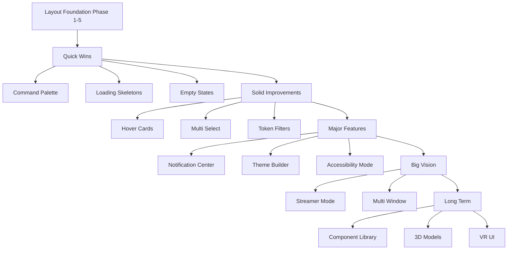
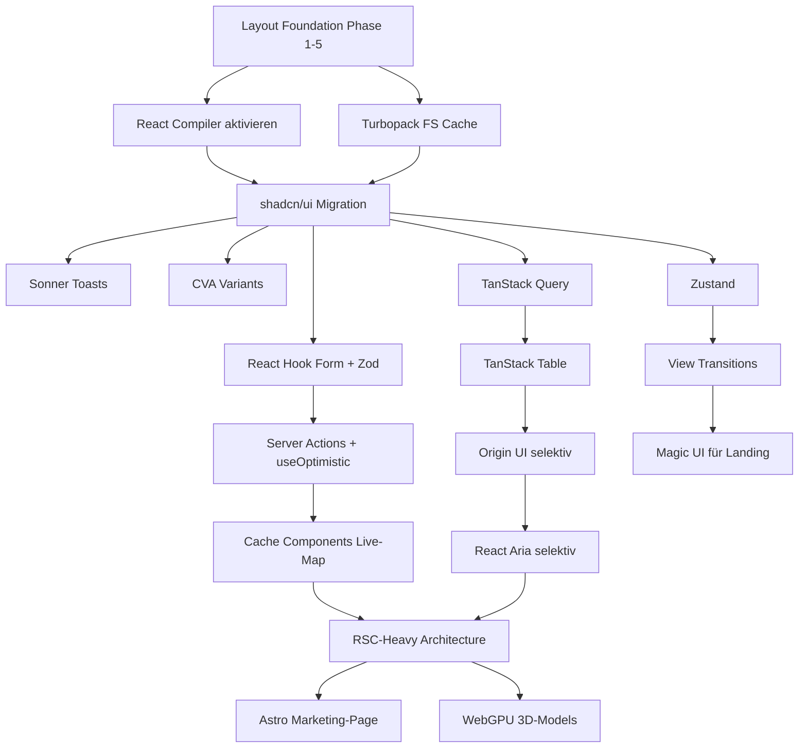

# Vision: Platform-Layout-Redesign

> **Status**: Vision / Architektur-Skizze / Migration-Plan
> **Datum**: 2026-04-27 (Tag 5 des Projekts)
> **Gilt als**: nicht-bindender Entwurf für künftiges Layout-Redesign
> **Verwandt**: `admin-dashboards-vision.md` (Section 8 ist Kurzversion davon)

Diese Doc beschreibt das geplante **Layout-Redesign** der VAM-Plattform — von aktuell Header-Only-Navigation zu einem Sidebar-fokussierten Layout, ähnlich wie vAMSYS Phoenix, Linear oder Discord. Inklusive Theme-System mit CSS-Variables + Tailwind, Per-Airline-Branding, Mobile-Strategie und Migration-Plan vom Bestehenden.

---

## Inhaltsverzeichnis

1. [Status-Quo: Was ist heute?](#1-status-quo-was-ist-heute)
2. [Probleme des aktuellen Layouts](#2-probleme-des-aktuellen-layouts)
3. [Ziel-Layout-Vision](#3-ziel-layout-vision)
4. [Component-Hierarchie](#4-component-hierarchie)
5. [Theme-System](#5-theme-system)
6. [Per-Airline-Branding](#6-per-airline-branding)
7. [Mobile-Strategie](#7-mobile-strategie)
8. [Tailwind-Code-Skizzen](#8-tailwind-code-skizzen)
9. [Accessibility (a11y)](#9-accessibility-a11y)
10. [Migration-Plan](#10-migration-plan)
11. [Innovation: Layout & Frontend-Visionen](#11-innovation-layout--frontend-visionen) (31 UX-Pattern-Ideen)
12. [Open Questions](#12-open-questions)
13. [Framework-Landscape & Innovation 2026](#13-framework-landscape--innovation-2026) (Stack-Refactor + 20+ Framework-Ideen)
14. [Out-of-Scope](#14-out-of-scope)
15. [Glossar](#15-glossar)

---

## 1. Status-Quo: Was ist heute?

### 1.1 Aktuelles Layout (Tag 5)

```
┌──────────────────────────────────────────────────────────────┐
│ [VAM Logo]  Dashboard  Live-Map  Settings        [Avatar▼]   │ ← Header
├──────────────────────────────────────────────────────────────┤
│                                                              │
│                                                              │
│                                                              │
│                       Page Content                           │
│                       (full-width)                           │
│                                                              │
│                                                              │
│                                                              │
└──────────────────────────────────────────────────────────────┘
```

### 1.2 Was funktioniert

```
✅ Einfach umgesetzt
✅ Mobile-friendly out-of-the-box (Header collapsed automatisch)
✅ Großer Content-Area
✅ Wenig Code
```

### 1.3 Was nicht funktioniert

```
❌ Bei vielen Top-Level-Routes wird Header zu lang
❌ Kein Platz für Sub-Navigation
❌ Kein "Aktive-Section"-Kontext erkennbar
❌ Keine Einsicht in Multi-Tenant-Kontext (welche Airline?)
❌ Settings/Admin-Bereich nicht klar getrennt
❌ Discord/Linear/Notion-Style-Look fehlt (= moderne SaaS-Optik)
```

### 1.4 Aktuelle Top-Level-Routes

```
/                       Landing-Page
/dashboard              Pilot-Dashboard
/livemap                Live-Map
/profile                User-Profile
/settings               User-Settings
/login                  Login
/register               Register
```

Geplant für Phase 4-5 Implementation:

```
/admin/*                Server-Admin (siehe admin-dashboards-vision.md)
/airline/{id}/admin/*   Airline-Admin
/booking                Booking-System (Tag 6)
/pireps                 PIREP-Übersicht
/fleet                  Fleet-Browse
/routes                 Routes-Browse
/awards                 Awards-Übersicht
/leaderboard            Leaderboards
```

= **15-20+ Routes geplant**. Im Header-Layout passen das nicht mehr rein.

---

## 2. Probleme des aktuellen Layouts

### 2.1 Skalierungs-Problem

Header-Navigation hat 3-5 Items Platz auf Desktop, dann muss in "Mehr ▾"-Dropdown ausgelagert werden. Bei 15-20 Routes wird das unübersichtlich.

```
Header bei 5 Items:    OK
Header bei 8 Items:    eng aber geht
Header bei 15+ Items:  Chaos / "Mehr ▾"-Hell
```

### 2.2 Multi-Tenant-Problem

Auf Multi-Tenant-Plattform ist nicht erkennbar in welchem Airline-Kontext der User ist. Im Sidebar-Pattern wäre das natürlich.

### 2.3 Kontext-Problem

Settings-Page sollte sich anders anfühlen als Dashboard. Aktuell sieht beides gleich aus.

### 2.4 Scroll-Verhalten

Header verschwindet beim Scrollen. Bei langer PIREP-Liste oder Live-Map verliert User die Navigation. Sidebar bleibt sichtbar.

---

## 3. Ziel-Layout-Vision

### 3.1 Hero-Mockup: Pilot-Dashboard mit Sidebar (Dark)

```svg
<svg viewBox="0 0 900 540" xmlns="http://www.w3.org/2000/svg">
  <!-- Background -->
  <rect width="900" height="540" fill="#020617"/>
  
  <!-- Sidebar -->
  <rect x="0" y="0" width="220" height="540" fill="#0f172a"/>
  
  <!-- Sidebar Header -->
  <rect x="0" y="0" width="220" height="64" fill="#1e293b"/>
  <circle cx="32" cy="32" r="14" fill="#6366f1"/>
  <text x="32" y="37" fill="#fff" font-family="system-ui" font-size="13" font-weight="700" text-anchor="middle">V</text>
  <text x="56" y="30" fill="#fff" font-family="system-ui" font-size="14" font-weight="600">VAM</text>
  <text x="56" y="46" fill="#94a3b8" font-family="system-ui" font-size="11">Lufthansa Virtual</text>
  
  <!-- Sidebar Section -->
  <text x="20" y="92" fill="#64748b" font-family="system-ui" font-size="10" font-weight="700">PILOT</text>
  
  <rect x="12" y="100" width="196" height="36" rx="6" fill="#1e293b"/>
  <text x="28" y="123" fill="#fff" font-family="system-ui" font-size="13" font-weight="600">🏠 Dashboard</text>
  
  <text x="28" y="153" fill="#94a3b8" font-family="system-ui" font-size="13">🌍 Live Map</text>
  <text x="28" y="183" fill="#94a3b8" font-family="system-ui" font-size="13">📅 My Bookings</text>
  <text x="28" y="213" fill="#94a3b8" font-family="system-ui" font-size="13">📋 My PIREPs</text>
  <text x="28" y="243" fill="#94a3b8" font-family="system-ui" font-size="13">🏆 Awards</text>
  
  <!-- Sidebar Section: Airline -->
  <text x="20" y="282" fill="#64748b" font-family="system-ui" font-size="10" font-weight="700">AIRLINE</text>
  
  <text x="28" y="305" fill="#94a3b8" font-family="system-ui" font-size="13">✈ Fleet</text>
  <text x="28" y="335" fill="#94a3b8" font-family="system-ui" font-size="13">🗺 Routes</text>
  <text x="28" y="365" fill="#94a3b8" font-family="system-ui" font-size="13">📊 Leaderboard</text>
  
  <!-- Sidebar Bottom -->
  <line x1="20" y1="450" x2="200" y2="450" stroke="#1e293b"/>
  <text x="28" y="475" fill="#94a3b8" font-family="system-ui" font-size="13">⚙ Settings</text>
  <text x="28" y="505" fill="#94a3b8" font-family="system-ui" font-size="13">🚪 Logout</text>
  
  <!-- Header -->
  <rect x="220" y="0" width="680" height="64" fill="#0f172a"/>
  <line x1="220" y1="64" x2="900" y2="64" stroke="#1e293b"/>
  <text x="240" y="38" fill="#fff" font-family="system-ui" font-size="18" font-weight="600">Dashboard</text>
  
  <!-- Search Box -->
  <rect x="540" y="18" width="180" height="28" rx="14" fill="#1e293b"/>
  <text x="556" y="36" fill="#64748b" font-family="system-ui" font-size="11">🔍 Search...</text>
  
  <!-- Notifications -->
  <circle cx="755" cy="32" r="14" fill="#1e293b"/>
  <text x="755" y="37" fill="#94a3b8" font-family="system-ui" font-size="13" text-anchor="middle">🔔</text>
  
  <!-- Avatar -->
  <circle cx="855" cy="32" r="14" fill="#6366f1"/>
  <text x="855" y="37" fill="#fff" font-family="system-ui" font-size="11" text-anchor="middle">KD</text>
  
  <!-- Stats Cards -->
  <rect x="240" y="88" width="200" height="100" rx="8" fill="#1e293b" stroke="#334155"/>
  <text x="260" y="112" fill="#94a3b8" font-family="system-ui" font-size="10" font-weight="700">FLIGHTS</text>
  <text x="260" y="148" fill="#fff" font-family="system-ui" font-size="28" font-weight="700">142</text>
  <text x="260" y="172" fill="#10b981" font-family="system-ui" font-size="11">↑ +12 this month</text>
  
  <rect x="450" y="88" width="200" height="100" rx="8" fill="#1e293b" stroke="#334155"/>
  <text x="470" y="112" fill="#94a3b8" font-family="system-ui" font-size="10" font-weight="700">FLIGHT HOURS</text>
  <text x="470" y="148" fill="#fff" font-family="system-ui" font-size="28" font-weight="700">234h</text>
  <text x="470" y="172" fill="#10b981" font-family="system-ui" font-size="11">↑ +18h this month</text>
  
  <rect x="660" y="88" width="220" height="100" rx="8" fill="#1e293b" stroke="#334155"/>
  <text x="680" y="112" fill="#94a3b8" font-family="system-ui" font-size="10" font-weight="700">CURRENT RANK</text>
  <text x="680" y="148" fill="#fff" font-family="system-ui" font-size="20" font-weight="700">Senior Captain</text>
  <text x="680" y="172" fill="#94a3b8" font-family="system-ui" font-size="11">12h to next rank</text>
  
  <!-- Active Flights -->
  <rect x="240" y="208" width="640" height="180" rx="8" fill="#1e293b" stroke="#334155"/>
  <text x="260" y="232" fill="#94a3b8" font-family="system-ui" font-size="11" font-weight="600">CURRENT FLIGHT</text>
  <text x="260" y="262" fill="#fff" font-family="system-ui" font-size="18" font-weight="600">DLH123 EDDF → LOWW</text>
  <text x="260" y="284" fill="#94a3b8" font-family="system-ui" font-size="13">A320-214 (D-AIBA) · Cruise · FL370</text>
  
  <rect x="260" y="310" width="500" height="6" rx="3" fill="#1e293b"/>
  <rect x="260" y="310" width="220" height="6" rx="3" fill="#6366f1"/>
  <text x="260" y="338" fill="#94a3b8" font-family="system-ui" font-size="11">EDDF</text>
  <text x="500" y="338" fill="#94a3b8" font-family="system-ui" font-size="11">Cruise · 38min remaining</text>
  <text x="740" y="338" fill="#94a3b8" font-family="system-ui" font-size="11">LOWW</text>
  
  <text x="780" y="262" fill="#a5b4fc" font-family="system-ui" font-size="13">Track →</text>
  
  <!-- Available Flights -->
  <rect x="240" y="408" width="640" height="120" rx="8" fill="#1e293b" stroke="#334155"/>
  <text x="260" y="432" fill="#94a3b8" font-family="system-ui" font-size="11" font-weight="600">SUGGESTED ROUTES</text>
  
  <rect x="260" y="448" width="180" height="60" rx="6" fill="#020617" stroke="#1e293b"/>
  <text x="276" y="470" fill="#fff" font-family="system-ui" font-size="12" font-weight="600">LOWW → EDDM</text>
  <text x="276" y="488" fill="#94a3b8" font-family="system-ui" font-size="10">A320 · 50min</text>
  
  <rect x="450" y="448" width="180" height="60" rx="6" fill="#020617" stroke="#1e293b"/>
  <text x="466" y="470" fill="#fff" font-family="system-ui" font-size="12" font-weight="600">LOWW → LSZH</text>
  <text x="466" y="488" fill="#94a3b8" font-family="system-ui" font-size="10">A320 · 1h 10min</text>
  
  <rect x="640" y="448" width="180" height="60" rx="6" fill="#020617" stroke="#1e293b"/>
  <text x="656" y="470" fill="#fff" font-family="system-ui" font-size="12" font-weight="600">LOWW → LFPG</text>
  <text x="656" y="488" fill="#94a3b8" font-family="system-ui" font-size="10">A320 · 1h 50min</text>
</svg>
```

### 3.2 Hero-Mockup: Pilot-Dashboard mit Sidebar (Light)

```svg
<svg viewBox="0 0 900 540" xmlns="http://www.w3.org/2000/svg">
  <!-- Background -->
  <rect width="900" height="540" fill="#f8fafc"/>
  
  <!-- Sidebar -->
  <rect x="0" y="0" width="220" height="540" fill="#fff"/>
  <line x1="220" y1="0" x2="220" y2="540" stroke="#e2e8f0"/>
  
  <!-- Sidebar Header -->
  <rect x="0" y="0" width="220" height="64" fill="#fff"/>
  <line x1="0" y1="64" x2="220" y2="64" stroke="#e2e8f0"/>
  <circle cx="32" cy="32" r="14" fill="#6366f1"/>
  <text x="32" y="37" fill="#fff" font-family="system-ui" font-size="13" font-weight="700" text-anchor="middle">V</text>
  <text x="56" y="30" fill="#0f172a" font-family="system-ui" font-size="14" font-weight="600">VAM</text>
  <text x="56" y="46" fill="#64748b" font-family="system-ui" font-size="11">Lufthansa Virtual</text>
  
  <!-- Sidebar Section -->
  <text x="20" y="92" fill="#94a3b8" font-family="system-ui" font-size="10" font-weight="700">PILOT</text>
  
  <rect x="12" y="100" width="196" height="36" rx="6" fill="#eef2ff"/>
  <text x="28" y="123" fill="#4338ca" font-family="system-ui" font-size="13" font-weight="600">🏠 Dashboard</text>
  
  <text x="28" y="153" fill="#475569" font-family="system-ui" font-size="13">🌍 Live Map</text>
  <text x="28" y="183" fill="#475569" font-family="system-ui" font-size="13">📅 My Bookings</text>
  <text x="28" y="213" fill="#475569" font-family="system-ui" font-size="13">📋 My PIREPs</text>
  <text x="28" y="243" fill="#475569" font-family="system-ui" font-size="13">🏆 Awards</text>
  
  <!-- Sidebar Section: Airline -->
  <text x="20" y="282" fill="#94a3b8" font-family="system-ui" font-size="10" font-weight="700">AIRLINE</text>
  
  <text x="28" y="305" fill="#475569" font-family="system-ui" font-size="13">✈ Fleet</text>
  <text x="28" y="335" fill="#475569" font-family="system-ui" font-size="13">🗺 Routes</text>
  <text x="28" y="365" fill="#475569" font-family="system-ui" font-size="13">📊 Leaderboard</text>
  
  <!-- Sidebar Bottom -->
  <line x1="20" y1="450" x2="200" y2="450" stroke="#e2e8f0"/>
  <text x="28" y="475" fill="#475569" font-family="system-ui" font-size="13">⚙ Settings</text>
  <text x="28" y="505" fill="#475569" font-family="system-ui" font-size="13">🚪 Logout</text>
  
  <!-- Header -->
  <rect x="220" y="0" width="680" height="64" fill="#fff"/>
  <line x1="220" y1="64" x2="900" y2="64" stroke="#e2e8f0"/>
  <text x="240" y="38" fill="#0f172a" font-family="system-ui" font-size="18" font-weight="600">Dashboard</text>
  
  <!-- Search Box -->
  <rect x="540" y="18" width="180" height="28" rx="14" fill="#f1f5f9"/>
  <text x="556" y="36" fill="#94a3b8" font-family="system-ui" font-size="11">🔍 Search...</text>
  
  <!-- Notifications -->
  <circle cx="755" cy="32" r="14" fill="#f1f5f9"/>
  <text x="755" y="37" fill="#475569" font-family="system-ui" font-size="13" text-anchor="middle">🔔</text>
  
  <!-- Avatar -->
  <circle cx="855" cy="32" r="14" fill="#6366f1"/>
  <text x="855" y="37" fill="#fff" font-family="system-ui" font-size="11" text-anchor="middle">KD</text>
  
  <!-- Stats Cards -->
  <rect x="240" y="88" width="200" height="100" rx="8" fill="#fff" stroke="#e2e8f0"/>
  <text x="260" y="112" fill="#94a3b8" font-family="system-ui" font-size="10" font-weight="700">FLIGHTS</text>
  <text x="260" y="148" fill="#0f172a" font-family="system-ui" font-size="28" font-weight="700">142</text>
  <text x="260" y="172" fill="#10b981" font-family="system-ui" font-size="11">↑ +12 this month</text>
  
  <rect x="450" y="88" width="200" height="100" rx="8" fill="#fff" stroke="#e2e8f0"/>
  <text x="470" y="112" fill="#94a3b8" font-family="system-ui" font-size="10" font-weight="700">FLIGHT HOURS</text>
  <text x="470" y="148" fill="#0f172a" font-family="system-ui" font-size="28" font-weight="700">234h</text>
  <text x="470" y="172" fill="#10b981" font-family="system-ui" font-size="11">↑ +18h this month</text>
  
  <rect x="660" y="88" width="220" height="100" rx="8" fill="#fff" stroke="#e2e8f0"/>
  <text x="680" y="112" fill="#94a3b8" font-family="system-ui" font-size="10" font-weight="700">CURRENT RANK</text>
  <text x="680" y="148" fill="#0f172a" font-family="system-ui" font-size="20" font-weight="700">Senior Captain</text>
  <text x="680" y="172" fill="#64748b" font-family="system-ui" font-size="11">12h to next rank</text>
  
  <!-- Active Flights -->
  <rect x="240" y="208" width="640" height="180" rx="8" fill="#fff" stroke="#e2e8f0"/>
  <text x="260" y="232" fill="#64748b" font-family="system-ui" font-size="11" font-weight="600">CURRENT FLIGHT</text>
  <text x="260" y="262" fill="#0f172a" font-family="system-ui" font-size="18" font-weight="600">DLH123 EDDF → LOWW</text>
  <text x="260" y="284" fill="#64748b" font-family="system-ui" font-size="13">A320-214 (D-AIBA) · Cruise · FL370</text>
  
  <rect x="260" y="310" width="500" height="6" rx="3" fill="#e2e8f0"/>
  <rect x="260" y="310" width="220" height="6" rx="3" fill="#6366f1"/>
  <text x="260" y="338" fill="#64748b" font-family="system-ui" font-size="11">EDDF</text>
  <text x="500" y="338" fill="#64748b" font-family="system-ui" font-size="11">Cruise · 38min remaining</text>
  <text x="740" y="338" fill="#64748b" font-family="system-ui" font-size="11">LOWW</text>
  
  <text x="780" y="262" fill="#4338ca" font-family="system-ui" font-size="13">Track →</text>
  
  <!-- Available Flights -->
  <rect x="240" y="408" width="640" height="120" rx="8" fill="#fff" stroke="#e2e8f0"/>
  <text x="260" y="432" fill="#64748b" font-family="system-ui" font-size="11" font-weight="600">SUGGESTED ROUTES</text>
  
  <rect x="260" y="448" width="180" height="60" rx="6" fill="#f8fafc" stroke="#e2e8f0"/>
  <text x="276" y="470" fill="#0f172a" font-family="system-ui" font-size="12" font-weight="600">LOWW → EDDM</text>
  <text x="276" y="488" fill="#64748b" font-family="system-ui" font-size="10">A320 · 50min</text>
  
  <rect x="450" y="448" width="180" height="60" rx="6" fill="#f8fafc" stroke="#e2e8f0"/>
  <text x="466" y="470" fill="#0f172a" font-family="system-ui" font-size="12" font-weight="600">LOWW → LSZH</text>
  <text x="466" y="488" fill="#64748b" font-family="system-ui" font-size="10">A320 · 1h 10min</text>
  
  <rect x="640" y="448" width="180" height="60" rx="6" fill="#f8fafc" stroke="#e2e8f0"/>
  <text x="656" y="470" fill="#0f172a" font-family="system-ui" font-size="12" font-weight="600">LOWW → LFPG</text>
  <text x="656" y="488" fill="#64748b" font-family="system-ui" font-size="10">A320 · 1h 50min</text>
</svg>
```

### 3.3 Layout-Bereiche

```
┌──────┬──────────────────────────────────────────────────────────┐
│ Logo │ Page Title                              [Search] [👤▼]   │
├──────┼──────────────────────────────────────────────────────────┤
│      │                                                          │
│ Nav  │                                                          │
│ Sec  │                                                          │
│ tion │                  Main Content Area                       │
│      │                                                          │
│ Nav  │                                                          │
│ Sec  │                                                          │
│ tion │                                                          │
│      │                                                          │
│ ───  │                                                          │
│      │                                                          │
│ Set  │                                                          │
│ Out  │                                                          │
└──────┴──────────────────────────────────────────────────────────┘
  ↑                          ↑
  Sidebar (220px)             Content (flexible)
```

### 3.4 Layout-Variantensystem

```
THREE LAYOUT-MODES:
─────────────────────────────────────────────
1. App-Layout (default für authenticated users)
   - Sidebar links
   - Header oben
   - Content rechts unten
   → Routes: /dashboard, /livemap, /admin, etc.

2. Auth-Layout (login/register)
   - Centered card
   - Kein Sidebar
   - Logo oben centered
   → Routes: /login, /register, /forgot-password

3. Public-Layout (landing-page, marketing)
   - Header oben (transparent over hero)
   - Footer unten
   - Kein Sidebar
   → Routes: /, /about, /pricing
```

---

## 4. Component-Hierarchie

### 4.1 Top-Level

```
RootLayout
├── ThemeProvider (Light/Dark/System)
├── ToastProvider (Notifications)
└── (children)
    ├── AuthLayout       (für /login, /register)
    ├── PublicLayout     (für Landing-Page)
    └── AppLayout        (für authenticated)
        ├── Sidebar
        │   ├── SidebarHeader (Logo + Airline-Name)
        │   ├── SidebarNav
        │   │   ├── SidebarSection (PILOT)
        │   │   │   ├── SidebarLink
        │   │   │   └── SidebarLink
        │   │   └── SidebarSection (AIRLINE)
        │   └── SidebarFooter (Settings, Logout)
        ├── Header
        │   ├── PageTitle (dynamic per route)
        │   ├── SearchBox
        │   ├── NotificationBell
        │   └── UserMenu
        └── Main
            └── (children) = Page Content
```

### 4.2 Component-Files-Struktur

```
src/components/layout/
├── AppLayout.tsx
├── AuthLayout.tsx
├── PublicLayout.tsx
├── Sidebar/
│   ├── Sidebar.tsx
│   ├── SidebarHeader.tsx
│   ├── SidebarNav.tsx
│   ├── SidebarSection.tsx
│   ├── SidebarLink.tsx
│   └── SidebarFooter.tsx
├── Header/
│   ├── Header.tsx
│   ├── PageTitle.tsx
│   ├── SearchBox.tsx
│   ├── NotificationBell.tsx
│   └── UserMenu.tsx
└── theme/
    ├── ThemeProvider.tsx
    └── ThemeSwitcher.tsx
```

---

## 5. Theme-System

### 5.1 Drei-Schicht-Architektur

```
SCHICHT 1: CSS-Variables (Design-Tokens)
─────────────────────────────────────────────
:root {
  --color-bg: ...
  --color-text: ...
  --color-primary: ...
  ...
}

[data-theme="dark"] {
  --color-bg: #020617;
  ...
}

SCHICHT 2: Tailwind-Mapping
─────────────────────────────────────────────
tailwind.config: {
  colors: {
    background: 'var(--color-bg)',
    foreground: 'var(--color-text)',
    primary: 'var(--color-primary)',
    ...
  }
}

SCHICHT 3: Component-Usage
─────────────────────────────────────────────
<div className="bg-background text-foreground">
  <button className="bg-primary text-primary-foreground">
    Click me
  </button>
</div>
```

### 5.2 CSS-Variable-Skizze

```css
/* src/styles/themes.css */

:root {
  /* Base palette */
  --color-bg:                 #ffffff;
  --color-bg-elevated:        #f8fafc;
  --color-bg-secondary:       #f1f5f9;
  
  --color-text:               #0f172a;
  --color-text-secondary:     #475569;
  --color-text-muted:         #94a3b8;
  
  --color-border:             #e2e8f0;
  --color-border-strong:      #cbd5e1;
  
  /* Brand */
  --color-primary:            #6366f1;
  --color-primary-hover:      #4f46e5;
  --color-primary-fg:         #ffffff;
  --color-primary-soft:       #eef2ff;
  --color-primary-soft-fg:    #4338ca;
  
  /* Semantic */
  --color-success:            #10b981;
  --color-warning:            #f59e0b;
  --color-danger:              #ef4444;
  --color-info:                #3b82f6;
  
  /* Sidebar-specific */
  --color-sidebar-bg:         var(--color-bg);
  --color-sidebar-border:     var(--color-border);
  --color-sidebar-item:       var(--color-text-secondary);
  --color-sidebar-item-hover: var(--color-bg-secondary);
  --color-sidebar-item-active-bg: var(--color-primary-soft);
  --color-sidebar-item-active-fg: var(--color-primary-soft-fg);
}

[data-theme="dark"] {
  --color-bg:                 #020617;
  --color-bg-elevated:        #0f172a;
  --color-bg-secondary:       #1e293b;
  
  --color-text:               #f8fafc;
  --color-text-secondary:     #cbd5e1;
  --color-text-muted:         #94a3b8;
  
  --color-border:             #1e293b;
  --color-border-strong:      #334155;
  
  /* Brand stays same */
  --color-primary:            #6366f1;
  --color-primary-hover:      #4f46e5;
  --color-primary-fg:         #ffffff;
  --color-primary-soft:       #1e1b4b;
  --color-primary-soft-fg:    #a5b4fc;
  
  /* Semantic stays same (mostly) */
  --color-success:            #10b981;
  --color-warning:            #f59e0b;
  --color-danger:              #ef4444;
  --color-info:                #3b82f6;
  
  /* Sidebar reuses base */
  --color-sidebar-bg:         var(--color-bg-elevated);
  --color-sidebar-border:     var(--color-border);
  --color-sidebar-item:       var(--color-text-secondary);
  --color-sidebar-item-hover: var(--color-bg-secondary);
  --color-sidebar-item-active-bg: var(--color-bg-secondary);
  --color-sidebar-item-active-fg: var(--color-text);
}
```

### 5.3 Tailwind-Config

```typescript
// tailwind.config.ts
import type { Config } from 'tailwindcss'

export default {
  content: ['./src/**/*.{ts,tsx,html}'],
  theme: {
    extend: {
      colors: {
        background: 'var(--color-bg)',
        'background-elevated': 'var(--color-bg-elevated)',
        'background-secondary': 'var(--color-bg-secondary)',
        
        foreground: 'var(--color-text)',
        'foreground-secondary': 'var(--color-text-secondary)',
        'foreground-muted': 'var(--color-text-muted)',
        
        border: {
          DEFAULT: 'var(--color-border)',
          strong: 'var(--color-border-strong)',
        },
        
        primary: {
          DEFAULT: 'var(--color-primary)',
          hover: 'var(--color-primary-hover)',
          foreground: 'var(--color-primary-fg)',
          soft: 'var(--color-primary-soft)',
          'soft-foreground': 'var(--color-primary-soft-fg)',
        },
        
        success: 'var(--color-success)',
        warning: 'var(--color-warning)',
        danger: 'var(--color-danger)',
        info: 'var(--color-info)',
        
        sidebar: {
          bg: 'var(--color-sidebar-bg)',
          border: 'var(--color-sidebar-border)',
          item: 'var(--color-sidebar-item)',
          'item-hover': 'var(--color-sidebar-item-hover)',
          'item-active-bg': 'var(--color-sidebar-item-active-bg)',
          'item-active-fg': 'var(--color-sidebar-item-active-fg)',
        },
      },
    },
  },
} satisfies Config
```

### 5.4 Theme-Switcher-Component

```typescript
// src/components/layout/theme/ThemeProvider.tsx
'use client'

import { createContext, useContext, useEffect, useState } from 'react'

type Theme = 'light' | 'dark' | 'system'

const ThemeContext = createContext<{
  theme: Theme
  setTheme: (theme: Theme) => void
  resolvedTheme: 'light' | 'dark'
} | null>(null)

export function ThemeProvider({ children }: { children: React.ReactNode }) {
  const [theme, setTheme] = useState<Theme>('system')
  const [resolvedTheme, setResolvedTheme] = useState<'light' | 'dark'>('dark')
  
  useEffect(() => {
    // Load saved theme from localStorage or user-preferences
    const saved = localStorage.getItem('vam-theme') as Theme | null
    if (saved) setTheme(saved)
  }, [])
  
  useEffect(() => {
    let actualTheme: 'light' | 'dark'
    
    if (theme === 'system') {
      actualTheme = window.matchMedia('(prefers-color-scheme: dark)').matches
        ? 'dark'
        : 'light'
    } else {
      actualTheme = theme
    }
    
    setResolvedTheme(actualTheme)
    document.documentElement.dataset.theme = actualTheme
    localStorage.setItem('vam-theme', theme)
  }, [theme])
  
  return (
    <ThemeContext.Provider value={{ theme, setTheme, resolvedTheme }}>
      {children}
    </ThemeContext.Provider>
  )
}

export const useTheme = () => {
  const ctx = useContext(ThemeContext)
  if (!ctx) throw new Error('useTheme must be inside ThemeProvider')
  return ctx
}
```

```typescript
// src/components/layout/theme/ThemeSwitcher.tsx
'use client'

import { useTheme } from './ThemeProvider'

export function ThemeSwitcher() {
  const { theme, setTheme } = useTheme()
  
  return (
    <div className="inline-flex rounded-full bg-background-secondary p-1">
      {(['light', 'dark', 'system'] as const).map((t) => (
        <button
          key={t}
          onClick={() => setTheme(t)}
          className={`
            rounded-full px-3 py-1 text-xs font-medium transition-colors
            ${theme === t
              ? 'bg-primary text-primary-foreground'
              : 'text-foreground-secondary hover:text-foreground'
            }
          `}
        >
          {t === 'light' ? '☀ Light' : t === 'dark' ? '🌙 Dark' : '⚙ System'}
        </button>
      ))}
    </div>
  )
}
```

---

## 6. Per-Airline-Branding

### 6.1 Konzept

Jede Airline kann auf der Plattform ein eigenes Branding haben, das **innerhalb des gewählten Light/Dark-Modes** wirkt — also nicht zwingt einen User von Light auf Dark.

```
USER WÄHLT GLOBAL:    Light / Dark / System
AIRLINE OVERRIDED:    Brand-Color (innerhalb Mode)
                      → Logo
                      → Primary-Color
                      → Optional: Sidebar-Akzente
```

### 6.2 Beispiel-Szenarien

```
Szenario 1: Lufthansa Virtual auf Dark-Theme
  Background: #020617 (default dark)
  Primary:    #FFCC00 (Lufthansa-Yellow → Custom-Override)
  Logo:       Lufthansa-Logo statt VAM-Logo
  
Szenario 2: Lufthansa Virtual auf Light-Theme  
  Background: #ffffff
  Primary:    #0066CC (Lufthansa-Blue, nicht Yellow weil schlecht auf weiß)
  Logo:       Lufthansa-Logo
  
Szenario 3: Eurowings Virtual
  Eigene Brand-Colors: Magenta + Schwarz
  
Szenario 4: User ist in keiner Airline
  Default-VAM-Branding (Indigo)
```

### 6.3 Implementation-Skizze

```typescript
// src/components/layout/theme/AirlineBrandingProvider.tsx

interface AirlineBranding {
  logoUrl?: string
  logoUrlDark?: string  // Optional: anderes Logo für Dark
  primaryColor?: string
  primaryColorDark?: string
  primaryHoverColor?: string
}

export function AirlineBrandingProvider({
  airline,
  children,
}: {
  airline: { id: string, branding: AirlineBranding } | null
  children: React.ReactNode
}) {
  const { resolvedTheme } = useTheme()
  
  useEffect(() => {
    if (!airline) {
      // Reset to defaults
      document.documentElement.style.removeProperty('--color-primary')
      document.documentElement.style.removeProperty('--color-primary-hover')
      return
    }
    
    const isDark = resolvedTheme === 'dark'
    const primary = isDark
      ? airline.branding.primaryColorDark ?? airline.branding.primaryColor
      : airline.branding.primaryColor
    
    if (primary) {
      document.documentElement.style.setProperty('--color-primary', primary)
    }
    
    // ...
  }, [airline, resolvedTheme])
  
  return <>{children}</>
}
```

### 6.4 UI für Airline-Admin

```
┌─────────────────────────────────────────────┐
│  Airline Branding                           │
├─────────────────────────────────────────────┤
│                                             │
│  Logo (Light Mode):                         │
│  [📁 Choose File] lufthansa-light.svg ✓    │
│  [Preview shows here]                       │
│                                             │
│  Logo (Dark Mode):                          │
│  [📁 Choose File] lufthansa-dark.svg ✓     │
│  [Preview shows here]                       │
│                                             │
│  Primary Color (Light Mode):                │
│  [🎨 #0066CC]  [Live Preview ▷]             │
│                                             │
│  Primary Color (Dark Mode):                 │
│  [🎨 #FFCC00]  [Live Preview ▷]             │
│                                             │
│  ☑ Apply branding to pilot dashboard        │
│  ☑ Apply branding to public pages           │
│  ☐ Apply branding to admin dashboard        │
│                                             │
│             [Cancel]  [Save Branding]       │
└─────────────────────────────────────────────┘
```

---

## 7. Mobile-Strategie

### 7.1 Breakpoints

```
Mobile:    <768px   (Sidebar collapsed, hamburger-menu)
Tablet:    768-1024 (Sidebar collapsed-narrow oder full)
Desktop:   1024+    (Sidebar full)
```

### 7.2 Sidebar-Verhalten

```
Desktop (>1024px):
  - Sidebar ist immer sichtbar
  - Width: 220px
  - Content: full-width minus Sidebar
  
Tablet (768-1024px):
  - Sidebar collapsible über Toggle
  - Default: collapsed (80px) mit nur Icons
  - Click expand: full 220px overlay
  
Mobile (<768px):
  - Sidebar als Drawer (von links rein)
  - Hamburger-Icon im Header
  - Klick auf Drawer-Link: Drawer schließt
  - Backdrop dimmt Content
```

### 7.3 Mockup: Mobile-Layout

```
┌────────────────────────────┐
│ [☰] VAM        [🔔] [👤]  │  ← Header mit Hamburger
├────────────────────────────┤
│                            │
│  Dashboard                 │
│                            │
│  ┌──────────────────────┐  │
│  │ Stats                │  │
│  │ Flights: 142        │  │
│  │ Hours: 234h         │  │
│  └──────────────────────┘  │
│                            │
│  ┌──────────────────────┐  │
│  │ Current Flight       │  │
│  │ DLH123 EDDF→LOWW   │  │
│  │ Cruise · 38min     │  │
│  └──────────────────────┘  │
│                            │
│  ┌──────────────────────┐  │
│  │ Suggested Routes     │  │
│  │ ...                  │  │
│  └──────────────────────┘  │
│                            │
└────────────────────────────┘
```

Mit Drawer offen:

```
┌─────────────────┬──────────┐
│ ╔═════════════╗ │░░░░░░░░░│
│ ║ V VAM       ║ │░░░░░░░░░│
│ ║   LH Virt   ║ │░░░░░░░░░│
│ ╠═════════════╣ │░░░░░░░░░│
│ ║ PILOT       ║ │░░░░░░░░░│
│ ║ 🏠 Dashboard║ │░░░░░░░░░│ ← Backdrop dimmed
│ ║ 🌍 Live Map ║ │░░░░░░░░░│
│ ║ 📅 Bookings ║ │░░░░░░░░░│
│ ║ ...         ║ │░░░░░░░░░│
│ ║             ║ │░░░░░░░░░│
│ ║ AIRLINE     ║ │░░░░░░░░░│
│ ║ ✈ Fleet     ║ │░░░░░░░░░│
│ ║ 🗺 Routes   ║ │░░░░░░░░░│
│ ║             ║ │░░░░░░░░░│
│ ║ ⚙ Settings  ║ │░░░░░░░░░│
│ ║ 🚪 Logout   ║ │░░░░░░░░░│
│ ╚═════════════╝ │░░░░░░░░░│
└─────────────────┴──────────┘
```

### 7.4 Implementation-Skizze

```typescript
// src/components/layout/Sidebar/Sidebar.tsx
'use client'

import { useState, useEffect } from 'react'

export function Sidebar() {
  const [isOpen, setIsOpen] = useState(false)  // mobile drawer state
  const [isMobile, setIsMobile] = useState(false)
  
  useEffect(() => {
    const check = () => setIsMobile(window.innerWidth < 768)
    check()
    window.addEventListener('resize', check)
    return () => window.removeEventListener('resize', check)
  }, [])
  
  return (
    <>
      {/* Backdrop for mobile drawer */}
      {isMobile && isOpen && (
        <div
          className="fixed inset-0 z-40 bg-black/50"
          onClick={() => setIsOpen(false)}
        />
      )}
      
      {/* Sidebar itself */}
      <aside
        className={`
          fixed inset-y-0 left-0 z-50 w-[220px] 
          bg-sidebar-bg border-r border-sidebar-border
          transition-transform duration-200
          md:translate-x-0
          ${isOpen ? 'translate-x-0' : '-translate-x-full'}
        `}
      >
        <SidebarHeader />
        <SidebarNav onLinkClick={() => setIsOpen(false)} />
        <SidebarFooter />
      </aside>
      
      {/* Hamburger toggle for mobile */}
      {isMobile && (
        <button
          onClick={() => setIsOpen(true)}
          className="fixed top-4 left-4 z-30 p-2"
          aria-label="Open menu"
        >
          ☰
        </button>
      )}
    </>
  )
}
```

---

## 8. Tailwind-Code-Skizzen

### 8.1 AppLayout

```typescript
// src/components/layout/AppLayout.tsx
import { Sidebar } from './Sidebar/Sidebar'
import { Header } from './Header/Header'

export function AppLayout({ children }: { children: React.ReactNode }) {
  return (
    <div className="min-h-screen bg-background text-foreground">
      <Sidebar />
      <div className="md:ml-[220px]">
        <Header />
        <main className="p-6 md:p-8">{children}</main>
      </div>
    </div>
  )
}
```

### 8.2 Sidebar (komplett)

```typescript
// src/components/layout/Sidebar/Sidebar.tsx
import Link from 'next/link'
import { usePathname } from 'next/navigation'

const navStructure = [
  {
    section: 'PILOT',
    items: [
      { href: '/dashboard', label: 'Dashboard', icon: '🏠' },
      { href: '/livemap', label: 'Live Map', icon: '🌍' },
      { href: '/bookings', label: 'My Bookings', icon: '📅' },
      { href: '/pireps', label: 'My PIREPs', icon: '📋' },
      { href: '/awards', label: 'Awards', icon: '🏆' },
    ],
  },
  {
    section: 'AIRLINE',
    items: [
      { href: '/fleet', label: 'Fleet', icon: '✈' },
      { href: '/routes', label: 'Routes', icon: '🗺' },
      { href: '/leaderboard', label: 'Leaderboard', icon: '📊' },
    ],
  },
]

export function Sidebar() {
  const pathname = usePathname()
  
  return (
    <aside className="
      fixed inset-y-0 left-0 z-30 w-[220px]
      bg-sidebar-bg border-r border-sidebar-border
      flex flex-col
    ">
      {/* Header */}
      <div className="
        flex h-16 items-center gap-3 px-5 border-b border-sidebar-border
      ">
        <div className="
          flex h-8 w-8 items-center justify-center rounded
          bg-primary text-primary-foreground font-bold text-sm
        ">
          V
        </div>
        <div>
          <div className="font-semibold text-sm leading-tight">VAM</div>
          <div className="text-xs text-foreground-muted">
            Lufthansa Virtual
          </div>
        </div>
      </div>
      
      {/* Nav */}
      <nav className="flex-1 overflow-y-auto p-3 space-y-6">
        {navStructure.map((section) => (
          <div key={section.section}>
            <div className="
              px-2 mb-2 text-xs font-bold text-foreground-muted tracking-wider
            ">
              {section.section}
            </div>
            <ul className="space-y-1">
              {section.items.map((item) => {
                const isActive = pathname === item.href
                return (
                  <li key={item.href}>
                    <Link
                      href={item.href}
                      className={`
                        flex items-center gap-3 px-3 py-2 rounded-md
                        text-sm transition-colors
                        ${isActive
                          ? 'bg-sidebar-item-active-bg text-sidebar-item-active-fg font-semibold'
                          : 'text-sidebar-item hover:bg-sidebar-item-hover hover:text-foreground'
                        }
                      `}
                    >
                      <span>{item.icon}</span>
                      <span>{item.label}</span>
                    </Link>
                  </li>
                )
              })}
            </ul>
          </div>
        ))}
      </nav>
      
      {/* Footer */}
      <div className="border-t border-sidebar-border p-3 space-y-1">
        <Link
          href="/settings"
          className="
            flex items-center gap-3 px-3 py-2 rounded-md
            text-sm text-sidebar-item
            hover:bg-sidebar-item-hover hover:text-foreground
          "
        >
          <span>⚙</span>
          <span>Settings</span>
        </Link>
        <button className="
          w-full flex items-center gap-3 px-3 py-2 rounded-md
          text-sm text-sidebar-item
          hover:bg-sidebar-item-hover hover:text-foreground
        ">
          <span>🚪</span>
          <span>Logout</span>
        </button>
      </div>
    </aside>
  )
}
```

### 8.3 Header

```typescript
// src/components/layout/Header/Header.tsx
'use client'

import { usePathname } from 'next/navigation'
import { SearchBox } from './SearchBox'
import { NotificationBell } from './NotificationBell'
import { UserMenu } from './UserMenu'

const titleMap: Record<string, string> = {
  '/dashboard': 'Dashboard',
  '/livemap': 'Live Map',
  '/bookings': 'My Bookings',
  '/pireps': 'My PIREPs',
  '/awards': 'Awards',
  '/fleet': 'Fleet',
  '/routes': 'Routes',
  '/leaderboard': 'Leaderboard',
  '/settings': 'Settings',
}

export function Header() {
  const pathname = usePathname()
  const title = titleMap[pathname] ?? 'VAM'
  
  return (
    <header className="
      sticky top-0 z-20 h-16 border-b border-border
      bg-background/80 backdrop-blur
      flex items-center justify-between px-6 md:px-8
    ">
      <h1 className="text-xl font-semibold">{title}</h1>
      
      <div className="flex items-center gap-3">
        <SearchBox />
        <NotificationBell />
        <UserMenu />
      </div>
    </header>
  )
}
```

### 8.4 Stats-Card-Pattern

```typescript
// src/components/ui/StatsCard.tsx
export function StatsCard({
  label,
  value,
  trend,
}: {
  label: string
  value: string
  trend?: { direction: 'up' | 'down', text: string }
}) {
  return (
    <div className="
      rounded-lg border border-border bg-background-elevated p-5
    ">
      <div className="text-xs font-bold text-foreground-muted tracking-wider">
        {label}
      </div>
      <div className="mt-3 text-3xl font-bold">
        {value}
      </div>
      {trend && (
        <div className={`
          mt-2 text-xs
          ${trend.direction === 'up' ? 'text-success' : 'text-danger'}
        `}>
          {trend.direction === 'up' ? '↑' : '↓'} {trend.text}
        </div>
      )}
    </div>
  )
}
```

Verwendung:

```tsx
<div className="grid grid-cols-1 md:grid-cols-3 gap-4">
  <StatsCard 
    label="FLIGHTS" 
    value="142" 
    trend={{ direction: 'up', text: '+12 this month' }}
  />
  <StatsCard 
    label="FLIGHT HOURS" 
    value="234h" 
    trend={{ direction: 'up', text: '+18h this month' }}
  />
  <StatsCard 
    label="CURRENT RANK" 
    value="Senior Captain" 
  />
</div>
```

---

## 9. Accessibility (a11y)

### 9.1 Pflicht-Features

```
KEYBOARD-NAVIGATION:
  - Tab: durch interaktive Elemente
  - Esc: schließt Drawer/Modal
  - Enter/Space: aktiviert Buttons/Links
  - Arrow-Keys: in Listen / Menus
  
SCREEN-READER:
  - Alle Buttons mit aria-label
  - Decorative Icons mit aria-hidden
  - Active-State mit aria-current="page"
  - Form-Inputs mit Labels (nicht placeholder als Label)
  
COLOR-CONTRAST:
  - Mindest-Kontrast WCAG AA (4.5:1 für normalen Text, 3:1 für large)
  - Light + Dark Theme beide getestet
  - Interactive-Elemente mit Hover-State
  
FOCUS-VISIBLE:
  - Tailwind: focus-visible:ring-2 focus-visible:ring-primary
  - Auf allen Buttons, Links, Inputs
  - Sichtbar genug für Tab-Navigation
```

### 9.2 Code-Skizze für SidebarLink

```typescript
<Link
  href={item.href}
  aria-current={isActive ? 'page' : undefined}
  className={`
    flex items-center gap-3 px-3 py-2 rounded-md
    text-sm transition-colors
    focus-visible:outline-none focus-visible:ring-2 
    focus-visible:ring-primary focus-visible:ring-offset-2
    ${isActive ? 'bg-...active...' : 'text-...inactive...'}
  `}
>
  <span aria-hidden="true">{item.icon}</span>
  <span>{item.label}</span>
</Link>
```

---

## 10. Migration-Plan

### 10.1 Aktueller Code-Stand

```
Aktueller Stand (Tag 5):
  - Top-Header in app/layout.tsx
  - Keine Sidebar-Component
  - Theme-Switcher noch nicht vorhanden
  - Tailwind-Defaults werden direkt verwendet (bg-slate-950 etc.)
```

### 10.2 Migrations-Phasen

```
PHASE 1: CSS-Variables-Foundation (Größe S, ~1 Tag)
─────────────────────────────────────────────
✅ Theme.css mit CSS-Variables anlegen
✅ Tailwind-Config umstellen auf CSS-Var-Mapping
✅ Existing Components (slate-950, indigo-600, etc.) → bg-background, text-primary, etc.
✅ Theme-Provider + Theme-Switcher anlegen
✅ Test: alle bestehenden Pages sehen gleich aus
   
Outcome: Basis für alles weitere. Keine UX-Änderung.

PHASE 2: AppLayout + Sidebar-Component (Größe M, ~2-3 Tage)
─────────────────────────────────────────────
✅ AppLayout-Component anlegen
✅ Sidebar-Component (mit Sections/Links)
✅ Header-Component (PageTitle, Search, Avatar)
✅ Routing: app/(auth)/* nutzt AuthLayout, app/(app)/* nutzt AppLayout
✅ Move Header-Items → Sidebar
   
Outcome: Sidebar-Layout aktiviert. Test.

PHASE 3: Mobile-Strategie (Größe S, ~1 Tag)
─────────────────────────────────────────────
✅ Sidebar mit Drawer-Mode für mobile
✅ Hamburger-Button im Header
✅ Backdrop für Drawer
✅ Test auf 320px, 768px, 1024px+
   
Outcome: Mobile-Friendly.

PHASE 4: Per-Airline-Branding (Größe M, ~2 Tage)
─────────────────────────────────────────────
✅ AirlineBrandingProvider-Component
✅ Airline-Settings-UI für Branding (Logo, Colors)
✅ Brand-Variables-Override-Logic
✅ Test: zwei Airlines parallel
   
Outcome: Multi-Tenant-Branding funktioniert.

PHASE 5: Polish + a11y (Größe S, ~1 Tag)
─────────────────────────────────────────────
✅ ARIA-Labels auf allen Buttons
✅ Focus-Visible-States
✅ Color-Contrast-Audit
✅ Keyboard-Navigation-Test
   
Outcome: Production-Ready.
```

**Total: ~7-10 Tage realistic** (mit Faktor 0.3: "Bauchgefühl 3-4 Wochen → Reality 7-10 Tage").

### 10.3 Backwards-Compatibility

Während Migration:
- Bestehende Pages funktionieren (CSS-Vars sind nicht-destructive)
- Routes ändern sich nicht
- Phase 1 kann ohne sichtbare Änderung deployed werden

---

## 11. Innovation: Layout & Frontend-Visionen

> **Vorbemerkung**: Diese Section listet Layout-spezifische Innovation-Ideen auf, organisiert nach Aufwand. Sie ergänzt die generische Innovation-Section in `admin-dashboards-vision.md` Section 9, fokussiert aber explizit auf **Frontend-/Layout-/Theme-/UX-Patterns**, nicht auf Backend, Twitch oder Aviation-Features.
>
> **Status-Tags**:
> - 🟢 **Just-Build** = Standard-Pattern, sicher umsetzbar
> - 🟡 **Validate-First** = Idee gut, aber unsicher ob User das wollen
> - 🔴 **Long-Term-Vision** = Erst nach Plattform-Reife sinnvoll
>
> **Aufwands-Skala**: S ≈ ½ Tag · M ≈ 1-2 Tage · L ≈ 3-5 Tage · XL ≈ 1-2 Wochen · XL+ ≈ Wochen+
>
> Diese Liste ist explizit als **Spielraum-Katalog** gedacht — was in Zukunft nice-to-have wäre, ohne Anspruch auf Umsetzung. Total: 24 Ideen.

### 11.1 Quick-Wins (S)

#### 11.1.1 Command-Palette (Cmd+K) · 🟢 · S

**Was**: Globale Command-Palette wie in Linear, Notion, VS Code. `Cmd+K` öffnet ein Search-Overlay mit allen verfügbaren Aktionen + Routes + zuletzt besuchten Pages.

**Warum**: Power-User-Feature. Ein einziges Keyboard-Shortcut um überall hinzuspringen.

**Implementation**: Library wie `cmdk` von pacocoursey, integriert mit Next.js Router + Sidebar-Routes-Liste.

**Mockup**:

```
┌─────────────────────────────────────────────┐
│  🔍 Type a command or search...        ESC   │
├─────────────────────────────────────────────┤
│  Recent                                     │
│    📅 My Bookings                           │
│    📋 PIREP DLH123                          │
│  Pages                                      │
│    🏠 Dashboard                             │
│    🌍 Live Map                              │
│  Actions                                    │
│    + New Booking                            │
│    + Submit PIREP                           │
│    🌙 Toggle Theme                          │
└─────────────────────────────────────────────┘
```

#### 11.1.2 Breadcrumb-Navigation für tiefe Routes · 🟢 · S

**Was**: Bei Sub-Pages (z.B. `/airline/lh/admin/fleet/aircraft/123`) Breadcrumb über dem Page-Title. Klickbar.

**Warum**: Bei tiefen Hierarchien einfacher zu navigieren als nur Sidebar.

**Mockup**:

```
Lufthansa Virtual › Admin › Fleet › Aircraft › D-AIBA
─────────────────────────────────────────────────────
A320-214 D-AIBA
```

#### 11.1.3 Sticky-Page-Actions im Header · 🟢 · S

**Was**: Page-spezifische Actions (z.B. "+ New Booking", "Save Changes") rutschen in den Header beim Scrollen statt wegzuverschwinden.

**Warum**: Auf langen Pages immer Zugriff auf wichtige Actions.

**Implementation**: Intersection-Observer auf Page-Action-Container.

#### 11.1.4 Empty-States mit Illustrations · 🟢 · S

**Was**: Wenn eine Liste leer ist (keine PIREPs, keine Bookings), schöne Illustration + Call-to-Action statt nur "No data".

**Warum**: Bessere Onboarding-Erfahrung für neue User.

**Mockup**:

```
┌─────────────────────────────────────────────┐
│                                             │
│             [✈ Illustration]                 │
│                                             │
│       No flights yet                        │
│       Book your first route to get started  │
│                                             │
│       [Browse Available Routes →]           │
│                                             │
└─────────────────────────────────────────────┘
```

#### 11.1.5 Loading-Skeletons statt Spinner · 🟢 · S

**Was**: Beim Daten-Laden zeigt UI Skeleton-Placeholder mit Aircraft-Outline, Card-Outlines, etc. statt generic Spinner.

**Warum**: Wirkt schneller, weniger Layout-Shift beim Daten-Eintreffen.

**Implementation**: Tailwind-Animation-Classes + bestehende Card-Strukturen als Skeleton.

#### 11.1.6 Keyboard-Shortcut-Cheatsheet · 🟢 · S

**Was**: `?` öffnet Modal mit allen verfügbaren Shortcuts (Cmd+K, G+D für Dashboard, etc.).

**Warum**: Discovery von Power-User-Features.

---

### 11.2 Solid-Improvements (M)

#### 11.2.1 Page-Transitions mit View-Transitions-API · 🟢 · M

**Was**: Native View-Transitions-API (Chrome 111+, Safari 18+) für smooth Page-Wechsel. Aviation-typische Animation: kleines Aircraft fliegt von alter zu neuer Page.

**Warum**: Modern, performant (GPU-beschleunigt), kostet wenig Code.

**Implementation**: Next.js 16 unterstützt View-Transitions out-of-the-box.

#### 11.2.2 Dense/Comfortable/Spacious-Density-Toggle · 🟢 · M

**Was**: User kann zwischen drei Padding-Modi wählen. Dense für Power-User mit viel Daten, Spacious für Anfänger.

**Warum**: Accessibility + Power-User-Komfort.

**Implementation**: CSS-Var `--density-scale: 1.0 | 0.75 | 1.25` multipliziert Padding/Margins.

#### 11.2.3 Anpassbare Sidebar-Sections · 🟢 · M

**Was**: User kann Sidebar-Sections collabsieren/expandieren. State persistiert pro User. Nicht-genutzte Sections können hidden werden.

**Implementation**: Local-Storage + User-Preferences.

#### 11.2.4 Inline-Editing für Tables · 🟢 · M

**Was**: In Routes/Fleet/Pireps-Tabellen können Felder direkt inline editiert werden (statt Modal-Dialog).

**Warum**: Bulk-Edit-Workflow effizienter.

#### 11.2.5 Hover-Cards für Quick-Info · 🟢 · M

**Was**: Hover über Aircraft-Registration / Pilot-Username / Airport-Code zeigt Mini-Card mit Quick-Info ohne Page-Wechsel.

**Mockup**:

```
Pilot: CrysaGaming hover →
                         ┌────────────────────┐
                         │ Kevin Drack         │
                         │ Senior Captain      │
                         │ 142 flights · 234h  │
                         │ Online VATSIM       │
                         └────────────────────┘
```

#### 11.2.6 Multi-Select + Bulk-Actions · 🟢 · M

**Was**: In Listen Mehrfachauswahl mit Checkboxes. Bulk-Actions im Footer (Approve all, Delete all, Export).

**Use-Case**: PIREP-Approval, Route-Bulk-Edit, Pilot-Management.

#### 11.2.7 Advanced-Filter-System mit Token-Search · 🟢 · M

**Was**: Filter-Bar wie GitHub-Issues. `aircraft:A320 destination:LOWW status:approved`. Token-basiert, klickbar zum Editieren.

**Warum**: Mächtige Filter ohne komplexes UI.

---

### 11.3 Major-Features (L)

#### 11.3.1 Workspace-System (Multi-Tab innerhalb der App) · 🟡 · L

**Was**: Wie VS Code: User kann mehrere "Workspaces" (Tabs) parallel offen halten innerhalb der App. Live-Map in Tab 1, Booking-Detail in Tab 2, PIREPs-Liste in Tab 3.

**Warum**: Power-User können zwischen Aufgaben springen ohne Navigation zu verlieren.

**Mockup**:

```
┌────────────────────────────────────────────────────┐
│ [🌍 Live Map] [📋 PIREP DLH123 ×] [📅 Bookings ×]+│
├────────────────────────────────────────────────────┤
│                                                    │
│  Active Tab Content (Live Map)                     │
│                                                    │
└────────────────────────────────────────────────────┘
```

**Implementation**: Tab-State im URL-Hash (`#tab=livemap+pirep:123+bookings`), pro Tab eigener React-Tree.

#### 11.3.2 Customizable-Dashboard mit Widget-System · 🟡 · L

**Was**: User kann sein Dashboard mit Drag&Drop konfigurieren. Widgets: Stats-Cards, Active-Flights, Recent-PIREPs, Awards-Progress, etc.

**Warum**: Pro Pilot andere Prioritäten — Senior-Captain will Awards, Trainee will nächste-Lessons.

**Mockup**:

```
Edit-Mode:
┌──────────────────────────────────────────────────────┐
│  Dashboard                            [Done Editing] │
├──────────────────────────────────────────────────────┤
│  ┌──────────┐ ┌──────────┐ ┌──────────────────────┐ │
│  │ Stats    │ │ Stats    │ │ Recent PIREPs        │ │
│  │ ⋮⋮       │ │ ⋮⋮       │ │ ⋮⋮                   │ │
│  └──────────┘ └──────────┘ └──────────────────────┘ │
│  ┌──────────────────────────┐ ┌────────────────────┐ │
│  │ Live Flights             │ │ Awards Progress    │ │
│  │ ⋮⋮                       │ │ ⋮⋮                 │ │
│  └──────────────────────────┘ └────────────────────┘ │
│                                                      │
│  [+ Add Widget]                                      │
└──────────────────────────────────────────────────────┘
```

**Implementation**: Library wie `react-grid-layout`, Widget-Catalog mit lazy-loading, Layout-State in DB.

#### 11.3.3 Picture-in-Picture für Live-Map · 🟢 · L

**Was**: Live-Map kann in kleines floating Window (PiP) verschoben werden. User browsed andere Pages, Map bleibt sichtbar als Overlay (z.B. unten rechts).

**Warum**: User kann während Flight in Settings/PIREPs/etc. navigieren ohne Live-Map-Kontext zu verlieren.

**Implementation**: Native Picture-in-Picture-API (für Video) oder Custom-Floating-Component.

#### 11.3.4 Theme-Builder mit Live-Preview · 🟢 · L

**Was**: Airline-Admin kann Theme komplett über Visual-UI bauen. Color-Picker für jeden Token, Live-Preview wie's auf Plattform aussieht. Export als JSON.

**Mockup**:

```
┌────────────────────────────────────────────────────┐
│  Theme Builder            [Save]  [Export JSON]   │
├────────────────────────┬───────────────────────────┤
│ TOKENS                 │ LIVE PREVIEW              │
│                        │                           │
│ Background  [#020617▼]│ ┌──────────────────────┐  │
│ Foreground  [#f8fafc▼]│ │ Sample Page          │  │
│ Primary     [#6366f1▼]│ │  ┌────────────────┐  │  │
│ Border      [#1e293b▼]│ │  │ Card           │  │  │
│ ...                    │ │  │ [Button]       │  │  │
│                        │ │  └────────────────┘  │  │
│ [Reset to default]     │ └──────────────────────┘  │
│                        │                           │
└────────────────────────┴───────────────────────────┘
```

#### 11.3.5 In-App-Notifications-Center mit History · 🟢 · L

**Was**: Bell-Icon im Header öffnet Drawer mit allen Notifications (PIREP-approved, Rank-up, etc.). History persistiert. Mark-as-read, Filter, Settings welche Types.

**Implementation**: WebSocket für real-time, Notification-Model in DB, Drawer-Component.

#### 11.3.6 Accessibility-Mode (High-Contrast + Larger-Text) · 🟢 · L

**Was**: Spezieller a11y-Mode mit:
- Höherer Kontrast (WCAG AAA statt AA)
- Größere Schrift (1.25× scale)
- Reduzierte Animationen (`prefers-reduced-motion`)
- Mehr Whitespace

**Warum**: Inklusion. Manche Pilots haben visuelle Beeinträchtigungen.

**Implementation**: Eigenes CSS-Variable-Set + Toggle in Settings.

#### 11.3.7 Print-Friendly-Stylesheets · 🟢 · L

**Was**: PIREP-Detail, Booking-Detail, Awards-Profil als Print-Ansicht (Cmd+P) sieht aus wie offizielles Dokument. Mit Logo, Header, Footer.

**Warum**: User wollen manchmal physische Dokumente (Rahmen für Awards, Pilot-Logbook-Print).

**Implementation**: `@media print` CSS, eigene Component-Variante.

#### 11.3.8 Drag-and-Drop-File-Upload everywhere · 🟢 · L

**Was**: Jede Page die Files akzeptiert (Logo-Upload, Aircraft-Liveries, PIREP-Screenshots) hat Drag-and-Drop direkt auf die Page. Mit Visual-Feedback während Drag.

**Implementation**: HTML5 Drag-and-Drop-API.

---

### 11.4 Big-Vision (XL)

#### 11.4.1 Persönliches Dashboard mit ML-driven-Recommendations · 🟡 · XL

**Was**: Dashboard zeigt nicht statische Stats, sondern ML-personalisierte Inhalte: "Du fliegst meist morgens A320 — heute Wetter perfekt für EDDF→LOWW", "Du brauchst noch 5h für Senior-Captain — hier sind 3 passende Routen".

**Warum**: Aktive Engagement-Treiber. User kommt zurück weil sich's relevant anfühlt.

**Implementation-Skizze**:
- ML-Modell auf User-PIREP-Pattern (Aircraft, Times, Routes)
- Recommendation-Engine basierend auf Cosine-Similarity ähnlicher Pilots
- Recharts/D3 für personalisierte Stats-Visualisierungen
- Edge-Computed (Vercel Edge) für niedrige Latency

**Aufwand**: ~2-3 Wochen MVP, Modell-Tuning ongoing.

**Risiken**:
- Kalt-Start-Problem (neue User haben keine Daten)
- ML-Hallucinations bei kleinen Datasets
- Validate-First: erst manuell prüfen ob Empfehlungen sinnvoll

#### 11.4.2 Multi-Window-Support (PWA-Detached-Windows) · 🟡 · XL

**Was**: Kompletter Multi-Window-Support für Power-User. Live-Map in eigenem Browser-Fenster (zum Zweitmonitor draggen), Booking-Detail in separatem Fenster, Synchronisation zwischen Fenstern via BroadcastChannel-API.

**Warum**: Streamer/Power-User mit Multi-Monitor-Setups (typisch in Aviation-Community).

**Implementation-Skizze**:
- Window-Manager-Component
- BroadcastChannel-API für Cross-Window-Sync
- Each-Window kennt seinen "Mode" (live-map / booking-detail / etc.)
- State-Sharing über Shared-Worker

**Aufwand**: ~2-3 Wochen.

**Risiken**:
- Browser-Compatibility variiert
- State-Sync-Komplexität
- Mobile braucht das nicht

#### 11.4.3 Aviation-themed Animation-Library · 🟢 · XL

**Was**: Sammlung von Aviation-spezifischen Micro-Animations: Aircraft-fliegt-über-Page bei Page-Load, Heading-Indicator-Pulse bei aktiven Flights, Wind-Sock-Animation für Wetter-Cards, Engine-Sound-Animation bei Take-off-Status.

**Warum**: Brand-Identity. Macht VAM aviation-feel statt generic SaaS.

**Implementation**: Lottie-Library (free Aircraft-Animations) oder eigene CSS/Framer-Motion-Suite.

**Aufwand**: ~2 Wochen für Initial-Library, dann ongoing.

#### 11.4.4 Adaptive UI für Cockpit-Stream-Mode · 🟢 · XL

**Was**: Spezial-Mode "Streamer-Cockpit". UI optimiert für Pilot-der-streamt: extra-große Schrift, Hoch-Kontrast, Auto-Hiding-Sidebar, Quick-Actions im Reach. Aktivierbar mit Keyboard-Shortcut.

**Warum**: Streamer haben andere Anforderungen als normale User. Sie navigieren nicht mit Maus, oft mit Voice oder One-Hand. UI muss das respektieren.

**Mockup**:

```
Streamer-Mode aktiviert (compact, focused):
┌────────────────────────────────────────────────────┐
│ ✈ Live: DLH123  EDDF→LOWW  Cruise FL370    ⚙ ESC │ 
├────────────────────────────────────────────────────┤
│                                                    │
│         BIG MAP / FLIGHT-INSTRUMENTS               │
│                                                    │
│                                                    │
├────────────────────────────────────────────────────┤
│ 📡 Twitch: 234 viewers · 5 subs today  · [Chat]   │
└────────────────────────────────────────────────────┘
```

**Aufwand**: ~2-3 Wochen.

#### 11.4.5 Inter-Window-Drag-and-Drop · 🟡 · XL

**Was**: User kann Items zwischen offenen Browser-Fenstern draggen. Drag PIREP von Window A in Discord-Webhook-Component in Window B → wird gepostet.

**Warum**: Workflow-Beschleunigung für Power-User.

**Implementation**: HTML5 Drag-and-Drop mit JSON-Daten in DataTransfer-Object. Cross-Window via BroadcastChannel.

**Aufwand**: ~3 Wochen.

**Risiken**:
- Browser-Quirks
- Niche-Use-Case
- Validate-First strict

---

### 11.5 Long-Term-Vision (XL+)

#### 11.5.1 Component-Library als Open-Source-Package · 🟢 · XL+

**Was**: VAM's Component-Library wird als Standalone-NPM-Package extrahiert (`@vam/ui`). Andere VA-Tools können es nutzen. Storybook für Doku.

**Warum**: Community-Building, Reputation, evtl. Konsolidierung der VA-Tooling-Landschaft.

**Implementation-Skizze**:
- Workspace-Setup mit Turborepo (haben wir schon!)
- Storybook für Component-Showcase
- Auto-Publish zu NPM via GitHub-Actions
- Theme-System bleibt in Core, optional in Library

**Aufwand**: ~6-8 Wochen Initial, ongoing-maintenance.

**Risiken**:
- Library-Maintenance ist eigenständige Arbeit
- Breaking-Changes komplex zu managen
- Community-Erwartungen
- Long-Term-Vision

#### 11.5.2 3D-Visualization-Engine für Aircraft-Models · 🟡 · XL+

**Was**: Im Browser 3D-Aircraft-Models zeigen (für Fleet-Detail-Pages, Aircraft-Selection beim Booking). Dreh-, Zoom-, Inspizier-bar.

**Warum**: Visuell-stark, hilft Aircraft-Identification, "wow"-Faktor.

**Implementation**: Three.js oder Babylon.js, glTF-Aircraft-Models (von MSFS-Liveries-Communities oder kommerziell).

**Aufwand**: ~2-3 Monate.

**Risiken**:
- Aircraft-Model-Lizenz-Fragen
- Performance auf mobilen Geräten
- Storage für 3D-Assets

#### 11.5.3 AR-Overlay-Mode (Smartphone-Cam auf Hardware) · 🔴 · XL+

**Was**: Companion-Mobile-App. Smartphone-Cam auf reales Pilot-Setup (Yoke, Throttle), AR-Overlays zeigen Live-Sim-Daten ergänzend zum Cockpit-Display.

**Warum**: Bridge zwischen Real-Hardware und virtueller Welt. Niche aber wow.

**Implementation-Skizze**:
- React-Native + ARKit/ARCore
- Computer-Vision für Hardware-Erkennung
- WebSocket zur VAM-Plattform für Sim-Daten

**Aufwand**: ~3-4 Monate.

**Risiken**:
- Hardware-Diversität
- CV-Genauigkeit bei schlechter Beleuchtung
- Smartphone-Battery-Drain

#### 11.5.4 Voice-Controlled-UI · 🟡 · XL+

**Was**: User kann mit Sprache durch UI navigieren. "Open Live Map", "Show my last 10 PIREPs", "Book EDDF to LOWW with A320". Hands-free für Streaming oder VR.

**Warum**: Accessibility + Streamer-Use-Case.

**Implementation**:
- Browser-Speech-Recognition-API (kostenlos)
- Intent-Recognition (LLM oder Custom-NLU)
- Action-Mapping zu UI-Routes/Functions

**Aufwand**: ~2 Monate.

**Risiken**:
- Recognition-Genauigkeit
- Privacy (Mikrofon-Permission)
- Validate-First

#### 11.5.5 Holographic/Spatial-UI für VR · 🔴 · XL+

**Was**: VAM-UI ist auch in VR-Headsets nutzbar. WebXR-basiert. Pilot kann in VR seine Stats, Bookings, PIREPs anschauen.

**Warum**: Aviation + VR ist starke Kombination. MSFS-VR-Pilots gibt es viele.

**Implementation**: WebXR + A-Frame oder Three.js mit XR-Renderer. UI-Components-Variante für 3D-Space.

**Aufwand**: ~4-6 Monate.

**Risiken**:
- VR-Adoption in Web-Apps niedrig
- UX-Patterns für VR sind anders
- Eigene Forschungs-Sache

---

### 11.6 Strategische Reihenfolge



**Empfohlene Implementations-Reihenfolge** (nach Foundation-Phase 1-5):

```
1.  11.1.1  Command-Palette (sofort wertvoll, 1 Tag)
2.  11.1.5  Loading-Skeletons (1 Tag)
3.  11.1.4  Empty-States (½ Tag)
4.  11.2.5  Hover-Cards (1-2 Tage)
5.  11.2.6  Multi-Select + Bulk (1-2 Tage)
6.  11.3.5  Notification-Center (3-4 Tage)
7.  11.3.4  Theme-Builder (3-4 Tage)
8.  11.3.6  Accessibility-Mode (3-4 Tage)
9.  11.4.4  Streamer-Cockpit-Mode (2 Wochen)
10. 11.4.1  ML-Recommendations (2-3 Wochen)
... (Rest nach Bedarf)
```

---

## 12. Open Questions

### 12.1 Sidebar-Width

```
Frage: Fixed 220px oder responsive?

A) Fixed 220px (mein Vorschlag)
   ✅ Konsistente UX
   ✅ Einfach zu implementieren
   ⚠️ Auf 1280px-Screens etwas viel

B) Responsive: 240px desktop, 220px tablet, drawer mobile
   ✅ Optimaler Platz pro Bildschirm
   ⚠️ Mehr Logic
   
Empfehlung: A starten, bei Bedarf später B.
```

### 12.2 Logo-Position

```
Frage: Logo im Sidebar-Header (mein Vorschlag) oder im Top-Header?

Sidebar-Header:
  ✅ Klare Brand-Identity links
  ✅ Wie Linear / Notion / Discord
  
Top-Header:
  ✅ Wie traditionelle Web-Apps
  ⚠️ Doppelt mit Page-Title

Empfehlung: Sidebar-Header (modern + brand-stark).
```

### 12.3 Sidebar-Sections

```
Frage: Wie Sections gruppieren?

Variante A (mein Vorschlag):
  PILOT (eigene Aktivitäten)
  AIRLINE (geteilte Daten der VA)
  
Variante B:
  TRAINING / OPS / COMMUNITY
  
Variante C:
  Flach ohne Sections

Empfehlung: A. Klar getrennt + skaliert mit Sub-Items.
```

### 12.4 Search-Box-Scope

```
Frage: Was kann gesucht werden?

V1 (MVP):
  - Routes (Departure→Destination)
  - Aircraft (Registration)
  - Pilots (Username)
  - Airports (ICAO/IATA)
  
V2:
  - PIREPs
  - Awards
  - Discord-Messages (wenn Discord-Integration)
  
Empfehlung: V1, mit klaren Result-Categories. V2 inkrementell.
```

### 12.5 Theme-Switcher-Position

```
Frage: Wo?

A) Im Sidebar-Footer (kompakt)
B) Im Header (UserMenu-Dropdown)
C) Pro-Airline-Override im Branding-Setup
D) In Settings-Page

Empfehlung: B (UserMenu) für quick-toggle, plus D für detailled
            (System/Light/Dark + Airline-Override-Settings).
```

---

## 13. Framework-Landscape & Innovation 2026

> **Vorbemerkung**: Das Layout-Redesign ist auch ein **Frontend-Stack-Refactor**. Diese Section listet die State-of-the-Art-Frameworks und -Tools die 2026 für eine VAM-artige Plattform relevant sind, plus konkrete Innovationen die durch sie möglich werden.
>
> **Status-Tags** (wie Section 11):
> - 🟢 **Just-Build** = Standard-Pattern, sicher umsetzbar, low-risk
> - 🟡 **Validate-First** = Idee gut, aber unsicher ob Aufwand sich lohnt
> - 🔴 **Long-Term-Vision** = Erst nach Plattform-Reife sinnvoll
> - ⚫ **Avoid** = Recherchiert, aber nicht empfohlen für VAM-Kontext
>
> **Aufwands-Skala**: S ≈ ½ Tag · M ≈ 1-2 Tage · L ≈ 3-5 Tage · XL ≈ 1-2 Wochen · XL+ ≈ Wochen+
>
> Diese Section ergänzt Section 11 um die **Framework-Dimension**. Während Section 11 UX-Patterns katalogisiert, fokussiert hier alles auf **welche moderne Tools** wir nutzen (sollten).

### 13.1 Stack-Status: Was haben wir heute?

```
AKTUELLER VAM-FRONTEND-STACK (Tag 5):
─────────────────────────────────────────────
Framework:         Next.js 16 (App Router)            ✅ current
React:             React 19                           ✅ current  
Bundler:           Turbopack                          ✅ default in N16
Styling:           Tailwind CSS v4                    ✅ current
Components:        Custom + Tremor Raw                ⚠️ veraltet (Tremor!)
Forms:             native form + manual               ⚠️ kein RHF/Zod
Server-State:      Server-Actions + Prisma           ⚠️ kein TanStack Query
Client-State:      useState + Context                 ⚠️ kein Zustand/Jotai
Animations:        CSS + Tailwind                     ✅ minimal nötig
Icons:             Lucide                             ✅ current
Toasts:            keine                              ❌ fehlt
Data-Tables:       manual                             ⚠️ kein TanStack Table
```

### 13.2 Was uns 2026 fehlt — kritischer Gap-Check

```
┌──────────────────────────┬────────────┬───────────────────────┐
│ Bereich                  │ Status     │ 2026-Standard         │
├──────────────────────────┼────────────┼───────────────────────┤
│ Component-Library        │ Tremor Raw │ shadcn/ui ⭐          │
│ Server-State-Mgmt        │ ad-hoc     │ TanStack Query        │
│ Client-State-Mgmt        │ Context    │ Zustand               │
│ Forms                    │ manual     │ React Hook Form + Zod │
│ Toast/Notifications      │ keine      │ Sonner                │
│ Variant-Mgmt             │ keine      │ CVA                   │
│ Data-Tables              │ manual     │ TanStack Table        │
│ Class-Merging            │ keine      │ tailwind-merge        │
│ Date-Picker              │ keine      │ date-fns + react-day  │
│ Icons                    │ Lucide     │ ✅ already             │
│ Bundler                  │ Turbopack  │ ✅ already             │
│ React-Compiler           │ off        │ on (Next 16 stable)   │
└──────────────────────────┴────────────┴───────────────────────┘
```

**Wichtigste Gaps**: Tremor Raw → shadcn/ui-Migration, TanStack Query, Zustand, Sonner, CVA. Das ist der "Layout-Foundation+" der das Redesign begleitet.

### 13.3 React 19/19.2 nutzen wir noch nicht voll

```
React-19-Features die VAM aktuell NICHT nutzt:
─────────────────────────────────────────────
❌ React Compiler                  → auto-memoization
❌ Actions API (useTransition)     → async-form-handling
❌ useFormStatus                   → form-status ohne prop-drilling
❌ useOptimistic                   → optimistic-UI für PIREP-submit
❌ use() für Promises in render    → cleaner data-loading
❌ Document-Metadata native         → SEO ohne next/head
❌ Server-Components voll          → kleinere JS-Payloads
❌ <Activity>-Component            → State-Preservation in 19.2
❌ useEffectEvent                  → event-handler ohne reactive-deps
❌ View-Transitions native (19.2)  → smooth page-changes
```

### 13.4 Next.js 16/16.2 nutzen wir noch nicht voll

```
Next-16-Features die VAM aktuell NICHT aktiviert hat:
─────────────────────────────────────────────
⚠️ React Compiler Integration      → off (default)
⚠️ Turbopack File System Cache     → would speed dev-startup 87%
⚠️ Layout-Deduplication            → automatic, brauchen kein Setup
⚠️ Incremental Prefetching         → automatic, schon aktiv
❌ updateTag() / revalidateTag()   → cache-mgmt für Server-State
❌ Cache Components (opt-in)       → static-shell + streaming-pieces
❌ Server Function Logging        → dev-debug-improvement
❌ Hydration-Diff-Indicator       → dev-debug-improvement
❌ AGENTS.md (für AI-Tools)       → AI-Coding-Hints
```

### 13.5 Just-Build (S+M) — Framework-Foundation

#### 13.5.1 Migration Tremor Raw → shadcn/ui · 🟢 · L

**Was**: Tremor Raw entfernen, shadcn/ui CLI einrichten, Components nach Bedarf installieren.

**Warum**:
- shadcn/ui ist 2026 De-facto-Standard für React-Apps
- Code-Ownership statt Library-Dependency  
- Tailwind v4 + Radix Primitives als Foundation
- Massive Ecosystem (Origin, Magic, Aceternity-Components plug-and-play)
- Aktiv weiterentwickelt vs Tremor Raw stagniert

**Implementation**:
```bash
# In c:\Users\kevin\Projekte\vam-system\apps\web
pnpm dlx shadcn@latest init

# Components nach Bedarf
pnpm dlx shadcn@latest add button card dialog dropdown-menu \
  form input label sheet skeleton sonner table tabs toast
```

**Migration-Pfad**:
1. Tremor-Raw-Files identifizieren
2. Pro Tremor-Component shadcn-Equivalent installieren
3. Stats-Cards / Dashboard-Charts: Recharts behalten (shadcn nutzt das auch)
4. Settings/Forms: shadcn-Form mit RHF+Zod
5. Tremor-Raw als Dependency entfernen

**Aufwand**: 3-5 Tage real (Faktor 0.3 von "Bauchgefühl 2 Wochen").

**Risiko**: Niedrig. shadcn-Components sind copy-paste, kein Lock-in.

#### 13.5.2 React Compiler aktivieren · 🟢 · S

**Was**: In `next.config.ts` flag setzen, Babel-Compiler läuft, automatische Memoization.

```typescript
// next.config.ts
import type { NextConfig } from 'next'

const nextConfig: NextConfig = {
  reactCompiler: true,  // Stable in Next.js 16
}

export default nextConfig
```

**Warum**:
- Auto-memoization: kein manuelles `useMemo`, `useCallback`, `memo` mehr nötig
- Performance-Gewinn ohne Code-Refactor
- Instagram nutzt das in Production seit 2024

**Aufwand**: 30min Setup + Test, ~1h für Build-Time-Vergleich.

**Risiko**: Niedrig. Falls Probleme: flag wegnehmen.

**Trade-off**: Dev-Build-Times werden etwas länger (Babel statt SWC für Compiler-Pass).

#### 13.5.3 Turbopack File System Cache aktivieren · 🟢 · S

**Was**: In `next.config.ts` flag setzen, Turbopack speichert Compiler-Artifacts auf Disk.

```typescript
// next.config.ts
const nextConfig: NextConfig = {
  // experimental.turbopackFileSystemCacheForDev ist 
  // default-on ab Next.js 16.1!
  experimental: {
    turbopackFileSystemCacheForBuild: true,  // opt-in für CI
  },
}
```

**Warum**:
- 87% schnellerer `next dev` Startup (real-world Vercel-Data)
- 400-900% schnellere Compile-Zeit nach Restart
- 67-100% schnelleres Server-Refresh
- Bei Turborepo-Monorepo: massiver DX-Gewinn

**CI-Tipp**: `.turbopack` Verzeichnis als Cache-Volume in CI mounten — Cache überlebt Container-Restarts.

**Aufwand**: 15min Setup + Verify.

#### 13.5.4 TanStack Query als Server-State-Layer · 🟢 · M

**Was**: `@tanstack/react-query` v6 für alle API-Calls. Cache, Refetch, Loading-States automatisch.

**Warum**:
- Server-State und Client-State trennen ist 2026-Standard
- 12M weekly downloads — undisputed standard
- ~200 Zeilen Boilerplate werden ~10 Zeilen
- Auto-Background-Refetch (Live-Map updated sich automatisch)
- Optimistic-Updates eingebaut

**Code-Skizze**:
```typescript
// app/providers.tsx
'use client'

import { QueryClient, QueryClientProvider } from '@tanstack/react-query'
import { ReactQueryDevtools } from '@tanstack/react-query-devtools'

const queryClient = new QueryClient({
  defaultOptions: {
    queries: {
      staleTime: 60 * 1000,        // 1min: fresh
      gcTime: 5 * 60 * 1000,        // 5min: cleanup
      refetchOnWindowFocus: true,   // bei Tab-Wechsel refetch
    },
  },
})

export function Providers({ children }: { children: React.ReactNode }) {
  return (
    <QueryClientProvider client={queryClient}>
      {children}
      <ReactQueryDevtools initialIsOpen={false} />
    </QueryClientProvider>
  )
}

// Verwendung:
// hooks/useLiveSessions.ts
import { useQuery } from '@tanstack/react-query'

export function useLiveSessions() {
  return useQuery({
    queryKey: ['live-sessions'],
    queryFn: () => fetch('/api/live/sessions').then(r => r.json()),
    refetchInterval: 30_000,  // alle 30s
  })
}
```

**Live-Map konkret**: Aktuell pollt der Client manuell, Refresh-Logic verteilt. Mit TanStack Query: ein Hook, automatische Background-Updates, Cache-Sharing zwischen Components.

**Aufwand**: 1-2 Tage Setup + erste Migrations (Live-Sessions, Routes, PIREPs).

#### 13.5.5 Zustand als Client-State-Store · 🟢 · S

**Was**: `zustand` für UI-State der nicht in URL gehört (Sidebar-Open, Theme, Selected-Items).

**Warum**:
- ~3KB Bundle-Größe
- Minimaler Boilerplate
- Funktioniert mit React Server Components
- 20M+ weekly downloads
- Persist-Middleware für localStorage automatisch

**Code-Skizze**:
```typescript
// stores/uiStore.ts
import { create } from 'zustand'
import { persist } from 'zustand/middleware'

interface UIState {
  sidebarOpen: boolean
  density: 'compact' | 'comfortable' | 'spacious'
  setSidebarOpen: (open: boolean) => void
  setDensity: (d: UIState['density']) => void
}

export const useUIStore = create<UIState>()(
  persist(
    (set) => ({
      sidebarOpen: true,
      density: 'comfortable',
      setSidebarOpen: (sidebarOpen) => set({ sidebarOpen }),
      setDensity: (density) => set({ density }),
    }),
    { name: 'vam-ui' }  // localStorage-key
  )
)

// Usage anywhere:
const { sidebarOpen, setSidebarOpen } = useUIStore()
```

**Aufwand**: ½ Tag Setup + Migration der wenigen UI-States.

#### 13.5.6 React Hook Form + Zod für Forms · 🟢 · M

**Was**: `react-hook-form` für Form-State, `zod` für Validation, shadcn `<Form>` als Wrapper.

**Warum**:
- Performance: Re-renders nur in Inputs die sich ändern
- Type-safe Validation: Zod-Schema = TypeScript-Type
- shadcn/ui hat first-class Integration
- Server- und Client-Side gleiche Validation-Schema

**Code-Skizze (z.B. PIREP-Submit)**:
```typescript
// schemas/pirep.ts
import { z } from 'zod'

export const pirepSchema = z.object({
  routeId: z.string().min(1),
  aircraftReg: z.string().regex(/^[A-Z0-9-]+$/),
  flightTimeMin: z.number().int().min(1).max(1440),
  fuelUsedKg: z.number().min(0).max(200_000),
  remarks: z.string().max(500).optional(),
})

export type PirepInput = z.infer<typeof pirepSchema>

// app/pirep/new/page.tsx
'use client'

import { useForm } from 'react-hook-form'
import { zodResolver } from '@hookform/resolvers/zod'
import { Form, FormField, FormItem, FormLabel, FormControl } from '@/components/ui/form'
import { pirepSchema, type PirepInput } from '@/schemas/pirep'

export default function NewPirepForm() {
  const form = useForm<PirepInput>({
    resolver: zodResolver(pirepSchema),
    defaultValues: { routeId: '', aircraftReg: '', flightTimeMin: 0 },
  })
  
  const onSubmit = async (data: PirepInput) => {
    // Schema bereits validiert, send to server-action
  }
  
  return (
    <Form {...form}>
      <form onSubmit={form.handleSubmit(onSubmit)}>
        {/* ... */}
      </form>
    </Form>
  )
}
```

**Aufwand**: 1-2 Tage. Schemas bestehen wieder (Zod statt manueller Checks).

#### 13.5.7 Sonner für Toast-Notifications · 🟢 · S

**Was**: `sonner` für alle Toast-Messages.

**Warum**:
- Default-Toast für shadcn/ui-Setups
- Cleaner als react-hot-toast
- Promise-basiert: `toast.promise(...)` für async-Feedback
- Klein (~5KB)

**Code**:
```typescript
// app/layout.tsx
import { Toaster } from '@/components/ui/sonner'

export default function RootLayout({ children }) {
  return (
    <html>
      <body>
        {children}
        <Toaster />
      </body>
    </html>
  )
}

// Usage:
import { toast } from 'sonner'

toast.success('PIREP submitted!')
toast.error('Network error', { description: 'Try again in a moment.' })
toast.promise(submitPirep(data), {
  loading: 'Submitting...',
  success: 'Filed!',
  error: 'Failed to file',
})
```

**Aufwand**: 30min Setup + Migration der existierenden Alert-Calls.

#### 13.5.8 CVA für Variant-Management · 🟢 · S

**Was**: `class-variance-authority` für Component-Variants.

**Warum**:
- shadcn nutzt das überall
- Type-safe Variants (Button-Sizes, -Colors etc.)
- Cleaner als Inline-Conditionals

**Code-Skizze**:
```typescript
// components/ui/Badge.tsx
import { cva, type VariantProps } from 'class-variance-authority'

const badgeVariants = cva(
  'inline-flex items-center rounded-full border px-2.5 py-0.5 text-xs font-semibold',
  {
    variants: {
      variant: {
        default: 'border-transparent bg-primary text-primary-foreground',
        success: 'border-transparent bg-success/10 text-success',
        warning: 'border-transparent bg-warning/10 text-warning',
        danger: 'border-transparent bg-danger/10 text-danger',
        outline: 'text-foreground',
      },
    },
    defaultVariants: { variant: 'default' },
  }
)

export interface BadgeProps 
  extends React.HTMLAttributes<HTMLDivElement>,
          VariantProps<typeof badgeVariants> {}

export function Badge({ className, variant, ...props }: BadgeProps) {
  return <div className={cn(badgeVariants({ variant }), className)} {...props} />
}
```

**Aufwand**: kommt automatisch mit shadcn/ui-Setup mit.

#### 13.5.9 TanStack Table für Daten-Tabellen · 🟢 · M

**Was**: `@tanstack/react-table` für PIREP-List, Routes-Browse, Fleet-Browse, etc.

**Warum**:
- Headless: arbeitet mit shadcn/ui-Tables zusammen
- Sorting, Filtering, Pagination, Column-Visibility eingebaut
- Server-Side oder Client-Side Modes
- Type-safe Column-Definitions

**Aufwand**: 1-2 Tage initial + ½ Tag pro Tabelle.

#### 13.5.10 View Transitions API für Page-Changes · 🟢 · M

**Was**: Native View-Transitions-API (Chrome 111+, Safari 18+, Firefox 127+).

**Warum** (über das hinaus was Section 11.2.1 schon sagt):
- React 19.2 hat eingebauten Support
- Next.js 16 unterstützt `unstable_ViewTransition`
- View-Transitions sind GPU-accelerated, smooth, native
- Aviation-Aesthetic: Card-flip, Smooth-Slide zwischen Routes

**Code-Skizze**:
```typescript
// app/livemap/page.tsx
import { unstable_ViewTransition as ViewTransition } from 'react'

export default function LiveMapPage() {
  return (
    <ViewTransition>
      <MapComponent />
    </ViewTransition>
  )
}
```

**Aufwand**: 1-2 Tage für Initial-Setup + iterative Anwendung.

### 13.6 Validate-First (M+L) — Strategische Optionen

#### 13.6.1 Origin UI / Magic UI / Aceternity Selektiv · 🟡 · M

**Was**: Statt komplette UI-Library zu wechseln, **selektiv** schöne Components aus dem shadcn-Ecosystem holen.

**Catalog 2026** (aus Recherche):

```
ORIGIN UI:
  Hunderte production-ready Components
  shadcn-Konvention, Tailwind v4, Radix + React Aria
  → Ideal für Forms, Data-Display, Feedback
  https://originui.com

MAGIC UI:
  50+ animated Components (Framer Motion)
  Animated Backgrounds, Text-Effects, Cards
  → Für Landing-Page + Aviation-Aesthetic
  19k GitHub-Stars, MIT-Lizenz
  https://magicui.design

ACETERNITY UI:
  Premium-Animations (kostenpflichtig + Free-Tier)
  3D-Effects, Hover-Animations, Trail-Effects
  → Sparingly für Hero-Sections nutzen
  https://ui.aceternity.com

CULT UI:
  Accessibility-fokussiert
  Vite + React 19 + Tailwind v4
  → für Internals wo Performance kritisch ist

UI LAYOUTS:
  Dashboard-Scaffolds + Layout-Foundations
  → Für Admin-Dashboards relevant

KIBO UI:
  Higher-order Components für Production
  → für Data-heavy Dashboards

KOKONUT UI:
  Animated für SaaS-Landing-Pages
  → für VAM-Marketing-Page

8BITCN:
  Retro-Pixel-Aesthetic
  ⚫ AVOID — passt nicht zu Aviation
```

**Strategie**:
- shadcn/ui als Foundation (alle App-Components)
- Origin UI für komplexere Pattern (Date-Range-Picker, Multi-Select)
- Magic UI für Marketing-Page Hero-Sections
- Aceternity SPARSAM für 1-2 Wow-Effects auf Landing
- Rest **NICHT** mischen → Konsistenz first

**Risiko Validate-First**: Bundle-Size kann wachsen wenn Framer-Motion + GSAP + andere Animation-Libs parallel.

**Aufwand**: ½ Tag pro selektive Component, gesamt M.

#### 13.6.2 TanStack Router als SPA-Alternative · 🟡 · L

**Was**: TanStack Router für 100% type-safe Routing in einem Sub-Bereich (z.B. Admin-Dashboard) statt Next.js-File-Routing.

**Warum**:
- 100% type-safe Routes: Mistype = Compile-Error
- Search-Params als typed State (Filter-System!)
- 14k GitHub-Stars
- Built-in Data-Loaders + Caching

**Wichtig**: NICHT statt Next.js — sondern in EINEM Sub-Bereich der besonders Type-Safety braucht.

**Wann sinnvoll**:
- Admin-Dashboard mit komplexer Filter-State
- Search-Heavy-Pages (Routes-Browse, Pilot-Search)

**Wann NICHT**:
- Standard-Pilot-Pages (Next.js File-Router reicht)
- SEO-relevante Pages (Server-Components nötig)

**Risiko**: Komplexitäts-Aufwand wenn man Next.js und TanStack-Router nebeneinander hat.

**Aufwand**: L (1 Woche) für Initial-Integration + Test.

**Empfehlung**: Validate-First bei einer komplexen Page, dann entscheiden.

#### 13.6.3 Cmdk + Algolia/MeiliSearch für Global-Search · 🟡 · L

**Was**: Section 11.1.1 sagt schon Cmd+K mit `cmdk`-Library. Hier zusätzlich: ernsthaftes Search-Backend.

**Stack**:
```
Frontend:    cmdk (Command-Palette UI)
Backend:     MeiliSearch (self-hosted, ~5MB Docker, free)
             oder Postgres-FTS (kein neues System nötig)
             oder Algolia (managed, kostenpflichtig nach Free-Tier)
```

**Empfehlung für VAM**: Postgres FTS reicht initial (haben wir schon). MeiliSearch wenn Such-Ergebnisse > 1000s.

**Validate-First**: Erst beobachten ob User Search nutzen würden. Wenn ja: ausbauen.

**Aufwand**: L (1 Woche) für Suche über Pilots, Routes, PIREPs.

#### 13.6.4 Server Actions + useOptimistic für Forms · 🟡 · M

**Was**: Statt Client-Side fetch + manual Loading-State: React 19 `useOptimistic` + Next.js Server-Actions.

**Code-Skizze**:
```typescript
'use client'
import { useOptimistic } from 'react'

export function PirepList({ pireps, onSubmit }) {
  const [optimisticPireps, addOptimisticPirep] = useOptimistic(
    pireps,
    (state, newPirep) => [...state, { ...newPirep, status: 'pending' }]
  )
  
  async function action(formData: FormData) {
    addOptimisticPirep({ id: 'temp', ...Object.fromEntries(formData) })
    await onSubmit(formData)  // Server-Action
  }
  
  return (
    <form action={action}>
      {/* ... */}
    </form>
  )
}
```

**Warum Validate-First**: Server-Actions haben Trade-offs (kein Client-Side Form-State, schwerer zu testen). Erst probieren ob's für VAM passt.

**Aufwand**: 1-2 Tage Test + Migration einer Form.

#### 13.6.5 Cache Components für Live-Map-Layout · 🟡 · L

**Was**: Next.js 16 Cache-Components: statische Shell + streaming-personalisierter Inhalt.

**Use-Case Live-Map**:
```
Statische Shell:
  - Layout (Sidebar + Header)
  - Map-Tiles (OpenStreetMap, Cache-Friendly)
  
Streaming-Personalized:
  - Live-Sessions (User-spezifisch wenn following)
  - User-Position (wenn aktiv)
```

**Warum Validate-First**: Cache-Komplexität. Wenn Bug, schwer zu debuggen.

**Aufwand**: L (1 Woche) für Live-Map-Refactor.

#### 13.6.6 React Aria für Critical-A11y-Components · 🟡 · M

**Was**: Statt Radix für DatePicker / Combobox / komplexe Komponenten — React Aria von Adobe.

**Recherche-Erkenntnis**: React Aria ist **strictest** in WAI-ARIA-Compliance. Adobe nutzt es für React Spectrum (Photoshop-Web). Argos-CI hat von Radix → React Aria migriert speziell wegen Accessibility-Schärfe.

**Wann Validate-First**:
- Wenn ein Component besonders a11y-kritisch ist (Booking-Dialog, Settings-Form)
- Wenn Radix Limitationen hat die ARIA-Compliance brechen

**Empfehlung**: Radix als Default (via shadcn), React Aria selektiv für 1-2 Components wo's nötig ist.

**Aufwand**: M pro selektive Component-Migration.

### 13.7 Long-Term-Vision (XL+) — Was später kommen kann

#### 13.7.1 TanStack Start als Komplett-Alternative zu Next.js · 🔴 · XL+

**Was**: Next.js 16 → TanStack Start migrieren für reinen Type-Safety-Fokus.

**Recherche-Status**: TanStack Start ist 2026 immer noch **early days**. Funktioniert, aber:
- Kleines Ecosystem
- Less Vercel-Specific-Optimizations
- Community kleiner

**Warum überhaupt**:
- 100% Type-Safe-Routing across Server/Client
- Lightweight (kein Vercel-Lock-in-Risiko)
- TanStack Query first-class integriert

**Empfehlung**: ⚫ **AVOID** für jetzt. Next.js 16 ist mature, schnell (Turbopack), gut dokumentiert. TanStack Start ist eine Wette die sich noch nicht lohnt.

**Re-Evaluate**: 2027.

#### 13.7.2 Vite + TanStack Router für Internal-Tool-SPA · 🔴 · XL

**Was**: Wenn VAM mal ein Desktop-Tool / OBS-Sidekick / Streamer-Companion baut → Vite + React 19 + TanStack Router.

**Wann sinnvoll**:
- Internal-Admin-Tool für Server-Owner (kein SEO nötig)
- OBS-Companion-App (Local-Only)
- Streamer-Dashboard außerhalb des Browsers

**Aufwand**: XL Initial.

#### 13.7.3 Server-Components-Heavy Architecture · 🟡 · XL

**Was**: Aktuell mischt VAM Client- und Server-Components ad-hoc. Refactor zu RSC-First-Architecture: 90% Server-Components, Client-Components nur wo Interaktion.

**Warum**:
- 30-50% kleinere JS-Payloads
- Bessere First-Paint
- React 19 hat RSC stable

**Risiken**:
- Bestehende Components müssen klassifiziert werden ("use client" ja/nein?)
- TanStack Query nicht in Server-Components nutzbar (man braucht Hybrid)
- State-Management zerteilt (Server-Side fetch, Client-Side react)

**Aufwand**: XL — wahrscheinlich 2-3 Wochen Refactor + Test.

#### 13.7.4 Astro für Marketing-Page · 🟡 · L

**Was**: Aktuell ist Landing-Page Teil der Next.js-App. Migration zu Astro für reines Marketing-Content (Pricing, About, Features).

**Warum**:
- Astro ist Zero-JS-default → super-fast
- Optional React-Components in Astro einbettbar
- Besseres SEO out-of-the-box
- Smaller Bundle-Size für Public-Pages

**Trade-off**:
- Eigenes Deployment-Target
- Shared-Components zwischen Next.js und Astro = Aufwand

**Empfehlung**: Validate-First nach Plattform-Reife.

**Aufwand**: L.

#### 13.7.5 WebGPU + Three.js für 3D-Aircraft-Models · 🔴 · XL+

**Was**: Section 11.5.2 sagt Three.js. WebGPU ist 2026 stable in Chromium-Browsers — neuere, performantere API als WebGL.

**Aufwand-Update vs Section 11.5.2**: ~2-3 Monate, mit WebGPU 50% bessere Performance.

#### 13.7.6 Web Workers für Heavy Calc · 🟡 · M

**Was**: Mapbox-Layer-Berechnungen, Live-Statistik-Aggregation in Web-Worker auslagern.

**Warum**:
- Main-Thread bleibt responsive
- Next.js 16.2 unterstützt Web-Worker mit Origin (für WASM-Libs)

**Aufwand**: M pro Worker.

### 13.8 Avoid-Liste (⚫) — Recherchiert aber nicht für VAM

```
⚫ Redux / Redux Toolkit
   Veraltet für neue Projekte. Nutze TanStack Query + Zustand.
   
⚫ MobX
   Niche, kleinere Community. Zustand reicht.
   
⚫ Material UI / MUI
   Big-Bundle, Theme-Override-Hell. shadcn besser.
   
⚫ Chakra UI
   Funktioniert, aber shadcn Code-Ownership ist überlegen.
   
⚫ Ant Design
   Asien-Standard, aber Theme-System anders. Doesn't fit VAM-Aesthetic.
   
⚫ Bootstrap / React-Bootstrap
   2026 anachronistisch.
   
⚫ Gatsby
   Deprecated nach Netlify-Akquisition. React-Team empfiehlt nicht mehr.
   
⚫ Create React App
   Deprecated. React-Team verweist auf Next.js / Vite.
   
⚫ styled-components / Emotion
   2026 niemand startet damit. Tailwind v4 + CSS-Vars besser.
   
⚫ React Router v6 ohne Framework
   Wenn man Next.js nutzt, sowieso nicht. Wenn SPA: TanStack Router.
   
⚫ Headless UI (Tailwind Labs)
   Recherche zeigt: limited gegenüber Radix/React-Aria. shadcn nutzt nicht Headless UI.
```

### 13.9 Strategische Reihenfolge



**Empfohlene Implementations-Reihenfolge** (nach Foundation-Phase 1-5):

```
Phase 13.5 — Framework-Foundation:
─────────────────────────────────────────────
1.  React Compiler aktivieren        ½ Tag
2.  Turbopack FS-Cache aktivieren    ½ Tag
3.  shadcn/ui Migration              3-5 Tage
4.  Sonner + CVA                     ½ Tag
5.  TanStack Query                   1-2 Tage
6.  Zustand                          ½ Tag
7.  React Hook Form + Zod            1-2 Tage
8.  TanStack Table                   1-2 Tage
9.  View Transitions                 1-2 Tage

Total Phase 13.5: ~10-15 Tage

Phase 13.6 — Validate-First:
─────────────────────────────────────────────
10. Origin UI selektiv               ½ Tag pro Component
11. Magic UI für Landing             1-2 Tage
12. Server Actions + useOptimistic   1-2 Tage Test
13. Cache Components Live-Map        1 Woche
14. React Aria selektiv              ½ Tag pro Component
15. TanStack Router (Sub-Bereich)    1 Woche

Phase 13.7 — Long-Term:
─────────────────────────────────────────────
16. RSC-Heavy Refactor               2-3 Wochen
17. Astro Marketing-Page             1 Woche
18. WebGPU 3D Models                 2-3 Monate (siehe 11.5.2)
19. Web Workers für Calc             M pro Use-Case
```

### 13.10 Reality-Check zur Recherche

```
EHRLICHE EINSCHÄTZUNG der Frameworks-Recherche:
─────────────────────────────────────────────

✅ Solide:
   - React 19/19.2 + Next.js 16/16.2 sind aktuelle Versionen
     (Claude-Knowledge-Cutoff Jan 2026, plus aktive Web-Recherche
      heute, Stand 28. April 2026)
   - shadcn/ui-Ecosystem ist real und etabliert
   - TanStack Query + Zustand-Trennung ist 2026-Standard
   - View Transitions API ist native verfügbar
   - Turbopack ist stable

⚠️ Mit Vorsicht:
   - "12M weekly downloads" für TanStack Query: aus einem Blog,
     nicht direkt npm verifiziert
   - Aceternity UI: Free + Pro-Tier, Lizenz-Modell prüfen
   - Magic UI 19k Stars: aus Recherche, nicht direkt validiert
   - TanStack Start "early days": Recherche-Quelle könnte veraltet
     sein bis April 2026
   
❌ Nicht recherchiert / unklar:
   - Konkrete Performance-Numbers für VAMs spezifischen Use-Case
   - Ob Tremor Raw konkret deprecated oder nur stagniert
   - Ob React Aria mit Tailwind v4 + Radix gut harmoniert
     (gemischte Reports)
```

**Ich rate dir**: Bei Phase 13.5 (Foundation) keine groben Risiken. Bei 13.6 (Validate-First) wirklich erst probieren. Bei 13.7 (Long-Term) nicht ohne neuen Reality-Check entscheiden.

---

## 14. Out-of-Scope

### 14.1 Sidebar-Anpassbar (User-Drag)

```
User soll Sidebar-Items per Drag&Drop neu ordnen können.

Status: Out-of-Scope. Komplexität rechtfertigt nicht den Wert.
        Wenn Bedarf später da: Phase 8+.
```

### 14.2 Sidebar-Multi-Tenant-Switcher

```
User hat mehrere Airline-Accounts → Quick-Switcher im Sidebar-Header.

Status: Out-of-Scope für initial Layout. 
        Später wenn Multi-Account-Setups häufig sind.
```

### 14.3 Custom Component-Library (eigene Design-System-Doku)

```
Storybook + komplett eigenes Design-System.

Status: Out-of-Scope. Tailwind + Component-Patterns reichen für MVP.
        Wenn Library-Features (z.B. Plugin-System) kommen, dann Storybook.
```

### 14.4 Animation-Heavy Transitions

```
Page-Transitions, Sidebar-Slide-Animations etc.

Status: Out-of-Scope. Subtile transitions ja, "fancy" nein.
        Performance-First.
```

---

## 15. Glossar

### 15.1 Layout-Begriffe

```
AppLayout           Layout-Component für authenticated Pages.
                    Hat Sidebar + Header + Main.

a11y                Accessibility (a + 11 Buchstaben + y).

Brand-Override      Per-Airline Theme-Anpassung innerhalb 
                    Light/Dark-Modes.

Breakpoint          CSS-Media-Query-Width (Mobile/Tablet/Desktop).

CSS-Variables       Custom-Properties die zur Laufzeit anpassbar sind.

Design-Tokens       Atomare Werte (Farben, Spacing) als CSS-Vars.

Drawer              Mobile-Variante der Sidebar (slide-in).

Theme-System        Light/Dark/System + Pro-Airline-Branding.

Sidebar             Linke Navigation (220px breit auf Desktop).
```

### 15.2 Framework-Begriffe (Section 13)

```
Actions API          React 19 Async-Handling für Forms.
                     useTransition mit pending/error/optimistic.

Cache Components     Next.js 16 opt-in: statische Shell + 
                     streaming personalisierte Inhalte.

Compiler (React)     Auto-Memoization Tool. Ersetzt manuelles 
                     useMemo / useCallback / memo.

CVA                  Class Variance Authority. Variant-Mgmt 
                     für Components (Sizes, Colors etc.).

FS-Cache             Turbopack File System Cache. Speichert 
                     Compiler-Artifacts auf Disk.

Headless-Component   Funktionalität + Accessibility ohne Styling.
                     Beispiele: Radix, React Aria.

Optimistic-UI        Sofortige UI-Update bevor Server-Response.
                     useOptimistic-Hook in React 19.

RSC                  React Server Components. Render-on-Server 
                     ohne JS an Client.

Server-Actions       Next.js Pattern: async-Functions die direkt 
                     in Form-action genutzt werden, laufen am Server.

Server-Fast-Refresh  Next.js 16.2: Server-side hot-reload. 
                     67-100% schneller als Browser-only-Refresh.

shadcn/ui            Component-Generator (nicht-Library). 
                     Components werden in eigenes Repo kopiert.
                     Build auf Radix + Tailwind.

Sonner               Toast-Library. Default für shadcn/ui-Setups.

Suspense             React-Feature für Loading-States. 
                     <Suspense fallback={...}>{children}</Suspense>.

TanStack Query       Server-State-Library. Cache, Refetch, 
                     Loading-States. Default 2026.

TanStack Router      Type-safe Router-Library. SPA-Alternative 
                     zu Next.js File-Routing.

TanStack Start       Next.js-Alternative von TanStack-Team. 
                     2026 noch early.

Turbopack            Rust-basierter Bundler. Default in Next.js 16.
                     5-10× schneller als Webpack.

useEffectEvent       React 19.2 Hook. Event-Handler ohne 
                     reactive-deps in useEffect.

useFormStatus        React 19 Hook. Form-Submit-Status ohne 
                     Prop-Drilling.

useOptimistic        React 19 Hook für Optimistic-UI-Updates 
                     mit Auto-Rollback bei Server-Fehler.

View Transitions     Native Browser-API für smooth Page-Wechsel.
                     Chrome 111+, Safari 18+, Firefox 127+.

WAI-ARIA             Web Accessibility Initiative ARIA.
                     Standards für Screen-Reader-Compatibility.

Zustand              Client-State-Library. ~3KB, minimal-boilerplate.
                     20M+ weekly downloads.

Zod                  TypeScript-first Schema-Validation.
                     Schema = TypeScript-Type.
```

---

**Ende der Doc.**

*Dieses Dokument ist lebend. Wenn neue Erkenntnisse oder Migration-Schritte dazukommen, bitte aktualisieren.*

*Letzte Änderung: 2026-04-27 (Tag 5)*
