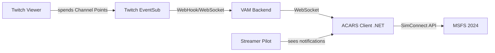
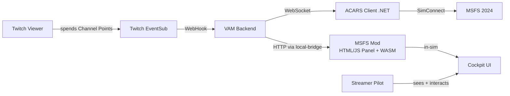
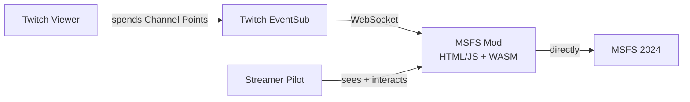

# Vision: Twitch-to-Sim-Integration (& YouTube-Equivalent)

> **Status**: Vision / Ideen-Katalog / Architektur-Skizze
> **Datum**: 2026-04-27 (Tag 5 des Projekts)
> **Gilt als**: nicht-bindender Entwurf für künftige Implementation
> **Verwandt**: `admin-dashboards-vision.md` Section 9.8 (Twitch-Innovations)
> **Strategischer Kontext**: VAM-System soll Content-Creator-First sein. Twitch- & YouTube-Live-Streamer sind primäre Zielgruppe.

Diese Doc beschreibt das Vorhaben, **Twitch-Viewer-Aktionen real im Sim auszulösen** — Engine-Failures via Channel-Points, Lichter-Steuerung via Bits, Frequenzen via Subs, etc. Plus äquivalente Mappings für YouTube-Live-Streamer (SuperChat / Memberships / Live-Chat).

Die zentrale Innovation: kein anderes VA-Tool, kein anderer MSFS-Mod, hat heute **bidirektionale** Twitch/YouTube-Sim-Integration. FlightSimTrack, msfs-panel-twitch und ähnliche Tools sind read-only. Was hier vorgeschlagen wird, ist write-direction — Viewer beeinflusst Sim-State. Das ist die Marktlücke.

---

## Inhaltsverzeichnis

1. [Strategische Begründung](#1-strategische-begründung)
2. [Was technisch möglich ist (SimConnect)](#2-was-technisch-möglich-ist-simconnect)
3. [Architektur-Optionen](#3-architektur-optionen)
4. [Aircraft-Compatibility-Realität](#4-aircraft-compatibility-realität)
5. [Anti-Cheat-Logik](#5-anti-cheat-logik)
6. [Aktions-Katalog (was kann der Viewer triggern?)](#6-aktions-katalog)
7. [User-Experience-Mockups](#7-user-experience-mockups)
8. [Implementation-Phasen](#8-implementation-phasen)
9. [Risiken und Mitigation](#9-risiken-und-mitigation)
10. [YouTube-Equivalent für Live-Streamer](#10-youtube-equivalent-für-live-streamer)
11. [Open Questions](#11-open-questions)
12. [Out-of-Scope](#12-out-of-scope)

---

## 1. Strategische Begründung

### 1.1 Das Marktbild heute

```
EXISTING TWITCH-MSFS-TOOLS (alle read-only):
─────────────────────────────────────────────
✅ FlightSimTrack (Barry Carlyon)
   Twitch-Extension, zeigt MSFS-Daten als Panel
   read-only

✅ msfs-panel-twitch (jopeek)
   In-Sim-Panel zeigt Twitch-Chat
   read-only (Streamer sieht Chat, Chat sieht nicht in den Sim)

✅ FailControl (flightsim.to)
   Random-Failures via SimConnect, .NET 9, MSFS 2024
   KEIN Twitch-Trigger

✅ Chaos Tricks (Steam Workshop, andere Games)
   Twitch-Bits-trigger Chaos-Mod
   Vorbild für Konzept, aber nicht für MSFS

LÜCKE:
─────────────────────────────────────────────
❌ Niemand hat Twitch → Sim-AKTIONEN für MSFS
   Forum-Thread aus 2020 wünscht sich das, niemand hat's gebaut
   Das ist die Marktopportunität
```

### 1.2 Warum das ein USP für VAM ist

```
USP-Wert:        ⭐⭐⭐⭐⭐ (5/5)
Engagement-Wert: ⭐⭐⭐⭐⭐ (5/5)
Marketing-Wert:  ⭐⭐⭐⭐⭐ (5/5)
Risiko:          ⭐⭐⭐ (3/5, mitigierbar)
Aufwand:         ⭐⭐⭐⭐ (4/5, große Foundation)

Wenn VAM das hat: 
  "Die einzige VA-Plattform die Twitch-Viewer echte In-Game-
   Aktionen ausführen lässt"
   
Aviation-Streamer würden VAM exklusiv nutzen.
Marketing-Material schreibt sich von selbst.
```

### 1.3 Zielgruppen

```
PRIMARY:  Aviation-Streamer auf Twitch (mit Affiliate/Partner-Status)
          → Die haben Channel-Points + Bits + Subs zum spenden

SECONDARY: Aviation-Streamer auf YouTube (Live)
          → Die haben SuperChat + Memberships als Equivalent

TERTIARY: Viewer/Community
          → Die wollen interagieren, Bits/SuperChats spenden, Spaß haben
```

---

## 2. Was technisch möglich ist (SimConnect)

SimConnect ist die offizielle MSFS-API. Externe Programme (z.B. unser ACARS-Client) verbinden sich, lesen Sim-Variablen, senden Events.

### 2.1 Engine/Aircraft-Failures

```
SimConnect-Failure-Events (alle generic, breit kompatibel):

⚙️  FAILURE_ENG1                   → Engine 1 ausfallen
⚙️  FAILURE_ENG2                   → Engine 2
⚙️  FAILURE_ENG3, FAILURE_ENG4    → Triebwerk 3, 4
💧 FAILURE_HYDRAULIC              → Hydraulic-System
⚡ FAILURE_ELECTRICAL             → Electrical
🌬️  FAILURE_PNEUMATIC              → Pneumatic
🛞 FAILURE_BRAKES                 → Brakes
🔌 FAILURE_VACUUM                 → Vacuum (für GA-Aircraft wichtig)
⛽ FAILURE_FUEL_SYSTEM            → Fuel-System
📍 FAILURE_PITOT                  → Pitot-Tube (führt zu falschem Speed)
📏 FAILURE_STATIC_PORT            → Static-Port (Altitude-Reading falsch)

Plus Aircraft-State-Triggers:
🔥 ENGINE_AUTO_SHUTDOWN           → Triebwerk-Stop sofort
🚪 STRUCTURAL_DEICE_ON / OFF
🌡️  TOGGLE_ANTI_ICE
```

### 2.2 Lichter (alle als generic SimEvents)

```
✅ TOGGLE_BEACON_LIGHTS          → Beacon
✅ TOGGLE_NAV_LIGHTS             → Position-Lights
✅ STROBES_TOGGLE / ON / OFF     → Strobes
✅ TOGGLE_TAXI_LIGHTS            → Taxi-Light
✅ LANDING_LIGHTS_TOGGLE/ON/OFF  → Landing-Lights
✅ TOGGLE_LOGO_LIGHTS            → Logo-Lights
✅ TOGGLE_RECOGNITION_LIGHTS     → Recognition
✅ TOGGLE_WING_LIGHTS            → Wing-Lights
✅ TOGGLE_CABIN_LIGHTS           → Cabin
✅ PANEL_LIGHTS_ON / OFF         → Panel-Lights

Zuverlässigkeit: Sehr gut bei den meisten Aircraft.
```

### 2.3 Radios und Frequenzen

```
✅ COM_RADIO_SET (BCD16)         → COM1 active
✅ COM2_RADIO_SET                → COM2 active
✅ COM_STBY_RADIO_SET            → COM1 standby
✅ COM2_STBY_RADIO_SET           → COM2 standby
✅ COM_RADIO_SWAP                → Active ↔ Standby tauschen
✅ COM2_RADIO_SWAP               
✅ NAV1_RADIO_SET                → NAV1 active
✅ NAV1_STBY_SET                 → NAV1 standby
✅ NAV2_RADIO_SET / NAV2_STBY_SET
✅ ADF_FREQUENCY_SET             → ADF
✅ XPNDR_SET                     → Squawk-Code
✅ XPNDR_IDENT_ON                → Ident-Button
✅ KOHLSMAN_SET                  → Altimeter-Setting

Encoding: BCD16 für Frequencies
Beispiel: 121.500 → 0x12150
         118.275 → 0x11827 (5kHz-Spacing)
         
Standard-Workflow: erst STBY setzen, dann SWAP → kein Glitch im Active
```

### 2.4 Autopilot

```
✅ AUTOPILOT_ON / AUTOPILOT_OFF     → Master-AP
✅ AP_HEADING_HOLD_ON / OFF
✅ HEADING_BUG_SET (degrees)        → HDG-Bug auf Wert
✅ AP_ALT_HOLD_ON / OFF
✅ AP_ALT_VAR_SET_ENGLISH (feet)    → ALT-Target setzen
✅ AP_VS_HOLD_ON / OFF
✅ AP_VS_VAR_SET_ENGLISH (fpm)
✅ AP_AIRSPEED_SET                  → Speed-Target
✅ AP_MACH_VAR_SET (×100)
✅ AP_NAV1_HOLD                     → NAV-Coupling
✅ AP_APR_HOLD                      → Approach-Mode
✅ AP_BC_HOLD                       → Backcourse
✅ AP_LOC_HOLD                      → LOC

Zuverlässigkeit:
  Default-Aircraft: 90%
  FBW A32NX:       50% (eigene Modes)
  PMDG:            30% (custom CDU)
  Fenix:           40%
```

### 2.5 Flugzeug-Konfiguration

```
✅ FLAPS_UP / FLAPS_DOWN
✅ FLAPS_1, FLAPS_2, FLAPS_3, FLAPS_4
✅ GEAR_UP / GEAR_DOWN / GEAR_TOGGLE
✅ PARKING_BRAKES                   → Toggle
✅ PARKING_BRAKE_SET (1/0)
✅ FUEL_PUMP                        → Fuel-Pumps toggle
✅ ANTI_ICE_ON / OFF
✅ PITOT_HEAT_ON / OFF
✅ TOGGLE_MASTER_BATTERY
✅ TOGGLE_MASTER_ALTERNATOR        → Generator
✅ APU_START / APU_STOP / APU_OFF_SWITCH
```

### 2.6 Pause/Time/Camera

```
✅ PAUSE_ON / PAUSE_OFF / PAUSE_TOGGLE
✅ SET_ZULU_TIME (seconds since midnight)
✅ SET_ZULU_DAY / SET_ZULU_MONTH / SET_ZULU_YEAR
✅ VIEW_CHASE_ON                    → External chase view
✅ VIEW_FORWARD                     → Cockpit
✅ VIEW_REAR
✅ DRONE_*                          → Drone-Mode
```

### 2.7 Was NICHT geht

```
❌ Aircraft-spezifische CDU/MCDU-Eingaben (PMDG, Fenix)
   Custom-Lvars + Custom-Events nötig, pro Aircraft separat mappen
   
❌ Touchscreen-Avionics (G1000, G3000) ohne Bridge
   Nur teilweise via SimConnect-Lvars erreichbar
   
❌ Custom-Cabin-Crew-Sounds
   Nur generische Sim-Sounds verfügbar
   
❌ Custom-Aircraft-Visuals modifizieren (Liveries on-the-fly)
   Sim-Side-Limitation
   
❌ Aircraft-Damage-Simulation (über Failures hinaus)
   Sim hat begrenztes Damage-Modell
```

---

## 3. Architektur-Optionen

Drei realistische Wege das umzusetzen, mit klaren Trade-offs.

### 3.1 Option A: Pure SimConnect (kein MSFS-Mod)



**Was**: ACARS-Client ist externer .NET-Prozess. Verbindet zu MSFS via SimConnect. VAM-Backend hört Twitch-EventSub, sendet Befehle an ACARS-Client. Client triggered SimConnect-Events.

**Was geht**:
- Alle SimConnect-Events aus Section 2 (Failures, Lichter, Radios, AP, etc.)
- Toast-Notifications via SimConnect-Text-Display (begrenzt)
- Sound-Events
- Keine Aircraft-spezifischen Custom-Lvars

**Was nicht geht**:
- Schöne UI im Cockpit (Streamer-Confirmation-Dialog, Voting-Display)
- Custom-Aircraft-States (PMDG/Fenix-spezifisch)

**Vorteile**:
- Einfache Architektur (1 externes Programm + Backend)
- Schnelle Umsetzung
- Keine Mod-Distribution nötig
- Standard-Update-Pfad (ACARS-Client updated wie sonst auch)

**Nachteile**:
- Keine UX-Layer im Sim
- Streamer hat keine Pre-Acknowledgment-Möglichkeit ("Yes, accept this failure")
- Toast-Notifications via SimConnect sehen einfach aus

**Aufwand**:
```
Server-Backend-Integration:    ~1 Woche
ACARS-Client-Erweiterung:      ~2-3 Wochen
Testing across Aircraft:       ~1-2 Wochen
─────────────────────────────────────────────
Total MVP:                     ~4-6 Wochen
```

### 3.2 Option B: Hybrid SimConnect + MSFS-2024-Mod



**Was**: Wie Option A, plus zusätzlicher MSFS-2024-Mod (HTML/JS-Panel + optional WASM-Module). Mod stellt In-Cockpit-UI bereit.

**Was zusätzlich geht**:
- In-Sim-Toast-Notifications mit Custom-Styling
- In-Sim-Panel: Live-Chat-Anzeige (wie msfs-panel-twitch, aber integriert)
- Streamer-Pre-Acknowledgment ("Accept the chaos? [Yes] [No]")
- Vote-Tally-Display ("23 viewers voted Engine 1, 18 voted Engine 2")
- Custom-Aircraft-Variables setzen (über Lvar-Bridge)
- Sound-Effects im Cockpit

**Technische Basis**:
- WASM-Modul für Logik die SimConnect alleine nicht kann
- HTML/JS-Panel für UI (Vorbild: msfs-panel-twitch funktioniert nachweislich)
- Standard MSFS-2024-SDK-Workflow (Developer Mode + Package-Build)
- Distribution über Community-Folder (manuell) oder Marketplace

**Vorteile**:
- Beste UX (Streamer + Viewer sehen Sim-Aktionen schön)
- Modular: SimConnect macht das was es kann, Mod ergänzt
- Streamer-Confirmation = Anti-Frust-Schutz
- Erweiterbar für Aircraft-spezifische Custom-Logic

**Nachteile**:
- Doppelte Codebase (extern .NET + Sim-Mod HTML/JS/WASM)
- Mod muss mit MSFS-Updates getestet werden
- Distribution = Anleitung für Community-Folder erstellen

**Aufwand**:
```
Server-Backend-Integration:    ~1 Woche
ACARS-Client-Erweiterung:      ~2 Wochen
MSFS-Mod-Entwicklung:          ~3-4 Wochen
Testing + Compatibility:       ~2-3 Wochen
─────────────────────────────────────────────
Total MVP:                     ~8-10 Wochen
```

**⭐ Mein klarer Vote**: Option B als Ziel-Architektur, aber inkrementell auf Option A starten.

### 3.3 Option C: Pure MSFS-Mod (alles im Sim)



**Was**: MSFS-Mod hat eigene Twitch-Integration. Hört direkt auf EventSub via WebSocket. SimConnect nur als Fallback. Keine externe Komponente.

**Was zusätzlich geht (vs B)**:
- Keine ACARS-Client-Installation nötig (eine ZIP installieren = fertig)
- Direkt-Integration mit Aircraft-Systemen ohne Roundtrip
- Single-Point-Of-Control

**Probleme**:
- ❌ MSFS-Mods sind sandboxed — HTTP/WebSocket-Calls beschränkt
- ❌ HTML/JS-Panel hat CSP-Restrictions die Twitch-Auth schwierig machen
- ❌ Wenn MSFS-Update kommt: MOD MUSS UPDATEN, sonst broken
- ❌ Schwerer zu debuggen (im Sim-Process)
- ❌ Single-Source-of-Failure: ein Bug crasht den Sim
- ❌ OAuth-Flow im Sim ist UX-Hölle

**Aufwand**:
```
MSFS-Mod-Entwicklung (komplex): ~5-7 Wochen
Twitch-Integration im Mod:      ~2-3 Wochen
Testing + Distribution:         ~2 Wochen
─────────────────────────────────────────────
Total MVP:                      ~9-12 Wochen
```

**Status**: Nicht empfohlen. Zu viel Risiko, zu wenig Modularität.

### 3.4 Vergleichstabelle

```
┌─────────────────────┬──────────┬──────────┬──────────┐
│                     │ Option A │ Option B │ Option C │
├─────────────────────┼──────────┼──────────┼──────────┤
│ MVP-Aufwand         │ 4-6 Wo   │ 8-10 Wo  │ 9-12 Wo  │
│ UX im Cockpit       │ minimal  │ ✅ voll   │ ✅ voll   │
│ Custom-Aircraft     │ ❌        │ ✅        │ ✅        │
│ Distribution        │ einfach  │ mittel   │ aufwendig│
│ Update-Risiko       │ niedrig  │ mittel   │ hoch     │
│ Debug-Möglichkeit   │ ✅ gut    │ ✅ gut    │ schwer   │
│ Crash-Risiko        │ niedrig  │ niedrig  │ hoch     │
│ ACARS-Client nötig? │ ja       │ ja       │ nein     │
└─────────────────────┴──────────┴──────────┴──────────┘
```

---

## 4. Aircraft-Compatibility-Realität

Das Hauptproblem: nicht alle Aircraft reagieren gleich auf generische SimConnect-Events. Custom-Aircraft (PMDG, Fenix, Aerosoft) haben oft eigene Systeme die Events ignorieren.

### 4.1 Compatibility-Matrix

```
┌──────────────────────┬──────────┬──────────┬──────────┬──────────┐
│ Aircraft             │ Lichter  │ Radios   │ AP       │ Failures │
├──────────────────────┼──────────┼──────────┼──────────┼──────────┤
│ Asobo C172           │ ✅ 100%   │ ✅ 95%    │ ✅ 90%    │ ✅ 85%    │
│ Asobo A320           │ ✅ 95%    │ ✅ 90%    │ ✅ 80%    │ ✅ 80%    │
│ Asobo B747           │ ✅ 95%    │ ✅ 85%    │ ✅ 75%    │ ✅ 75%    │
├──────────────────────┼──────────┼──────────┼──────────┼──────────┤
│ FBW A32NX (free)     │ ✅ 95%    │ ✅ 90%    │ ⚠️ 50%    │ ⚠️ 60%    │
│ FBW A380X            │ ✅ 90%    │ ✅ 85%    │ ⚠️ 50%    │ ⚠️ 55%    │
├──────────────────────┼──────────┼──────────┼──────────┼──────────┤
│ PMDG B737            │ ⚠️ 80%    │ ⚠️ 60%    │ ❌ 30%    │ ⚠️ 50%    │
│ PMDG B777            │ ⚠️ 75%    │ ⚠️ 55%    │ ❌ 25%    │ ⚠️ 45%    │
│ PMDG B747            │ ⚠️ 75%    │ ⚠️ 55%    │ ❌ 25%    │ ⚠️ 45%    │
├──────────────────────┼──────────┼──────────┼──────────┼──────────┤
│ Fenix A320           │ ⚠️ 85%    │ ⚠️ 70%    │ ❌ 40%    │ ⚠️ 55%    │
│ Fenix A321           │ ⚠️ 85%    │ ⚠️ 70%    │ ❌ 40%    │ ⚠️ 55%    │
├──────────────────────┼──────────┼──────────┼──────────┼──────────┤
│ Aerosoft CRJ         │ ✅ 90%    │ ⚠️ 70%    │ ⚠️ 50%    │ ⚠️ 60%    │
│ Aerosoft Twin Otter  │ ✅ 95%    │ ✅ 85%    │ ⚠️ 65%    │ ✅ 75%    │
└──────────────────────┴──────────┴──────────┴──────────┴──────────┘

Legende:
  ✅ = >75% funktioniert reliably  
  ⚠️ = 40-75% — eingeschränkt nutzbar
  ❌ = <40% — Custom-Profile zwingend nötig
```

### 4.2 Per-Aircraft-Profile-System

Lösung: pro Aircraft ein YAML-Profil das definiert welche Custom-Events/Lvars zu nutzen sind. Vorbild: FS-Copilot (yury-sch/FsCopilot) macht das genauso für Shared-Cockpit.

```yaml
# profiles/pmdg-737-800.yaml
aircraft:
  match: "PMDG 737-800*"
  
lights:
  beacon:
    type: "lvar"
    lvar: "L:PMDG_737_BEACON_LIGHT_SWITCH"
    set_value: "1=on, 0=off"
  strobes:
    type: "lvar"
    lvar: "L:PMDG_737_STROBE_LIGHT_SWITCH"
    
radios:
  com1:
    type: "custom-event"
    event: "L:PMDG_737_VHF_NAV_FREQ_INDEX_INC"
    encoding: "manual_step"
    
autopilot:
  heading_bug:
    type: "lvar"
    lvar: "L:PMDG_737_HDG_SEL"
    set_value: "0-359"
    
failures:
  engine_1:
    type: "lvar"
    lvar: "L:PMDG_737_ENG1_FAIL"
    set_value: "1=fail"
  electrical:
    type: "compound"
    actions:
      - lvar: "L:PMDG_737_ELEC_BUS_1_FAIL"
        value: 1
      - lvar: "L:PMDG_737_ELEC_BUS_2_FAIL"
        value: 1
```

**Profil-Erstellung**: Community-driven analog zu FS-Copilot. Wir liefern Profile für die Top-10-Aircraft, der Rest wächst organisch.

### 4.3 Fallback-Strategy

Wenn kein Profil verfügbar:
1. Versuche generic SimConnect-Event
2. Wenn das fehlschlägt: melde an Streamer ("Nicht unterstützt für dieses Aircraft")
3. Refund Channel-Points an Viewer (über Twitch-API)
4. Log für späteres Profile-Erstellen

---

## 5. Anti-Cheat-Logik

Wenn Twitch-Chat Aktionen im Sim auslösen kann, gibt es Cheating-Risiko bei Online-Networks.

### 5.1 Das Problem

```
Auf VATSIM/IVAO ist es Cheating wenn:
  - Twitch-Chat liest neue ATC-Frequenz
  - Trigger setzt Frequenz im Sim
  - Pilot hat Vorteil gegenüber anderen Pilots ohne Twitch-Setup
  
Auch problematisch:
  - "Stabilize for 30s" gibt Pilot unfair-Vorteil
  - "Free fuel +1t" verändert Aircraft-State
  - "Auto-pilot HDG/ALT setzen" kann ATC-Konflikt verursachen
```

### 5.2 Lösung: Network-Awareness

```typescript
// Pseudo-code
function shouldAllowAction(action: Action, context: Context): boolean {
  // Hard rule: keine Twitch-triggers wenn Online auf VATSIM/IVAO
  if (context.user.network === 'VATSIM' || context.user.network === 'IVAO') {
    if (action.category === 'cheating-risk') {
      return false;
    }
  }
  
  // Failures sind okay (selbst-zugefügter Schaden ist kein Cheat)
  // Lichter sind okay (kein Vorteil)
  // AP-Aktionen sind risky (default off auf VATSIM)
  // Frequency-Setting ist problematic (default off auf VATSIM/IVAO)
  
  return true;
}
```

### 5.3 Action-Kategorisierung

```
ALWAYS-OK (auch on Online-Networks):
  - Lichter (Beacon, Strobes, Landing-Lights)
  - Camera-Modes (Drone-View, Spot-Plane)
  - Cabin-Lights / Logo-Lights
  - Self-Inflicted Failures (Engine-Failure ist self-damage)
  
NETWORK-AWARE (off bei VATSIM/IVAO):
  - Frequency-Setting (COM/NAV)
  - Squawk-Setting
  - Auto-Pilot-Targets (HDG, ALT, Speed)
  - Weather-Inject
  - Free-Fuel-Top-up
  
NEVER-AUTO (immer Streamer-Confirmation):
  - Engine-Restart nach Failure
  - Auto-Stabilize
  - Skip-To-Approach
  - Position-Teleport
```

### 5.4 Streamer-Override

Streamer kann pro Action explizit erlauben/sperren:

```
┌─────────────────────────────────────────────┐
│  Twitch Actions Settings                    │
├─────────────────────────────────────────────┤
│  Currently Online: ✓ VATSIM (CID 770283)    │
│                                             │
│  ALLOWED (no risk):                         │
│  ☑ Lights (Beacon, Strobes, Landing)        │
│  ☑ Camera Modes                             │
│  ☑ Self-Inflicted Failures                  │
│                                             │
│  RESTRICTED (Network-Awareness):            │
│  ☐ Frequency Setting    [Default: OFF]      │
│  ☐ Squawk Setting       [Default: OFF]      │
│  ☐ AP Target Setting    [Default: OFF]      │
│  ☑ Weather Inject       [Override: ON]      │
│                                             │
│  ⚠️ Override only if VATSIM/IVAO rules allow │
└─────────────────────────────────────────────┘
```

---

## 6. Aktions-Katalog

Konkret was der Viewer triggern kann, gestaffelt nach Bits/Channel-Points:

### 6.1 Cheap-Tier (100-500 Bits / 500-2000 Channel-Points)

```
LIGHTS:
  💡 Beacon ON / OFF                    100 💎
  💡 Strobes ON / OFF                   100
  💡 Nav-Lights toggle                  100
  💡 Landing-Lights                     200
  💡 Logo-Lights                        100
  💡 Light-Show 30s (alle wechseln)     300
  
RADIO (no-vatsim):
  📻 Squawk auf Standby (1200)         200
  📻 COM2 auf 121.5 (Emergency)        300
  📻 ATIS-Frequenz auto-eintragen      400
```

### 6.2 Medium-Tier (1000-3000 Bits / 5000-15000 Channel-Points)

```
COCKPIT-ACTIONS:
  ⚙️ Anti-Ice ON für 5min              1000
  ⚙️ Pitot-Heat toggle                 800
  ⚙️ Cabin-Lights wechseln             1000
  
CO-PILOT-ACTIONS (no-vatsim):
  📻 Suggest next COM-frequency        1500
  📻 Auto-fill Standby-COM             1000
  ⚙️ AP HDG-Bug auf Wert (Chat-Vote)   2000
  ⚙️ AP ALT-Target setzen              2500
  
VIEWER-FUN:
  📷 Drone-View für 30s                2000
  📷 Spot-Plane für 60s                1500
  📷 External-Camera 30s               1500
  
WEATHER (carefully):
  🌫️ Slight Turbulence 2min            1500
  💨 5kt Crosswind boost               1500
```

### 6.3 Expensive-Tier (5000-10000 Bits / 25000-50000 Channel-Points)

```
FAILURES:
  ⚙️ Engine 1 Failure                   8000
  ⚙️ Engine 2 Failure                   8000
  💧 Hydraulic 1 Failure                5000
  ⚡ Electrical Failure                 5000
  🛞 Brake Failure                      3000
  
WEATHER-CHAOS:
  🌪️ Sudden Storm Cell                  5000
  ⛈️ Severe Turbulence 5min             3000
  🌫️ Fog at Destination                 8000
  🥶 Icing-Conditions                   4000
  💨 25kt Crosswind                     5000
  
AP-AGGRESSIV (Sub-only):
  ⚙️ AP Heading +90° (Chat-determined)  10000
  ⚙️ Climb to FL400                     10000
  ⚙️ Descend now                        15000
```

### 6.4 Trust-Tier (Sub-only, Streamer-Confirmation)

```
EXTREME:
  ⚙️ Both Engines Failure (Glider!)     50000
  📍 GPS Failure                        15000
  📡 ILS Frequency randomized           10000
  🧭 Compass Failure                    8000
  📻 Lost Comms                         12000
  
HELPFUL (für Streamer):
  ⛽ Free Fuel +1t                      5000
  🛬 Auto-Stabilize 30s                 10000
  ✨ Perfect Weather 5min               5000
  🚁 Skip-To-Approach                   25000  (Sub-only)
  
GROUP-THRESHOLDS:
  🎉 50 Subs erreicht → Free perfect landing
  🎉 1000 Bits cumulated → Streamer-choice failure
  🎉 10 viewers redeem same hour → Mass-Chaos-Mode
```

---

## 7. User-Experience-Mockups

### 7.1 Streamer-Pre-Acknowledgment-Dialog (Im Cockpit)

```
┌─────────────────────────────────────────────┐
│  ⚠️ TWITCH-VIEWER-ACTION INCOMING            │
├─────────────────────────────────────────────┤
│                                             │
│  Viewer "AviationFan99" redeems:            │
│  >> Engine 1 Failure (8,000 points)         │
│                                             │
│  Decision in: 8 seconds...                  │
│                                             │
│  [✓ ACCEPT (Y)]   [✗ DECLINE (N)]           │
│                                             │
│  Auto-accept:    ☐ Cheap actions            │
│                  ☐ Medium actions           │
│                  ☐ All actions              │
└─────────────────────────────────────────────┘
```

### 7.2 Co-Pilot-Action-Panel (als Twitch-Extension)

```
┌─────────────────────────────────────────────────────────┐
│  ✈ Co-Pilot Actions — DLH123 in Cruise                 │
├─────────────────────────────────────────────────────────┤
│                                                         │
│  💡 LIGHTS                                              │
│  [Beacon ON 100💎]  [Strobes ON 100💎]                 │
│  [Landing-Light 200💎]  [Light Show 30s 300💎]         │
│                                                         │
│  📻 RADIOS (Captain Online VATSIM — eingeschränkt)      │
│  [Squawk Standby 200💎]                                │
│  [Suggest ATIS-Freq 1500💎]                            │
│  ⚠️ AP-Aktionen deaktiviert auf VATSIM                  │
│                                                         │
│  ⚙️ FAILURES (8000+ 💎)                                  │
│  [Engine 1 Fail]  [Hydraulic Fail]  [Electric Fail]    │
│                                                         │
│  📷 CAMERA                                              │
│  [Drone 30s 2000💎]  [Spot-Plane 60s 1500💎]           │
│                                                         │
│  🎁 PILOT-RELIEF (Sub-only)                             │
│  [Auto-Stabilize 30s 10000💎]                          │
└─────────────────────────────────────────────────────────┘
```

### 7.3 Live-Vote-Display (im Cockpit)

```
┌─────────────────────────────────────────────┐
│  🗳 Chat votes for new HDG-Bug:              │
├─────────────────────────────────────────────┤
│                                             │
│  010°  ████████░░░░░░░░  42% (23 votes)     │
│  090°  ██░░░░░░░░░░░░░░  12%  (7 votes)     │
│  180°  █████░░░░░░░░░░░  28% (15 votes)     │
│  270°  ████░░░░░░░░░░░░  18% (10 votes)     │
│                                             │
│  Voting closes in: 12s                      │
│  Total votes: 55                            │
│                                             │
│  Apply: ☑ Auto when poll ends               │
│         (Captain can override with Y/N)     │
└─────────────────────────────────────────────┘
```

---

## 8. Implementation-Phasen

### Phase 1: Foundation (Größe XL, ~6-8 Wochen)

```
✅ Twitch-OAuth-Login + Account-Linking
✅ EventSub-Hub im VAM-Backend
✅ ACARS-Client erweitert um Twitch-Action-Receiver
✅ Action-Whitelist (nur cheap-Tier-Actions)
✅ Network-Awareness-Logic (VATSIM/IVAO-Detection)
✅ Foundation-Aircraft-Profile (3-5 Aircraft)
✅ Streamer-Settings-Page in VAM
```

Outcome: Streamer kann Twitch-Channel-Points-Rewards für Lichter + Camera-Modes anlegen. Funktioniert auf Asobo-Default-Aircraft.

### Phase 2: Co-Pilot-Layer (Größe L, ~3-4 Wochen)

```
✅ Radio-Actions (mit VATSIM/IVAO-Disable)
✅ AP-Actions (mit Streamer-Override)
✅ Anti-Ice / Pitot-Heat
✅ Vote-Aggregation (Chat-Voting)
✅ Erweitertes Aircraft-Profile-System
✅ Compatibility-Matrix initial veröffentlicht
```

Outcome: Twitch-Chat fungiert als virtueller F/O. Lichter, Radios (offline), AP-Targets-Suggestions.

### Phase 3: Failures + Chaos (Größe L, ~3-4 Wochen)

```
✅ Engine-Failures (1-Engine, dann 2-Engines)
✅ Hydraulic / Electric / Pneumatic
✅ Brake-Failures
✅ Streamer-Pre-Acknowledgment-Dialog (via SimConnect-Text)
✅ Auto-Refund bei Aircraft-Incompatibility
```

Outcome: Engine-Failures via Channel-Points möglich. Mit Streamer-Override.

### Phase 4: Mod-Layer (Größe XL, ~4-6 Wochen) — Option B

```
✅ MSFS-2024-Mod-Foundation (HTML/JS-Panel)
✅ In-Sim-Notifications mit Custom-Styling
✅ In-Sim-Chat-Display
✅ In-Sim-Vote-Display
✅ Streamer-Confirmation-Dialog im Cockpit (nicht via SimConnect-Text)
✅ Mod-Distribution-Doc + Community-Folder-Setup
```

Outcome: Saubere UX im Cockpit. Streamer-Erlebnis professionell.

### Phase 5: Weather-Chaos (Größe L, ~3 Wochen)

```
✅ Weather-Inject via SimConnect-Weather-API
✅ Storm-Cells, Turbulence, Fog, Icing
✅ Crosswind-Boost
✅ Auto-Recovery nach Threshold
```

Outcome: Wetter-basierte Challenges für Viewer freischaltbar.

### Phase 6: Aircraft-Profile-Pack (laufend)

```
✅ FBW A32NX Custom-Profile
✅ PMDG 737/777/747 Profile
✅ Fenix A320/A321 Profile
✅ Aerosoft CRJ / Twin Otter Profile
✅ Community-Submitted-Profile-Acceptance-Workflow
```

Outcome: Compatibility-Matrix wächst dauerhaft.

### Phase 7: YouTube-Equivalent (Größe XL, ~6-8 Wochen)

Siehe Section 10.

---

## 9. Risiken und Mitigation

### 9.1 Aircraft-Compatibility

```
RISIKO: PMDG/Fenix-Aircraft funktionieren nur 30-50% der Aktionen
MITIGATION:
  - Compatibility-Matrix transparent in UI
  - Pro-Aircraft-Profile als Open-Source
  - Auto-Refund bei Inkompatibilität
  - Phase-Plan: Default-Aircraft zuerst, Payware später
```

### 9.2 SimConnect-Crashes

```
RISIKO: Zu viele Apps mit SimConnect-Connection → MSFS crasht
MITIGATION:
  - ACARS-Client benutzt eine geteilte Connection für alle Actions
  - Robuste Reconnect-Logic
  - Health-Monitor warnt User bei zu vielen externen Apps
  - Crash-Detection + Auto-Recovery
```

### 9.3 Twitch-API-Rate-Limits

```
RISIKO: Bei vielen Actions schnell hintereinander → Rate-Limit
MITIGATION:
  - Throttling im VAM-Backend (max 1 Action / 2 Sekunden)
  - Queue-System für Spitzenlast
  - EventSub statt Polling (effizienter)
```

### 9.4 Streamer-Frust durch zu viele Failures

```
RISIKO: Stream wird unspielbar wenn Chat 10× pro Minute Engine-Failure triggert
MITIGATION:
  - Cooldown pro Action-Type (Engine-Failure max 1× pro 30min)
  - Streamer-Settings: Auto-Decline wenn cumulative-failures > N
  - "Recovery-Mode" — nach Major-Failure 5min Pause vor nächster
```

### 9.5 Cheating-Vorwürfe auf VATSIM/IVAO

```
RISIKO: VATSIM-Community sieht Twitch-Trigger als Cheat
MITIGATION:
  - Network-Awareness-Logic (siehe Section 5)
  - Default: hard-disable risky-Actions auf VATSIM/IVAO
  - Klare Doku für Streamer
  - Optional: VATSIM-Compliance-Mode lockt Settings
```

### 9.6 Cooldown-Manipulation durch Spam

```
RISIKO: Mehrere Viewer redeem gleichzeitig → unfaire Spam-Wirkung
MITIGATION:
  - Pro-User-Cooldown (1 Action / 5min pro Viewer)
  - Action-Queue mit Priority
  - Group-Threshold-Logic für Mass-Actions
```

### 9.7 MSFS-Updates brechen Mod (Option B/C)

```
RISIKO: Nach Sim-Update funktioniert Mod nicht mehr
MITIGATION:
  - Mod ist gut isoliert (nur Standard-MSFS-SDK-APIs)
  - Test-Suite die nach jedem MSFS-Update läuft
  - Quick-Hotfix-Pipeline
  - Community-Folder-Distribution erlaubt schnelle Updates
```

---

## 10. YouTube-Equivalent für Live-Streamer

Manche Aviation-Streamer sind auf YouTube statt Twitch. Die meisten Konzepte aus dieser Doc sind übertragbar — die Begriffe und APIs sind anders, die Mechanik ist ähnlich.

### 10.1 YouTube-API-Capabilities (recherchiert)

```
YOUTUBE DATA API v3 (für Channel/Videos):
─────────────────────────────────────────────
- channels (list, update)
- subscriptions (insert, list, delete)
- videos (insert, list, update, rate)
- members (list)             ← Channel-Members ähnlich Twitch-Subs
- membershipsLevels (list)   ← Sub-Tiers
- comments (list, insert, update, delete, setModerationStatus)

YOUTUBE LIVE STREAMING API (während Live-Stream):
─────────────────────────────────────────────
- liveBroadcasts (CRUD, transition, bind)
- liveStreams (CRUD)
- liveChatMessages:
  - list, insert, transition, delete
  - streamList (GRPC für low-latency, KEY-FEATURE)
- liveChatModerators (list, insert, delete)
- liveChatBans (insert, delete)
- superChatEvents (list)     ← Bits-Equivalent
- superStickerEvents
```

### 10.2 Twitch ↔ YouTube Mapping

```
┌──────────────────────────┬──────────────────────────┐
│ Twitch                   │ YouTube                  │
├──────────────────────────┼──────────────────────────┤
│ Sub                      │ Channel-Member          │
│ Sub-Tier 1/2/3           │ Membership-Level         │
│ Bits / Cheer             │ SuperChat                │
│ (no equivalent)          │ SuperSticker             │
│ Channel-Points           │ (kein direktes Equival.) │
│ EventSub Webhook         │ liveChatMessages.streamList│
│ Polls                    │ POLL_EVENT in liveChat   │
│ Predictions              │ (kein direktes Equival.) │
│ Raids                    │ (kein direktes Equival.) │
│ Stream-Markers           │ (kein direktes Equival.) │
│ Clips (via API)          │ (kein direktes Equival.) │
│ Channel-Points-Rewards   │ Custom über SuperChat    │
└──────────────────────────┴──────────────────────────┘
```

**Kernerkenntnis**: YouTube hat **keine** Channel-Points. Stattdessen gibt es **SuperChats** (Geld direkt) und **Memberships** (monatliche Subscription). Beide sind ähnlich, aber nicht identisch zu Twitch's Bits + Channel-Points.

### 10.3 Übertragung der VAM-Twitch-Features auf YouTube

#### 10.3.1 OAuth + Account-Linking

YouTube nutzt Google-OAuth. NextAuth.js v5 hat Google-Provider. Mit Scope `youtube.readonly` und `youtube.force-ssl` lassen sich die meisten Live-Features ansprechen.

#### 10.3.2 Live-Stream-Status

```
TWITCH: EventSub `stream.online` / `stream.offline`
YOUTUBE: liveBroadcasts.list mit broadcastStatus=active
         (Polling alle 30s nötig — kein EventSub-Equivalent)
```

Polling-Overhead höher als bei Twitch. VAM-Backend muss pro YouTube-Streamer alle 30s pollen.

#### 10.3.3 SuperChat-basierte Aktionen (statt Channel-Points)

YouTube hat **4 SuperChat-Tiers** basierend auf Spendebetrag:

```
Tier 1: $1-1.99    → 0:00-2:00 pinned, 50 chars
Tier 2: $2-4.99    → 2:00-5:00 pinned, 150 chars
Tier 3: $5-9.99    → 5:00-30:00 pinned, 200 chars
Tier 4: $10-49.99  → 30:00-60:00 pinned, 200 chars
Tier 5: $50-99.99  → 1-2h pinned
Tier 6: $100+      → 5h pinned
```

Mapping zu VAM-Actions:

```
$1-2 SuperChat        → Cheap-Tier-Action (Lichter, Camera)
$5-10 SuperChat       → Medium-Tier (AP, Anti-Ice)
$10-50 SuperChat      → Expensive-Tier (Failures, Weather)
$100+ SuperChat       → Trust-Tier (Both Engines, Skip-To-Approach)
```

Implementation-Skizze:

```typescript
// VAM-Backend hört liveChatMessages.streamList (GRPC)
function onYouTubeChatMessage(message) {
  if (message.snippet.type === 'SUPER_CHAT_EVENT') {
    const amountUsd = message.snippet.superChatDetails.amountMicros / 1_000_000;
    const tier = mapAmountToTier(amountUsd);
    
    // Action wählen basierend auf Tier
    const action = selectActionForTier(tier);
    
    // Trigger im Sim
    triggerSimAction(action, {
      from: message.authorDetails.displayName,
      amount: amountUsd,
    });
  }
}
```

#### 10.3.4 Member-Only Actions (statt Sub-Only)

YouTube-Memberships entsprechen Twitch-Subs. `members.list` gibt Membership-Status. VAM kann member-only-Actions definieren analog zu sub-only.

#### 10.3.5 Polls

YouTube unterstützt Live-Chat-Polls (POLL_EVENT in liveChatMessages). VAM kann ähnlich wie Twitch-Polls implementieren.

#### 10.3.6 Translation/Captions

YouTube hat eingebaute Captions-API. Translation-Feature (Twitch-Idee 9.8.24) ist auf YouTube sogar einfacher umsetzbar.

### 10.4 GRPC-Streaming für Low-Latency-Chat

YouTube bietet `liveChatMessages.streamList` als **GRPC-Endpoint** für Live-Chat-Streaming mit niedriger Latenz. Vergleichbar mit Twitch's EventSub-WebSocket.

```python
# Beispiel-Code aus YouTube-Doku
import grpc
from youtube_v3 import stream_list_pb2_grpc, stream_list_pb2

channel = grpc.secure_channel('youtube.googleapis.com', credentials)
stub = stream_list_pb2_grpc.LiveChatMessagesStub(channel)

request = stream_list_pb2.LiveChatStreamListRequest(
    live_chat_id='UC...',
)

for response in stub.StreamList(request):
    for message in response.live_chat_messages:
        process(message)
```

### 10.5 Begrenzungen und Unterschiede

```
NACHTEILE YOUTUBE vs TWITCH:
─────────────────────────────────────────────
- Keine Channel-Points (= weniger micro-engagement)
- SuperChat ist Geld (US$), nicht virtuell wie Bits
  → Höhere Hürde für Viewer
- Kein direktes Predictions/Bets-Equivalent
- API-Quota strikt (10k Units/day default)
- OAuth-Setup komplexer als Twitch
- Polling teilweise statt Push-Updates

VORTEILE YOUTUBE vs TWITCH:
─────────────────────────────────────────────
- SuperStickers haben visuelles Element
- Memberships-Levels = mehrstufig wie Twitch-Tier
- Captions-API eingebaut
- Globale Reichweite (oft mehr Viewer als Twitch)
- Chat-Moderation-API umfangreicher
- VOD-Replay nach Stream automatisch (kein Clipping nötig)
```

### 10.6 Implementation-Strategie für YouTube

```
PHASE 7A: YouTube-OAuth + Account-Linking (1 Woche)
PHASE 7B: GRPC-Live-Chat-Connection (2 Wochen)
PHASE 7C: SuperChat-to-Action-Mapping (2 Wochen)
PHASE 7D: Memberships-Verification (1 Woche)
PHASE 7E: Polls-Integration (1 Woche)

Total YouTube-Equivalent: ~7-8 Wochen
```

**Empfehlung**: YouTube nicht parallel zu Twitch entwickeln. Erst Twitch fertig, dann YouTube als Phase 7 nachschieben. Architektur generalisieren so dass beide Plattformen über gleiche Backend-Schicht laufen ("Streaming-Platform-Abstraction").

### 10.7 Architektur-Generalisierung

```typescript
// Pseudo-code Backend-Abstraktion
interface StreamingPlatform {
  name: 'twitch' | 'youtube';
  
  authenticate(user: User): Promise<OAuthTokens>;
  subscribeToEvents(streamerId: string, handler: EventHandler): void;
  
  triggerAction(action: Action): Promise<void>;
  refundUser(amount: number, currency: 'bits' | 'usd'): Promise<void>;
}

class TwitchPlatform implements StreamingPlatform {
  // EventSub via WebSocket
  // Channel-Points-Refund via API
}

class YouTubePlatform implements StreamingPlatform {
  // GRPC liveChatMessages.streamList
  // SuperChat ist nicht refundable (Geld!)
  // → andere Logic für Refund (Sponsor-Gift, Member-Perk)
}

// VAM-Backend nutzt Interface
const platforms = [
  new TwitchPlatform(),
  new YouTubePlatform(),
];
```

So bleibt die Action-Logic gleich, nur die Platform-Adapter unterscheiden sich.

---

## 11. Open Questions

### 11.1 Mod-Distribution

```
Frage: Marketplace oder Community-Folder?

Marketplace:
  ✅ Einfache Installation für User
  ❌ Approval-Process bei Microsoft
  ❌ Eventuell Cost (Marketplace-Partner-Programm)
  
Community-Folder:
  ✅ Kein Approval
  ✅ Open-Source-Distribution einfach
  ❌ User muss Community-Folder finden + ZIP entpacken

Empfehlung: Community-Folder zuerst (analog FS-Copilot, FailControl).
            Marketplace optional später.
```

### 11.2 Profile-Repository

```
Frage: Wo werden Aircraft-Profile gehostet?

Option A: GitHub-Repo (Pull-Requests von Community)
Option B: VAM-Server hosted (Web-UI für Profile-Submission)
Option C: Hybrid (GitHub + VAM-API)

Empfehlung: Option A initially (low maintenance), 
            Option C wenn Community größer.
```

### 11.3 Cooldown-Pro-Action vs Cooldown-Pro-Aircraft

```
Frage: Wenn Engine 1 ausgefallen ist + repariert, sofort wieder failbar?

Option A: Cooldown pro Action-Type (Engine-Failure 30min)
Option B: Cooldown pro Aircraft-State (wenn Aircraft frisch in Cruise → fairer)
Option C: Configurable pro Streamer

Empfehlung: Option C — Streamer entscheidet.
```

### 11.4 Refund-Semantik bei Inkompatibilität

```
Frage: Action triggert nicht (Aircraft ignoriert es). Refund?

Twitch: Channel-Points-Refund via API möglich
YouTube: SuperChat-Refund schwierig (echtes Geld)

Vorschlag YouTube: 
  - Klares "Action may not work for all aircraft" Disclaimer
  - Streamer kann Member-Gift als Goodwill geben
  - Keine echte API-Refund-Logic
```

### 11.5 Privacy: Wer sieht welche Streamer-Daten?

```
Frage: Sieht jeder VAM-User die Twitch-Settings anderer User?

Empfehlung: 
  - Streamer-Settings sind privat per User
  - Nur Live-Status ist public auf Profile (wenn opt-in)
  - Action-Logs nur für Streamer selbst sichtbar
```

---

## 12. Out-of-Scope

### 12.1 Kick-Integration

```
Kick.com ist eine Streaming-Plattform die Twitch-Marktanteile angreift.
Ihre API ist aktuell limitiert. Würden wir Kick supporten:
  - Aufwand vergleichbar mit YouTube
  - Marktreife noch unklar
  
Status: Out-of-Scope für initial Implementation. 
        Beobachten und ggf. später als Phase 8 hinzufügen.
```

### 12.2 TikTok-Live

```
TikTok hat Live-Streaming aber API-Zugang sehr restriktiv.
Aviation-Streaming-Community kaum auf TikTok aktiv.

Status: Out-of-Scope.
```

### 12.3 Custom Aircraft-Damage-Modeling

```
Wir arbeiten mit Sim-Failures nicht mit Custom-Damage-Models.
Das wäre Aircraft-Maker-Aufgabe (PMDG, Fenix, etc.).

Status: Out-of-Scope.
```

### 12.4 Real-Money-Gambling/Bets

```
Predictions auf Flight-Outcomes ist vorgesehen (Twitch-Predictions).
Aber: kein Real-Money. Nur Channel-Points (= virtuell).

Real-Money würde Compliance-Probleme schaffen (Glücksspiel-Lizenz).

Status: Out-of-Scope.
```

---

## 13. Glossar

```
ACARS                Aircraft Communications Addressing and Reporting System.
                     Im VAM-Kontext: der Client der Sim-Daten erhebt + sendet.

Bits                 Twitch's virtuelle Spende-Währung. Viewer kauft Bits, 
                     gibt sie an Streamer.

Channel-Points       Twitch-Loyalty-Punkte. Viewer verdient durch Watching, 
                     gibt sie aus für Custom-Rewards.

EventSub             Twitch's WebHook/WebSocket-System für Real-time Events.

GRPC streamList      YouTube's Low-Latency-Methode für Live-Chat-Updates.
                     Long-lived Connection.

Live-Chat-API        YouTube-API für Live-Stream-Chat.
                     Während Stream verfügbar, danach nicht mehr.

Member               YouTube's Equivalent zu Twitch-Sub. Monatlicher Abo.

Membership-Level     YouTube's Multi-Tier-Sub-System.

MSFS-2024-SDK        Microsoft Flight Simulator 2024 SDK.
                     Erlaubt Mods + Add-ons.

Profile (YAML)       Per-Aircraft-Konfiguration die Custom-Lvars/Events 
                     mapped auf Standard-Actions.

SimConnect           MSFS-API für externe Programme. Kommunikation mit Sim.

SuperChat            YouTube's Highlight-Spende. Ähnlich Bits aber Geld.

SuperSticker         SuperChat mit Sticker-Image. Visueller.

Twitch Extension     HTML/JS-Code der in Twitch-Channel-Page integriert.
                     Sandboxed.

WASM-Modul           WebAssembly-Code im MSFS-Mod-Kontext. 
                     Custom-Logic die HTML/JS allein nicht kann.
```

---

## Anhang A: Verwandte Tools (Recherche)

```
EXISTING TOOLS DIE ALS VORBILD DIENEN:
─────────────────────────────────────────────
FailControl                    https://flightsim.to/file/99139
  - Random Failures via SimConnect
  - .NET 9, MSFS 2024
  - Architektur-Vorbild für Failure-Logic

FS-Copilot                     https://github.com/yury-sch/FsCopilot
  - Shared-Cockpit für MSFS 2024
  - YAML-Templates pro Aircraft
  - Vorbild für unser Profile-System

msfs-panel-twitch              https://github.com/jopeek/msfs-panel-twitch
  - In-Sim-Twitch-Chat-Display
  - Vorbild für Mod-UI

FlightSimTrack                 https://twitch.extensions.barrycarlyon.co.uk/flightsimtrack
  - Twitch-Extension für MSFS-Daten-Anzeige
  - Vorbild für Twitch-Extension-Setup

Chaos Tricks                   Steam Workshop (andere Games)
  - Twitch-Bits-Trigger-Mod
  - Konzept-Vorbild
```

---

**Ende der Doc.**

*Dieses Dokument ist lebend. Wenn neue Erkenntnisse oder Validate-First-Entscheidungen dazukommen, bitte aktualisieren.*

*Letzte Änderung: 2026-04-27 (Tag 5)*
