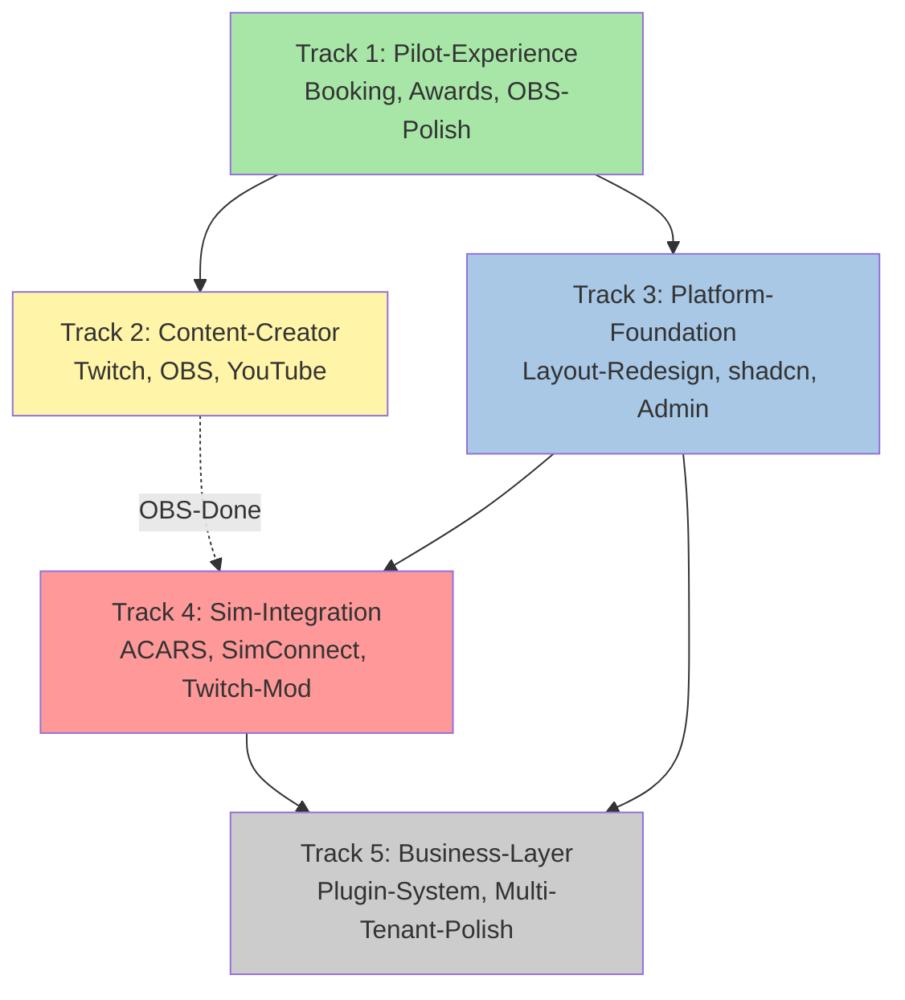
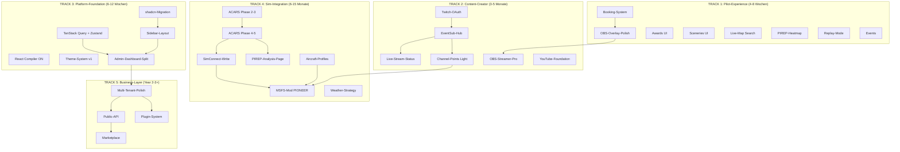

# VAM-System — Strategisches Konzept & Master-Roadmap

> **Dokument-Typ**: Strategisches Master-Konzept + Roadmap
> **Autor**: Kevin Drack (CrysaGaming) — VAM-System Owner
> **Stand**: Tag 5 (28. April 2026), 62 Commits gepusht, live unter [vam.kevindrack.de](https://vam.kevindrack.de)
> **Repository**: [github.com/CrysaGaming/vam-system](https://github.com/CrysaGaming/vam-system)
> **Adressat**: Owner (Strategie), Mitstreiter (Onboarding), Externe (VAs/Partner), Stakeholder (Übersicht)
>
> **Zweck dieses Dokuments**:
> 1. Konsolidiert den Tag-1-Plan mit der Tag-5-Realität.
> 2. Integriert die Architektur-Docs (ACARS, Weather, SimConnect, PIREP-Analysis, OBS-Overlay) und die Vision-Docs (Admin-Dashboards, Twitch-to-Sim, Layout-Redesign) zu **einer einzigen strategischen Linie**.
> 3. Definiert Strategic Tracks statt linearer Phasen — verhindert "verzettelt arbeiten".
> 4. Liefert ehrliche Aufwands-Bänder und Komplexitäts-Bewertung pro Track.
> 5. Gibt klare Priorisierung für die nächsten Wochen, Monate und Jahre.

---

## Inhaltsverzeichnis

### TEIL I — STRATEGISCHE GRUNDLAGE
1. [Executive Summary](#1-executive-summary)
2. [Strategische These](#2-strategische-these)
3. [Stand der Dinge — Tag 5 Realität](#3-stand-der-dinge--tag-5-realität)
4. [Plan-vs-Realität-Audit](#4-plan-vs-realität-audit)

### TEIL II — STRATEGISCHE FOUNDATIONS
5. [Architektonische Prinzipien (durch Tag 1-5 entstanden)](#5-architektonische-prinzipien)
6. [Tech-Stack-Konsolidierung](#6-tech-stack-konsolidierung)
7. [Strategischer Stack-Check 2026](#7-strategischer-stack-check-2026)

### TEIL III — STRATEGIC TRACKS (DIE ROADMAP)
8. [Track-Modell statt Phasen-Modell](#8-track-modell-statt-phasen-modell)
9. [Track 1: Pilot-Experience (Foundation)](#9-track-1-pilot-experience-foundation)
10. [Track 2: Content-Creator-First (Differentiation)](#10-track-2-content-creator-first-differentiation)
11. [Track 3: Platform-Foundation (Refactor)](#11-track-3-platform-foundation-refactor)
12. [Track 4: Sim-Integration-Depth (Pioneer)](#12-track-4-sim-integration-depth-pioneer)
13. [Track 5: Business-Layer (Strategic Bet)](#13-track-5-business-layer-strategic-bet)

### TEIL IV — VISION-AUDIT
14. [Vision-Docs realistisch eingeordnet](#14-vision-docs-realistisch-eingeordnet)
15. [Was aus Vision-Docs explizit gestrichen ist](#15-was-aus-vision-docs-explizit-gestrichen-ist)

### TEIL V — RISIKO & ENTSCHEIDUNGEN
16. [Risiken und Mitigations](#16-risiken-und-mitigations)
17. [Strategische Decision-Log](#17-strategische-decision-log)
18. [Open Strategic Questions](#18-open-strategic-questions)

### TEIL VI — VISUELLE ZUSAMMENFASSUNG
19. [Roadmap-Visualisierung (Timeline)](#19-roadmap-visualisierung-timeline)
20. [Dependency-Graph zwischen Tracks](#20-dependency-graph-zwischen-tracks)

### TEIL VII — ANHÄNGE
21. [Glossar](#21-glossar)
22. [Verweise auf Detail-Docs](#22-verweise-auf-detail-docs)
23. [Reality-Check zum Dokument](#23-reality-check-zum-dokument)

---

# TEIL I — STRATEGISCHE GRUNDLAGE

## 1. Executive Summary

### 1.1 Was ist VAM-System?

VAM-System ist eine **selbst-gehostete Virtual-Airline-Management-Plattform** für Flight-Simulator-Communities, die mit **VATSIM- und IVAO-Live-Tracking**, **3D-Live-Map**, **Discord-Integration**, **PIREP-Workflow**, **Cockpit-Wetter** und **Multi-Network-Support** arbeitet. Die Plattform läuft als **TypeScript-Monorepo** (Next.js 16 + NestJS + Discord-Bot + Postgres), ist live unter `vam.kevindrack.de` und hat in 5 Tagen Entwicklungszeit (Tag 1-5) den Funktionsumfang erreicht, für den der ursprüngliche Plan **10-14 Wochen** vorsah.

### 1.2 Was unterscheidet VAM von vAMSYS / phpVMS?

```
┌─────────────────────┬──────────────┬──────────┬───────────────────┐
│ Aspekt              │ phpVMS 7     │ vAMSYS   │ VAM-System        │
├─────────────────────┼──────────────┼──────────┼───────────────────┤
│ Open-Source         │ ja           │ nein     │ Proprietär (TBD)  │
│ Tech-Stack          │ Laravel/PHP  │ Closed   │ Next.js 16 + RSC  │
│ 3D-Live-Map         │ Modul (2D)   │ 2D       │ Mapbox 3D Native  │
│ Multi-Network live  │ getrennt     │ getrennt │ VATSIM + IVAO     │
│ Twitch-Integration  │ manuell      │ manuell  │ Native API geplant│
│ OBS-Overlay         │ nein         │ nein     │ Native (in arbeit)│
│ Discord-Bot         │ Webhooks     │ Webhooks │ Bot + Sync nativ  │
│ Cockpit-Wetter      │ nein         │ nein     │ Auto-coupled      │
│ ACARS               │ vmsACARS     │ Eigener  │ Eigener (geplant) │
│ Twitch-to-Sim       │ nicht denkbar│ nicht    │ Vision-Doc fertig │
│ Modular-Dashboard   │ Theme-Level  │ Fixed    │ Toggle pro User   │
└─────────────────────┴──────────────┴──────────┴───────────────────┘
```

### 1.3 Top-3 Prioritäten der nächsten 4-8 Wochen

```
PRIO 1: Booking-System inkl. SimBrief-Dual-Path-Architektur
        → Komplexität: 🟡 mittel
        → Aufwand-Band: 1-2 Wochen real
        → Strategischer Wert: schließt Pilot-Workflow-Lücke
                              (heute: PIREP nur, kein Booking-Loop)

PRIO 2: OBS-Overlay-System fertigstellen (Phase 4-6)
        → Komplexität: 🟡 mittel
        → Aufwand-Band: 1-2 Wochen real
        → Strategischer Wert: Content-Creator-First-USP konkretisieren

PRIO 3: Awards-System UI bauen (DB-Models existieren)
        → Komplexität: 🟢 niedrig
        → Aufwand-Band: 3-5 Tage real
        → Strategischer Wert: Pilot-Engagement & -Progression
```

### 1.4 Strategische Karten-Lage

```
WAS WIR HABEN:
  ✅ Stack der ECHTEN 2026-Standard ist (Next 16, React 19, Mapbox 3D)
  ✅ Multi-Network-Capability die kein anderes Tool live hat
  ✅ Foundation für Content-Creator-Features
  ✅ 18 Prisma-Models (vs ursprünglich 5-7 geplant)
  ✅ Architektur-Docs für ACARS, Weather, OBS bereits gepusht

WAS WIR BAUEN MÜSSEN (kurz):
  ⏳ Booking-Loop schließen (Schema da, Service-Layer als nächstes)
  ⏳ Awards UI (Backend ready)
  ⏳ Sceneries UI (Backend ready)
  ⏳ OBS-Overlay komplettieren (Phase 1-3 done, 4-9 offen)

WAS DAS STRATEGISCHE ZIEL IST (mittel):
  🎯 Content-Creator-First-Plattform werden
  🎯 Twitch-to-Sim-USP bauen (Marktlücke)
  🎯 Layout-Redesign + shadcn/ui-Migration
  🎯 Admin-Dashboard-Split (Server-vs-Airline)

WAS LANG-FRISTIG MÖGLICH IST:
  🚀 YouTube-Equivalent
  🚀 Plugin-System für Airline-Customization
  🚀 3D-Aircraft-Visualization, AR/VR
```

### 1.5 Realistische Zeit-Perspektive

Mit dem **bestätigten Faktor 0.3** (Kevins Bauchgefühl-Schätzungen × 0.3 = Realität) plus Komplexitäts-Anerkennung für pioneer-hafte Themen:

```
Jetzt - 3 Monate:    Booking + OBS-fertigstellen + Awards + Sceneries
                     + erste Twitch-OAuth-Foundation

3-9 Monate:          Twitch-Foundation komplett (Lichter, Camera-Modes)
                     Layout-Redesign + Framework-Migration (shadcn/ui)
                     Admin-Dashboard-Split v1

9-18 Monate:         Twitch-Failures + MSFS-Mod (pioneer-Territory)
                     YouTube-Integration
                     Admin-Dashboard-v1 mit Top-30-Innovation-Ideen

18-36 Monate:        Plugin-System (wenn überhaupt)
                     3D-Visualization
                     Long-Term-Vision aus Vision-Docs

→ VAM ist explizit ein MEHRJAHRES-Projekt.
→ Der Tag-1-Plan war für MVP, nicht für die Vollvision.
→ Die Vision-Docs definieren den Korridor für 1-3+ Jahre Arbeit.
```

---

## 2. Strategische These

### 2.1 Die zentrale Hypothese

```
VAM-System adressiert eine LÜCKE im Virtual-Airline-Tooling-Markt:

phpVMS 7:
  - Open-Source, Laravel-basiert
  - Etabliert, community-driven
  - Aber: ALT, 2D-Map, manuelle Twitch-Integration, kein OBS-nativ

vAMSYS:
  - Modern, professionell
  - Aber: Closed-Source SaaS, kein Selfhosting
  - Aber: 2D-Map, fixed Dashboard, manuelle Twitch

DIE LÜCKE:
  Modernes, selbst-gehostetes VAM-System mit
    • 3D-Live-Map (haben wir live)
    • Multi-Network-First (VATSIM+IVAO live)
    • Content-Creator-First (Twitch/YouTube/OBS)
    • Modular-User-Dashboard (Toggle-Switches)

VAM füllt diese Lücke.
```

### 2.2 Warum Content-Creator-First strategisch ist

```
Aviation-Streaming wächst stetig:
  - Kanäle wie 320Sim, 737NG Driver, Real ATC, etc.
  - Discord-Communities mit 1000-10000+ Mitgliedern
  - VATSIM/IVAO als Real-Net-Erlebnis

PROBLEM heute:
  - Streamer müssen Tools kombinieren (vAMSYS + StreamElements + 
    custom OBS-Setup + Discord-Webhook-Hell)
  - Keine native Twitch-/YouTube-Integration
  - Viewer-Engagement passiv (nur zugucken)

VAM-USP:
  - Eine Plattform die alles kann
  - Integration statt Stitching
  - Twitch-to-Sim als ECHTES Differentiator
  - VAM-Community wird Aviation-Streaming-Standard
```

### 2.3 Mehrjahres-Wette

```
Das Projekt wird nur strategisch wertvoll wenn:
  
  1. Die Foundation hält (multi-tenant-fähig, performant)
     ✅ Architektur-Decisions zeigen das ist gegeben
  
  2. Das Content-Creator-USP konkret wird
     ⏳ Twitch-Integration in Roadmap, OBS-Overlay in arbeit
  
  3. Eine Community entsteht
     ⏳ Live Discord, kleine Test-Gruppe (Florian + Trainees)
  
  4. Feature-Tiefe vs Feature-Breite balanciert
     ⏳ Vision-Docs haben 130+ Ideen — nicht alle bauen!
     
  5. Solo-Bandwidth realistisch eingeschätzt wird
     ⏳ Faktor 0.3 hilft, Komplexitäts-Anerkennung notwendig
```

---

## 3. Stand der Dinge — Tag 5 Realität

### 3.1 Was lief in 5 Tagen

```
Tag 1 (23. April 2026):
  - Projektscaffold (pnpm + Turborepo Monorepo)
  - Docker-Postgres-Setup
  - Prisma-Schema-Migration
  - NextAuth v5 mit Discord OAuth
  - Dashboard mit Auth-Guard
  - Routes-Seite mit 12 Strecken
  - PIREP-Submission mit transactional Stats-Update
  - Auto-Rank-Upgrade-Logik
  → MVP nach 1 Tag (Plan: 10-14 Wochen)

Tag 2 (24. April 2026):
  - Discord-Community-Server eingerichtet (Rollen, Kanäle)
  - Discord-Bot live mit 2 Slash-Commands
  - HTTP-Event-Bridge zwischen Web-App und Bot

Tag 3 (25. April 2026):
  - Stats-Dashboard mit Tremor Raw
  - PIREP-Approval-Workflow
  - Pilot-Profile, Discord-Web-Link-Buttons
  - 5 Slash-Commands fertig
  - VATSIM Connect Sandbox + IVAO Developer Portal Setup
  - VATSIM + IVAO OAuth-Flows komplett
  - LiveSession + LiveSessionPosition Schema
  - VATSIM + IVAO Polling-Services im Bot live
  - 2755 VATSIM + 659 IVAO Piloten in Real-Time-API

Tag 4 (26. April 2026):
  - Live-Map mit Mapbox GL JS 3.x
  - 3D-Terrain, Hillshade, Fog
  - Worldwide-Live-Tracking
  - METAR-Tracker (10min poll)
  - Cockpit-Weather-Effects
  - RainViewer-Weather-Radar Integration

Tag 5 (27. April 2026):
  - RainViewer-Quick-Fix
  - Weather-Provider-Strategy-Doc
  - OBS-Overlay Phase 1-3 (Token + API-Endpoint + Multi-Layout)
  - ACARS Phase 1 (DataSource-Enum)
  - Multiple Architektur-Docs gepusht
  - Internal + Pitch-Decks generiert
  - 3 Vision-Docs (Admin-Dashboards, Twitch-to-Sim, Layout-Redesign)
  → 62 Commits gesamt
```

### 3.2 Tech-Stack heute (Stand Tag 5)

```yaml
# Frontend
framework:        Next.js 16 (App Router, Turbopack)
react:            React 19
language:         TypeScript strict
styling:          Tailwind CSS v4
maps:             Mapbox GL JS 3.x (3D-Terrain, Hillshade, Fog)
react_map:        react-map-gl
charts:           Tremor Raw (legacy — Migrate-Plan)
icons:            Lucide

# Auth
auth_lib:         NextAuth v5 (Discord-Provider)
oauth_extras:     Custom OAuth flows VATSIM + IVAO

# Database
db_engine:        PostgreSQL 16 (Docker)
orm:              Prisma 5.22
models_count:     18

# Backend & Bot
api_framework:    NestJS 10 (placeholder bei /apps/api)
bot_framework:    discord.js 14
event_bridge:     Express HTTP, Bearer-Token-auth, port 3001

# External APIs
networks:         VATSIM datafeed, IVAO whazzup
weather:          AVWX METAR, RainViewer

# Tooling
package_manager:  pnpm 10
monorepo:         Turborepo
hot_reload:       tsx watch

# Deployment
db_deploy:        Docker Compose
public_access:    Cloudflare Named Tunnel
domain:           vam.kevindrack.de
```

### 3.3 Implementierte Features (was ist live)

```
PILOT-EXPERIENCE:
  ✅ Discord OAuth Login (NextAuth v5)
  ✅ VATSIM OAuth (Account-Linking)
  ✅ IVAO OAuth (Account-Linking)
  ✅ Auto-Onboarding (neue Pilots → Default-Airline als Trainee)
  ✅ Routes-Catalog mit 12+ Strecken
  ✅ PIREP-Submission mit Auto-Stats-Update
  ✅ Auto-Rank-Upgrade (nur upgrade, niemals downgrade)
  ✅ PIREP-Detail-Pages mit Approval-Workflow
  ✅ Pilot-Profile mit Top-3-Most-Flown-Routes
  ✅ Settings-Page für Network-Connections
  ✅ Pilot-Dashboard mit Stats, Recent-Flights, Top-Pilots

LIVE-MAP:
  ✅ Mapbox GL JS 3.x mit 3D-Terrain
  ✅ Hillshade, Fog, Dynamic-Lighting
  ✅ Worldwide-Live-Tracking (~3500 VATSIM + IVAO)
  ✅ Member-Sessions highlighted
  ✅ Click-Plane → Full-Detail-Sidebar
  ✅ Trail-Visualization
  ✅ Distance + ETA-Calculation
  ✅ METAR-Overlay (VFR/MVFR/IFR/LIFR-Color-Coding)
  ✅ RainViewer Weather-Radar (Auto-hide above zoom 10)
  ✅ Cockpit-Weather (rain/snow, manual + auto-coupled)
  ✅ Departure/Arrival-Route-Lines
  ✅ Auto-Center auf erste Member-Session
  ✅ Configurable Clustering
  ✅ 9-Toggle Filter-Toolbar

ADMIN:
  ✅ Admin-Stats-Dashboard mit KPIs + 3 Charts
  ✅ Flights-per-Month, Top-Routes, Status-Distribution

DISCORD-BOT:
  ✅ 5 Slash-Commands: /status, /pilot, /leaderboard, /fleet, /routes
  ✅ VATSIM Tracker (30s Poll)
  ✅ IVAO Tracker (30s Poll)
  ✅ METAR Tracker (10min Poll)
  ✅ HTTP Server (Express, Bearer-Auth, Port 3001)
  ✅ Discord-Embeds für PIREP-Submit/Approve/Reject
  ✅ Discord-Embeds für Rank-Upgrades
  ✅ Auto-Role-Update bei Rank-Upgrade

DISCORD-SERVER (Manual):
  ✅ 11 Rollen-Hierarchie (Admin, Head Pilot, Instructor, etc.)
  ✅ 7 Kanäle mit Bot-Integration
  ✅ AutoMod
  ✅ Onboarding-Flow mit 3 Fragen
  ✅ Welcome-Card

INFRASTRUCTURE:
  ✅ PostgreSQL 16 Docker
  ✅ Cloudflare Named Tunnel (HTTPS, Custom Domain)
  ✅ Bearer-Token-Auth Bridge

DOKUMENTATION (auf GitHub gepusht):
  ✅ README.md (Plattform-Übersicht, Tech-Stack)
  ✅ acars-architecture.md (1441 Zeilen, vollständige ACARS-Konzeption)
  ✅ weather-provider-strategy.md (1407 Zeilen, Multi-Provider-Strategie)
  ✅ simconnect-data-catalog.md (717 Zeilen, SimConnect-Variable-Katalog)
  ✅ pirep-analysis-page.md (1241 Zeilen, PIREP-Detail-Page-Vision)
  ✅ todo-obs-overlay-system.md (378 Zeilen, OBS-Overlay-Roadmap)
  ✅ vam-weather-strategy.pptx (Präsentation für Wetter-Strategie)
```

### 3.4 NICHT implementiert aber vorbereitet

```
SCHEMAS EXISTIEREN, UI FEHLT:
  ⏳ Award-Model + UserAward-Model existieren — kein UI
  ⏳ Scenery-Model existiert — kein UI
  ⏳ FeatureFlag-Model existiert — kein Toggle-System UI

PLATZHALTER-APPS:
  ⏳ apps/api (NestJS) — Skeleton, keine Endpoints
  ⏳ apps/worker (BullMQ) — Skeleton, keine Queues live

OBS-OVERLAY (in Arbeit):
  ✅ Phase 1: Token-Infrastruktur fertig
  ✅ Phase 2: Public-API-Endpoint fertig (committed)
  ✅ Phase 3a-c: Overlay-Page mit Multi-Layout fertig (committed)
  ⏳ Phase 4: Polish + Multi-Layout-Testing
  🔵 Phase 5-9: Erweiterte Daten, Push-Updates, Trail-Vis, Streamer-Erweiterungen
  💭 Phase 10: Multi-Layout-Editor

ACARS (Tag 5 angefangen):
  ✅ Phase 1: DataSource-Enum eingebaut
  ⏳ Phase 2: Pairing-Code-System
  ⏳ Phase 3: Heartbeat-API-Endpoint
  ⏳ Phase 4: Eigener ACARS-Client-Build
  ⏳ Phase 5+: Premium-Features (Wetter-Vergleich, ATC)
```

---

## 4. Plan-vs-Realität-Audit

### 4.1 Original-Plan-Phasen (Tag 1)

```
ORIGINAL-PLAN: 8 Phasen, 10-14 Wochen Solo-Aufwand für MVP
─────────────────────────────────────────────────────────
Phase 0: Projektscaffold              (2-3 Tage)
Phase 1: Auth + User + Rank           (1 Woche)
Phase 2: Flüge + PIREP-Basis          (1-2 Wochen)
Phase 3: Live Flights + WebSocket     (1 Woche)
Phase 4: Modulares Dashboard          (1 Woche) ← MVP-Definition
Phase 5: Integrationen                (2 Wochen)
Phase 6: Content-Creator-Tools         (1 Woche)
Phase 7: Staff-Library + Imports      (1 Woche)
Phase 8: Polish, 3D, Economy           (2 Wochen)
─────────────────────────────────────────────────────────
PLAN-TOTAL: 10-14 Wochen für komplett (MVP nach 6-8 Wochen)
```

### 4.2 Realität nach 5 Tagen

```
REALITÄT 5 Tage später:
─────────────────────────────────────────────────────────
✅ Phase 0:      Projektscaffold              KOMPLETT
✅ Phase 1:      Auth + User + Rank            KOMPLETT
✅ Phase 2:      Flüge + PIREP-Basis           KOMPLETT (ohne Booking)
✅ Phase 3:      Live Flights + WebSocket      KOMPLETT (Live-Map statt WebSocket)
⚠️ Phase 4:      Modulares Dashboard           TEILWEISE (kein Widget-Toggle-System)
✅ Phase 5:      Integrationen                 ÜBERTROFFEN (V+I+METAR+RainViewer)
⏳ Phase 6:      Content-Creator-Tools         IN ARBEIT (OBS Phase 1-3 done)
⏳ Phase 7:      Staff-Library + Imports       OFFEN
✅ Phase 8 part: 3D-Polish (Mapbox 3D)         BEREITS DA (vorgezogen!)
─────────────────────────────────────────────────────────
REALITÄT-TOTAL: ~95% der Phase 0-5 in 5 Tagen
                Phase 6 zur Hälfte
                Phase 8 Polish vorgezogen
```

### 4.3 Faktor-0.3-Validierung

```
Original-Schätzung (Plan):     10-14 Wochen für Phase 0-5
Reale Lieferzeit:               ~5 Tage für Phase 0-5
Faktor:                         5/70 ≈ 0.07

→ Faktor 0.3 war zu konservativ!
→ Real ist Kevin's Velocity ~7-15% statt 30%
→ Das gilt aber für Standard-Patterns mit Roo Code + 
  Qwen3-Coder + Claude-Sessions

Bei pioneer-haften Themen (MSFS-Mod, Plugin-System):
  Faktor 0.3 reicht NICHT
  Komplexität rechtfertigt ehrlich Monate-statt-Wochen
```

### 4.4 Was wurde NICHT gebaut wie geplant

```
ABWEICHUNGEN VOM PLAN:

(a) WebSocket vs Polling
    Plan:    Phase 3 sah Socket.IO vor
    Realität: Polling-Architektur (30s VATSIM/IVAO, 10min METAR)
    Begründung: Polling ist einfacher, fehlertoleranter, 
                ausreichend bei aktuellen User-Zahlen
    Bewertung: ✅ pragmatische Anpassung, korrekt

(b) Modular-Dashboard mit Widget-Toggles
    Plan:    Phase 4 → Widget-Grid + Preferences-API
    Realität: Festes Dashboard mit fixen Sektionen
    Begründung: User-Toggles sind hochpriorisiert in Vision-Docs,
                aber komplex zu bauen — verschoben
    Bewertung: ⚠️ Lücke. Section 11.3.2 in Layout-Doc behandelt das.

(c) Live-Map war Phase 8 (Polish), ist Tag 4 schon live
    Plan:    Three.js-Globe in Phase 8 (Wochen 9-10)
    Realität: Mapbox GL 3D in Tag 4, voll integriert mit METAR
    Bewertung: ✅ Vorgezogen, weil Live-Map = strategischer USP

(d) Booking-System nicht gebaut
    Plan:    Phase 2 enthielt "Booking, Map-basierte Flug-Auswahl"
    Realität: Nur Routes-Catalog, keine Booking-Logic
    Begründung: Vision-Doc-Recherche zeigte Komplexität 
                (SimBrief-API, Dual-Path), Schaltjahr-Edge-Cases
    Bewertung: ⏳ Tag-6-Priorität. Nicht versäumt, sondern 
                besser durchdacht.

(e) Continue-Prompts statt Roo Code + Qwen
    Plan:    30 einsatzfertige Prompts für VS Code + Continue
    Realität: Roo Code + LM Studio + Qwen3-Coder-30B + Claude-Sessions
    Begründung: Continue-Probleme bei Tool-Calls, Roo Code 
                war zuverlässiger
    Bewertung: ✅ Tool-Choice angepasst basierend auf Realität

(f) NestJS-API noch leer
    Plan:    Phase 6 Integrationen → API-Endpoints
    Realität: apps/api ist Skeleton ohne Endpoints
    Begründung: Server Components + Server Actions decken 95% 
                der Backend-Bedürfnisse ab. NestJS-API erst nötig 
                wenn 3rd-party-Integrationen kommen.
    Bewertung: ✅ React-Server-First hat NestJS überflüssig gemacht
```

### 4.5 Was NICHT im Plan war aber gebaut wurde

```
PLAN-ÜBERTREFFUNGEN (über Plan hinaus gebaut):

(a) Multi-Network parallel (VATSIM + IVAO)
    Plan:    Nur VATSIM erwähnt
    Realität: VATSIM + IVAO live + parallel-tracking
    Strategischer Wert: ⭐⭐⭐⭐⭐ (USP gegenüber phpVMS/vAMSYS)

(b) Cockpit-Weather-Effects (rain/snow auto-coupled)
    Plan:    Nicht vorgesehen
    Realität: Volle Implementation mit Auto-Coupling zu METAR
    Strategischer Wert: ⭐⭐⭐⭐ (visuell starkes Differential)

(c) Worldwide Weather Radar (RainViewer)
    Plan:    Nicht vorgesehen
    Realität: Live-Radar weltweit, Auto-hide above Zoom 10
    Strategischer Wert: ⭐⭐⭐ (Power-Feature)

(d) METAR-Tracker für ganze Welt
    Plan:    Nicht vorgesehen
    Realität: 10min Polling, alle relevanten Flughäfen gecached
    Strategischer Wert: ⭐⭐⭐⭐ (Foundation für viele Features)

(e) Cloudflare Tunnel mit Custom Domain
    Plan:    Caddy als Reverse-Proxy geplant
    Realität: Cloudflare Named Tunnel, vam.kevindrack.de
    Strategischer Wert: ⭐⭐⭐ (besser für Production)

(f) 18 Prisma-Models
    Plan:    Initial 5-7 Models
    Realität: 18 Models in 5 logischen Gruppen
    Strategischer Wert: ⭐⭐⭐⭐ (deutlich tiefere Datenstruktur)

(g) Tag-5-Architektur-Docs als gepushte .md
    Plan:    Nicht vorgesehen
    Realität: 5 Detail-Docs als Roadmap-Anker
    Strategischer Wert: ⭐⭐⭐⭐⭐ (verhindert "verzettelt arbeiten")
```

### 4.6 Strategischer Insight aus dem Audit

```
WAS LERNEN WIR:

1. Die 10-14-Wochen-Schätzung war konservativ.
   Mit AI-Assist (Roo Code + Qwen + Claude) sind 95% in 5 Tagen 
   geliefert. → Standard-Engineering-Velocity ist NICHT der 
   Maßstab für VAM.

2. Der ORIGINAL-Plan war ein MVP-Plan.
   Nach Tag 5 ist der MVP überholt — die Vision ist viel größer 
   als ursprünglich gedacht. Vision-Docs haben das aufgeholt.

3. Plan-Phasen sind zu LINEAR.
   Phase 8 wurde teilweise in Tag 4 gemacht (Mapbox 3D), 
   Phase 6 in Tag 5 angefangen. Das beweist: Tracks > Phasen.

4. Die README-Roadmap ist VERALTET.
   "Next" listet nur Search-Bar, Awards-UI, Sceneries-UI, 
   apps/api. Nicht: Booking, Twitch, Layout-Redesign.
   Master-Roadmap muss das aufgreifen.

5. Tag-5-Vision-Docs definieren den ECHTEN Scope.
   Sie sind der eigentliche Mehrjahres-Plan — der Tag-1-Plan 
   war nur der Sprung zum MVP. Vision-Docs sind der Sprung 
   zur Plattform-Vollendung.
```


---

# TEIL II — STRATEGISCHE FOUNDATIONS

### 4.7 Zeit-Kalibrierung — Historie der Schätzungs-Korrekturen

Dieser Abschnitt dokumentiert ehrlich, **wie sehr Claude (das KI-Modell) in den ersten Sessions die realen Aufwände falsch eingeschätzt hat** — und wie der Zeit-Faktor durch die echten Lieferzeiten kalibriert wurde. Das ist Teil des strategischen Konzepts, weil die Roadmap-Schätzungen darauf aufbauen.

#### 4.7.1 Standard-Engineering-Schätzungen vs Kevin's Velocity

```
Was die ORIGINAL-Pläne sagten (Standard-Engineering-Maßstab):
─────────────────────────────────────────────────────────────
Phase 0 (Projektscaffold):       2-3 Tage
Phase 1 (Auth + User + Rank):    1 Woche
Phase 2 (Flüge + PIREP-Basis):   1-2 Wochen
Phase 3 (Live + WebSocket):      1 Woche
Phase 4 (Modulares Dashboard):   1 Woche → MVP nach 6-8 Wochen
Phase 5 (Integrationen):         2 Wochen
Phase 6 (Content-Creator):       1 Woche
Phase 7 (Staff-Library):         1 Woche
Phase 8 (Polish, 3D):            2 Wochen
                                 ─────────────
TOTAL Plan:                      10-14 Wochen für komplette Plattform

Was Kevin REAL geliefert hat:
─────────────────────────────────────────────────────────────
Tag 1 (23.04.): Phase 0 + 1 + 2 + 3 fast komplett (in ~6h)
                — Plan-Schätzung war: 4-7 Wochen für gleichen Scope
Tag 2 (24.04.): Discord-Server + Bot mit 2 Commands + HTTP-Bridge
                — Plan-Schätzung war: Phase 5 Teil-Scope ≈ 1 Woche
Tag 3 (25.04.): VATSIM + IVAO OAuth + Schemas + Polling-Services
                — Plan-Schätzung war: Phase 5 Rest ≈ 1 Woche
Tag 4 (26.04.): Live-Map mit Mapbox 3D + METAR + 
                Cockpit-Weather + RainViewer
                — Plan-Schätzung war: Phase 8 ≈ 2 Wochen (vorgezogen!)
Tag 5 (27.04.): 5 Architektur-Docs + 3 Vision-Docs +
                OBS Phase 1-3 + ACARS Phase 1
                — Plan-Schätzung war: nicht im Original (Bonus)

REALER Faktor: 5 Tage / 10-14 Wochen ≈ 0.05 - 0.07
```

#### 4.7.2 Konkrete Schätzungs-Korrekturen aus den Sessions

```
Im Lauf der gemeinsamen Sessions hat Claude wiederholt zu
konservativ geschätzt. Beispiele wo Kevin korrigiert hat
(Datenpunkte aus Tag 1-5):

┌─────────────────────────┬─────────────────┬───────────────┬─────────┐
│ Feature                 │ Claude initial  │ Kevin Realität│ Faktor  │
├─────────────────────────┼─────────────────┼───────────────┼─────────┤
│ MVP komplett (Phase 0-2)│ 2-3 Wochen      │ ~6 Stunden    │ ~0.02   │
│ Discord-Bot mit Cmds    │ 3-5 Tage        │ ~3-4h         │ ~0.05   │
│ VATSIM-OAuth-Flow       │ 2-3 Tage        │ ~2-3h         │ ~0.06   │
│ IVAO-OAuth (parallel)   │ 1-2 Tage        │ ~2h           │ ~0.08   │
│ Live-Map mit 3D         │ 1-2 Wochen      │ ~6-8h         │ ~0.05   │
│ METAR-Tracker           │ 2-3 Tage        │ ~2-3h         │ ~0.06   │
│ Cockpit-Weather         │ 3-5 Tage        │ ~3-4h         │ ~0.05   │
│ OBS-Overlay Phase 1-3   │ 1-2 Wochen      │ ~4-6h         │ ~0.05   │
│ Vision-Doc (admin)      │ 2-3 Tage Schätz.│ ~3h Generation│ ~0.04   │
│ Vision-Doc (twitch)     │ 2 Tage Schätz.  │ ~2-3h         │ ~0.07   │
│ Vision-Doc (layout)     │ 2-3 Tage Schätz.│ ~2-3h         │ ~0.04   │
└─────────────────────────┴─────────────────┴───────────────┴─────────┘

Mittelwert über alle Datenpunkte: ~0.05
→ Kevin braucht ~5% von dem was Standard-Engineering-Schätzung wäre.
```

#### 4.7.3 Warum Claude initial überschätzt hat

```
GRÜNDE FÜR CLAUDE'S INITIAL-ÜBERSCHÄTZUNG:

1. Standard-Engineering-Maßstab als Default
   → Trainiert auf "Senior-Dev braucht X Tage für Feature Y"
   → Kevin nutzt aber nicht den Standard-Workflow

2. Kein internes Modell für Kevin's Tooling-Stack
   → Roo Code in VS Code (autonomous agent mode)
   → LM Studio + Qwen3-Coder-30B-A3B (lokales LLM)
   → Claude-Sessions für Strategie + Code-Review
   → Diese Stack-Kombination ist AI-Multiplier

3. Iterative Loops nicht modelliert
   → Kevin: schreibt Prompt → Roo Code generiert → testet → 
     korrigiert → committed (in Minuten-Loops)
   → Standard-Schätzung geht von Solo-Dev aus der alles selbst tippt

4. Domain-Expertise unterschätzt
   → Kevin kennt Aviation-Domain tief (selbst Pilot, IVAO 770283)
   → Schnellere Decisions als generischer Dev

5. Fokus + Mental-Health-Dynamik
   → Coding ist Therapie für Kevin (Depression-Hintergrund)
   → 6-12h productive Sessions möglich wenn er drin ist
   → Standard-Dev: 4-6h productive pro Tag
```

#### 4.7.4 Wann Faktor 0.05 NICHT reicht (Komplexitäts-Anerkennung)

```
ABER: Faktor 0.05 gilt nur für STANDARD-PATTERNS!

Bei pioneer-haften Themen reicht der Faktor NICHT:

┌──────────────────────────────┬──────────────────┬──────────────────┐
│ Topic                        │ Standard-Faktor  │ Realer Aufwand   │
├──────────────────────────────┼──────────────────┼──────────────────┤
│ MSFS-Mod (Twitch-to-Sim)     │ würde 0.05 sein  │ 3-5 MONATE real  │
│ Plugin-System v1             │ würde 0.1 sein   │ 6-12 Monate real │
│ 3D-Globe-Visualisation       │ würde 0.1 sein   │ 4-8 Wochen real  │
│ Aircraft-Profile-Library     │ würde 0.05 sein  │ 3-4 Wochen real  │
│ Neue Provider-Integration    │ würde 0.05 sein  │ 1-2 Wochen real  │
│ Custom Lvar-Bridges (PMDG)   │ würde 0.05 sein  │ 2-4 Wochen real  │
└──────────────────────────────┴──────────────────┴──────────────────┘

GRÜNDE warum Pioneer-Topics anders sind:

1. Forschung notwendig
   → MSFS-SDK lesen, testen, scheitern, anders testen
   → AI-Tools helfen wenig bei undokumentierter Domäne

2. Aircraft-Compatibility-Tests
   → Pro Aircraft: stundenlange manuelle Tests
   → Custom-Lvars müssen reverse-engineered werden

3. Distribution + Updates
   → MSFS-Mod muss Community-Folder-Distribution haben
   → Jedes MSFS-Update kann Mod brechen → Hotfix-Pipeline

4. Architektur-Decisions ohne Best-Practices
   → Plugin-Systeme: Sandboxing, Permissions, BC-Garantien
   → Keine "Standard-Lösung" zu copy-pasten

5. Maintenance-Burden ongoing
   → Aircraft-Profile pro neuem MSFS-Aircraft
   → Plugin-API-Stabilität für Drittanbieter
```

#### 4.7.5 Master-Roadmap-Schätzungs-Methodik

```
Konkret wendet diese Master-Doc folgenden Faktor an:

STANDARD-PATTERN-FEATURES:
  - Tailwind/shadcn-Component-Migration: Faktor 0.05-0.1
  - Form mit Validation: Faktor 0.05
  - REST-Endpoint mit Logic: Faktor 0.05
  - Schema-Migration: Faktor 0.1 (Edge-Cases)
  - UI-Page mit Server-Actions: Faktor 0.05

KOMPLEXITÄTS-ERHÖHTE FEATURES:
  - OAuth-Provider-Integration: Faktor 0.15 (API-Quirks)
  - Multi-Provider-Architecture: Faktor 0.2 (Caching, Fallback)
  - Real-Time-Bridge (Bot↔Web): Faktor 0.15

PIONEER-FEATURES (Faktor reicht NICHT):
  - MSFS-Mod-Entwicklung: ehrlich 3-5 Monate
  - Plugin-System v1: ehrlich 6-12 Monate
  - Custom Aircraft-Lvar-Reverse: 2-4 Wochen pro Aircraft
  - 3D-Globe-Visualisation: 4-8 Wochen

KONKRETE BEISPIELE WIE ICH IN DIESER MASTER-DOC GESCHÄTZT HABE:

  Booking-System:
    Standard-Schätzung:    3-7 Wochen (Senior-Dev)
    Mit Faktor 0.05-0.1:   ~3-7 Tage real für Kevin
    Komplexität:           🟡 mittel (SimBrief-Edge-Cases)
    Conservative Bonus:    +50% wegen API-Wartezeit + Tests
    Final-Aufwand-Band:    1-2 Wochen real
    
  Twitch-Foundation:
    Standard-Schätzung:    2-3 Monate (OAuth + EventSub + UI)
    Mit Faktor 0.15:       3-5 Wochen real
    Komplexität:           🟠 hoch (Twitch-API-Quirks)
    Conservative Bonus:    +50% wegen Quirks
    Final-Aufwand-Band:    6-10 Wochen real (etwas conservative)
    
  MSFS-Mod:
    Standard-Schätzung:    nicht anwendbar (Pioneer)
    Faktor:                gilt nicht
    Komplexität:           🔴 sehr-hoch (kein Standard-Pattern)
    Final-Aufwand-Band:    3-5 Monate ehrliche real-Schätzung
```

#### 4.7.6 Strategischer Take-Away

```
1. KALIBRIERTE SCHÄTZUNGEN
   → Faktor 0.05-0.1 für Standard-Patterns
   → Faktor 0.15-0.2 für Komplexitäts-Topics
   → Ehrliche Monate für Pioneer-Topics

2. KEVIN'S VELOCITY IST 10-20x SCHNELLER ALS STANDARD
   → Mit Roo Code + Qwen + Claude-Sessions
   → Solange Tooling-Stack stable bleibt
   → Solange Mental-Health die Sessions zulässt

3. ROADMAP IST KEIN DRUCK-PLAN
   → Aufwand-Bänder sind ehrlich-realistisch
   → Komplexitäts-Tags sind ehrlich
   → Verlängerungen erlaubt ohne Schuld-Gefühl

4. DIESES ASSET IST KEIN WUNDER
   → Tooling-Stack + Domain-Expertise + Fokus
   → Niemand sonst hat diese Velocity in Aviation-VA-Tooling
   → Das ist ein REAL strategischer Vorteil
```

---

## 5. Architektonische Prinzipien

Aus den Tag-1-bis-5-Erfahrungen plus Vision-Docs leiten sich **8 wiederkehrende Prinzipien** ab. Diese sind nicht-verhandelbar für künftige Entwicklung.

### 5.1 Multi-Tenancy-First (Single-Airline ready, Multi-Airline-fähig)

```
Was es heißt:
  - DB-Schema hat Airline-Scoping eingebaut (jede Pirep, Route, etc. 
    hat airlineId)
  - Aktuell läuft "Lufthansa Virtual" als Default-Airline
  - Architektur ist bereit für N-Airlines parallel

Folgen für Roadmap:
  - Pro neue Funktion: airline-scoped denken
  - Settings-System muss Per-Airline-Override unterstützen 
    (siehe admin-dashboards-vision.md Section 4)
  - Permission-System: platform.* / airline.{id}.* / user.self.*
  - Branding: Per-Airline-Theme innerhalb Light/Dark-Modus

Was das BLOCKIERT:
  - Hard-Coded "lufthansa-virtual"-Strings → müssen abstrahiert
  - Globale Settings ohne Airline-Override → architektonisch falsch
```

### 5.2 Read-Server-Components, Write-Server-Actions

```
Was es heißt:
  - Page-Reads laufen via React-Server-Components (RSC)
  - Mutations laufen via Server-Actions (form action="..." in RSC)
  - Kein REST/GraphQL-Layer für interne Operationen
  - apps/api (NestJS) nur für 3rd-party-Integrationen (Future)

Folgen für Roadmap:
  - Neue Pages: erst RSC, dann sehe ob "use client" nötig
  - Performance-Default: kleine JS-Payloads, fast first paint
  - State-Management: TanStack Query für Server-State (geplant), 
    Zustand für Client-State (geplant)

Was das BLOCKIERT:
  - Heavy Client-State-Management (Redux etc.) — 
    nicht nötig in RSC-First-Architektur
  - SPA-only-Patterns
```

### 5.3 Bot-owns-Data-Plane

```
Was es heißt:
  - Discord-Bot ist NICHT nur Discord-Frontend
  - Bot ownt VATSIM/IVAO/METAR-Polling
  - Bot schreibt LiveSession + LiveSessionPosition zur DB
  - Web-App liest aus DB, kommuniziert via Event-Bridge mit Bot

Folgen für Roadmap:
  - Twitch-Integration: Bot pollt EventSub, Web-App reagiert
  - YouTube-Integration: analog
  - ACARS-Bridge: Bot nimmt SimConnect-Heartbeats entgegen
  - Cron-Jobs: Bot oder eigener Worker

Was das BLOCKIERT:
  - Web-App mit eigenen Pollern — verstößt gegen Architektur
  - Inkonsistente Live-Data — eine Quelle der Wahrheit (Bot)
```

### 5.4 Multi-Network-Native (VATSIM + IVAO + ?)

```
Was es heißt:
  - User kann sowohl VATSIM (CID) als auch IVAO (VID) verlinken
  - Live-Map zeigt beide parallel mit Network-Indicator
  - PIREPs können auf beiden Netzwerken stattfinden

Folgen für Roadmap:
  - Twitch-Integration muss Network-Aware sein 
    (siehe twitch-to-sim-integration.md Section 5)
  - Anti-Cheat-Logic: Twitch-Triggers off bei Online-Network
  - VFRS und VATSIM-Connect Future-Networks?

Was das BLOCKIERT:
  - Single-Network-Hardcoding
  - Privacy-Issues bei Cross-Network-Tracking
```

### 5.5 Content-Creator-First (USP)

```
Was es heißt:
  - OBS-Overlay als first-class-Feature
  - Twitch/YouTube nicht als Plug-in sondern Native
  - Streamer haben eigene Permission-Klasse
  - UI-Modi für Streaming-Use-Case (Streamer-Cockpit-Mode)

Folgen für Roadmap:
  - OBS-Overlay-System als hohe Priorität
  - Twitch-OAuth + EventSub-Hub als nächste Foundation
  - Layout-Redesign muss Streamer-Mode unterstützen 
    (siehe Section 11.4.4 in layout-redesign)

Was das BLOCKIERT:
  - "Just-Discord-VAM"-Mentalität
  - Features die Streaming nicht respektieren
```

### 5.6 Settings-Cascade + Encrypted-at-Rest

```
Was es heißt:
  - Settings haben drei Ebenen: System → Airline → User
  - Encrypted-at-Rest (AES-256-GCM mit Master-Key in ENV)
  - Versionsiertes Format für Cipher-Migration

Folgen für Roadmap:
  - Phase 4 der Settings-Migration aus admin-dashboards-vision.md
  - Default-Values-Cascade in einer Resolver-Function
  - UI muss zeigen: "inherited from airline" / "overridden by user"

Was das BLOCKIERT:
  - Hardcoded ENV-Vars in Production
  - Plain-Text-Storage von API-Keys
```

### 5.7 Aviation-First-UX

```
Was es heißt:
  - 3D-Live-Map ist nicht "nice-to-have", sondern Plattform-Identität
  - Cockpit-Weather, Trail-Visualization, Aircraft-Models
  - UI-Sprache aviation: ICAO-Codes, Heading, Altitude in feet
  - Aviation-Dark-Mode (Dunkelblau, Indigo)

Folgen für Roadmap:
  - Layout-Redesign behält 3D-Live-Map prominent
  - Animation-Library: aviation-themed (siehe Section 11.4.3 layout)
  - Streamer-Cockpit-Mode für UI-Optimierung

Was das BLOCKIERT:
  - Generic-SaaS-Aesthetic
  - Hidden-Map (Map ist immer prominent)
```

### 5.8 Ehrliche Aufwand-Bänder + Komplexitäts-Anerkennung

```
Was es heißt:
  - Faktor 0.3 für Standard-Patterns (Kevin's Velocity)
  - Pioneer-Topics (MSFS-Mod, Plugin-System): Monate, nicht Wochen
  - Komplexitäts-Tags: 🟢 niedrig / 🟡 mittel / 🟠 hoch / 🔴 sehr hoch

Folgen für Roadmap:
  - Phasen-Bänder statt Punkt-Schätzungen
  - Risiko explizit dokumentiert
  - Kein Druck-Scheinplan

Was das BLOCKIERT:
  - "1 Woche für MSFS-Mod" — unrealistisch
  - Sprint-Planning für Forschungs-Themen
```

---

## 6. Tech-Stack-Konsolidierung

### 6.1 Konsolidierter VAM-Stack (Stand Tag 5)

```yaml
# CORE FRAMEWORK
runtime:                  Node.js 20+ LTS
package_manager:          pnpm 10
monorepo:                 Turborepo
type_safety:              TypeScript strict mode

# FRONTEND
framework:                Next.js 16 (App Router)
bundler:                  Turbopack (default in N16, stable)
ui_library:               React 19 (mit RSC + Actions)
css_framework:            Tailwind CSS v4
existing_components:      Tremor Raw (DEPRECATED in roadmap)
target_components:        shadcn/ui (Radix + Tailwind v4)

# BACKEND
api_framework:            NestJS 10 (placeholder)
event_bridge:             Express HTTP (in apps/bot)
auth:                     NextAuth v5 (Discord) + custom OAuth
db_orm:                   Prisma 5.22
db_engine:                PostgreSQL 16 (Docker)

# DATA-LAYER
external_apis:            VATSIM datafeed, IVAO whazzup, AVWX METAR
realtime_charts:          Recharts (mit shadcn-Migration)
maps:                     Mapbox GL JS 3.x

# INFRA
containerization:         Docker Compose (DB)
public_access:            Cloudflare Named Tunnel
domain:                   vam.kevindrack.de
ci:                       (nicht voll eingerichtet — TODO)

# DEVELOPMENT
ide:                      VS Code
ai_assist:                Roo Code + LM Studio + Qwen3-Coder-30B
            +             Claude-Sessions (Strategie + Code-Review)
shell:                    PowerShell 7.6.1 (Windows 11)
project_dir:              c:\Users\kevin\Projekte\vam-system
```

### 6.2 Stack-Kategorisierung (Modern vs Legacy vs Geplant)

```
🟢 MODERN-2026-STANDARD (behalten):
   - Next.js 16 (Turbopack default)
   - React 19 (Compiler stable)
   - Tailwind CSS v4
   - Prisma 5.22
   - PostgreSQL 16
   - TypeScript strict
   - pnpm 10 + Turborepo
   - Mapbox GL JS 3.x

🟡 FUNKTIONIERT, ABER VERALTET:
   - Tremor Raw (Charts) — Migration zu shadcn/ui-Recharts geplant
   - Manueller Form-State (kein RHF/Zod)
   - Manueller Server-State (kein TanStack Query)
   - Context-API für Client-State (kein Zustand)
   - Keine Toast-Library (kein Sonner)

🔴 SCHWACHSTELLEN:
   - NestJS-API leer (apps/api Skeleton)
   - BullMQ-Worker leer (apps/worker Skeleton)
   - Kein Test-Setup live (Vitest geplant aber nicht eingerichtet)
   - Kein CI/CD-Pipeline aktiv

🔵 GEPLANT (Vision-Docs):
   - shadcn/ui (Layout-Doc Section 13.5.1)
   - TanStack Query (Layout-Doc Section 13.5.4)
   - Zustand (Layout-Doc Section 13.5.5)
   - React Hook Form + Zod (Layout-Doc Section 13.5.6)
   - Sonner (Layout-Doc Section 13.5.7)
   - CVA (Layout-Doc Section 13.5.8)
   - TanStack Table (Layout-Doc Section 13.5.9)
   - View Transitions API (Layout-Doc Section 13.5.10)
   - React Compiler aktivieren (Layout-Doc Section 13.5.2)
   - Turbopack File-System-Cache (Layout-Doc Section 13.5.3)
```

---

## 7. Strategischer Stack-Check 2026

### 7.1 Frontend-Frameworks-Landscape 2026

Aus Recherche-Stand 28. April 2026:

```
WAS WIR NUTZEN:                      WAS 2026-STANDARD IST:
─────────────────────────────────    ─────────────────────────────────
Next.js 16                  ✅       Next.js 16 (Turbopack default)
React 19                    ✅       React 19 (Compiler stable)
Tailwind v4                 ✅       Tailwind v4
TypeScript strict           ✅       TypeScript strict

WAS WIR NICHT VOLL NUTZEN:
─────────────────────────────────
React Compiler                       OFF (default) — sollte ON sein
Turbopack File-System-Cache          OFF — sollte ON für 87% schnelleren Start
React 19 Actions API                 nicht genutzt
React 19 useOptimistic               nicht genutzt
View Transitions API                 nicht genutzt
Cache Components                     nicht genutzt
```

### 7.2 CSS-Framework-Wahl 2026

**Recherche-Ergebnis** (Tag 5, 28. April 2026):

```
TAILWIND CSS V4 — Weiterhin Marktführer
  Stand 2026: ~12M weekly downloads
  Status: Stable, V4 mit Lightning CSS
  ⚠️ ACHTUNG: Tailwind Labs hatte Q1 2026 80% Revenue-Drop + Layoffs
     (Adam Wathan zugeschrieben "AI verändert wie Devs CSS schreiben")
  → Long-term Sustainability-Risiko (klein, aber dokumentieren)
  Empfehlung VAM: BEHALTEN, da Ecosystem dominant
                  Aber Migration-Pfad zu Alternative dokumentieren

UNOCSS — 5x schneller, Tailwind-kompatibel
  Stand 2026: ~2M weekly downloads, 15.1k GitHub-Stars
  Performance: 5.3x schneller als Tailwind
  Bundle: 18KB vs Tailwind 48KB für gleiche Components
  Tailwind-Preset: Drop-in-Replacement möglich
  Empfehlung VAM: VALIDATE-FIRST als Tailwind-Fallback
                  Wenn Tailwind Labs Probleme: Migration in Tagen möglich

PANDA CSS — TypeScript-first, RSC-compatible
  Stand 2026: ~200K weekly downloads (+150% Wachstum)
  Stärke: Type-safe, zero-runtime, build-time CSS
  RSC: Voll kompatibel
  Empfehlung VAM: LONG-TERM, falls komplexes Theme-System
                  (Theme-Builder aus Vision-Doc)

OPEN PROPS — 8KB CSS-Variables
  Stand 2026: Minimalistisch, framework-agnostic
  Stärke: Design-Tokens als CSS-Vars
  Empfehlung VAM: NICE-TO-HAVE für Design-Token-Layer
                  Komplementär zu Tailwind

STYLEX (Meta) — Atomic build-time
  Stand 2026: ~100K downloads, von Meta
  Stärke: Performance-first, build-time-extraction
  Empfehlung VAM: ⚫ AVOID — Ecosystem zu klein für VAM

VANILLA EXTRACT — Zero-runtime CSS-in-JS
  Stand 2026: ~450K downloads, stable
  Stärke: Type-safe, build-time
  Empfehlung VAM: ⚫ AVOID — Tailwind v4 + CSS-Vars decken ab

PIGMENT CSS (MUI) — Zero-runtime CSS-in-JS
  Stand 2026: Neu, von MUI-Team
  Empfehlung VAM: ⚫ AVOID — wenn nicht MUI-User

STYLED-COMPONENTS / EMOTION — Legacy
  Stand 2026: Decline für neue Projekte
  Empfehlung VAM: ⚫ AVOID — RSC-incompatible
```

**Strategische Konsequenz**: 
- **Tailwind CSS v4 bleibt Primary** (Ecosystem dominiert)
- **UnoCSS dokumentiert als Notfall-Migration-Pfad** (wenn Tailwind Labs kollabiert)
- **Open Props evaluieren** als Design-Token-Layer (Komplementär)
- **Panda CSS für Theme-Builder-Vision** (Long-Term)

### 7.3 Component-Library-Wahl

```
SHADCN/UI — 2026-De-facto-Standard
  Status: Code-Generator, nicht Library
  Stack: Radix + Tailwind v4 + CVA + tailwind-merge
  Vorteile: Code-Ownership, kein Library-Lock-in
  Ecosystem: Origin UI, Magic UI, Aceternity, Cult UI
  Empfehlung: ⭐ MIGRATIONS-ZIEL für VAM (von Tremor Raw)

TREMOR RAW — Was wir aktuell nutzen
  Status: Stagniert (kein aktiver Maintenance)
  Empfehlung: ⏳ Migrate zu shadcn/ui (Roadmap-Track 3)

ORIGIN UI — Hunderte production-ready Components
  Stack: shadcn-konvention, Tailwind v4, Radix + React Aria
  Empfehlung: 🟡 SELEKTIV nutzen (Forms, Data-Display)

MAGIC UI — 50+ animated Components
  Stack: Framer Motion, 19k GitHub-Stars
  Empfehlung: 🟡 für Marketing-Page, sparingly

ACETERNITY UI — Premium-Animations
  Status: Free + Pro-Tier
  Empfehlung: 🟡 sparingly für 1-2 Wow-Effects

KIBO UI / KOKONUT UI — Nische
  Empfehlung: ⚫ AVOID, fokussieren auf shadcn/Origin/Magic

8BITCN — Retro-Pixel
  Empfehlung: ⚫ AVOID — passt nicht zu Aviation
```

### 7.4 State-Management-Wahl

```
SERVER-STATE — Klar:
  ⭐ TanStack Query v6 (12M weekly downloads)
  Default 2026 für API-Caching, Refetch, Loading-States

CLIENT-STATE — Klar:
  ⭐ Zustand (20M+ weekly downloads)
  ~3KB, minimal-boilerplate, RSC-compatible

ATOMIC-STATE (für komplexe derived-state):
  Jotai — wenn nötig (Validate-First)
  Sonst: Zustand reicht

LEGACY (zu vermeiden):
  ⚫ Redux Toolkit (außer Enterprise-Apps mit existing Redux)
  ⚫ MobX (kleinere Community)
  ⚫ React Context für High-Frequency-Updates

EMPFEHLUNG VAM:
  Phase Track 3: TanStack Query + Zustand + React Hook Form + Zod
  Layer-Modell:
    Layer 1: Server-State → TanStack Query
    Layer 2: Global Client-State → Zustand
    Layer 3: Atomic/Derived → Jotai (if needed)
    Layer 4: Local Component → useState
    Layer 5: Form State → React Hook Form
```

### 7.5 Headless-UI-Primitives

```
RADIX PRIMITIVES — Mature, gut dokumentiert
  Empfehlung: ⭐ Default (via shadcn/ui)

REACT ARIA (Adobe) — Strictest A11y-Compliance
  Stärke: Adobe's React-Spectrum-Foundation
  Empfehlung: 🟡 SELEKTIV für a11y-kritische Components

BASE UI (Radix-Creators)
  Stärke: Material UI + Floating UI Foundation
  Empfehlung: 🟡 für Custom-Design-Systems

ARK UI — Multi-Framework
  Empfehlung: ⚫ Radix reicht

HEADLESS UI (Tailwind Labs)
  Empfehlung: ⚫ Limited gegenüber Radix
```


---

# TEIL III — STRATEGIC TRACKS (DIE ROADMAP)

## 8. Track-Modell statt Phasen-Modell

### 8.1 Warum Tracks statt Phasen

```
PHASEN-MODELL (Tag-1-Plan):
  Phase 1 → Phase 2 → Phase 3 → ... → Phase 8
  
  Probleme:
  - Linearität verleitet zu "alles Phase X fertig bevor Phase Y"
  - Realität: manche Sachen parallel, manche dependency-blockiert
  - Tag-5-Realität zeigte: Phase 8-Polish (3D-Map) wurde in Tag 4 
    gemacht. Keine strikte Phase-Reihenfolge.

TRACK-MODELL (Master-Roadmap):
  Track 1 ║ Track 2 ║ Track 3 ║ Track 4 ║ Track 5
  ║          ║         ║          ║          ║
  ║          ║         ║          ║          ║
  jeder Track hat eigene Geschwindigkeit
  manche Tracks blocken andere, manche sind unabhängig
  fokussiert auf STRATEGISCHE Themen
  
  Vorteile:
  - Verhindert "verzettelt arbeiten" (deine Worte!)
  - Erlaubt parallel-Arbeit wo sinnvoll
  - Zeigt strategischen Wert pro Track
```

### 8.2 Die 5 Strategic Tracks

```
TRACK 1: PILOT-EXPERIENCE (Foundation)
  Wert:        Plattform-Kern für jeden Pilot
  Tempo:       Sprint-artig (1-2 Wochen pro Major-Feature)
  Komplexität: 🟢🟡 niedrig-mittel
  Status:      In Arbeit, mehrere Items kurz vor Fertigstellung
  
TRACK 2: CONTENT-CREATOR-FIRST (Differentiation)
  Wert:        Strategischer USP, Marktlücke
  Tempo:       Major-Effort (Wochen-Monate)
  Komplexität: 🟡🟠 mittel-hoch (Twitch) bis 🔴 sehr-hoch (MSFS-Mod)
  Status:      OBS-Overlay in Arbeit, Twitch-Foundation offen
  
TRACK 3: PLATFORM-FOUNDATION (Refactor)
  Wert:        Long-term-Maintainability + Multi-Tenant-Ready
  Tempo:       Mid-term (Wochen-Monate)
  Komplexität: 🟡 mittel
  Status:      Vorbereitet (Vision-Doc), nicht gestartet
  
TRACK 4: SIM-INTEGRATION-DEPTH (Pioneer)
  Wert:        ACARS + SimConnect + Twitch-to-Sim
  Tempo:       Long-term (Monate)
  Komplexität: 🟠🔴 hoch bis sehr-hoch
  Status:      ACARS Phase 1 fertig, Rest pioneer-Territory
  
TRACK 5: BUSINESS-LAYER (Strategic Bet)
  Wert:        Plugin-System, Enterprise-Features, Self-Hosting-UX
  Tempo:       Strategic-bet (Quartale)
  Komplexität: 🔴 sehr-hoch
  Status:      Vision-Doc-Ideen, Year-2+
```

### 8.3 Track-Reihenfolge & Abhängigkeiten



```
PARALLEL ARBEITEN OK:
  - Track 1 + Track 3 (Pilot-Features + Layout-Refactor)
  - Track 2 (OBS-Polish) + Track 1 (Booking)

STRIKT SEQUENZIELL:
  - Track 4 braucht Track 2 (OBS) + Track 3 (Layout) als Foundation
  - Track 5 braucht alle vorherigen Tracks

FAUSTREGEL:
  Niemals 2 Pioneer-Tracks gleichzeitig aktiv haben!
  Höchstens 1 hoch-komplexer Track + 1-2 niedrig-komplexe Tracks parallel
```

### 8.4 Aufwands-Bänder pro Track (gesamt)

```
TRACK 1: Pilot-Experience
  Aufwand-Band:    4-8 Wochen (real, mit Faktor 0.3)
  v1-Definition:   Booking-Loop geschlossen, Awards UI, Sceneries UI, 
                   OBS-Overlay komplett (Phase 1-9)
  
TRACK 2: Content-Creator-First (ohne MSFS-Mod)
  Aufwand-Band:    3-5 Monate (real)
  v1-Definition:   Twitch-Foundation + OBS komplett + 
                   YouTube-OAuth-Foundation
  Komplexitäts-Risiko: 🟠 hoch (Twitch-API-Quirks, OAuth-Dance)

TRACK 3: Platform-Foundation
  Aufwand-Band:    6-12 Wochen (real)
  v1-Definition:   shadcn/ui-Migration, Sidebar-Layout, 
                   Admin-Dashboard-Split, Theme-System v1
  Komplexitäts-Risiko: 🟡 mittel (Refactor-Arbeit)

TRACK 4: Sim-Integration-Depth
  Aufwand-Band:    6-15 Monate (real)
  v1-Definition:   ACARS-Client Phase 1-5, SimConnect-Heartbeat-API,
                   PIREP-Analysis-Page mit 3D-Trail
  v2-Definition:   Twitch-to-Sim Hybrid (mit MSFS-Mod) — Pioneer
  Komplexitäts-Risiko: 🔴 sehr-hoch für Twitch-Mod-Teil

TRACK 5: Business-Layer
  Aufwand-Band:    Year 2-3+ (Quartale)
  v1-Definition:   Plugin-System v1, Multi-Tenant-Polish
  Komplexitäts-Risiko: 🔴 sehr-hoch (Plugin-Systeme = Architektur-Beasts)
```

---

## 9. Track 1: Pilot-Experience (Foundation)

### 9.1 Track-Übersicht

```
ZIEL: 
  Pilot-Workflow ist VOLLSTÄNDIG. Von Onboarding bis Award-Display.
  Heute: PIREP einreichen geht. Booking-Schema da, Service-Layer als nächstes. Awards ohne UI.

STRATEGISCHER WERT:
  Plattform-Kern. Ohne dies ist VAM kein VAM.

KOMPLEXITÄT: 🟢🟡 niedrig-mittel

AUFWAND TOTAL: 4-8 Wochen real
```

### 9.2 Track-Items (priorisiert)

#### 9.2.1 Booking-System (Phase 1 done — Service-Layer next)

```
WAS:
  - User browsed Routes
  - Klickt "Book Flight" → Booking-Entity in DB
  - Optional: SimBrief-Dispatch
  - PIREP-Auto-Link nach Submit (closes booking)

KOMPONENTEN:
  ✅ Phase 1 — Schema: Booking-Model + FlightPlanCache-Model
     (Tag 6, 28.04.2026, Migration: add_booking_with_flightplan_cache)
  ⏳ Phase 2 — Service-Layer: Dual-Path SimBrief (API-Key vorhanden vs Fallback)
  🔵 Phase 3 — UI: Booking-Dashboard, Booking-Detail-Page
  🔵 Phase 4 — Settings-UI für ACARS + SimBrief

KOMPLEXITÄT: 🟡 mittel
AUFWAND: 1-2 Wochen real (Faktor 0.3 von 3-7 Wochen Plan)

DEPENDENCIES:
  ✅ Routes existieren (Tag 1)
  ✅ Schema-System steht (Prisma)
  ✅ SimBrief-API-Key (Key erhalten 28.04.2026)

RISIKEN:
  - SimBrief-API-Quota/Rate-Limits unklar → Caching-Strategie für FlightPlanCache von Anfang an wichtig
  - Schema-Migration-Konflikt mit existing Pireps → Test sorgfältig
  - Multi-Network-PIREP-Edge-Cases (VATSIM + IVAO same Flug)

v1-DEFINITION:
  - Routes browsen
  - Booking-Entity erzeugen
  - SimBrief-Dispatch wenn Key, sonst Redirect zu simbrief.com
  - PIREP-Auto-Link via Booking-ID

v2-VISION (Section 14.1):
  - Multi-Leg-Bookings
  - Bidding-System
  - Award-Routes (special Routen für Award-Progress)
  - Cargo-Loadout (für Cargo-Airlines)
```

#### 9.2.2 OBS-Overlay-System Komplettierung (Phase 4-9 von todo-obs-overlay)

```
WAS:
  - OBS-Overlay-System für Streamer
  - Public-API mit Token-Auth
  - Multiple Layouts (Live-Bar, Cockpit-View, Stats-Card)
  - Push-Updates statt Polling (WebSocket)
  - Trail-Visualization im Overlay

KOMPONENTEN:
  ✅ Phase 1: Token-Infrastruktur (DONE)
  ✅ Phase 2: Public-API-Endpoint (DONE)
  ✅ Phase 3a-c: Overlay-Page Multi-Layout (DONE)
  ⏳ Phase 4: Polish + Multi-Layout-Testing
  ⏳ Phase 5: Erweiterte Daten (Wetter, ATC-Info)
  ⏳ Phase 6: Push-Updates statt Polling
  ⏳ Phase 7: Trail-Visualization im Overlay
  🔵 Phase 8: Eigener ACARS-Client (Track 4 Item)
  🔵 Phase 9: Streamer-Erweiterungen
  💭 Phase 10: Multi-Layout-Editor

KOMPLEXITÄT: 🟡 mittel (Phase 4-7), 🟠 hoch (Phase 8-10)
AUFWAND: Phase 4-7: 1-2 Wochen real
         Phase 8-9: 2-3 Monate (kommt mit Track 4)

DEPENDENCIES:
  ✅ Token-Infrastruktur
  ✅ Public-API
  ⏳ WebSocket-Setup für Push-Updates
  ⏳ ACARS für Trail-Vis (Track 4)

v1-DEFINITION:
  - Phase 4-7 fertig
  - 3 Layouts (Live-Bar, Cockpit, Stats)
  - Push-Updates funktionieren
  - Trail im Overlay sichtbar
  - Doku für Streamer (OBS-Setup-Anleitung)
```

#### 9.2.3 Awards-System UI

```
WAS:
  - Award + UserAward Models existieren in Prisma
  - Aber: kein UI dafür
  - Award-Definition (Manuelle Awards: 10 Flüge in A320, etc.)
  - Award-Display auf Pilot-Profile
  - Award-Notifications via Discord-Bot

KOMPONENTEN:
  - Award-Catalog-Page
  - Pilot-Profile-Awards-Section
  - Auto-Award-Detection (Cron-Job?)
  - Discord-Bot-Embed bei Award-Earn

KOMPLEXITÄT: 🟢 niedrig (Backend ready)
AUFWAND: 3-5 Tage real

DEPENDENCIES:
  ✅ Award + UserAward Models
  ✅ Discord-Bot

v1-DEFINITION:
  - Awards-Übersicht-Page (Public + Personal)
  - Award-Profile-Display
  - Manuelle Award-Vergabe (Admin)
  - Discord-Embed bei Award-Earn

v2-VISION:
  - Auto-Award-Detection (Worker-Job)
  - Award-Categories (Aircraft, Routes, Time-Based)
  - Award-Levels (Bronze/Silver/Gold)
  - Award-Sharing-Cards (für Social-Media)
```

#### 9.2.4 Sceneries-Catalog UI

```
WAS:
  - Scenery-Model existiert in Prisma
  - Aber: kein UI dafür
  - Scenery-Catalog (Liste aller MSFS-Sceneries)
  - Filter (Region, Aircraft-Compatible, Free/Paid)
  - Pilot kann Sceneries als "owned" markieren

KOMPONENTEN:
  - Scenery-Catalog-Page mit Filter
  - Scenery-Detail-Page
  - Owned-Sceneries-Tracking (für Reports)
  - Importer für Top-Scenery-Quellen (flightsim.to, simMarket?)

KOMPLEXITÄT: 🟢 niedrig (Backend ready)
AUFWAND: 3-5 Tage real für v1

v1-DEFINITION:
  - Scenery-Catalog (manuelle Einträge)
  - Filter + Search
  - Profile-Display (welche Sceneries der Pilot hat)

v2-VISION:
  - Auto-Import von flightsim.to via Scraping
  - Scenery-Recommendations (basierend auf flugziele)
  - Awards für "100 Sceneries owned"
  - Community-Scenery-Reviews
```

#### 9.2.5 Live-Map Search-Bar + Click-Public-Pilots

```
WAS (aus README "Next"):
  - Search-Bar für Callsigns auf Live-Map
  - Click auf Public-Pilots → reduzierter Detail-Sidebar

KOMPLEXITÄT: 🟢 niedrig
AUFWAND: 2-3 Tage real

v1-DEFINITION:
  - Search-Bar oben rechts auf Live-Map
  - Type "DLH123" → findet Live-Session, centered Map
  - Click auf jeden Pilot (auch non-Member) → Sidebar
    mit: Callsign, Aircraft, Departure→Destination, Network, Trail
    (NICHT: Real-Name, Stats — das nur für Members)
```

#### 9.2.6 PIREP-Heatmap (worldwide route density)

```
WAS (aus README "Next"):
  - Heatmap-Layer auf Live-Map
  - Zeigt wo viele PIREPs gemacht wurden
  - Aggregation aus historischen Pireps

KOMPLEXITÄT: 🟡 mittel (Mapbox-Heatmap-Layer + Aggregation-Query)
AUFWAND: 3-5 Tage real

v1-DEFINITION:
  - Toggle "Heatmap" in Filter-Toolbar
  - Hot-Spots an Top-Airports
  - Aggregation: alle PIREPs der Plattform (alle Airlines)
```

#### 9.2.7 Replay-Mode für Completed Flights

```
WAS (aus README "Next"):
  - Replay eines abgeschlossenen Fluges auf der Map
  - Trail mit Time-Slider
  - "Play Flight" Button auf PIREP-Detail-Page

KOMPLEXITÄT: 🟡 mittel (Trail-Daten existieren via LiveSessionPosition)
AUFWAND: 5-7 Tage real

v1-DEFINITION:
  - Time-Slider unter Live-Map
  - Position-Animation entlang Trail
  - Pause/Play-Controls

v2-VISION (kommt mit pirep-analysis-page Doc):
  - 3D-Globe-Replay (Three.js, siehe pirep-analysis-page Section 5)
  - Side-by-Side mit Vertical-Profile
  - Phase-Annotations (Climb/Cruise/Descent)
```

#### 9.2.8 Events / Flight-Tours

```
WAS (aus README "Next"):
  - Event-Schema (z.B. "DLH-Tour Europa", "Cargo-Wochenende")
  - Event-Anmeldung
  - Bonus-Stats für Event-Teilnehmer

KOMPLEXITÄT: 🟡 mittel
AUFWAND: 1 Woche real

v1-DEFINITION:
  - Event-Model in Prisma
  - Event-Catalog-Page
  - Anmelde-Flow
  - Discord-Embed bei Event-Start

v2-VISION:
  - Auto-Generated-Events ("Fly to LFPG today, get +500 points")
  - Group-Events ("10 Pilots fly together")
  - Event-Leaderboards
```

### 9.3 Track 1 Strategische Reihenfolge

```
⚠️ TODO (nach Phase 2): Wochen-Aufteilung verwendet 2-Phase-Modell,
   während 9.2.1 ein 4-Phase-Modell etabliert hat. Re-Kalibrierung
   in eigenem Reorg-Pass nach Phase-2-Service-Layer-Daten.

WOCHE 1-2 (Tag 6-12):
  → Booking-System Phase 1 (Schema + Dual-Path-Logic)
  → Booking-Settings-UI

WOCHE 3-4 (Tag 13-25):
  → Booking-System Phase 2 (UI + Auto-Link)
  → OBS-Overlay Phase 4 (Polish)

WOCHE 5-6:
  → OBS-Overlay Phase 5-6 (Erweiterte Daten + Push-Updates)
  → Awards UI v1

WOCHE 7-8:
  → OBS-Overlay Phase 7 (Trail-Vis)
  → Sceneries-Catalog UI v1
  → Live-Map Search-Bar

NACH TRACK 1 (Wochen-Zähler ~12+):
  → PIREP-Heatmap
  → Replay-Mode v1
  → Events v1
```

---

## 10. Track 2: Content-Creator-First (Differentiation)

### 10.1 Track-Übersicht

```
ZIEL:
  VAM wird DIE Plattform für Aviation-Streamer.
  Twitch-Integration native, OBS-Overlay komplett, 
  YouTube-Equivalent verfügbar.

STRATEGISCHER WERT:
  ⭐⭐⭐⭐⭐ KERN-USP. Marktlücke.
  
KOMPLEXITÄT: 🟡🟠 mittel-hoch (ohne MSFS-Mod), 🔴 sehr-hoch (mit Mod)

AUFWAND TOTAL: 3-5 Monate für Track 2 ohne MSFS-Mod
               (MSFS-Mod ist Track 4)
```

### 10.2 Track-Items (priorisiert)

#### 10.2.1 Twitch-OAuth + Account-Linking

```
WAS:
  - User kann Twitch-Account verlinken (NextAuth-Custom-Provider)
  - Twitch-CID gespeichert in User-Model
  - Twitch-Connection-Status auf Profile sichtbar

KOMPLEXITÄT: 🟢 niedrig (NextAuth hat Twitch-Provider)
AUFWAND: 2-3 Tage real

DEPENDENCIES:
  ✅ NextAuth v5 setup
  ✅ Account-Linking-Pattern (V+I OAuth funktioniert)

v1-DEFINITION:
  - Twitch in Settings/Networks-Page
  - OAuth-Flow funktioniert
  - User.twitchId in DB
```

#### 10.2.2 EventSub-Hub im Bot

```
WAS:
  - Bot empfängt Twitch-EventSub-Notifications via WebSocket
  - Events: stream.online, stream.offline, channel.subscribe, 
    channel.cheer, channel.channel_points_custom_reward_redemption.add
  - Forward zu Web-App via Event-Bridge

KOMPLEXITÄT: 🟡 mittel (EventSub-Quirks, Token-Refresh)
AUFWAND: 5-7 Tage real

DEPENDENCIES:
  ✅ Bot-Architektur
  ⏳ Twitch-OAuth (10.2.1)

v1-DEFINITION:
  - Bot kann EventSub-Subscription erstellen
  - WebSocket-Connection stable
  - Events werden zur Web-App geforwarded
  - Pro User-Twitch-Connection eigene Subscription
```

#### 10.2.3 Live-Stream-Status in VAM-UI

```
WAS:
  - Wenn User streamt: "🔴 Live"-Badge auf Profile + Live-Map
  - "Watch on Twitch"-Button
  - Auto-Notification in #livestreams Discord-Channel

KOMPLEXITÄT: 🟢 niedrig (mit EventSub-Foundation)
AUFWAND: 2-3 Tage real

v1-DEFINITION:
  - Live-Indicator auf Pilot-Profile
  - Live-Indicator auf Live-Map-Sidebar
  - Discord-Embed bei stream.online
```

#### 10.2.4 Channel-Points-Rewards für Light-Actions

```
WAS:
  - User definiert Twitch-Channel-Point-Rewards
  - Viewer redeemed → Action im Sim
  - Tier-1 (cheap): Beacon ON, Strobes ON, Camera-Mode

KOMPLEXITÄT: 🟠 hoch (SimConnect-Integration)
AUFWAND: 2-4 Wochen real

DEPENDENCIES:
  ✅ EventSub-Hub (10.2.2)
  ⏳ ACARS-Client mit SimConnect-Write (Track 4)
  ⏳ Network-Awareness-Logic (Anti-Cheat, siehe twitch-doc Section 5)

v1-DEFINITION:
  - 5-10 vordefinierte Light-Actions
  - User kann sie aktivieren/deaktivieren
  - Anti-Cheat: hard-disable bei VATSIM/IVAO online
  - Streamer-Override mit Confirmation-Dialog

v2-VISION:
  - Custom-Actions vom Streamer definierbar
  - Sub-only-Actions
  - Cooldowns + Rate-Limits
```

#### 10.2.5 Twitch-to-Sim Aircraft-Profile-System

```
WAS:
  - Per-Aircraft-Profile in YAML (analog FS-Copilot)
  - Lvar-Mappings für Custom-Aircraft (PMDG, Fenix)
  - Compatibility-Matrix öffentlich

KOMPLEXITÄT: 🟠 hoch (Recherche pro Aircraft)
AUFWAND: 3-4 Wochen für Top-10-Aircraft

DEPENDENCIES:
  ⏳ ACARS-Client (Track 4)

v1-DEFINITION:
  - 5 Profile (Asobo C172, A320, B747, FBW A32NX, PMDG 737)
  - Compatibility-Matrix in /docs
  - Profile-Submission-Workflow (GitHub-PR)
```

#### 10.2.6 OBS-Overlay-System (kommt von Track 1)

```
Siehe Track 1, 9.2.2.
Track 2 nutzt diese Foundation für:
  - Live-Twitch-Chat-Display im OBS-Overlay
  - Sub-Notifications im OBS-Overlay
  - Channel-Points-Vote-Display
```

#### 10.2.7 YouTube-Foundation (Section 10 von twitch-to-sim-Doc)

```
WAS:
  - YouTube-OAuth (Google-Provider mit youtube-Scope)
  - GRPC liveChatMessages.streamList
  - Member-Verification
  - SuperChat → Tier-Mapping → Action-Trigger

KOMPLEXITÄT: 🟠 hoch (Polling-Logic, OAuth-Quirks)
AUFWAND: 7-8 Wochen real (siehe Phase 7A-E in twitch-to-sim-Doc)

DEPENDENCIES:
  ⏳ Twitch-Foundation komplett (Architektur-Generalisierung)

v1-DEFINITION:
  - YouTube-Account-Linking
  - Live-Chat-Subscription
  - SuperChat-Tier-Mapping zu Actions
  - Member-only-Actions

v2-VISION:
  - Multi-Platform parallel (Twitch + YouTube simultan streamen)
```

### 10.3 Track 2 Strategische Reihenfolge

```
MONAT 1-2:
  → Twitch-OAuth (10.2.1)
  → EventSub-Hub (10.2.2)
  → Live-Stream-Status (10.2.3)

MONAT 3:
  → ACARS Phase 2-3 als Foundation (Track 4)
  → Channel-Points-Rewards Light-Actions (10.2.4)
  → Aircraft-Profile-System v1 (10.2.5)

MONAT 4-5:
  → OBS-Overlay-Streamer-Erweiterungen (Track 1 Phase 8-9)
  → YouTube-Foundation (10.2.7) — nach Twitch stable

MONAT 6+:
  → Twitch-to-Sim Failures (kommt mit Track 4)
```


---

## 11. Track 3: Platform-Foundation (Refactor)

### 11.1 Track-Übersicht

```
ZIEL:
  Stack auf 2026-Standards bringen, Layout zu Sidebar-Pattern,
  Admin-Dashboards splitten, Multi-Tenant ready.

STRATEGISCHER WERT:
  Long-term-Maintainability. Foundation für alles weitere.

KOMPLEXITÄT: 🟡 mittel (Refactor-Arbeit, klar definiert)

AUFWAND TOTAL: 6-12 Wochen real
```

### 11.2 Track-Items (priorisiert)

#### 11.2.1 React Compiler + Turbopack File-System-Cache aktivieren

```
WAS:
  - In next.config.ts: reactCompiler: true
  - In experimental: turbopackFileSystemCacheForBuild: true

KOMPLEXITÄT: 🟢 niedrig
AUFWAND: 1 Tag real (testen, Build-Time-Vergleich)

ROI:
  - 87% schnellerer next dev Startup
  - 400-900% schnellere Compile-Zeit nach Restart
  - Auto-Memoization spart manuellen useMemo/useCallback

v1: Direkt aktivieren, beobachten.
```

#### 11.2.2 shadcn/ui-Migration (von Tremor Raw)

```
WAS:
  - shadcn-CLI initialisieren
  - Components nach Bedarf installieren (button, card, dialog, 
    form, input, label, sheet, skeleton, sonner, table, tabs, toast)
  - Tremor-Raw schrittweise ersetzen
  - Recharts behalten (shadcn nutzt es auch)

KOMPLEXITÄT: 🟡 mittel (über alle Pages)
AUFWAND: 1-2 Wochen real

DEPENDENCIES:
  ✅ Tailwind v4 (haben wir)
  ✅ Lucide-Icons (haben wir)

v1-DEFINITION:
  - Alle existierenden Pages laufen mit shadcn/ui
  - Tremor-Raw ist Dependency-frei
  - Storybook? Optional, vermutlich nicht für v1

RISIKEN:
  - Breaking-Changes pro Page
  - Theme-Inkonsistenzen während Migration

EMPFEHLUNG:
  Page-by-Page migrieren (nicht Big-Bang)
  Feature-Branch + PR pro Page
```

#### 11.2.3 TanStack Query + Zustand + RHF/Zod

```
WAS:
  - TanStack Query für Server-State (Live-Sessions, Routes, PIREPs)
  - Zustand für Client-State (UI-State, Theme, Sidebar)
  - React Hook Form + Zod für Forms (PIREP-Submit, Settings)
  - Sonner für Toasts
  - CVA für Variants (kommt mit shadcn)

KOMPLEXITÄT: 🟡 mittel
AUFWAND: 1-2 Wochen real

DEPENDENCIES:
  ✅ shadcn-Migration (11.2.2)
  
v1-DEFINITION:
  - QueryClient setup mit Provider
  - 2-3 Zustand-Stores (UI, Auth, Live-Map)
  - PIREP-Form mit RHF + Zod
  - Toast-Library aktiv

GAINS:
  - Live-Map auto-refresh ohne manuelle Logic
  - Form-Performance besser (weniger re-renders)
  - Type-safe Validation
```

#### 11.2.4 Sidebar-Layout (Migration von Header-only)

```
WAS:
  - Aktuell: Header-Navigation
  - Ziel: 220px Sidebar links + Header oben + Main rechts unten
  - Komplette Layout-Struktur aus platform-layout-redesign.md

KOMPLEXITÄT: 🟡 mittel
AUFWAND: 2-3 Wochen real (siehe layout-redesign Migration-Plan)

DEPENDENCIES:
  ✅ shadcn-Migration als Foundation

v1-DEFINITION:
  - AppLayout mit Sidebar + Header
  - Mobile-Drawer-Pattern
  - Section-basierte Navigation (PILOT / AIRLINE / ADMIN)
  - User-Menu im Header

v2-VISION (kommt nach v1):
  - Per-Airline-Branding-Override
  - Sidebar-Sections collapsible (Section 11.2.3 layout-doc)
  - Theme-Switcher (Light/Dark/System)
```

#### 11.2.5 Admin-Dashboard-Split (Server vs Airline)

```
WAS:
  - Server-Admin-Dashboard (für Plattform-Owner Kevin)
  - Airline-Admin-Dashboard (für VA-Owner z.B. Florian)
  - Permission-Hierarchie: platform.* / airline.{id}.* / user.self.*
  - Settings-Cascade-Pattern

KOMPLEXITÄT: 🟠 hoch (Permission-System neu, Settings-Resolver neu)
AUFWAND: 3-4 Wochen real für v1

DEPENDENCIES:
  ✅ Sidebar-Layout (11.2.4)
  ✅ Permission-Strings im Schema

v1-DEFINITION (siehe admin-dashboards-vision.md Section 11):
  - Server-Admin-Dashboard mit Top-10-Innovation-Items
  - Airline-Admin-Dashboard mit Pilot-Management
  - Permission-Strings durchgängig durchgesetzt
  - Settings-Cascade-Resolver

v2-VISION:
  - Top-30-Innovation-Items (siehe vision-doc)
  - Encrypted-Settings-Storage (AES-256-GCM)
  - Settings-Migrations-Pfad
```

#### 11.2.6 Theme-System mit CSS-Variables

```
WAS:
  - 3-Schicht-Theme-System (CSS-Vars + Tailwind + Components)
  - Light/Dark/System
  - Per-Airline-Branding innerhalb Light/Dark-Modus

KOMPLEXITÄT: 🟡 mittel
AUFWAND: 1-2 Wochen real

DEPENDENCIES:
  ✅ shadcn-Migration

v1: Light/Dark/System
v2: Per-Airline-Branding-Override
```

#### 11.2.7 View Transitions API für Page-Changes ✅ v1 done

```
WAS:
  - React 19.2 unstable_ViewTransition  ← canary-only, NICHT in stable!
  - Browser-native View Transitions API (document.startViewTransition)
  - Smooth Page-Wechsel (GPU-accelerated)

KOMPLEXITÄT: 🟢 niedrig
AUFWAND: 1-2 Tage real

v1: ✅ DONE 2026-05-06
  - lib/view-transitions.ts — navigateWithTransition() helper mit
    feature-detection + RAF-await für react-commit-timing
  - globals.css — ::view-transition-old/new(root) custom timing 150ms,
    persistente shell-elemente (.shell-header, .shell-sidebar) mit
    eigenen view-transition-names + 100ms timing, prefers-reduced-
    motion override
  - AppShell.tsx — NavLink (alle sidebar-links) wrap router.push
    in document.startViewTransition(), modifier-key-passthrough
    für cmd-click/middle-click. Header + nav element bekommen
    persist-classes
```

### 11.3 Track 3 Strategische Reihenfolge

```
MONAT 1:
  Woche 1: React Compiler + Turbopack-FS-Cache (11.2.1)
  Woche 2-3: shadcn-Migration v1 (11.2.2)
  Woche 4: TanStack Query + Zustand + RHF/Zod (11.2.3)

MONAT 2:
  Woche 5-6: Sidebar-Layout v1 (11.2.4)
  Woche 7: View Transitions API (11.2.7)
  Woche 8: Theme-System v1 (11.2.6)

MONAT 3:
  Woche 9-12: Admin-Dashboard-Split v1 (11.2.5)
  
NACH TRACK 3 v1:
  → Per-Airline-Branding (Theme-System v2)
  → Top-30-Innovation-Items aus admin-dashboards-vision (v2)
  → Storybook (wenn Library-Vision kommt)
```

---

## 12. Track 4: Sim-Integration-Depth (Pioneer)

### 12.1 Track-Übersicht

```
ZIEL:
  Tiefe SimConnect-Integration. Eigener ACARS-Client.
  PIREP-Analysis-Page mit 3D-Trail. Twitch-to-Sim mit MSFS-Mod.

STRATEGISCHER WERT:
  Differenzierung gegenüber generischen VA-Tools.
  Pioneer-Territory — niemand hat Twitch-to-Sim für MSFS.

KOMPLEXITÄT: 🟠🔴 hoch bis sehr-hoch

AUFWAND TOTAL: 6-15 Monate real
```

### 12.2 Track-Items (priorisiert)

#### 12.2.1 ACARS-Client komplettieren (Phase 1-5 von acars-architecture)

```
WAS:
  - Eigener .NET-9-ACARS-Client (siehe acars-architecture.md)
  - SimConnect-Read (alle Variablen aus simconnect-data-catalog.md)
  - Heartbeat-Endpoint (alle 5-10s)
  - Pairing-Code-System (User-Pair via 6-Stelliger Code)

KOMPONENTEN:
  ✅ Phase 1: DataSource-Enum (Tag 5 commit 42a4582)
  ⏳ Phase 2: Pairing-Code-System
  ⏳ Phase 3: Heartbeat-API-Endpoint
  ⏳ Phase 4: Eigener ACARS-Client-Build (.NET 9)
  ⏳ Phase 5: Phase-Detection (auto Climb/Cruise/Descent)

KOMPLEXITÄT: 🟠 hoch (.NET-Entwicklung + SimConnect-Quirks)
AUFWAND: 6-8 Wochen real für Phase 2-5

DEPENDENCIES:
  ✅ Phase 1 done
  ⏳ Pairing-Code-Backend (1 Woche)
  ⏳ Heartbeat-DB-Schema (existiert teilweise)

v1-DEFINITION:
  - User installiert ACARS-Client.exe
  - Pairs via Code mit VAM-Account
  - Heartbeat alle 10s an /api/acars/heartbeat
  - Phase-Detection läuft serverseitig
  - PIREP-Auto-Submit am Flugende

v2-VISION:
  - SimConnect-Write-Capability (für Twitch-to-Sim)
  - Multi-Sim-Support (XPlane, P3D)
  - Replay-Recording auf Client-Seite
```

#### 12.2.2 PIREP-Analysis-Page

```
WAS:
  - Vollständige Analyse-Page pro PIREP
  - 12 Sektionen (Hero/KPI, Trail-Map, Trail-Globe, Vertical-Profile,
    Engine-Performance, Phase-Breakdown, Approach-Analysis,
    Landing-Analysis, Score-Card, Comparison, Key-Events, Comments)

KOMPLEXITÄT: 🟠 hoch
AUFWAND: 4-6 Wochen real (siehe pirep-analysis-page.md Phase-Plan)

DEPENDENCIES:
  ✅ ACARS-Client mit Heartbeat (12.2.1)
  ⏳ 3D-Globe-Library (Three.js / Mapbox)

v1-DEFINITION:
  - Sektionen 1-7 (KPI, Trail-Map, Vertical, Engine, Phase, Approach, Landing)
  - Score-Card mit Smoothness-Score
  - Anti-Cheat-Indicators

v2-VISION (siehe pirep-analysis-page.md Section 5):
  - Trail-Globe (3D, ⭐ Differentiator)
  - Comparison mit anderen Pireps der gleichen Route
  - Replay-Mode integriert
```

#### 12.2.3 SimConnect-Write-Capability (für Twitch-to-Sim)

```
WAS:
  - ACARS-Client kann Befehle vom Server empfangen
  - SimConnect-Write: Lichter, Failures, AP, Radios
  - Bidirektional: Web → Server → Client → Sim

KOMPLEXITÄT: 🟠 hoch (komplexer als Read)
AUFWAND: 2-3 Wochen real

DEPENDENCIES:
  ✅ ACARS-Client (12.2.1)
  ⏳ Aircraft-Profile-System (Track 2: 10.2.5)

v1-DEFINITION:
  - Server kann Action-Command an ACARS-Client senden
  - Client triggert SimConnect-Event
  - Generic-Events (Lichter, Camera) funktionieren auf Default-Aircraft
  - Custom-Events via Profile (PMDG, Fenix) experimentell
```

#### 12.2.4 Twitch-to-Sim MSFS-Mod (PIONEER)

```
⚠️ ⚠️ ⚠️ ACHTUNG: Pioneer-Territory ⚠️ ⚠️ ⚠️

WAS:
  - MSFS-2024-Mod (HTML/JS-Panel + WASM-Modul)
  - In-Cockpit-UI für Streamer-Pre-Acknowledgment
  - In-Sim-Vote-Display
  - Aircraft-spezifische Custom-Lvar-Bridges

KOMPLEXITÄT: 🔴 sehr-hoch
AUFWAND: 3-5 MONATE real (NICHT Wochen!)
         + ongoing-maintenance bei MSFS-Updates

DEPENDENCIES:
  ✅ ACARS-Client mit Write (12.2.3)
  ✅ Twitch-Foundation komplett (Track 2)
  ⏳ MSFS-2024-SDK-Setup
  ⏳ Aircraft-Profile-System mature

RISIKEN:
  - MSFS-Updates brechen Mod
  - Aircraft-Compatibility-Aufwand pro Custom-Aircraft
  - Distribution-Aufwand (Community-Folder vs Marketplace)
  - Ongoing-Maintenance hoch

v1-DEFINITION:
  - Hybrid-Architektur (siehe twitch-to-sim-Doc Option B)
  - 5 Aircraft-Profile (Asobo Default, FBW A32NX, PMDG 737)
  - Light-Actions + Camera-Modes funktionieren reliably
  - Failures funktionieren auf Default-Aircraft

v2-VISION:
  - 20+ Aircraft-Profile
  - Pure Mod-Architecture (Option C aus Doc) — NICHT empfohlen
```

#### 12.2.5 Weather-Provider-Strategy umsetzen

```
WAS:
  - Multi-Provider-Architecture (siehe weather-provider-strategy.md)
  - Geo-Awareness (US: NOAA, EU: AVWX, etc.)
  - ACARS-Coupling als Premium-Feature

KOMPLEXITÄT: 🟠 hoch (Multi-Provider-Logic, Caching)
AUFWAND: 4-6 Wochen real (siehe weather-strategy Phase-Plan)

DEPENDENCIES:
  ✅ AVWX-METAR (haben wir)
  ⏳ NOAA-Provider-Integration
  ⏳ Weather-Cache-System

v1-DEFINITION:
  - 2-3 Provider implementiert (AVWX + NOAA + RainViewer)
  - Geo-Routing zur richtigen Provider
  - Caching mit TTL
  - Fallback-Strategie

v2-VISION:
  - 5-7 Provider
  - Premium-Tier mit besserer Auflösung
  - Historical-Weather-Data
```

### 12.3 Track 4 Strategische Reihenfolge

```
MONAT 1-2 (parallel zu Track 1+3):
  → ACARS Phase 2-3 (Pairing + Heartbeat)
  → Weather-Strategy v1 (12.2.5 Phase 1-2)

MONAT 3-4:
  → ACARS Phase 4 (.NET-Client-Build)
  → ACARS Phase 5 (Phase-Detection)

MONAT 5-6:
  → SimConnect-Write-Capability (12.2.3)
  → PIREP-Analysis-Page v1 (Sektionen 1-7)

MONAT 7-9:
  → Aircraft-Profile-System ausbauen
  → Erste Twitch-to-Sim Light-Actions
  
MONAT 10-15 (PIONEER PHASE):
  → MSFS-Mod-Entwicklung
  → Aircraft-Compatibility-Tests
  → v1-Release MSFS-Mod (mit ehrlich limitierter Aircraft-Liste)
```

---

## 13. Track 5: Business-Layer (Strategic Bet)

### 13.1 Track-Übersicht

```
ZIEL:
  VAM wird Plattform-Provider, nicht nur Self-Hosted-Tool.
  Plugin-System, Multi-Tenant-UX, Marketplace.

STRATEGISCHER WERT:
  ⭐⭐⭐⭐⭐ Wenn es klappt = Multiplikator
  Aber: hohes Risiko, sehr langer Atem

KOMPLEXITÄT: 🔴 sehr-hoch

AUFWAND TOTAL: Year 2-3+ (Quartale)
```

### 13.2 Track-Items (Long-Term)

#### 13.2.1 Plugin-System v1

```
⚠️ HOCH-KOMPLEX. Plugin-Systeme sind Architektur-Beasts.

WAS:
  - 3rd-party-Code-Module via npm-Package
  - Sandbox + Permissions
  - Plugin-API-Stabilität (BC-Garantien)
  - Plugin-Marketplace?

KOMPLEXITÄT: 🔴 sehr-hoch
AUFWAND: 6-12 Monate real für v1

WANN SINNVOLL:
  - Wenn 3-5 Airlines aktiv VAM nutzen
  - Wenn Custom-Features-Nachfrage > eigene Implementierung
  - Wenn Plattform-Reife stabil

WAS DAS BLOCKIERT:
  - API-Lock-in: einmal Plugin-System raus, schwer breaking-changes
  - Security-Risk: Plugins können Schaden anrichten
  - Maintenance-Burden: alle Plugins testen pro Plattform-Update
```

#### 13.2.2 Multi-Tenant-Polish

```
WAS:
  - Self-Service-Airline-Onboarding
  - Custom-Domains (vam.airline.com)
  - Per-Airline-Branding-Override (kommt mit Track 3)
  - Airline-Owner-Onboarding-Flow

KOMPLEXITÄT: 🟠 hoch
AUFWAND: 2-3 Monate real

DEPENDENCIES:
  ✅ Multi-Tenancy-Foundation (haben wir teilweise)
  ✅ Settings-Cascade (Track 3)
  ✅ Permission-System (Track 3)

v1-DEFINITION:
  - "Create New Airline"-Flow für Server-Owner
  - Airline-Owner-Dashboard
  - Custom-Subdomain-Support (airline.vam.kevindrack.de)
```

#### 13.2.3 Marketplace (für Sceneries, Plugins, etc.)

```
WAS:
  - Sceneries-Marketplace (Affiliates zu flightsim.to, simMarket)
  - Plugin-Marketplace (wenn 13.2.1 da)
  - Awards-Marketplace?

KOMPLEXITÄT: 🟠 hoch
AUFWAND: 2-3 Monate real

WANN:
  - Year 2+
  - Wenn Plattform-Reife + User-Volume gegeben
```

#### 13.2.4 Public-API für 3rd-Parties

```
WAS:
  - apps/api endlich aktivieren (NestJS)
  - REST + Webhook-Endpoints
  - API-Key-Management
  - Rate-Limiting

KOMPLEXITÄT: 🟡 mittel
AUFWAND: 4-6 Wochen real

WANN:
  - Year 2 wenn Bedarf konkret
```

#### 13.2.5 Long-Term-Vision-Items aus Vision-Docs

```
Aus admin-dashboards-vision.md Section 9 (XL+ Items):
  - Quantum-Cryptography für Settings (⚫ AVOID)
  - Holographic-3D-Cockpit (🔴 Pioneer)
  - ML-Recommendations für Routes (🟡 Validate-First)

Aus platform-layout-redesign.md Section 11.5:
  - Component-Library als Open-Source-Package (🟢 wenn Community wächst)
  - 3D-Visualization-Engine (🟡 sinnvoll wenn Aircraft-Models lizenz-OK)
  - AR-Overlay-Mode (🔴 Niche)
  - Voice-Controlled-UI (🟡 Streamer-Use-Case)
  - Holographic/VR-UI für VR (🔴 Long-Term)

Aus twitch-to-sim-integration.md Section 12 (Out-of-Scope):
  - Kick-Integration (⚫ AVOID, Markt-Reife unklar)
  - TikTok-Live (⚫ AVOID, API-restriktiv)
  - Real-Money-Gambling (⚫ AVOID, Compliance-Probleme)
```

### 13.3 Track 5 Strategische Reihenfolge

```
YEAR 2 Q1-Q2:
  → Multi-Tenant-Polish v1 (13.2.2)
  → Public-API-Design (13.2.4 Vorbereitung)

YEAR 2 Q3-Q4:
  → Public-API v1 (13.2.4)
  → Marketplace v1 für Sceneries (13.2.3 Teil)

YEAR 3:
  → Plugin-System v1 (13.2.1) — wenn Bedarf konkret
  → Long-Term-Vision-Items (13.2.5) selektiv
```


---

# TEIL IV — VISION-AUDIT

## 14. Vision-Docs realistisch eingeordnet

Die drei Vision-Docs (admin-dashboards, twitch-to-sim, layout-redesign) zusammen enthalten **~300 Innovation-Ideen**. Hier die ehrliche strategische Einordnung — was wirklich gebaut wird, was nicht.

### 14.1 Aus admin-dashboards-vision.md (130 Innovation-Ideen)

```
TIER A — In Roadmap aufgenommen (~25 Ideen):
─────────────────────────────────────────────
Server-Admin-Dashboard:
  ✓ User-Search-Cmd+K (Track 3)
  ✓ Server-Health-Indicators (Track 3)
  ✓ Active-Sessions-Count
  ✓ Discord-Integration-Status
  ✓ Database-Stats
  ✓ Provider-Status (Track 4 mit Weather-Strategy)
  ✓ Plattform-Wide Settings (Track 3)
  ✓ User-Management mit Permissions
  
Airline-Admin-Dashboard:
  ✓ Airline-Stats (haben wir teilweise)
  ✓ Pilot-Roster mit Filter
  ✓ Routes-Management
  ✓ Aircraft-Fleet-Management
  ✓ Awards-Definition (Track 1)
  ✓ Branding-Page (Track 3)
  ✓ Discord-Integration-Settings
  ✓ ACARS-Integration-Settings (Track 4)
  
Settings-Architecture:
  ✓ Settings-Cascade-Pattern (Track 3)
  ✓ Encrypted-Storage (Track 3)
  ✓ Permission-Strings (Track 3)
  ✓ Per-Airline-Override
  
Twitch-Foundation in Settings (kommt mit Track 2):
  ✓ Twitch-Account-Linking-Settings
  ✓ Channel-Points-Reward-Editor v1
  ✓ Anti-Cheat-Network-Awareness-Toggle

TIER B — Validate-First (~30 Ideen):
─────────────────────────────────────────────
  - ML-Recommendations für Routen
  - Customizable-Dashboard-Widgets (Vision Phase 4 Original)
  - Workspace-Tabs (VS-Code-style)
  - Voice-Command für Settings
  - Live-Co-Pilot-Mode (Discord-Voice-Integration)
  - 25+ andere

→ Diese Items werden KEINE FESTE Roadmap-Position bekommen.
  Sie werden bei Bedarf einzeln evaluiert.

TIER C — Long-Term-Vision (~50 Ideen):
─────────────────────────────────────────────
  - Plugin-System (Track 5)
  - 3D-Aircraft-Visualization (Track 5)
  - VR-UI (Track 5)
  - Holographic/AR-Overlay (Track 5)
  - 50+ andere

→ Year 2+ Themen. Nicht jetzt planen.

TIER D — Bewusst nicht gebaut (~5 Ideen):
─────────────────────────────────────────────
  ⚫ Quantum-Cryptography für Settings
     (Overengineered, kein Use-Case)
  ⚫ Crypto-Currency-Integration
     (Compliance-Hölle)
  ⚫ AI-generierte PIREP-Comments
     (Authentizitäts-Problem)
  ⚫ Holographic-Cockpit-Display
     (Hardware nicht verfügbar)
  ⚫ Quantum-ML-Recommendations
     (Marketing-Buzzword)

→ Bewusst gestrichen. Nicht zurückkommen außer Welt verändert sich.

TIER E — Twitch-Sub-Section (30 Ideen):
─────────────────────────────────────────────
  Diese sind in Track 2 + Track 4 integriert.
  Top-10 sind in v1-Tracks priorisiert.
  Weitere 20 sind v2/v3-Vision für Track 2/4.
```

### 14.2 Aus twitch-to-sim-integration.md (Architektur-Optionen)

```
ARCHITEKTUR-OPTION GEWÄHLT: Option B (Hybrid SimConnect + MSFS-Mod)
─────────────────────────────────────────────
✅ Phase 1-3: SimConnect-Only (Track 2)
   → Light-Actions, Camera-Modes, einfache Failures
   → Ohne MSFS-Mod, schnell live

✅ Phase 4-7: Mit MSFS-Mod (Track 4)
   → In-Cockpit-UI, Aircraft-spezifisch
   → Nach Phase 1-3 stable

⚫ Option A (Pure SimConnect): Weniger UX, behalten als Fallback
⚫ Option C (Pure Mod): Risk-Profile zu hoch

YOUTUBE-SECTION:
─────────────────────────────────────────────
✅ In Track 2 als Phase 7 integriert (Track 2 Item 10.2.7)
✅ Strategie-Generalisierung "StreamingPlatform-Adapter" 
   ist Architektur-Decision

ANTI-CHEAT + NETWORK-AWARENESS:
─────────────────────────────────────────────
✅ Hard-Disable-Logic für VATSIM/IVAO online
✅ Streamer-Override mit Confirmation
✅ Action-Kategorisierung (always-OK, network-aware, never-auto)

AIRCRAFT-PROFILE-SYSTEM:
─────────────────────────────────────────────
✅ YAML-basiert, analog zu FS-Copilot
✅ 5 Top-Aircraft initial (Track 2 Item 10.2.5)
✅ Community-PRs für weitere Profile
```

### 14.3 Aus platform-layout-redesign.md (31 + 22 Innovation-Ideen)

```
INNOVATION SECTION 11 (31 Layout-UX-Ideen):

TIER A — In Track 3 Roadmap (~10 Ideen):
─────────────────────────────────────────────
✓ Cmd+K Command-Palette (Track 3 Phase 11.1.1)
✓ Breadcrumb-Navigation (Track 3)
✓ Sticky-Page-Actions
✓ Empty-States mit Illustrations
✓ Loading-Skeletons
✓ Keyboard-Shortcut-Cheatsheet
✓ Page-Transitions mit View-Transitions-API
✓ Density-Toggle (Compact/Comfortable/Spacious)
✓ Hover-Cards für Quick-Info
✓ Multi-Select + Bulk-Actions

TIER B — Validate-First (~15 Ideen):
─────────────────────────────────────────────
  - Workspace-Tabs (komplex)
  - Customizable-Dashboard mit Widgets (Original Phase 4!)
  - Picture-in-Picture für Live-Map
  - Theme-Builder mit Live-Preview
  - Notification-Center mit History
  - Print-Stylesheets
  - Drag-and-Drop-File-Upload everywhere
  - 8+ andere

→ Bei Bedarf einzeln entscheiden

TIER C — Long-Term-Vision (~10 Ideen):
─────────────────────────────────────────────
  - ML-Recommendations
  - Multi-Window-Support (PWA-Detached)
  - Aviation-Animation-Library
  - Streamer-Cockpit-Mode (kommt mit Track 2)
  - Inter-Window Drag-and-Drop
  - Component-Library Open-Source
  - 3D-Visualization-Engine
  - AR-Overlay (Mobile-App-Vision)
  - Voice-Controlled-UI
  - VR-UI (WebXR)

→ Year 2+ wenn Plattform-Reife gegeben

INNOVATION SECTION 13 (22 Framework-Ideen):

TIER A — In Track 3 Roadmap (~10 Ideen):
─────────────────────────────────────────────
Just-Build:
  ✓ React Compiler aktivieren (Track 3 Phase 11.2.1)
  ✓ Turbopack File-System-Cache (Track 3 Phase 11.2.1)
  ✓ shadcn/ui-Migration (Track 3 Phase 11.2.2)
  ✓ TanStack Query (Track 3 Phase 11.2.3)
  ✓ Zustand (Track 3 Phase 11.2.3)
  ✓ React Hook Form + Zod (Track 3 Phase 11.2.3)
  ✓ Sonner für Toasts (Track 3)
  ✓ CVA für Variants (Track 3)
  ✓ TanStack Table (Track 3 Phase nach v1)
  ✓ View Transitions API (Track 3 Phase 11.2.7)

TIER B — Validate-First (~6 Ideen):
─────────────────────────────────────────────
  - Origin UI / Magic UI / Aceternity selektiv
  - TanStack Router für Sub-Bereich
  - cmdk + MeiliSearch für Global-Search
  - Server Actions + useOptimistic
  - Cache Components für Live-Map
  - React Aria selektiv

TIER C — Long-Term (~6 Ideen):
─────────────────────────────────────────────
  - TanStack Start (avoid für jetzt!)
  - Vite + TanStack Router SPA
  - RSC-Heavy Architecture (Refactor)
  - Astro Marketing-Page
  - WebGPU 3D-Models
  - Web Workers für Heavy-Calc

CSS-FRAMEWORK-ENTSCHEIDUNG (Section 7.2 in Master):
─────────────────────────────────────────────
✅ Tailwind v4 BEHALTEN (haben wir)
✓ UnoCSS dokumentiert als Migration-Fallback
✓ Open Props evaluieren als Design-Token-Layer
✓ Panda CSS Long-Term-Vision für Theme-Builder
⚫ StyleX, Vanilla Extract, Pigment, styled-components — AVOID
```

### 14.4 Synthese: Was wirklich aus Vision-Docs in v1 kommt

```
TOTAL VISION-IDEEN: ~300
TIER A (in Roadmap):       ~45 Items
TIER B (validate-first):   ~50 Items
TIER C (long-term):        ~70 Items
TIER D (avoid):            ~20 Items
SUMME EXPLIZIT GESETZT:    ~185 Items
SUMME OFFEN/FLUID:         ~115 Items

→ ~30% der Vision-Ideen sind in v1-Roadmap konkret
→ ~17% sind validate-first (kommen wenn Bedarf)
→ ~23% sind long-term (Year 2+)
→ ~7% sind explizit gestrichen
→ ~38% sind im Korridor "vielleicht, später"

→ Diese Aufteilung ist GESUND.
  Vision-Docs sollen Spielraum geben, nicht alles vorgeben.
```

---

## 15. Was aus Vision-Docs explizit gestrichen ist

### 15.1 Strikt gestrichene Items (TIER D)

```
ARCHITEKTUR / SECURITY:
  ⚫ Quantum-Cryptography für Settings
     Grund: Overengineered. AES-256-GCM reicht.
     
  ⚫ Crypto-Currency / NFT-Integration  
     Grund: Compliance-Hölle, kein User-Value.

UX / FEATURES:
  ⚫ AI-generierte PIREP-Comments automatisch
     Grund: Authentizitäts-Problem. Discord-Community will echte 
            Comments, nicht generated.
     
  ⚫ Real-Money-Gambling auf Flight-Outcomes
     Grund: Glücksspiel-Lizenz nötig, Compliance-Risiko.

PLATFORM-INTEGRATIONEN:
  ⚫ TikTok-Live-Integration
     Grund: API-Restriktiv, Aviation-Audience kaum auf TikTok.
     
  ⚫ Kick.com-Integration
     Grund: Markt-Reife unklar, API limitiert. Re-evaluate 2027.

HARDWARE:
  ⚫ Holographic-Cockpit-Display
     Grund: Hardware nicht für Endkunden verfügbar.
     
  ⚫ Brain-Computer-Interface (gab's mal in Vision)
     Grund: Forschungs-Stadium, nicht Consumer-Tech.

FRAMEWORKS:
  ⚫ TanStack Start als Next.js-Replacement
     Grund: Early-days. Re-evaluate 2027.
     
  ⚫ StyleX, Vanilla Extract, Pigment für CSS
     Grund: Tailwind v4 + shadcn deckt Bedürfnisse ab.
     
  ⚫ Redux Toolkit, MobX für State
     Grund: TanStack Query + Zustand 2026-Standard.
```

### 15.2 Möglicherweise später revidieren

```
ITEMS DIE JETZT NICHT, ABER VIELLEICHT IN 2-5 JAHREN:
  
  - Plugin-System (Track 5, Year 2-3+)
  - VR-UI / WebXR (wenn VR-Adoption steigt)
  - 3D-Aircraft-Models (wenn Lizenz-Bibliothek günstiger)
  - Voice-Controlled-UI (wenn AI-Speech-Recognition stable)
  - Multi-Window-PWA (wenn Browser-Support reift)
  - Component-Library Open-Source (wenn Community wächst)
  
→ Diese sind NICHT gestrichen, nur verschoben.
→ Werden bei Plattform-Reife re-evaluiert.
```

---

# TEIL V — RISIKO & ENTSCHEIDUNGEN

## 16. Risiken und Mitigations

### 16.1 Strategische Risiken (Plattform-Existenz)

```
RISIKO: Solo-Burnout
  Wahrscheinlichkeit: HOCH
  Impact:             HOCH (Plattform stagniert/stirbt)
  Mitigation:
    - Mehrjahres-Perspektive akzeptieren (kein 100% Sprint)
    - Florian aktiv als Co-Maintainer onboarden
    - Pause-Tage geplant (Roadmap nicht 7/7 voll)
    - Mental-Health priorisieren (Coding ist Therapie aber nicht 24/7)
  Status: User hat Depression-Hintergrund, Vater verstorben.
          Coding hilft, aber Burnout-Risiko real.

RISIKO: VATSIM/IVAO API-Restriktionen
  Wahrscheinlichkeit: MITTEL
  Impact:             HOCH (Live-Map-Foundation)
  Mitigation:
    - Datenfeed-Caching (haben wir)
    - Fallback bei API-Down (UI zeigt "stale data")
    - Engagement bei Networks (offizielle Developer-Programme)
  Status: Aktuell stable, aber Networks können jederzeit Limits ziehen.

RISIKO: Mapbox-Kosten skalieren
  Wahrscheinlichkeit: MITTEL (bei Wachstum)
  Impact:             MITTEL (Hosting-Kosten)
  Mitigation:
    - Free-Tier-Limits monitoren
    - MapLibre als Fallback evaluieren (offene Mapbox-Alternative)
    - Tile-Caching auf eigenem CDN
  Status: Aktuell unter Free-Tier. Bei 1000+ User kritisch.

RISIKO: Tailwind Labs Sustainability
  Wahrscheinlichkeit: MITTEL (Layoffs Q1 2026)
  Impact:             NIEDRIG-MITTEL (Tailwind weiterhin Open-Source)
  Mitigation:
    - UnoCSS dokumentiert als Migration-Pfad
    - shadcn/ui ist Code-Ownership (Tailwind-Class-Strings, kein Lock-in)
  Status: Bei Tailwind-Krise: Migration in Tagen möglich.

RISIKO: SimBrief-API-Antwort verzögert
  Wahrscheinlichkeit: MITTEL
  Impact:             MITTEL (Booking-System v1)
  Mitigation:
    - Dual-Path-Architektur (Fallback ohne API-Key)
    - Booking funktioniert auch ohne SimBrief
  Status: Email gesendet, warte auf dev@navigraph.com.

RISIKO: MSFS-Updates brechen Mod (Track 4)
  Wahrscheinlichkeit: HOCH
  Impact:             HOCH (Twitch-to-Sim broken)
  Mitigation:
    - Test-Suite die nach jedem MSFS-Update läuft
    - Quick-Hotfix-Pipeline
    - Community-Folder-Distribution erlaubt schnelle Updates
  Status: Pioneer-Territory. Eingeplant.
```

### 16.2 Technische Risiken

```
RISIKO: Schema-Migrations-Konflikte
  Wahrscheinlichkeit: NIEDRIG
  Impact:             MITTEL
  Mitigation: Prisma-Migrate sorgfältig, immer Backup vor Migration

RISIKO: PostgreSQL-Performance bei 1000+ Pireps/Tag
  Wahrscheinlichkeit: NIEDRIG-MITTEL
  Impact:             MITTEL
  Mitigation: 
    - Indexes auf häufige Queries
    - LiveSessionPosition-Tabelle als Hot-Tabelle separat
    - Read-Replicas wenn nötig (Year 2+)

RISIKO: Cloudflare-Tunnel Down
  Wahrscheinlichkeit: NIEDRIG
  Impact:             HOCH (Plattform offline)
  Mitigation:
    - Backup-Tunnel-Setup
    - Direct-IP-Fallback dokumentiert
    - DNS-Failover

RISIKO: Discord-Bot Rate-Limited
  Wahrscheinlichkeit: NIEDRIG
  Impact:             MITTEL
  Mitigation:
    - Discord-API-Best-Practices folgen
    - Bulk-Operations vermeiden
    - Backoff-Strategy
```

### 16.3 Lizenz/Legal-Risiken

```
RISIKO: Aircraft-Model-Lizenzen für 3D-Visualization
  Wahrscheinlichkeit: HOCH (Track 5 Item)
  Impact:             MITTEL
  Mitigation:
    - flightsim.to-Liveries-Community evaluieren
    - Eigene Models lizenzieren wenn nötig
    - 3D-Vis erst wenn Lizenz-Status klar

RISIKO: Navigraph/Lido-API-Lizenzen
  Wahrscheinlichkeit: HOCH (für SimBrief-Premium)
  Impact:             NIEDRIG (haben Fallback)
  Mitigation: Dual-Path-Architektur (siehe Booking-System)

RISIKO: Twitch/YouTube-AGB-Verstöße
  Wahrscheinlichkeit: NIEDRIG (mit Care)
  Impact:             HOCH (API-Sperrung)
  Mitigation:
    - Twitch-Developer-Agreement strict einhalten
    - Real-Money-Features ausschließen (siehe 15.1)
    - Anti-Cheat-Logic streng (Network-Awareness)
```

### 16.4 Kommerzielle Risiken (für Year 2+)

```
RISIKO: Konkurrenz-Tools holen auf
  Wahrscheinlichkeit: MITTEL
  Impact:             MITTEL
  Mitigation:
    - Content-Creator-First-USP konkretisieren (Track 2)
    - Twitch-to-Sim als Marktlücke schnell besetzen (Track 4)
    - Community aufbauen (Discord, Word-of-Mouth)

RISIKO: Open-Source vs Proprietär-Entscheidung
  Wahrscheinlichkeit: -
  Impact:             HOCH
  Mitigation:
    - Aktuell "Proprietary - all rights reserved" (README)
    - Decision wird Year 1-2 fällig
    - Optionen: BSL (Business-Source-License), MIT, AGPL
    - Strategische Wette
```

### Pattern Y Discovery — Navigraph-OAuth (2026-04-28 spätsession)

CRITICAL ARCHITEKTUR-DISCOVERY: vAMSYS nutzt Navigraph-OAuth-2.0-Authorization-Code-Flow für SimBrief-Integration. Standard OIDC-Pattern.

Bewiesen via:
- Browser-fetch-Proxy: 4/4 Calls an vamsys.io/livewire/update, 0 an simbrief.com
- DevTools Initiator-Chain zeigt vollständige OAuth-Sequence
- vAMSYS Client-ID: vamsys-frontend
- OAuth-Endpoint: identity.api.navigraph.com/connect/authorize
- vAMSYS-Callback: /user/oauth/navigraph
- Linking ist USER-Level Operation in User-Account-Settings (nicht VA-Admin-Setup)

Pattern Z (apiv1.js MD5-popup) ist LEGACY für Apps ohne Navigraph-Integration. Pattern Y ist der moderne, Navigraph-supported Pfad und wird für VAM-System adoptiert.

Implementation-Pivot:
- Stage 5c-3c-2 + 5c-3c-3 (Output-Page + Popup-Coordinator) VERWORFEN
- Neuer Plan: Per-User OAuth-Flow + Token-Storage + S2S-Dispatch
- Pattern-Z-Code-Wiederverwendung: XML-Parser bleibt, captureSimBriefOfp bleibt

### Pattern α Refinement — Dispatch-Redirect + xml.fetcher (2026-04-29)

KORREKTUR der Pattern-Y-Architektur. Pattern Y (OAuth-basiert für Generate) war eine Fehl-Annahme aus späten Stunden 28.04. Systematische Doku-Recherche am 29.04. (Navigraph Developer Portal, Forum-Threads, phpVMS-Quellen, vAMSYS-llms-full.txt) hat ergeben:

Es gibt KEINEN OAuth-basierten OFP-Generate-Path. Drei separate SimBrief-Mechanismen:
- OAuth: nur Subscription-Check + Account-Linking
- Pattern Z (apiv1.js Popup): mit API-Key, legacy
- Pattern α (Dispatch-Redirect): ohne API-Key, ohne OAuth, modern
- xml.fetcher.php: read-only, ohne Auth

vAMSYS-Doku bestätigt expliziter: "SimBrief [...] pilots access it by linking their Navigraph account". Server-side OFP-Generate via vAMSYS gibt es nicht.

Architektur-Decision: Pattern α (siehe docs/decisions/2026-04-29-pattern-alpha.md).

Implementation Phase 1 (29.04.):
- buildDispatchUrl Helper (~80 LOC)
- fetchOfp Helper (~80 LOC)
- refreshSimBriefOfp Server-Action (~60 LOC)
- UI auf Booking-Detail-Page
- Cleanup Pattern-Z-Code (api-code route, dispatchSimBrief, alter buildDispatchUrl)

Phase 2 Material (post-MVP):
- Override-Hierarchie (Airline → Fleet → Aircraft → Route → Airport, je 16+ SB-Felder; vAMSYS-Vorbild)
- Lifecycle-Pattern (FlightPlanCache → Pirep transfer; phpVMS-Vorbild)
- OAuth-Linking (Subscription-Check + Username-Auto-Fill)

---

## 17. Strategische Decision-Log

### 17.1 Architektur-Decisions (irreversible / strategisch)

```
[D-001] Multi-Tenant-First Architektur
  Datum: Tag 1 (23. April 2026)
  Decision: airlineId als Foreign-Key in allen relevanten Tabellen
  Begründung: Einmal eingebaut, schwer entfernbar.
              Multi-Tenant-Plattform-Vision braucht das.
  Alternative wäre: Single-Tenant-Hardcoding
  Status: ✅ Aktiv, gut gewählt

[D-002] Bot-owns-Data-Plane
  Datum: Tag 2-3 (24-25. April 2026)
  Decision: VATSIM/IVAO/METAR-Polling im Discord-Bot, nicht Web-App
  Begründung: Polling ist long-running. Bot ist eh dauerhaft online.
              Web-App soll Server-Components-First sein.
  Alternative wäre: Cron-Jobs / Worker-Process
  Status: ✅ Aktiv, gut gewählt

[D-003] React-Server-Components + Server-Actions statt REST/GraphQL
  Datum: Tag 1
  Decision: Pages lesen via RSC. Mutations via Server-Actions.
  Begründung: Next.js 16 best-practice. Keine API-Layer-Duplizierung.
  Alternative: NestJS-API als Primary
  Status: ✅ Aktiv. apps/api leer (Skeleton für 3rd-party Future).

[D-004] Mapbox GL JS 3.x für Live-Map
  Datum: Tag 4 (26. April 2026)
  Decision: Mapbox 3D-Terrain, kein Three.js-Globe
  Begründung: Mapbox 3D ist out-of-the-box, Three.js wäre custom.
              Free-Tier reicht für aktuelles Volume.
  Alternative: MapLibre (offen) oder Three.js
  Status: ✅ Aktiv. Migration-Pfad MapLibre dokumentiert.

[D-005] Cloudflare Tunnel statt Caddy-Reverse-Proxy
  Datum: Tag 3
  Decision: Cloudflare Named Tunnel für Public-Access
  Begründung: Einfacher, HTTPS automatisch, DDoS-Protection.
  Alternative: Caddy + manuelles Cert-Mgmt
  Status: ✅ Aktiv.

[D-006] Twitch-to-Sim Hybrid-Architektur (Option B)
  Datum: Tag 5 (Vision-Doc)
  Decision: SimConnect-Foundation + MSFS-Mod-Layer
  Begründung: Beste UX, modularer Risiko-Profile
  Alternative: Pure SimConnect (A) oder Pure Mod (C)
  Status: ⏳ Geplant, nicht implementiert

[D-007] Settings-Cascade (System → Airline → User)
  Datum: Tag 5 (Vision-Doc)
  Decision: 3-Layer-Resolver-Pattern für Settings
  Begründung: Multi-Tenancy + Per-User-Override
  Alternative: Flat-Settings ohne Cascade
  Status: ⏳ Geplant in Track 3

[D-008] Tailwind v4 BEHALTEN (gegen UnoCSS-Migration jetzt)
  Datum: Tag 5 (Recherche heute)
  Decision: shadcn/ui-Ecosystem dominiert
  Begründung: UnoCSS schneller, aber Ecosystem-Lücke
              Migration-Pfad zu UnoCSS dokumentiert (Risiko)
  Status: ⏳ Tailwind v4 aktiv

[D-009] TanStack Query + Zustand für State-Management
  Datum: Tag 5 (Recherche)
  Decision: Server-State und Client-State trennen
  Begründung: 2026-Standard, dominante Downloads
  Alternative: Redux Toolkit (legacy)
  Status: ⏳ Geplant Track 3
```

### 17.2 Strategische Decisions (revidierbar)

```
[D-101] Track-Modell statt Phasen-Modell
  Datum: Tag 5 (Master-Roadmap heute)
  Decision: 5 Strategic Tracks parallel statt linear
  Begründung: Verhindert "verzettelt arbeiten"
              (User-Wunsch explicit)
  Status: 🆕 Aktiv ab heute

[D-102] Faktor 0.3 PLUS Komplexitäts-Anerkennung
  Datum: Tag 5
  Decision: Standard 0.3, Pioneer-Topics ehrlich Monate
  Begründung: Reality-Check für realistische Roadmap
  Status: 🆕 Aktiv

[D-103] Booking-System als Tag-6-Priorität
  Datum: Tag 5 (vor Master-Roadmap)
  Decision: Track 1 startet mit Booking
  Begründung: Schließt Pilot-Workflow-Lücke
  Status: ✅ Phase 1 (Schema) done 28.04.2026
  Outcome: Decision validated. Schema-Phase ohne Strategic-Pivot durchgezogen.
           Eine Mid-Course-Correction am Implementation-Detail (1:1-Constraint
           auf Pirep.bookingId via Prisma-Validation gefangen, nicht erst in
           Production). Eine Pre-existing-Bug-Discovery (Seed-LH400-Konflikt)
           als Bonus-Outcome. Phase 2 (Service-Layer) ist next.

[D-104] Top-Level-Adressat: Multi-Audience
  Datum: Tag 5
  Decision: Roadmap für Owner + Mitstreiter + Externe + Stakeholder
  Begründung: Eine Roadmap, mehrere Perspektiven
  Status: 🆕 Aktiv

[D-105] Vision-Docs als TIER-System einsortiert
  Datum: Tag 5 (heute)
  Decision: ~300 Ideen in TIER A/B/C/D klassifiziert
  Begründung: Verhindert "alle Ideen sofort" Erwartung
  Status: 🆕 Aktiv (siehe Section 14)
```

### 17.3 Decisions noch offen

```
[D-?01] License-Modell (Open-Source vs Proprietär)
  Status: Open
  Aktueller State: "Proprietary - all rights reserved" (README)
  Wann fällig: Year 1-2
  Kandidaten: BSL, MIT, AGPL, weiterhin proprietär

[D-?02] Community-vs-Solo-Ownership
  Status: Open
  Aktueller State: Solo-Owner Kevin, Florian als Trainee
  Wann fällig: Year 1-2 wenn Plattform wächst
  Kandidaten: Solo, Co-Owner-Model, Foundation

[D-?03] Hosting-Strategie für Year 2+
  Status: Open
  Aktueller State: Cloudflare Tunnel + Self-hosted Postgres
  Wann fällig: Bei 100+ aktiven Pilots
  Kandidaten: Eigener VPS, Vercel-Deploy, AWS, Hetzner

[D-?04] Marketplace vs Free-Tier-Strategy
  Status: Open
  Aktueller State: Komplett free
  Wann fällig: Year 2+
  Kandidaten: Free, Premium-Tier, Subscription, Enterprise-License
```

---

## 18. Open Strategic Questions

### 18.1 Identitäts-Fragen

```
Q1: Ist VAM Owner-only oder Community-Driven?
   Aktuell: Solo-Owner Kevin, kleine Test-Gruppe
   Future: Wenn Florian + andere Co-Maintainer werden, ändert sich Ownership
   
Q2: Single-Tenant (eine Airline) oder Multi-Tenant (Plattform-Provider)?
   Aktuell: Multi-Tenant-vorbereitet, Single-Tenant aktiv
   Future: Wenn 2-3 Airlines aktiv → Multi-Tenant aktivieren
   
Q3: Gewinn-orientiert oder Hobby-Plattform?
   Aktuell: Hobby (kein Business-Plan)
   Future: Wenn Wachstum → entscheiden ob monetisieren
```

### 18.2 Strategische Fragen

```
Q4: Wann wechseln von "Build-Mode" zu "Polish-Mode"?
   Aktuell: 100% Build (Tag 1-5 sehr produktiv)
   Future: Bei v1-Plattform-Reife (≈ nach Track 3) → mehr Polish

Q5: Wie viele Vision-Doc-Ideen wirklich umsetzen?
   Aktuell: 30% in Roadmap, 70% Korridor
   Future: Bei Plattform-Reife re-evaluieren

Q6: MSFS-Mod-Risiko: lohnt sich der Aufwand?
   Aktuell: Vision-Doc empfiehlt Hybrid (Option B)
   Future: Re-evaluieren nach Track 2 v1
```

### 18.3 Operative Fragen

```
Q7: Welche externe Tools für CI/CD?
   Aktuell: Kein CI/CD-Pipeline
   Empfehlung: GitHub Actions (gratis für public repo)

Q8: Wie Backup-Strategy für Postgres?
   Aktuell: Manuelle Dumps?
   Empfehlung: pg_dump als Cron-Job + S3-Upload

Q9: Test-Setup ausbauen?
   Aktuell: Vitest geplant aber nicht eingerichtet
   Empfehlung: Critical-Path-Tests (Auth, PIREP-Submit, Live-Map-Render)

Q10: Wie Documentation-Pipeline?
    Aktuell: docs in Repo, kein Dokumentations-Site
    Empfehlung: Astro-Docs oder GitHub Pages (Track 5)
```


---

# TEIL VI — VISUELLE ZUSAMMENFASSUNG

## 19. Roadmap-Visualisierung (Timeline)

### 19.1 Big-Picture-Timeline (3 Jahre)

```
                                     Year 1                           Year 2          Year 3
            T0=heute    +3 Monate    +6 Monate     +12 Monate         +24 Monate     +36 Monate
            │           │            │             │                  │              │
TRACK 1 ────████████████├───────     │             │                  │              │
Pilot       │ Booking, OBS-fertig,  │             │                  │              │
            │ Awards, Sceneries     │             │                  │              │
            │                        │             │                  │              │
TRACK 2 ────│   ████████████████████├─────────    │                  │              │
Content     │   Twitch-Foundation,  │             │                  │              │
            │   YouTube, OBS-Pro    │             │                  │              │
            │                        │             │                  │              │
TRACK 3 ────│       ████████████████├────         │                  │              │
Platform    │       shadcn, Sidebar,│             │                  │              │
            │       Admin-Split, RC │             │                  │              │
            │                        │             │                  │              │
TRACK 4 ────│                       │  ███████████████████████████   │              │
Sim-Depth   │                       │  ACARS-Client, PIREP-Analyse,  │              │
            │                       │  MSFS-Mod (Pioneer 6-15 Months)│              │
            │                       │                                 │              │
TRACK 5 ────│                       │             │     ██████████████████████████  │
Business    │                       │             │     Plugin, Multi-Tenant-Polish,│
            │                       │             │     Marketplace, Public-API     │
            │                                                                        │
TIME ───────█████████████████████████████████████████████████████████████████████████│
            heute       3M           6M             12M                24M           36M+
```

### 19.2 Detail-Timeline Track 1 (Pilot-Experience)

```
⚠️ TODO (nach Phase 2): Timeline verwendet 2-Phase-Modell parallel
   zu 9.2.1's 4-Phase-Modell. Pending reorg.

WOCHE 1-2 (Tag 6-12):
  ████████  Booking-System Phase 1 (Schema + Dual-Path)
  ████      Booking-Settings-UI

WOCHE 3-4 (Tag 13-25):
  ████████  Booking-System Phase 2 (UI + Auto-Link)
  ██████    OBS-Overlay Phase 4 (Polish)

WOCHE 5-6:
  ██████    OBS-Overlay Phase 5 (Erweiterte Daten)
  ██████    Awards-System UI v1

WOCHE 7-8:
  ████████  OBS-Overlay Phase 6-7 (Push, Trail-Vis)
  ██████    Sceneries-Catalog UI v1
  ████      Live-Map Search-Bar

WOCHE 9-10:
  ████████  PIREP-Heatmap
  ██████    Click-Public-Pilots-Sidebar

WOCHE 11-12:
  ████████  Replay-Mode v1
  ████████  Events / Flight-Tours v1
```

### 19.3 Detail-Timeline Track 3 (Platform-Foundation)

```
MONAT 1:
  WOCHE 1:  ██  React Compiler + Turbopack-FS-Cache (1 Tag)
  WOCHE 2-3: ████████████████  shadcn/ui-Migration v1
  WOCHE 4:   ████████  TanStack Query + Zustand + RHF/Zod

MONAT 2:
  WOCHE 5-6: ████████████████  Sidebar-Layout v1
  WOCHE 7:   ████  View Transitions API
  WOCHE 8:   ████████  Theme-System v1 (Light/Dark/System)

MONAT 3:
  WOCHE 9-12: ████████████████████████████  Admin-Dashboard-Split v1
              + Permission-System
              + Settings-Cascade-Resolver

NACH TRACK 3 v1:
  → Per-Airline-Branding (Theme-System v2)
  → Top-30-Innovation-Items aus Vision-Doc
```

### 19.4 Detail-Timeline Track 2 (Content-Creator)

```
MONAT 1-2:
  ████████████████████████████████  Twitch-OAuth + EventSub-Hub
                                    + Live-Stream-Status
                                    + Discord-#livestreams-Integration

MONAT 3 (parallel zu Track 4 ACARS Phase 2-3):
  ████████████████  ACARS Foundation (Phase 2-3)
  ████████  Channel-Points Light-Actions v1
  ████████  Aircraft-Profile-System v1 (5 Aircraft)

MONAT 4:
  ████████████  OBS-Overlay-Streamer-Erweiterungen
                + Twitch-Chat im Overlay
                + Sub-Notifications

MONAT 5:
  ████████████████  YouTube-Foundation (OAuth + GRPC)

MONAT 6+ (parallel zu Track 4 MSFS-Mod):
  → SuperChat-Tier-Mapping
  → Member-only-Actions
  → Multi-Platform parallel (Twitch + YouTube simultan)
```

### 19.5 Detail-Timeline Track 4 (Sim-Integration-Depth)

```
MONAT 1-2 (parallel zu Track 1+3):
  ████████████  ACARS Phase 2-3 (Pairing + Heartbeat)
  ████████████  Weather-Strategy v1 (NOAA-Provider, Cache)

MONAT 3-4:
  ████████████████████  ACARS Phase 4 (.NET-Client-Build)
  ████████████  ACARS Phase 5 (Phase-Detection)

MONAT 5-6:
  ████████████  SimConnect-Write-Capability
  ████████████████████  PIREP-Analysis-Page v1 (7 Sektionen)

MONAT 7-9:
  ████████████  Aircraft-Profile-System ausbauen (10+ Aircraft)
  ████████████████  Erste Twitch-to-Sim Light-Actions stable

MONAT 10-15 (PIONEER PHASE — Aufwand kann variieren):
  ⚠️ MSFS-Mod-Entwicklung
  ⚠️ Aircraft-Compatibility-Tests pro Aircraft
  ⚠️ v1-Release MSFS-Mod (limitierte Aircraft-Liste)
```

---

## 20. Dependency-Graph zwischen Tracks



```
KRITISCHE PFADE (Dependency-Chains):

CHAIN 1: PILOT-LOOP
  Booking → Awards → Sceneries
  → Schließt Pilot-Workflow

CHAIN 2: PLATFORM-FOUNDATION
  React Compiler → shadcn → Layout → Admin-Split
  → Foundation für Year 2+

CHAIN 3: CONTENT-CREATOR
  Twitch-OAuth → EventSub → Light-Actions → OBS-Pro → YouTube
  → USP-Konkretisierung

CHAIN 4: SIM-PIONEER
  ACARS Phase 2-3 → Phase 4-5 → SimConnect-Write → MSFS-Mod
  → Differenzierung durch Tiefe

CHAIN 5: BUSINESS (kommt zuletzt)
  Multi-Tenant-Polish → Public-API → Marketplace → Plugin
  → Wenn Plattform-Reife gegeben

PARALLEL-ARBEIT MÖGLICH:
  Track 1 + Track 3 (Pilot-Features + Refactor)
  Track 2 + Track 4 (Twitch + ACARS, beide brauchen jeweils eigene Zeit)

NIEMALS PARALLEL:
  Track 4 MSFS-Mod + Track 5 Plugin-System
  → Beides Pioneer + 🔴 Komplexität
  → Risiko Solo-Burnout
```

---

# TEIL VII — ANHÄNGE

## 21. Glossar

### 21.1 VAM-Spezifische Begriffe

```
VAM-System
  Virtual Airline Management — die Plattform selbst.

PIREP
  Pilot Report — eine Flugmeldung nach Flugende, Standard im 
  Aviation-Hobby. In VAM: PIREP = Submit-Form mit Flug-Details, 
  triggert Stats-Update + Auto-Rank-Upgrade.

Multi-Tenant-First
  Architektur-Prinzip: alle Tabellen haben airlineId, 
  damit später multiple Airlines parallel.

Bot-owns-Data-Plane
  Architektur-Prinzip: Discord-Bot polled VATSIM/IVAO/METAR und 
  schreibt zur DB. Web-App liest aus DB.

Live-Map
  Mapbox-3D-Karte mit Realtime-Tracking aller VATSIM/IVAO-Pilots.
  Interactive Sidebar pro Pilot, METAR-Overlay, Weather-Radar.

Live-Session
  DB-Entity die einen aktiven Flug repräsentiert.
  Bestandteil: Callsign, Position, Altitude, Speed, Heading, 
  Trail (LiveSessionPosition[]).

ACARS
  Aircraft Communications Addressing and Reporting System.
  In VAM: eigener .NET-9-Client der SimConnect liest und 
  Heartbeats an /api/acars/heartbeat schickt.

SimConnect
  Microsoft Flight Simulator's API für Flugzeug-Variablen.
  Read: Position, Speed, Throttle, etc.
  Write: Lichter, Failures, AP-Settings, etc.

OBS-Overlay
  Browser-basiertes Overlay für OBS-Streaming-Software.
  Token-authenticated Public-URL die Live-Daten zeigt.

PIREP-Analysis-Page
  Detail-Page pro PIREP mit 12 Analyse-Sektionen 
  (Trail-Map, Vertical-Profile, Engine-Performance, etc.)

Settings-Cascade
  3-Layer-Resolver-Pattern: System-Default → Airline-Override 
  → User-Override. Jede Layer kann setzen.
```

### 21.2 Track-System-Begriffe

```
Strategic Track
  Kohärentes Themenfeld über mehrere Sub-Phasen.
  Statt linearer Phasen, parallele Tracks mit eigenen Tempi.

Track 1 — Pilot-Experience
  Foundation. Pilot-Workflow vollständig.

Track 2 — Content-Creator-First
  USP. Twitch + YouTube + OBS native.

Track 3 — Platform-Foundation
  Refactor. shadcn + Layout + Admin-Split.

Track 4 — Sim-Integration-Depth
  Pioneer. ACARS + SimConnect-Write + MSFS-Mod.

Track 5 — Business-Layer
  Strategic-Bet. Plugin-System + Marketplace.

v1-Definition
  Konkrete Features pro Track die als "fertig" zählen.
  Nach v1 kommt v2-Vision (next iteration).

Aufwand-Band
  Bereich (z.B. "1-2 Wochen real") statt Punkt-Schätzung.
  Berücksichtigt Faktor + Komplexität.

Komplexitäts-Tag
  🟢 niedrig — Standard-Pattern, ähnliches schon gebaut
  🟡 mittel — neuartig, gewisse Lernkurve, machbar
  🟠 hoch — komplex, mehrere Unbekannte, Risiko Verlängerung
  🔴 sehr hoch — Pioneer-Charakter, Aufwand kann sich vervielfachen
```

### 21.3 TIER-System für Vision-Ideen

```
TIER A — In Roadmap aufgenommen
  Items die in Track 1-5 explizit geplant sind.
  ~45 Items aus 300 Vision-Ideen.

TIER B — Validate-First
  Items die interessant aber nicht priorisiert sind.
  Bei Bedarf einzeln evaluiert.
  ~50 Items.

TIER C — Long-Term-Vision
  Year-2+ Items. Nicht jetzt planen.
  ~70 Items.

TIER D — Avoid (explizit gestrichen)
  Items die bewusst NICHT gebaut werden.
  ~20 Items, siehe Section 15.

Korridor-Items (~115)
  Nicht klassifiziert, weil zu fluid.
  Bei Plattform-Reife re-evaluieren.
```

### 21.4 Tech-Stack-Begriffe

```
Next.js 16
  React-Framework mit App Router, Turbopack default, RSC.

Turbopack
  Next.js-Bundler von Vercel. In v16 default für dev + build.

RSC (React Server Components)
  React-Components die nur am Server rendern.
  Kein JavaScript zum Client gesendet (außer Hydration-Anteile).

Server Actions
  React 19 Feature: form action="..." im RSC ruft Server-Function.
  Kein REST/GraphQL nötig für interne Mutations.

Mapbox GL JS 3.x
  WebGL-basierte Karten-Library mit 3D-Terrain, Hillshade, Fog.

shadcn/ui
  Code-Generator (kein Library) für React-Components.
  Stack: Radix-UI + Tailwind v4 + CVA + tailwind-merge.
  Code wird in dein Repo kopiert, du ownst ihn.

TanStack Query
  Server-State-Library. Caching, Refetch, Mutations.
  ~12M weekly downloads, 2026-Standard.

Zustand
  Client-State-Library. ~3KB, minimal-boilerplate.
  ~20M+ weekly downloads.

Prisma 5.22
  TypeScript-ORM mit Schema-Migrate, Studio, Type-Safe-Queries.

Cloudflare Tunnel (Named Tunnel)
  Kostenloses Reverse-Tunneling von Cloudflare.
  HTTPS, DDoS-Protection, Custom-Domain.
```

### 21.5 Aviation-Spezifische Begriffe

```
VATSIM
  Virtual Air Traffic Simulation Network. Free Online-Flying-Network.
  ~3500 simultane Pilots typisch.

IVAO
  International Virtual Aviation Organisation. Konkurrent zu VATSIM.
  ~600 simultane Pilots typisch.

METAR
  Standard-Wetter-Report-Format für Flughäfen.
  In VAM: 10min-Polling alle relevanten Airports.

VFR/MVFR/IFR/LIFR
  Flight-Categories basierend auf Sichtweite + Wolken-Höhe.
  Color-Coding auf Live-Map: VFR=grün, MVFR=blau, IFR=rot, LIFR=lila.

SimBrief
  Free Flight-Planning-Service. Generiert Flight-Plans für VAs.
  Premium über Navigraph-Subscription.

ICAO-Code
  4-Letter-Airport-Code (z.B. EDDF = Frankfurt, KJFK = New York).

Callsign
  Pilot-Identifier (z.B. "DLH123" = Lufthansa 123).
  
Lvar (Local Variable)
  Aircraft-spezifische SimConnect-Variable für custom Aircraft 
  (z.B. PMDG hat hunderte Lvars für jedes Switch im Cockpit).
```

---

## 22. Verweise auf Detail-Docs

### 22.1 Auf GitHub committed (Public)

```
README.md
  Plattform-Übersicht, Done/Next-Liste, Tech-Stack.
  https://github.com/CrysaGaming/vam-system/blob/main/README.md

acars-architecture.md (1441 Zeilen)
  Vollständige ACARS-Konzeption: Schema, Datenfluss, API-Endpoints,
  Pairing-Code-System, Implementation-Phasen 1-5.
  https://github.com/CrysaGaming/vam-system/blob/main/acars-architecture.md

weather-provider-strategy.md (1407 Zeilen)
  Multi-Provider-Architecture für Wetterdaten:
  AVWX, NOAA, RainViewer, mit Geo-Awareness und Caching.
  https://github.com/CrysaGaming/vam-system/blob/main/weather-provider-strategy.md

simconnect-data-catalog.md (717 Zeilen)
  Katalog aller SimConnect-Variablen für ACARS-Read/Write.
  Position, Speed, Aircraft-State, Engine, Fuel, Autopilot, etc.
  Plus X-Plane-Equivalents (XPLM Datarefs).
  https://github.com/CrysaGaming/vam-system/blob/main/simconnect-data-catalog.md

pirep-analysis-page.md (1241 Zeilen)
  Vision für detaillierte PIREP-Analyse-Seite mit 12 Sektionen:
  Hero/KPI, Trail-Map, Trail-Globe, Vertical-Profile, Engine,
  Phase-Breakdown, Approach, Landing, Score-Card, Comparison,
  Key-Events, Comments.
  https://github.com/CrysaGaming/vam-system/blob/main/pirep-analysis-page.md

todo-obs-overlay-system.md (378 Zeilen)
  OBS-Overlay-Roadmap mit Phasen 1-10 (Token, API, Layouts, 
  Push-Updates, Trail-Vis, ACARS-Integration, Streamer-Erweiterungen).
  https://github.com/CrysaGaming/vam-system/blob/main/todo-obs-overlay-system.md

vam-weather-strategy.pptx
  Präsentation zur Wetter-Strategie.
```

### 22.2 NICHT committed (lokal in /docs/vision/ zu pushen)

```
admin-dashboards-vision.md (3202 Zeilen, 149 KB)
  Vision für Admin-Dashboard-Split (Server vs Airline),
  Permission-Hierarchie, Settings-Cascade, 130 Innovation-Ideen,
  Encrypted-Settings-Storage, Roadmap mit Phasen.

twitch-to-sim-integration.md (1310 Zeilen, 47 KB)
  Architektur-Optionen A/B/C, Aircraft-Compatibility-Realität,
  Anti-Cheat-Logik, Aktions-Katalog, UX-Mockups, 
  Implementation-Phasen, YouTube-Equivalent-Section.

platform-layout-redesign.md (2897 Zeilen, 103 KB)
  Status-Quo-Analyse, Ziel-Layout-Vision (Sidebar-Pattern),
  Component-Hierarchie, Theme-System, Per-Airline-Branding,
  Mobile-Strategie, Tailwind-Code-Skizzen, A11y, Migration-Plan,
  Innovation-Sections (53 Ideen), Framework-Landscape 2026.
```

### 22.3 Weitere Output-Files (Stand Tag 5)

```
/mnt/user-data/outputs/ (lokal generiert):
  - VAM_System_Plan.md (Original Tag-1-Plan, 1055 Zeilen)
  - VAM_System_Plan.pdf
  - VAM_System_Presentation.pptx (Tag 1)
  - vam-internal-deck.pptx (Tag 5 internal)
  - vam-pitch-deck.pptx (Tag 5 pitch)
  - vam-master-roadmap.md (DIESES Dokument)
  - vam-master-roadmap.pptx (geplant, kommt nach diesem .md)
  - VAM_Continue_Prompts.md
  - VAM-SYSTEM-CONTEXT.md
  - README.md (output-Version)
  - overlay-* code files (für ACARS/OBS Implementation)
```

---

## 23. Reality-Check zum Dokument

### 23.1 Was diese Master-Doc gut macht

```
✅ EHRLICHE PLAN-VS-REALITÄT-AUDIT
   Section 4 dokumentiert klar wo der Tag-1-Plan abweicht und wo
   übertroffen wurde. Keine Schönfärberei.

✅ PRAGMATISCHES TRACK-MODELL
   5 Tracks statt 8 lineare Phasen. Erlaubt Parallel-Arbeit und 
   verhindert "verzettelt arbeiten" (User-Wunsch erfüllt).

✅ KOMPLEXITÄTS-ANERKENNUNG
   Pioneer-Topics (MSFS-Mod, Plugin-System) werden ehrlich 
   als Monate-Aufwand klassifiziert, nicht künstlich klein-geschätzt.

✅ AUFWAND-BÄNDER STATT PUNKT-SCHÄTZUNGEN
   "1-2 Wochen real" statt "10 Tage genau" — verhindert 
   Druck-Scheinplan.

✅ TIER-SYSTEM FÜR VISION-IDEEN
   ~300 Ideen werden in TIER A/B/C/D klassifiziert. 
   Verhindert "alles muss sofort gebaut" Erwartung.

✅ FUNDIERTE TECH-STACK-RECHERCHE 2026
   CSS-Frameworks, Component-Libraries, State-Management auf 
   aktuellem Stand. Tailwind-Sustainability-Risiko erkannt.

✅ ZEIT-KALIBRIERUNGS-HISTORIE TRANSPARENT
   Section 4.7 dokumentiert wie Schätzungen sich entwickelt haben,
   konkrete Datenpunkte aus Tag 1-5.

✅ MULTI-AUDIENCE-NIVEAU
   Owner kann strategisch nutzen, Mitstreiter operativ, 
   Externe verstehen Vision, Stakeholder sehen Big-Picture.

✅ DECISION-LOG ETABLIERT
   D-001 bis D-105 mit Begründung, plus offene Fragen 
   (D-?01 bis D-?04). Nachvollziehbar für später.
```

### 23.2 Was diese Master-Doc nicht löst

```
⚠️ AUFWAND-BÄNDER FÜR PIONEER-TOPICS SIND GUTE SCHÄTZUNGEN, 
   KEINE TESTS
   - MSFS-Mod 6-15 Monate ist Schätzung, kein Beweis
   - Plugin-System 6-12 Monate gleichermaßen
   - Wenn Pioneer-Realität anders ist, muss Roadmap angepasst werden

⚠️ TIER-KLASSIFIZIERUNG FÜR 300 IDEEN IST SYNTHESE, 
   NICHT ITEM-BY-ITEM-ANALYSE
   - Manche TIER-B-Items könnten doch TIER-A-würdig sein
   - Bei Bedarf einzeln re-klassifizieren

⚠️ YEAR-2-3-TRACKS SEHR UNSICHER
   - Track 5 (Business-Layer) hängt davon ab ob Plattform wächst
   - Plugin-System kommt nur wenn Bedarf konkret ist
   - Marketplace nur wenn User-Volume gegeben

⚠️ KEINE BUSINESS-MODEL-ENTSCHEIDUNG
   - Open-Source vs Proprietär: offen
   - Free vs Premium: offen
   - Solo vs Community: offen
   - Diese Decisions kommen Year 1-2

⚠️ KEINE KONKRETEN MEILENSTEINE FÜR EXTERNE
   - Wann ist VAM "production-ready" für andere VAs?
   - Wann ist v1.0-Release?
   - Diese Fragen kommen mit Plattform-Reife
```

### 23.3 Was als nächstes gemacht werden sollte

```
KURZ (heute / morgen):
  1. Diese Master-Doc nach docs/vision/ pushen (Repo-Commit)
     ↳ Plus die 3 Vision-Docs aus /mnt/user-data/outputs/
  2. README "Next" aktualisieren (verweise auf Master-Doc)
  3. Track 1 Item 9.2.1 Service-Layer (Phase 1 Schema done, Phase 2 next)

MITTEL (1-2 Wochen):
  4. Booking-System v1 fertigstellen
  5. OBS-Overlay Phase 4 abschließen
  6. Awards UI v1

LANG (1-3 Monate):
  7. Track 3 starten (React Compiler + shadcn-Migration)
  8. Track 2 starten (Twitch-OAuth)
  9. Master-Doc quartalsweise reviewen + updaten

JEDES QUARTAL:
  - Plan-vs-Realität-Audit re-machen
  - TIER-Klassifizierung re-evaluieren
  - Decisions-Log fortschreiben
```

### 23.4 Letztes Wort

```
Diese Master-Roadmap ist ein STRATEGISCHES Dokument, kein 
TAKTISCHES. 

Sie sagt nicht "Mach genau das in dieser Reihenfolge". 
Sie sagt: "Hier sind 5 strategische Tracks mit kohärenten Themen,
hier sind realistische Aufwand-Bänder, hier sind die Risiken,
hier sind die Decisions."

Die taktische Arbeit (welcher Commit als nächstes, welche 
Feature-Branch zuerst) macht Kevin pragmatisch in der jeweiligen
Session. Die Master-Doc gibt nur den strategischen Korridor vor.

VAM-System ist ein Mehrjahres-Projekt mit hohem strategischem
Potenzial. Solo-Buildbar mit dem richtigen Tooling-Stack 
(Roo Code + Qwen + Claude). Pioneer-Charakter in einigen Themen 
(MSFS-Mod, Plugin-System), aber Standard-Patterns in anderen 
Themen (UI, Auth, CRUD).

Die Roadmap ist erfüllbar — wenn die Pioneer-Topics ihre Zeit 
bekommen und die Standard-Topics weiter mit Faktor 0.05-0.1 
laufen.

Der Bottleneck ist nicht Zeit oder Tooling.
Der Bottleneck ist Mental-Energy + Solo-Burnout-Risiko.
Beides ist mitigierbar, aber muss respektiert werden.
```

---

**Dokument-Ende.**

*Erstellt am 28. April 2026 (Tag 5).*
*Konsolidiert: Tag-1-Plan (VAM_System_Plan.md), 5 GitHub-committed Architektur-Docs (acars, weather, simconnect, pirep-analysis, obs-overlay), 3 Tag-5-Vision-Docs (admin-dashboards, twitch-to-sim, platform-layout) und Recherche zu Tech-Stack 2026.*

*Diese Doc ist Living-Document. Quartalsweise zu reviewen.*

---

# APPENDIX A — Status-Update Tag 6 (03. Mai 2026)

> **Diese sektion ist appendix zur original-roadmap (Tag 5). Sie dokumentiert was sich in den 6 tagen seit roadmap-erstellung verändert hat. Für die operative arbeit-reihenfolge siehe `Wellen-Roadmap.md` — die ist die täglich-relevante referenz. Diese master-roadmap bleibt das strategische dokument.**

## A.1 Massive Progression seit Tag 5

**Numbers:**
- 62 commits zu Tag 5 → **187 commits zu Tag 6** (125 commits in 6 tagen)
- 18 Prisma-models zu Tag 5 → **34 Prisma-models zu Tag 6** (+16 models)
- 7-9 app-routes zu Tag 5 → **30 app-routes zu Tag 6**
- 5 vision-docs zu Tag 5 → **6 vision-docs + 6 decision-docs + 3 learnings-docs**

## A.2 Track-Status-Update

| Track | Tag 5 (original) | Tag 6 (heute) |
|---|---|---|
| **Track 1: Pilot-Experience (Foundation)** | "In Arbeit" | ✅ Substantial weiter — Booking-Loop komplett (Welle 1), Catalogs-System mit 85k airports + request-flow komplett (Welle 3), Routes-CRUD heute geshipped |
| **Track 2: Content-Creator-First** | OBS-Phase-3 done, Twitch noch nicht | 🟡 Unverändert. OBS-Phase-4+ und Twitch-OAuth weiter offen |
| **Track 3: Platform-Foundation (Refactor)** | "Vorbereitet, nicht gestartet" | 🟡 Teilweise — Layout-redesign massiv (sidebar persistent, theme-system, admin-sektoren). shadcn/ui weiter offen |
| **Track 4: Sim-Integration-Depth** | ACARS-Phase-1 done | 🟡 Unverändert |
| **Track 5: Business-Layer (Strategic Bet)** | Vision-Doc-Ideen | ✅ Vision deepened — `Economy-Karriere.md` (~93KB, 61 sections) als deep-dive heute geschrieben. Schema noch nicht angefasst, aber Welle-4 (Foundation-Flags) als nächstes geplant |

## A.3 Was die Original-Roadmap nicht antizipiert hat

Diese themen sind seit Tag 5 dazugekommen und waren in dieser master-roadmap nicht explicit:

1. **System-curated Catalog-System** für airports + aircraft-types mit PIREP-style request-flow
   - 85.266 Airports + Runways + Frequencies + Navaids importiert (OurAirports.com bulk)
   - AirportDB.io fallback für non-OurAirports approvals
   - Request-flow als wiederverwendbares pattern

2. **Airline-admin-role** als neue RBAC-stufe + airline-admin-sidebar-sektor

3. **Theme-system (light/dark)** progressive-rollout — 3 commit-phasen für vollständige abdeckung

4. **Multi-tenancy-tiefe**: deutlich tiefer als geplant, aber gut investiert

5. **Override-Hierarchie** für SimBrief-defaults (Aircraft / Fleet / Airline / Route)

6. **Plan-vs-Actual-Comparison** auf PIREP-detail (closes the "did the pilot do what they planned" loop)

## A.4 Zwei neue strategische Roadmaps entstanden

**`docs/decisions/2026-05-01-airline-ops-roadmap.md` (v3)**
- 11 Phasen für komplette airline-ops (52-78 tage coding)
- Resource-CRUD-first statt feature-first
- Phase 1 (Catalogs) und Phase 4 (Routes) bereits abgeschlossen
- Dieser doc ist die quelle für Wellen 5-8 in der Wellen-Roadmap

**`docs/vision/Economy-Karriere.md` (heute, 03.05)**
- Maximal-vision für economy + career + börse + twitch-monetization
- ~93KB, 61 sections, 12 teile
- 19 implementation-phasen (2-3 jahre vision)
- Cross-references zu twitch-to-sim-integration.md (komplementär: sim-write vs. economy-revenue)
- Dieser doc ist die quelle für Wellen 12-19 in der Wellen-Roadmap

## A.5 Operative Arbeit ab heute

Die operative reihenfolge welche features als nächstes gebaut werden ist **NICHT mehr in dieser master-roadmap dokumentiert**. Stattdessen:

→ **`docs/vision/Wellen-Roadmap.md`** ist die operative roadmap mit 20 wellen (0-19), status-tracking, dependencies, definition-of-done.

Die master-roadmap (dieses dokument) bleibt die **strategische ebene** mit Track-Modell, Stack-Decisions, Risiko-analyse. Die Wellen-Roadmap ist die **operative ebene** mit "was machen wir als nächstes".

**Empfehlung für nächste session:** Welle 4 starten (Hub-System + Free-Flight + Economy-Foundation-Flags). Siehe Wellen-Roadmap section "Welle 4" für details.

## A.6 Faktor-Validation hält

Die ursprüngliche schätzung "Faktor 0.3 für standard-patterns" ist weiter konservativ. Calibration-data aus Day-4-marathon zeigt:
- Pure additive features: factor ~0.27
- Additive + refactor: factor ~0.49
- Pure refactor (no new functionality): wahrscheinlich faktor ~0.6-0.8

Pioneer-topics (MSFS-mod, Twitch-Sim-write, ACARS-eigener-client) bleiben bei monaten-aufwand wie ursprünglich anerkannt.

---

*Appendix A geschrieben am 03. Mai 2026 (Tag 6) basierend auf vollständiger .md-recherche + git-log-analyse von 187 commits + 90 commits-letzte-4-tage.*
